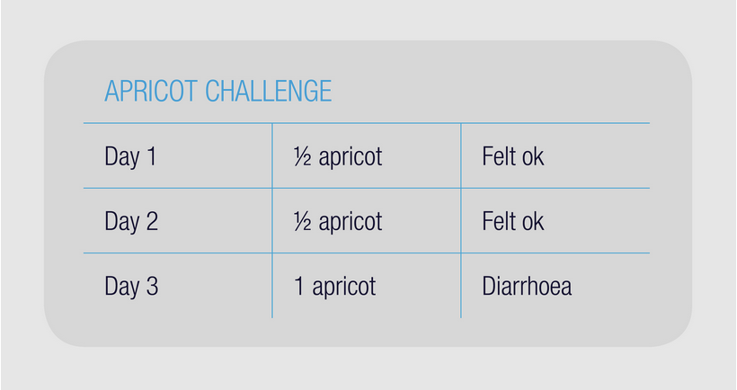

```{r setup, include=FALSE}
knitr::opts_chunk$set(echo = TRUE)
```

<br>


### Question 1

Which of the following conditions have overlapping symptoms with IBS? Note, there is more than one correct answer. Select all correct responses. 

a. Rheumatoid arthritis

b. Osteoporosis

c. Inflammatory bowel disease

d. Coeliac disease

e. Endometriosis

*Answer: c, d, e*

<br>

### Qestion 2

Select the correct response about the prevalence of IBS.

a. IBS is equally common in males and females

b. Sex differences in the prevalence of IBS are unknown

c. IBS is more common in females.

d. IBS is more common in males.

*Answer: c*

<br>

### Question 3

Which of the following patients would require further investigations before a diagnosis of IBS is made? Note, there is more than one correct answer. Select all correct answers.

a. A 20 year old girl who presents with abdominal pain and daily loose stools with blood and mucous.

b. A 60 year old lady with 6 months of daily diarrhoea and abdominal pain relieved by defecation

c. A 65 year old male who presents with regular episodes of abdominal pain associated with the onset of loose frequent bowel motions. Symptoms started 2 months ago and have been getting progressively worse.

d. A 20 year old girl who presents with episodic diarrhoea for the last 2 years and coeliac disease excluded. Onset of diarrhea is associated with lower abdominal pain which is relieved by opening her bowels.

*Answer: a, b*

<br>

### Question 4


Which of the following tests is NOT used for the assessment of coeliac disease?

Select one correct answer only. 

a. Transglutaminase antibody

b. HLA DQ2/DQ8 genetic test

c. Small intestinal biopsy

d. Diet history that looks for relationships between gluten intake and symptoms

*Answer: d*

<br>

### Question 5


Which of the following tests should be used to screen for coeliac disease in patients who are following a gluten free diet, but are unwilling to undergo a ‘gluten challenge’?

Select one correct answer only. 

a. HLA DQ2/DQ8 gene test

b. Small intestinal biopsy

c. Transglutaminase antibody

d. Faecal calprotectin

*Answer: a*

<br>

### Question 6


What does evidence show about the causes of IBS?

Select one correct answer only. 

a. IBS is a disorder of brain-gut interaction and psychological factors (such as stress and anxiety) may influence symptoms

b. IBS is most likely caused by poor diet, in particular a low fibre intake

c. Psychological factors were once thought to influence IBS symptoms but it is now thought that genetics and lifestyle play a greater role

d. Animal proteins are thought cause IBS

*Answer: a*

<br>

### Question 7

In what ways is a person with IBS impacted?

a.  IBS symptoms tend to remain stable over the lifetime of the patient

b. IBS can have a profound, negative impact on daily life, as sufferers may avoid social events, shopping, eating out, long journeys and work

c.  Poor quality of life is rare among people with IBS

d.  IBS is thought to reduce life expectancy by up to 15 years


*Answer: b*

<br>

### Question 8

What is the role of fructans and GOS in humans?

a. Malabsorption of fructans and GOS is rare. These sugars are universally absorbed in the small intestine

b.  Fructans and GOS are considered probiotics

c. Fructans and GOS are considered prebiotics because they selectively stimulate the growth and activity of beneficial gut bacteria, in particular bifidobacteria and lactobacillus

d.  Fructans and GOS are selectively inhibit the growth and activity of beneficial gut bacteria, in particular bifidobacteria and lactobacillus


*Answer: c*

<br>

### Question 9

Select the correct statement about lactose.

a. Re-testing lactose tolerance may be worthwhile as lactose tolerance can change over time

b. The terms ‘lactose malabsorption’ and ‘lactose intolerance’ can be used interchangeably as they mean the same thing

c.  Lactose is a monosaccharide composed of chains of fructose


d. Lactulose is the enzyme needed to break lactose into individual sugar units, glucose and galactose.

*Answer: a*

<br>

### Question 10

What is the correct recommendation regarding probiotic/prebiotic supplementation with concurrent use of the low FODMAP diet?

a. Changes in gut microbiota observed on a low FODMAP diet may be mitigated by the co-administration of the probiotic, VSL#3.

b. All people following Phase 1 low FODMAP diet should take a prebiotic supplement to compensate for the loss of beneficial gut bacteria

c. All people following Phase 1 low FODMAP diet should take a probiotic supplement to compensate for the loss of beneficial gut bacteria

d. All people following a Phase 1 low FODMAP diet should consume fermented foods containing live bacterial cultures to compensate for the loss of beneficial gut bacteria

*Answer: a*

<br>

### Question 11

What has evidence shown regarding the absorption of FODMAPs in the gastrointestinal tract?

a. Lactose malabsorption is more common among people with IBS than those without

b. Sorbitol and mannitol may induce gastrointestinal symptoms regardless of the extent to which they’re absorbed.

c. Approximately one third of people malabsorb fructans in the small intestine, facilitating their delivery to the large intestine where they are rapidly fermented by resident bacteria.

d.  GOS are malabsorbed in about 5% of people with IBS


*Answer: b*

<br>

### Question 12

How does fat intake impact digestion and absorption?

a. Increase visceral hypersensitivity, increase small intestinal motility and slow intestinal gas transport.

b.  Contribute to intestinal inflammation and diarrhoea

c. Increase visceral hypersensitivity, increase small intestinal motility and speed up intestinal gas transport.

d. Increase visceral hypersensitivity and undergo fermentation, contributing to bacterial overgrowth and wind

*Answer: a*

<br>

### Question 13

Identify the CORRECT statement about the effects of short chain carbohydrates in the GI tract:

Select one correct answer only.

a. Short-chain carbohydrates attract gas into the small intestinal lumen and if they reach the large intestine, undergo fermentation by gut bacteria, producing water. These actions cause bloating and bacterial dysbiosis due to inherent issues with visceral hypersensitivity.

b. Little is known about the physiological effects of short-chain carbohydrates in the GI tract.

c. Short-chain carbohydrates attract water into the stomach, and if they reach the large intestine, undergo fermentation by gut bacteria, resulting in gas production. These actions cause bacterial overgrowth and pain due to inherent issues with visceral hypersensitivity.

d. Short-chain carbohydrates attract water into the intestinal lumen and if they reach the large intestine, undergo fermentation by gut bacteria, resulting in gas production. These actions cause luminal distension, and in people with IBS, induce symptoms due to inherent issues with visceral hypersensitivity.

*Answer: d*

<br>

### Question 14

Choose the CORRECT statement about the effects of food processing on FODMAP content.

Select one correct answer only.

a.  The effect of food processing techniques on FODMAP composition is unknown

b.  Food processing techniques thought to affect FODMAP content include baking, freezing, canning, pressing and fermentation

c. FODMAP composition of food processed food is determined by ingredient selection. Food processing techniques are not thought to affect final FODMAP content

d. Food processing techniques thought to affect FODMAP content include boiling, canning, pressing, straining, pickling, fermentation, activation and ‘sprouting’

*Answer: d*

<br>

### Question 15

Which of the following high FODMAP food examples are correct? Note, there is more than one correct response. Select all correct responses.

a. Foods rich in lactose include cow’s milk, custard, sweetened condensed milk, evaporated milk, ice cream, yoghurt

b. Foods rich in fructans and GOS include garlic, onion, leek, artichoke, wheat/rye/barley based breakfast cereal, bread, biscuits, red kidney beans, split peas, falafels, baked beans, cashews and pistachios, vegetarian mince

c. Foods rich in fructose include garlic, onion, leek, artichoke, wheat/rye/barley based breakfast cereal, bread, biscuits, red kidney beans, split peas, falafels, baked beans, cashews and pistachios, vegetarian mince

d. Foods rich in glucose include cow’s milk, custard, sweetened condensed milk, evaporated milk, ice cream, yoghurt

*Answer: a, b*

<br>

### Question 16

Identify the CORRECT statement about the cut-offs used to classify foods as low in FODMAPs

Select one correct answer only.

a. The low FODMAP cut-offs allow people to include more than one serve of low FODMAP food per sitting

b.  The reliability of the low FODMAP cut offs has never been tested

c.  The low FODMAP criteria classify food on a grams per 100g basis

d.  Low FODMAP foods contain no FODMAPs

e. Low FODMAP cutoffs allow people to consume only 1 serve of low FODMAP food per sitting

*Answer: a*

<br>

### Question 17

Which of the following is a low FODMAP ingredient?

Select one correct answer only.

a.  Chicory root extract

b.  Agave syrup

c.  Maple syrup

d.  Xylitol

e.  High fructose corn syrup


*Answer: c*

<br>

### Question 18

How do food processing methods such as cooking and fermentation alter the FODMAP content of foods? Note, there is more than one correct response. Select all correct responses.

a. Food processing techniques that involve water (such as boiling, canning, pressing and straining) tend to raise FODMAP content of the food

b. FODMAPs are water soluble, so food processing techniques that involve water (such as boiling, canning, pressing and straining) lower FODMAP content via the leaching of water soluble FODMAPs (eg. fructans and GOS) into the surrounding liquid.

c. Processes involving fermentation alter FODMAP content. During the fermentation process, fermenting microorganisms (such as lactobacilli) feed on FODMAPs (such as fructans and GOS), lowering the content of these FODMAPs. Consequently, longer fermentation times result in a greater reduction in fructan and GOS content.

d.  Food processing techniques are not thought to affect FODMAP content


*Answer: b, c*

<br>

### Question 19

What is the relationship between gluten free products and oligosaccharides? 

a. Gluten free grain and cereal products tend to be higher in oligosaccharides than gluten containing grain and cereal products

b. Gluten free grain and cereal products tend to be lower in oligosaccharides than gluten containing grain and cereal products

c. Wheat bread is typically gluten free and low in oligosaccharides

d.  Gluten and oligosaccharides tend to coexist in fruit and dairy products

*Answer: b*

<br>

### Question 20

What should be considered when assessing gastrointestinal function in individuals with IBS?

a. When assessing bowel and GI symptoms, take note of the type, severity, duration, pattern and impact of these symptoms

b.  Diarrhoea is rare in IBS and should be considered a red flag

c. An assessment of bowel and gastrointestinal symptoms is not warranted in people with IBS

d. The Bristol Stool Chart is considered outdated and should not be used to assess stool form in clinical practice

*Answer: a*

<br>

### Question 21

What is important to consider when assessing the symptoms of a patient with IBS? Note, there is more than one correct answer. Select all correct answers.

a. When considering the types of symptoms experienced by a patient, ask specific questions about the patient’s predominant bowel habit and whether they experience bloating, abdominal pain and/or flatulence.

b. When considering symptom severity, ask the patient about how problematic their symptoms are and to what extent they impact on quality of life

c. The length of time that a patient has suffered IBS-like symptoms can be useful to determine whether symptom onset coincided with a bout of gastroenteritis

d. IBS is thought to not affect quality of life, so questions to this effect during patient assessments are unnecessary

*Answer: a, b, c*

<br>

### Question 22

During the initial dietetic assessment, which questions are important to ask in order to screen for red flags?

Note, there is more than one correct answer. Select all correct answers.

a.  Is there ever blood in your stool?

b.  Has your weight changed at all recently?

c.  Do you have a family history of IBS

d.  Do you experience regular abdominal pain that is relieved by defecation?

e.  Are you waking up in the night to use your bowels?


*Answer: a, b, e*

<br>

### Question 23

What should be considered when completing a dietetic (or nutrition) assessment on a patient with IBS?

a. Medications and supplements that may affect IBS symptoms include iron supplements, metformin and magnesium

b. Genetic predisposition is not thought to affect the development of gastrointestinal disorders so an assessment of family history of gastrointestinal disorders is irrelevant

c. Overweight and obesity are rare in IBS so an assessment of anthropometry (e.g. weight and weight history) is irrelevant

d. An assessment of red flags is not necessary in people with IBS as these are rare and should already have been ruled out by the doctor

*Answer: a*

<br>

### Question 24

What is important to consider when completing a dietary assessment with a patient who has IBS?

a. Assessing whether someone is following a vegetarian diet is vital as a low FODMAP diet is contraindicated.

b. An assessment of total fluid intake is needed but specific questioning about caffeine, alcohol, milk and fruit juice intake is irrelevant as these fluids are not thought to affect GI symptoms.

c. Assessment of current FODMAP intake is useful to determine the extent of FODMAP restriction required.

d. A dietary assessment does not need to consider fibre intake, as only FODMAPs affect IBS symptoms.

*Answer: c*

<br>

### Question 25

What is important to consider when assessing a patient prior to implementation of the low FODMAP diet?

a. It can be useful to consider how a patient’s current symptoms may be affected by intake of seasonal products (such as stone fruit).

b.  Cooking skills are only relevant in women with IBS

c.  Cultural background has minimal impact on the patient’s diet.

d. Understanding a patient’s living and work situation provides irrelevant information and should not be included in the dietetic assessment

*Answer: a*

<br>

### Question 26

You assess a 40 year old male with confirmed IBS. He is highly motivated to try a low FODMAP diet to improve his symptoms of abdominal pain, bloating and diarrhoea. He loves his food and enjoys cooking, but recently has found that many fruits and wheat products trigger symptoms, even in small amounts.

When advising this patient on FODMAP restriction, which of the following approaches would you recommend?

Select one correct answer only.

a. An approach that expands the patient’s diet to include more low FODMAP foods, knowing that these should be tolerated.

b. A strict low FODMAP diet that replaces all foods containing high or moderate amounts of FODMAPs with nutritionally equivalent, low FODMAP alternatives.

c. Assessing the patient to ensure nutritional adequacy, then referring them on for other non-diet therapies, such as medication, stress management and gut-directed hypnotherapy.

d.  A FODMAP gentle approach that only restricts foods that are very high in FODMAPs, frequently consumed, and suspected to be major symptom triggers.

*Answer: b*

<br>

### Question 27

You assess a 25 year old female with confirmed IBS that was diagnosed several years ago. Although she still experiences the occasional symptom flare, her IBS symptoms are under control since she changed her diet to exclude all forms of wheat, dairy and gluten. She also avoids most fruits and eats a limited range of vegetables. She would like to discuss probiotic supplements as she has heard that these can also help to manage gut symptoms associated with IBS. Her weight is stable and in the healthy range.

You convince her to trial a low FODMAP diet as you think this will help her to establish the true triggers of her gut symptoms. She agrees to this.

When advising this patient on FODMAP restriction, which of the following approaches would you recommend?

Select one correct answer only.

a. Assessing the patient to ensure nutritional adequacy, then referring them on for other non-diet therapies, such as medication, stress management and gut-directed hypnotherapy.

b. An approach that expands the patient’s diet to include more low FODMAP foods, knowing that these should be tolerated.

c. A strict low FODMAP diet that replaces all foods containing high or moderate amounts of FODMAPs with nutritionally equivalent, low FODMAP alternatives.

d. A FODMAP gentle approach that only restricts foods that are very high in FODMAPs, frequently consumed, and suspected to be major symptom triggers. 

*Answer: b*

<br>

### Question 28

You assess a 22 year old lady with confirmed IBS and a 5 year history of anorexia nervosa. She is currently studying in her final year of Medicine. She has heard about the low FODMAP diet and has come to see you about implementing this diet to improve her IBS symptom control. Her symptoms of abdominal pain, bloating and diarrhoea have been particularly bad over the past few months and she observes that this coincided with a particularly busy and stressful time at university.

When advising this patient on FODMAP restriction, which approach would you recommend:

Select one correct answer only.

a. An approach that expands the patient’s diet to include more low FODMAP foods, knowing that these should be tolerated.

b. Assessing the patient to ensure nutritional adequacy, then referring them on for other non-diet therapies, such as medication, stress management and gut-directed hypnotherapy.

c. A FODMAP gentle approach that only restricts foods that are very high in FODMAPs, frequently consumed, and suspected to be major symptom triggers.

d. A strict low FODMAP diet that replaces all foods containing high or moderate amounts of FODMAPs with nutritionally equivalent, low FODMAP alternatives.

*Answer: b*

<br>

### Question 29

You assess an 18 year old female university student with confirmed IBS. She would like to improve her gut symptoms through diet, but has limited cooking skills and is busy working part-time and studying full-time.

When advising this patient on FODMAP restriction, which approach would you recommend:

Select one correct answer only.

a. A strict low FODMAP diet that replaces all foods containing high or moderate amounts of FODMAPs with nutritionally equivalent, low FODMAP alternatives.

b.  A FODMAP gentle approach that only restricts foods that are very high in FODMAPs, frequently consumed, and suspected to be major symptom triggers.

c. An approach that expands the patient’s diet to include more low FODMAP foods, knowing that these should be tolerated.

d. Assessing the patient to ensure nutritional adequacy, then referring them on for other non-diet therapies, such as medication, stress management and gut-directed hypnotherapy.

*Answer: b*

<br>

### Question 30

You are consulting a patient of Asian background. What dietary tips could you offer them? 

Note, there is more than one correct answers. Please select all correct answers.

a.  Ask for no onion and garlic in your dish

b. Avoid rice-based dishes, such as rice noodles, jasmine rice and rice vermicelli as these are high in FODMAPs.

c.  Choose plain meat or use sauces that do not include onion or garlic

d.  Avoid soy sauce and wasabi as they are high in FODMAPs

e.  Ask for silken tofu instead of firm tofu


*Answer: a, c*

<br>

### Question 31


Identify the CORRECT statements about Phase 2 - FODMAP reintroduction. 

Note, there is more than one correct answer. Select ALL correct answers. 

a. Patients should be encouraged to re-introduce high FODMAP foods to increase food variety; increase prebiotic intake; improve nutritional adequacy and reduce any adverse effects of a restrictive diet on social eating and/or quality of life

b. Probiotic supplementation (using VSL#3) has been shown to mitigate some of the changes in gut microbiota seen on a low FODMAP diet

c. Fructans and GOS are known to have probiotic actions so prebiotic supplementation is recommended in all phases of the FODMAP diet

d.  Patients who experience symptom improvement on a strict low FODMAP diet should continue this long term to avoid symptom flares


*Answer: a, b*

<br>

### Question 32

Prebiotic rich foods available in a low FODMAP serve on the Monash app include:

Select one correct answer only.

a. Watermelon, currants, raisins, cooked and cooled potato/rice/pasta, oats, canned lentils/ chickpeas, mung beans, almonds

b. Banana, currants, raisins, cooked and cooled potato/rice/pasta, oats, canned lentils/ chickpeas, mung beans, almonds

c. Banana, currants, dried apricot, cooked and cooled potato/rice/pasta, oats, canned lentils/ chickpeas, mung beans, almonds, wheat bran

d. Banana, currants, raisins, cooked and cooled potato/rice/pasta, oats, red kidney beans, mung beans, almonds

*Answer: b*

<br>

### Question 33 

Your patient has established that they tolerate small serves of sorbitol rich foods well, so they would now like to challenge foods rich in fructose AND sorbitol. Which foods do you suggest they try?

Select one correct answer only.

a.  Watermelon, cherries, mango, nectarine, peach

b.  Apple, pear, cherries

c.  Apple, grapes, orange, banana, pear

d.  Apple, grapefruit, tropical fruit juice, fruit salad with mango and apricot


*Answer: b*

<br>

### Question 34

Patients who have negative expectations regarding a specific food or challenge may experience worse symptoms due to what’s known as the ‘brain-gut axis’.

Which of the following strategies could be used in patients who are stressed or anxious about the reintroduction process? Note, there is more than one correct answer. Select ALL correct answers.

a. Starting with very small challenge doses 

b.  Challenging on non-consecutive days

c.  Considering blinded challenges

d.  Establishing FODMAP tolerance using breath hydrogen testing instead


*Answer: a, b, c*

<br>

### Question 35

Identify the CORRECT statement about adapting the reintroduction phase to suit other dietary requirements:

Note, there is more than one correct answer. Select all correct answers.

a. In patients with diabetes, spend additional time challenging low GI, fibre rich carbohydrate sources. 

b. Re-challenge multiple legume types to assess tolerance and increase chance of finding tolerated legumes for vegetarians or vegans

c.  In vegetarians and vegans, spend additional time challenging high FODMAP protein sources such as legumes, dairy, nuts and milk alternatives

d. Adapt foods used for each challenge depending on patient food preferences and other food intolerances. 

*Answer: a, b, c, d*

<br>

### Question 36

Considering the patient’s symptom response to a sorbitol challenge using apricot, your advice to the patient in Phase 3 might be:

Select one correct answer only.



<br>

a.  Include high sorbitol serves of food freely in the diet

b.  Never eat apricot again

c.  Include sorbitol rich foods in the diet, but limit to amber serves.

d.  Avoid all amber and red serves of sorbitol rich foods.


*Answer: c*

<br>

### Question 37

Identify the CORRECT responses.

Note, more than one answer is correct. 

In a patient who reports a poor response to the low FODMAP diet, you should:

a.  Rule out IBS and diagnose the patient with another functional bowel disorder.

b.  Consider red flags

c.  Consider referring the patient on to other health professionals

d.  Assume their compliance to the dietary restrictions was poor.


*Answer: b, c*

<br>

### Question 38

Which therapies should be considered in patients with IBS who have suspected fast colonic transit?

Note, there is more than one correct answer. Select all correct answers.

a.  Prune juice and wheat bran supplements


b. A more targeted reduction of osmotically active FODMAPs (such as fructose and polyols)

c.  Recommendations to increase exercise, fluid and caffeine intake


d. A more targeted reduction of osmotically active FODMAPs (such as fructans and GOS)

e.  Fibre supplements with gel forming properties (such as psyllium)


*Answer: b, e*

<br>

### Question 39

In patients with IBS-C or patients who experience a worsening of constipation on the low FODMAP diet, other therapies may be used to improve laxation and symptom control.

Which strategies can be considered for individuals with IBS-C who experience worsening of constipation on the low FODMAP diet? Note, there is more than one correct answer. Select all correct answers.

a.  Ensuring adequate fluid intake

b.  Considering laxatives

c.  Manipulating fibre intake

d.  Reintroducing excess fructose and sugar polyol rich food early in Phases 2 and 3.

e.  Encouraging kiwifruit intake

*Answer: a, b, c, d, e*

<br>

### Question 40

Which of the following tests /assessments CAN accurately exclude coeliac disease?

Note, there is more than one correct answer. Select all correct answers.

a.  Serology for antibodies (IgA-EMA or IgA-TTG)

b. Gastroscopy with 4-6 biopsy samples from the small bowel (assuming the patient was following a gluten containing diet prior to screening)

c.  Genetic testing (HLA DQ2 and DQ8)

d. Food and symptom diary to assess relationship between gluten intake and symptoms

*Answer: b, c*

<br>

### Question 41

What proportion of patients with IBS are expected to respond positively to a low FODMAP diet? 

a.  60-80% will respond

b.  20-40% will respond

c.  100% will respond

d.  10% will respond

*Answer: a*

<br>

### Question 42

Select the correct response about the pathophysiological abnormalities may be responsible for IBS symptoms. Note, there is more than one correct answer. Select all correct answers.

a. Visceral hypersensitivity is rare in patients with IBS and not thought to contribute to symptoms

b. A low FODMAP diet is thought to be most effective in treating patients with visceral hypersensitivity, as the diet reduces luminal distension which exaggerates symptoms of pain in the presence of visceral hypersensitivity

c. Alterations to motility in IBS include fast, slow and uncoordinated colonic transit. Patients with fast colonic transit will typically present with long-standing constipation, while patients with slow or uncoordinated colonic transit will typically present with diarrhoea

d. Patients whose symptoms are triggered by stress and anxiety may have enhanced communication between their brain and gut. In these patients, other more targeted therapies may be considered, such as cognitive behavioural therapy and gut-directed hypnotherapy

*Answer: b, d*

<br>

### Question 43

What is known about Rifaximin use in patients with IBS?

Select one correct answer only.

a. Rifaximin is a minimally absorbed antibiotic which may benefit patients with IBS, but without constipation

b.  Rifaximin is a probiotic that restores the gut microbiota in people with IBS-D

c. Repeated treatment with Rifaximin (after initial relapse) is considered unsafe and ineffective in IBS

d. Antibiotics such as Rifaximin mainly benefit patients with constipation-predominant IBS

*Answer: a*

<br>

### Question 44

Select the correct response about psychological therapies in IBS. Note, there is more than one correct answer. Select all correct answers.

a. Psychological stress can result in changes in gastrointestinal function and symptoms

b. Gut directed hypnotherapy is the same as standard hypnotherapy and can be delivered by any hypnotherapist or dietitian

c. Cognitive behaviour therapy (CBT) is not thought to be effective in people with IBS

d. In gut-directed hypnotherapy, suggestions are made for the control and normalisation of gastrointestinal function (normally on a repetitive basis) and metaphors are used for bringing about improvement.

*Answer: a, d*

<br>

### Question 45

A patient asks you whether probiotics could help to manage her IBS symptoms? What advice would you give her?

Note, there is more than one correct answer. Select all correct answers. 

a. Probiotic strains have additive benefits, thus patients should be encouraged to take large doses of multi-species formulations, or to combine probiotic strains to optimise treatment response.

b. When choosing a probiotic, consider the strain and dose, as well as evidence for efficacy, and the symptom profile of the patient.

c. Good compliance is needed to achieve therapeutic benefits.

d. Modest improvements in IBS symptoms (10-30%) have been reported in most studies, but benefits of probiotic supplementation may take ~4 weeks to appear.

*Answer: b, c, d*

<br>

### Question 46

What does the evidence show regarding psychological therapies in IBS?

a. Stress management techniques are not usually necessary in IBS as psychological distress is not thought to play a role in triggering IBS symptoms.

b. Dietitians should deliver gut directed hypnotherapy to patients who present with IBS symptoms triggered by stress and anxiety.

c.  Gut-directed hypnotherapy is thought to improve gastrointestinal symptoms to a similar extent as a low FODMAP diet.


d. Cognitive behaviour therapy involves breathing exercises and relaxation techniques.

*Answer: c*

<br>

### Question 47

When choosing medications or supplements for individuals with IBS, which of the following statements reflect valid evidence? Note, there is more than one correct answer. Select all correct answers.

a.  Peppermint oil is considered unsafe and ineffective as an adjunct therapy for IBS.

b. SWT-G (also known as Iberogast) is a herbal preparation thought to trigger IBS symptoms

c. Bile salt sequestrants such as cholestyramine are sometimes used to manage symptoms in people with IBS-D and bile acid malabsorption.

d.  Antispasmodics are sometimes used to treat IBS based on the belief that colonic smooth muscle spasms contribute abdominal pain.


*Answer: c, d*

<br>

### Question 48

What has research shown regarding probiotic supplementation in patients with IBS?

Select one correct answer only.

a. Most studies have shown that probiotic supplementation leads to major improvements in IBS symptoms

b. All patients commencing a low FODMAP diet should be advised to take a probiotic supplement

c.  Patients with severe symptoms may be better suited to probiotic therapy

d.  Most studies have shown probiotic supplementation leads to minor improvements in IBS symptoms


*Answer: d*

<br>

### Question 49

What is the role of fibre in managing IBS?

a. Highly fermentable fibres such as linseeds and psyllium husks tend to worsen symptoms in IBS

b.  Fibre supplementation is recommended in patients with faecal impaction

c. Wheat bran is a non-fermentable fibre with bulking characteristics making it a suitable choice in people with IBS

d. Methylcellulose and sterculia are minimally fermented and have gel forming + bulking characteristics making them a good choice in people with IBS-C

*Answer: d*

<br>

### Question 50

Identify the correct statement about the role of alcohol in IBS management? Select one correct answer only. 

a. Consuming more than 2 standard drinks within 2 hours will trigger gastrointestinal symptoms in most people with IBS

b.  People who consume high alcohol intakes are at increased risk of developing IBS

c. If alcohol is suspected to trigger IBS symptoms, reducing/eliminating alcohol intake may be helpful, but this change should be made in isolation so effects on symptoms can be detected

d.  Alcohol should be avoided in all people with IBS


*Answer: c*

<br>

### Question 51


What is the main problem with using elimination diets to detect food chemical sensitivities?

Select one correct answer only.

a. Elimination diets to identify food chemical sensitivities are generally thought to provide excessive vitamins and minerals.

b. A low food chemical diet should be trialled in all patients who experience gastrointestinal symptoms when they eat foods high in food chemicals

c. Clinical guidelines do not mention low food chemical diets for IBS, probably due to the lack of efficacy data and limited uptake (mostly in parts of Australia)

d. The extensive and reliable data describing the salicylate content of foods is too hard for patients to memorise

*Answer: c*

<br>

### Question 52

Select the correct response about dietary fibre. 

a. Fibre has blood glucose and cholesterol raising effects and should be avoided in IBS

b. The term fibre encompasses a number of plant proteins that are rapidly absorbed in the small intestine

c. The term fibre encompasses a number of short and long-chain carbohydrates, including FOS, GOS, resistant starches and non-starch polysaccharides such as cellulose, hemicellulose, gums and pectin

d.  Low fibre, Western diets are the major cause of IBS


*Answer: c*

<br>

### Question 53

Select the correct response about food chemicals. Note, there is more than one correct answer. Select all correct answers.

a.  Most clinical guidelines now recommend a low food chemical diet to manage IBS

b. Naturally-occurring food chemicals may trigger non-GI conditions such as urticaria (skin rash) and angioedema (swelling) in some people

c. Naturally-occurring food chemicals include preservatives, sweeteners, thickeners and acidity regulators

d. Naturally-occurring food chemicals include salicylates, amines, glutamates, benzoates, penicillin and yeast.

*Answer: b, d*

<br>

### Question 54

What is the role of gluten in triggering IBS symptoms? Note, there is more than one correct response. Select all correct responses. 

a. Patients who experience symptom relief on a gluten free diet can be assumed to have coeliac disease

b. It is possible that a small subset of IBS patients are sensitive to gluten, but in the majority, other factors provoke symptoms

c.  Gluten is thought to trigger symptoms in the majority of IBS sufferers


d. A gluten free diet is recommended in patients with IBS who have experienced symptom improvement on a wheat-free diet

e. Self-diagnosis with non-coeliac gluten sensitivity (NCGS) and failure to exclude other conditions with similar symptoms (such as IBD, IBS and coeliac disease) may result in misdiagnosis and sub-optimal treatment.

*Answer: b, e*

<br>

### Question 55

What does the evidence show regarding IBS in children?

a. IBS in children can usually be self-diagnosed by the parents as they know the child best

b.  In toddlers and pre-school children, symptoms of IBS may result in behavioural changes such as being withdrawn or irritable; ongoing, unformed bowel actions past infancy, or problems toilet training
  
c. Breath tests are considered more accurate in children than adults and if available, should be used to guide dietary restrictions

d.  A reintroduction phase is not usually needed in children as children are usually content eating a small range of low FODMAP foods


*Answer: b*

<br>

### Question 56

Which symptom is NOT associated with both IBS and endometriosis?

Note, there is one correct answer only. 

a.  Diarrhoea or constipation

b.  Pelvic pain

c.  Nausea

d.  Abdominal pain and bloating

*Answer: b*

<br>

### Question 57

Identify the INCORRECT response about dietary restrictions in children. 

a. Children are highly sensitive to FODMAPs and a very strict low FODMAP diet is likely to be necessary to achieve symptom improvement

b. If a low FODMAP diet is deemed necessary in a child, a FODMAP gentle approach should be prescribed. Using this approach, only frequently consumed, very high FODMAP foods would be excluded.

c. In some children, symptom improvement may be achieved with simple advice to normalise eating habits in a manner consistent with the dietary guidelines and to attempt to open their bowels regularly.

d.  Dietary restrictions should be kept to a minimum in children.

*Answer: a*

<br>

### Question 58

What has research shown about endometriosis?

a.  Endometriosis is thought to affect 1% of women of reproductive age

b.  Gastrointestinal symptoms are uncommon in women with endometriosis

c. In endometriosis, symptom severity is a good indicator of the extent of the condition, whereby women with mild symptoms can have mild disease and women with severe symptoms can have severe disease.

d.  Endometriosis occurs when tissue that normally lines the uterus (known as the endometrium), grows in and around other organs in the body.


*Answer: d*

<br>

### Question 59

What is the recommended approach regarding implementation of a low FODMAP diet for infants with colic?

a. In formula-fed infants, introduction of a low FODMAP formula may improve symptoms of infantile colic.

b. A low FODMAP diet may represent a useful, short‐term intervention in breastfeeding mothers of infant with colic

c. A low FODMAP diet and the early cessation of breastfeeding should be recommended to breastfeeding mothers of infants with colic.

d. Early introduction of low FODMAP solid foods may be effective in the management of infantile colic

*Answer: b*

<br>

### Question 60

What is the recommended approach to implement a low FODMAP diet for patients with endometriosis?

a. Patients with suspected endometriosis should trial a low FODMAP diet before they consider other investigations to diagnose their symptoms.

b. A low FODMAP diet should now be considered first line therapy for the treatment of endometriosis

c. Bowel symptoms are common among women with endometriosis and preliminary data suggest that a low FODMAP diet may assist in managing these

d.  A low FODMAP diet may exacerbate symptoms in endometriosis

*Answer: c*

---


