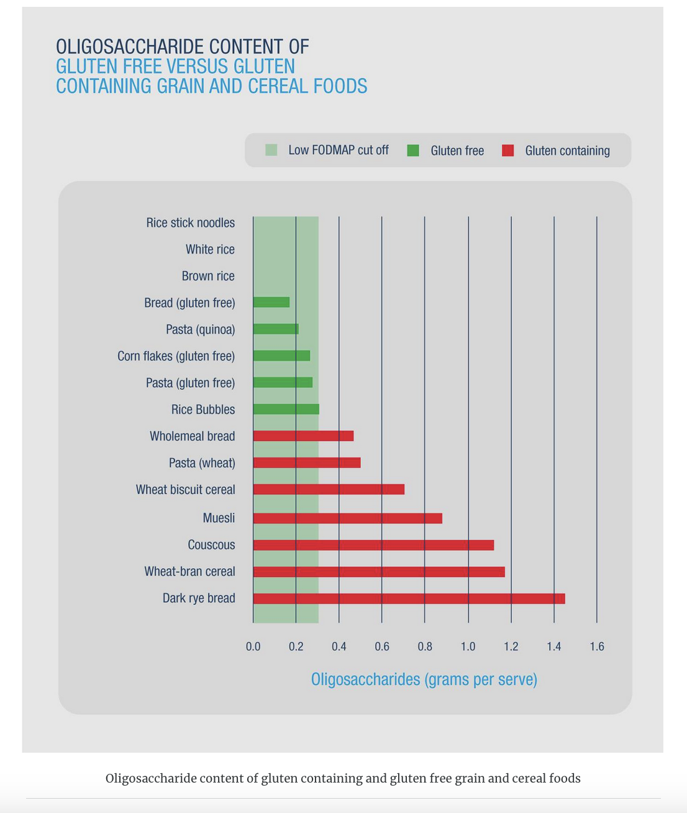
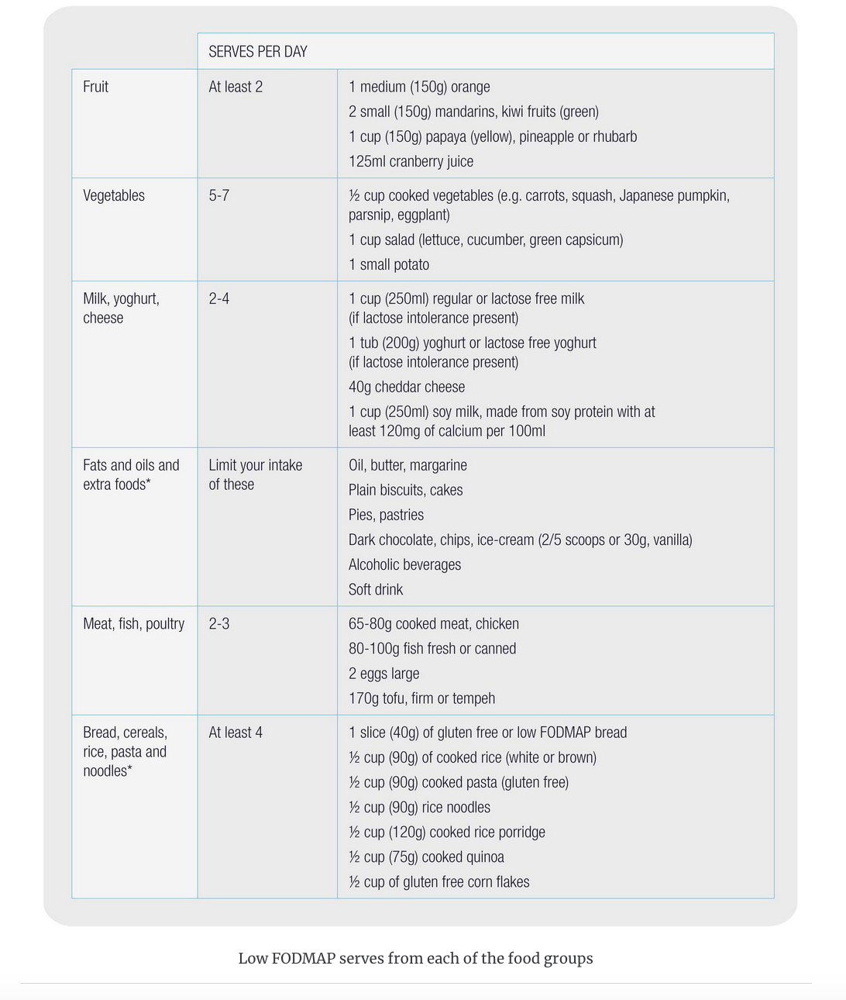
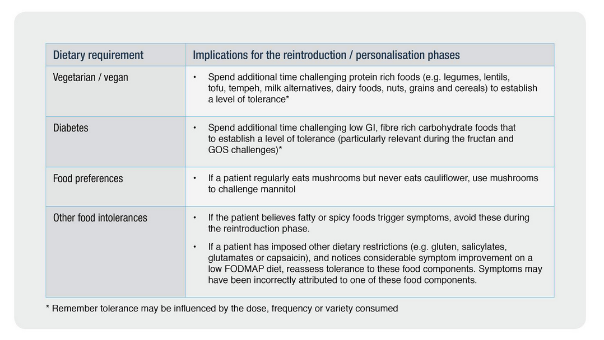
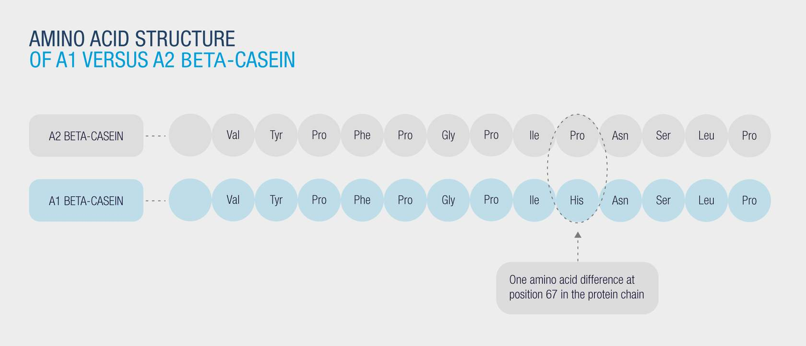
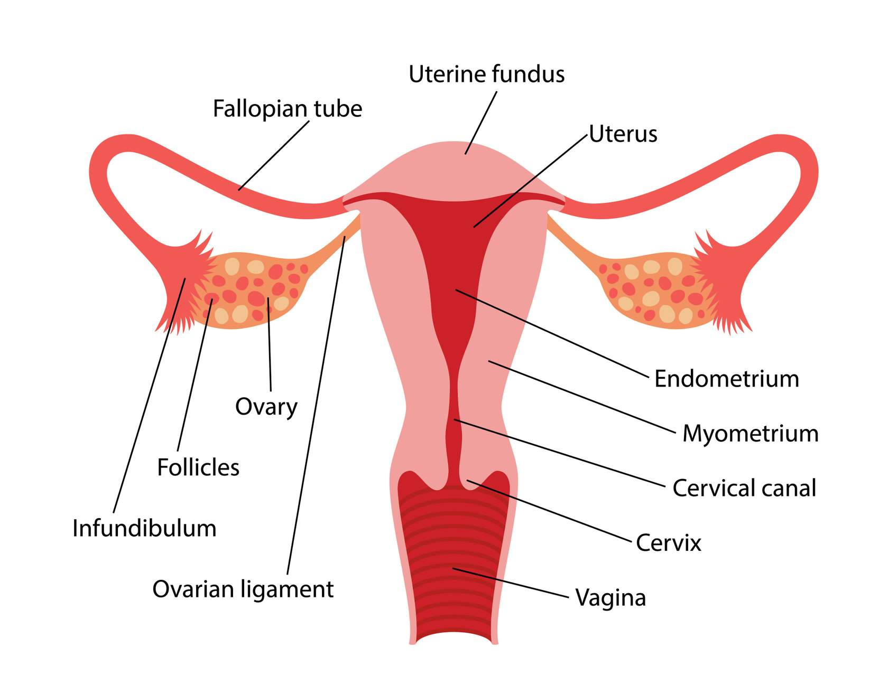
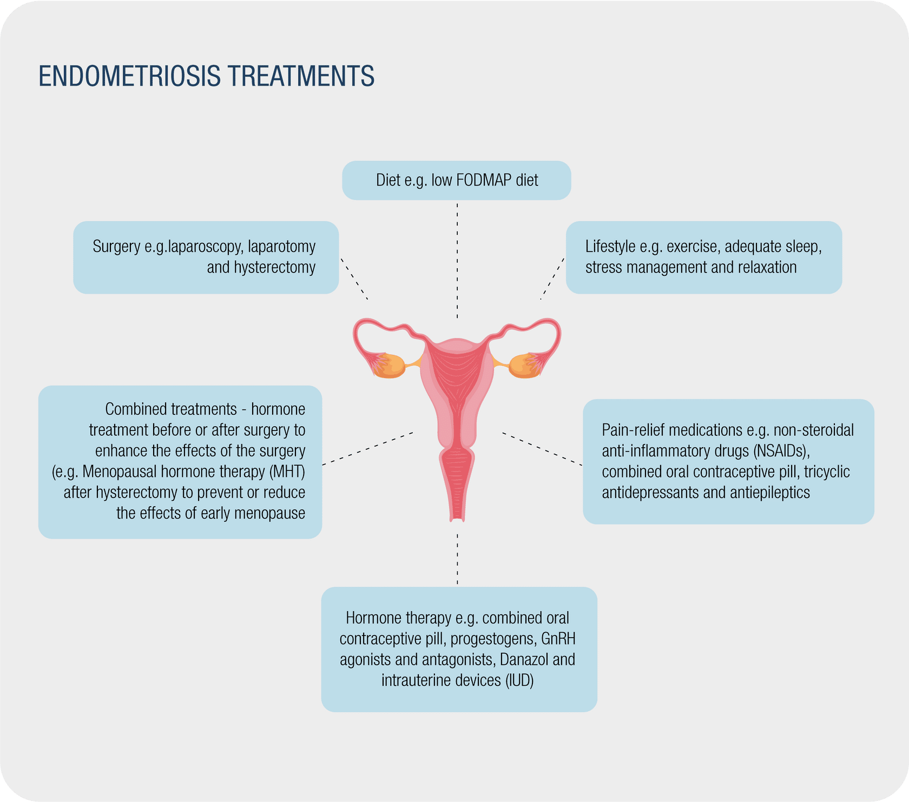
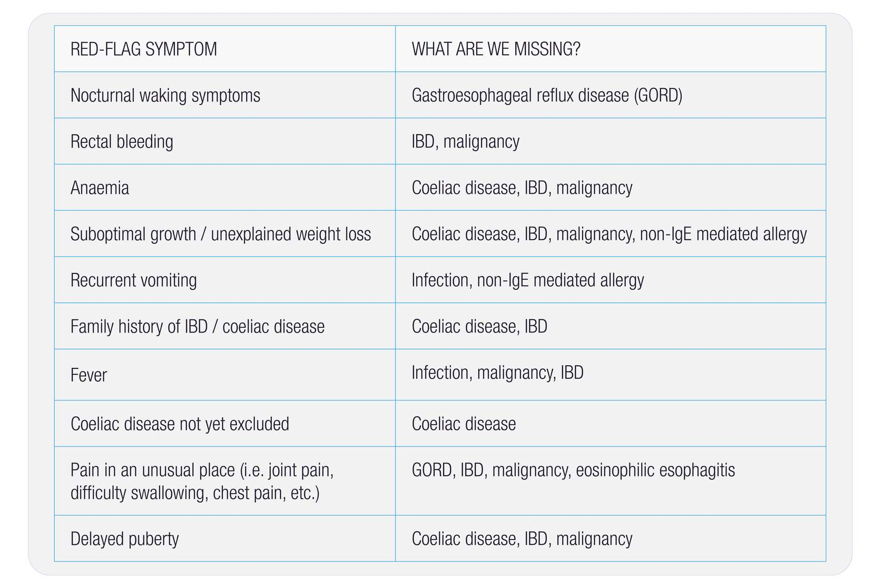

---
title: "FODMAP Diet for IBS- Dietitian Course"
author: "by Jane Varney"
date: "`r format(Sys.time(), '%B %d, %Y')`"
output: 
  bookdown::html_document2:
    toc: true 
    toc_float: true
    toc_depth: 4  
    number_sections: true  
    theme: united  
    highlight: tango  
    fig_caption: true
---

```{r setup, include=FALSE}
knitr::opts_chunk$set(echo = TRUE)

```


\newpage


<br>

# Module 1: Funtional bowel disorders and IBS

<br>

## Disorders of gut-brain interactions (DGBIs)

Formerly known as functional gastrointestinal disorders (FGIDs), DGBIs are disorders characterised by:

- motility disturbance

- visceral hypersensitivity

- altered mucosal and immune function

- altered gut microbiota

- altered central nervous system processing 

The term 'functional' is used because the body’s normal activities (e.g. movement of the intestines, sensitivity of intestinal nerves or the manner by which the brain controls these functions) are impaired. Importantly though, there are **no structural abnormalities** that can be seen on endoscopy,  with imaging or in blood tests, so these disorders are **diagnosed using symptom criteria.**

There are several sub-classes of DGBIs including:

- Functional oesophageal disorders (e.g. functional chest pain, functional dysphagia)

- Functional gastroduodenal disorders (e.g. functional dyspepsia)

- Functional bowel disorders (e.g. IBS)

- Centrally mediated disorders of gastrointestinal pain

- Gallbladder and sphincter of oddi disorders (e.g. bilary pain)

- Anorectal disorders (e.g. faecal incontinence)

- Childhood functional gastrointestinal disorders (e.g. functional constipation)

<br>

### Functional bowel disorders

Functional bowel disorders (FBDs) include a spectrum of chronic gastrointestinal disorders characterised by symptoms including abdominal pain, bloating, and altered bowel habits[1, 2]. FBDs are diagnosed using symptom criteria, and where indicated by the clinical scenario, after the exclusion of other gastrointestinal diseases, such as coeliac disease and inflammatory bowel disease (IBD).

<br>

### Spectrum of FBDs

FBDs are categorised according to predominant symptom type, and include:

- irritable bowel syndrome (IBS);

- functional diarrhoea;

- functional constipation;

- functional abdominal bloating/ distention;

- unspecified FBD; and

- opiod-induced constipation [1]. 

Although FBDs can be classified into different conditions, considerable overlap exists and these conditions are thought to exist on a continuum. 

<br>

{width=70%}

<br>

### Prevalence of IBS

IBS is one of the most common conditions seen by gastroenterologists and primary-care physicians, and is associated with high medical costs. The condition is thought to affect between 3.8 and 9.2% of the population worldwide, although prevalence varies greatly (from 1% to more than 25%), depending on the country examined and the criteria used to define the condition (Rome III or Rome IV)[130]. Interestingly, lower prevalence of IBS is seen when Rome IV criteria are applied compared to Rome III. 

The prevalence of IBS is predicted to grow, as:

- many countries become more westernised

- the burden of predisposing mental health conditions (e.g. anxiety and depression) grows, and 

- awareness of the condition increases among both patients and health professionals[131]

IBS is 1.5 times more common in women than men, more common in those with a lower socioeconomic status and commonly diagnosed before the age of 50 years[4, 6].

<br>

### Under-diagonsis of IBS

Although IBS is a relatively common condition, it often goes undiagnosed. The under-diagnosis of IBS is sometimes described as an ‘iceberg effect', whereby there are more undiagnosed than diagnosed cases of IBS. For instance, one study estimated that while ~11% of the population had IBS, only ~1/3 of these cases were formally diagnosed[8]. 


Undiagnosed IBS is problematic for the patient and can negatively affect QOL, as patients are left feeling anxious, frustrated, and searching for an organic cause of their symptoms, but unable to utilise effective, targeted therapies. Patients may also be made to feel that their symptoms are emotionally or psychologically based, not real. 

<br>

## Impact on QOL and daily life {.tabset}

Although IBS does not affect life expectancy, the chronic and episodic nature of the condition can have a profound effect on QOL and daily activities[9]. The fluctuating nature of IBS symptoms is highlighted in natural history studies which show that:

- IBS symptoms may resolve for a period and then return

- New symptoms may develop

- Symptom severity may change from sometimes being quite mild, to other times being quite severe[10] 

- Usual, or ‘predominant’ bowel habit may change. People may experience mostly constipation or mostly diarrhoea for a while, and then develop a more ‘alternating’ bowel habit (sometimes experiencing diarrhoea and sometimes experiencing constipation)[11]. 

These fluctuating symptoms can leave sufferers with a sense of uncertainty, unpredictability and fear. People with IBS may feel distressed, ashamed or embarrassed about their symptoms, and these feelings affect QOL and daily life.

<br>

### Impact on QOL

IBS adversely affects QOL, in severe cases causing social isolation as symptoms may prevent patients from leaving the home[1, 3, 4]. The severe impact of IBS symptoms was highlighted in data showing that patients with IBS are willing to relinquish 15 years of their remaining life to attain perfect health[12].


The impact of IBS on QOL is compounded by the under-diagnosis and poor management. Even when a positive diagnosis of IBS is reached, this is often delivered to the patient with uncertainty and considerable delay; long after the first onset of symptoms. This scenario is problematic for patients, leading to anxiety about the cause of ongoing symptoms and diminishing patients' capacity to accept the diagnosis and engage in effective treatments.

Treatment dissatisfaction among diagnosed patients is also common[12], with many left frustrated by the poor efficacy of traditional management strategies[13]. 

<br>

### Impact on daily activities

IBS can have a profound, negative impact on daily life. Sufferers may avoid social events, shopping, eating out, long journeys and travel commitments[14]. Sleep, diet, and relationships with family, friends and sexual partners can all be affected[8]. Work can also be negatively impacted as people take sick days to manage symptoms (absenteeism) or achieve less at work due to the disruption of their symptoms (presenteeism)[14]. 

The findings of a qualitative study which used semi-structured interviews to characterise the impact of IBS on the daily lives of 18 sufferers are summarised in the infographic below[15]. 

{width=100%}

<br>

## Cause/ Pathogenesis

The cause of IBS and other FBDs is unclear and likely to be multifactorial. Proposed mechanisms are highlighted in the infographic and accordion boxes[1]. 

{width=70%}

<br>

### Motility changes

**Accelerated or delayed colonic transit can contribute to diarrhoea or constipation predominant symptoms in IBS[16].**

Accelerated colonic transit occurs in 15-45% of patients with diarrhoea-predominant symptoms, while slow colonic transit occurs in 5-46% of patients with constipation-predominant symptoms. Altered transit may be a consequence of altered enterocyte secretion and/or neuromuscular dysfunction[16]. Rectal dysfunction may also contribute to constipation-predominant symptoms[17]. 

<br>

### The gut-brain axis, visceral hypersensitivity and psychological influences

The 'brain-gut axis' is the complex reflex circuit that facilitates communication between the brain and the gut[18, 19]. Studies that have measured visceral hypersensitivity via rectal balloon distension have shown increased activation of the brain regions used in endogenous pain modulation. These findings confirm that central nervous system dysregulation exists in IBS[20, 21].

Psychological factors such as stress and anxiety can:

- influence gastrointestinal motility (either increasing or decreasing transit time)

- affect pain threshold

- impair the mucosal secretory and barrier functions of the gastrointestinal tract[1]. 

In the past, psychological symptoms were thought to contribute to gastrointestinal symptoms (brain-to-gut) in a one-way manner. However, this relationship is now thought to be bidirectional, with a subset of people with IBS thought to develop gastrointestinal symptoms that drive psychological symptoms (gut-to-brain)[22].

<br>

### Impact of microbiota

Technological advances have improved our ability to characterise the microbiome[23] and led to observations that there may be differences between the faecal microbiota of people with IBS and healthy controls[24]. However, whether these differences are a cause or consequence of the condition is unknown.

Colonic fermentation may also be greater in some people with IBS compared to healthy controls[24], but fermentation is generally similar. Differences in the faecal microbiota composition have been described in a proportion of people with diarrhoea- and constipation-predominant IBS[25]. Diet is considered a major external modulator of the colonic microbiota, with both short- and long-term dietary habits affecting bacterial populations[26].

<br>

### Other potential causes of IBS

With improved understanding of the colonic microbiota, additional causes of IBS have been proposed, some of which relate to microbe-host interactions via, for example, immune and metabolic responses, which are also thought to be influenced by dietary intake[27]. Increased mucosal permeability and immune activation may occur following a bout of gastroenteritis and are typically associated with diarrhoea-predominant symptoms[16]. Evidence for increased mucosal permeability in post-infectious IBS suggests that abnormal permeability may be involved in disease pathogenesis[28].

The increased risk of developing IBS following a bout of gastroenteritis supports the involvement of low-grade inflammation and immune alterations in the pathogenesis of IBS[29]. However, the role of these factors in symptom genesis and how they can be used to guide treatment requires elucidation.

<br>

### Heredity

IBS often clusters in families, although this may be more due to learned behaviours and environmental exposure than to genetic predisposition. This theory is supported by twin studies which show that having a mother or father with IBS is a stronger predictor of having the condition than having a twin with IBS[30, 31].

<br>

### Further reading

Black, CJ and Ford, AC  (2020) Global burden of irritable bowel syndrome: trends, predictions and risk factors. Nature Reviews Gastroenterology & Hepatology. 

Basnayake C. Treatment of irritable bowel syndrome. Aust Prescr 2018;41:145-9.

Drossman DA. Functional Gastrointestinal Disorders: History, Pathophysiology, Clinical Features and Rome IV. Gastroenterology. 2016.

Holtmann G, Shah A, Morrison M. Pathophysiology of Functional Gastrointestinal Disorders: A Holistic Overview. Digestive Diseases 2017;35(suppl 1):5-13

<br>

## Major symptoms

IBS is a chronic and relapsing disease[20]. Symptoms often wax and wane, and symptom severity varies within and between individuals[8, 32]. Because IBS symptoms vary so much, there are diagnostic criteria to classify patients based on predominant symptoms. 

Common symptoms of IBS:

- Abdominal distension

- Constipation

- Diarrhea

- Alternating bowel habit

- Excessive flatulence

- Lower abdominal pain

- Bloating

<br>

Major symptoms of IBS:

- Abdominal pain

- Distension

- Excessive flatulence

- Alternating bowel habits

- Bloating

<br>

### Symptom severity {.tabset}

IBS is a highly heterogenous condition, in terms of:

- pathophysiological factors contributing to the condition, 

- predominant symptoms, 

- the natural course of the condition, and 

- responsiveness to treatment. 

This heterogeneity is also seen with symptom severity which can differ between individuals and also within the same individual over time.

IBS symptom severity may be categorised as mild, moderate or severe. Mild, moderate and severe symptoms affect around 40%, 35% and 25% of sufferers, respectively. 

<br>

#### Mild {-}

When symptoms are **mild**, patients may:

- have low-intensity, infrequent symptoms

- have relatively good health-related quality of life (HRQOL)

- not seek out health care, and thus have undiagnosed IBS

<br>

#### Moderate {-}

When symptoms are **moderate**, patients may:

- have more persistent/ uncomfortable symptoms

- suffer impaird QOL

- find daily activities are impacted. 

<br>

#### Severe {-}

When symptoms are **severe**, patients may:

- experience more frequent, persistent and intense symptoms

- find daily life is disrupted

- attend health services more often

- seek out specialist advice 

<br>

### {.unnumbered .unlisted}

Factors that influence self-rated symptom severity include:

- pain, bowel difficulties, bloating and dietary restrictions

- limits on social activities

- ability to leave the home

- restrictions on work-life and school attendance[12]. 

As will be discussed in Module 4, IBS symptom severity should be assessed in the initial dietetic assessment. 

<br>

## Natural history of IBS {.tabset}

Patients are often curious to know why their IBS symptoms have changed, and/or how they will change over time. Understanding the natural history of IBS (the progression of this condition over time, usually in the absence of treatment) will help you to answer these questions. 

<br>

### Step 1 {.unnumbered .unlisted}

***Intermittent symptom flares***

IBS is considered a chronic condition, characterised by symptoms that flare and change over time. The relapsing, remitting nature of IBS symptoms was highlighted in a study that collected baseline and 10 year follow up data from nearly 4000 individuals. The study showed that 2/3 of those with IBS at baseline remained symptomatic at 10 year follow up[33]. 

Similarly, a systematic review showed that over a 2 year follow up period:

- 2-18% of individuals experienced worsening of symptoms

- 30%-50% experienced stable symptoms, and

- 12%-38% experienced complete symptom resolution[10]. 

<br>

### Step 2 {.unnumbered .unlisted}

***Predominant symptoms change***

The types of symptoms experienced by people with IBS may also change over time. People most commonly transition from having IBS-C or IBS-D, to a mixed subtype (IBS-M), but less commonly transition from having IBS-C to IBS-D (or vice versa)[10].

<br>

### Step 3 {.unnumbered .unlisted}

***Diagnosis before age 50***

IBS affects people of all ages (including children and the elderly), although it is usually diagnosed before age 40 and is less common in people aged over 50[34]. There are a number of theories to explain this observation: 

- younger people may be more likely to seek health professional advice for IBS-like symptoms

- better techniques for identifying and diagnosing the condition may have resulted in earlier detection and diagnosis.

- over time, older people may have identified and learnt to better manage IBS symptoms

- IBS symptoms may diminish over time[35].

<br>

### Step 4 {.unlisted .unnumbered}

***Female predominance***

Internationally, IBS affects around 67% more women than men[31]. However, in certain regions (such as South Asia, South America, and Africa), prevalence rates between sexes are more similar, and possibly higher in men[34]. These sex differences may reflect international differences in the health seeking behaviour of men and women[31]. According to this theory, in most (but not all) parts of the world, women are more likely to seek advice from healthcare professionals for their symptoms, and are thus more likely to receive a diagnosis.

<br>

## Diagnosis

IBS should be diagnosed by a medical doctor, who should take a careful history and use the Rome IV criteria as guidance. 

<br>

### Importance of an accurate, timely, confident diagnosis of IBS

As highlighted earlier in this module, a diagnosis of IBS is often given to patients with uncertainty and after considerable delay; long after the first onset of symptoms. For instance, one study showed that 1/4 of patients with diagnosed IBS had visited a healthcare professional at least 5 times before a formal diagnosis was reached[14], while another showed that the average time to first diagnosis of IBS was 7 years[12]. These problems are compounded by the use of uncertain language around the diagnosis of IBS[36] (e.g. You may have a bit of IBS). This scenario contributes to anxiety regarding the cause of ongoing symptoms and diminishes patients' capacity to accept their diagnosis and engage in effective treatments.

A confident, accurate diagnosis should be considered the starting point in the therapeutic pathway. There are 3 key components to the diagnostic process:

**1. Making the diagnosis** (making a provisional diagnosis based on positive criteria - a diagnosis of IBS should not simply be one of exclusion);

**2. Ensuring it is a correct diagnosis** (screening for red flags and using targeted investigations to exclude other relevant differential diagnoses); and

**3. Effectively communicating the diagnosis** to ensure patient ownership. 

Providing patients with an accurate, positive and confident diagnosis of IBS is needed to:

- reduce repeat specialist consultations;

- reduce unnecessary investigations (in search of a diagnosis);

- allow patients to confidently manage their condition. 

<br>

### Further reading

Black CJ, Ford AC. Best management of irritable bowel syndrome. Frontline Gastroenterology. 2021;12(4):303.

Linedale, E. C. and J. M. Andrews (2017). "Diagnosis and management of irritable bowel syndrome: a guide for the generalist." Med J Aust 207(7): 309-315.

<br>

## The Rome criteria

The Rome Foundation was founded in the 1980’s and utilises experts to provide guidelines on the diagnosis and treatment of FBDs. Rome criteria allow patients to be sub-classified according to their predominant bowel habit (using the Bristol stool chart) as IBS-C, IBS-D, IBS-M or IBS-U (see definitions below).

It is recommended that sub-typing occur:

- based on days when bowel movements are abnormal

- using the Bristol stool chart to classify stool consistency

- using information about bowel habits ***before*** the patient commenced laxatives or anti-diarrhoeal agents

{width=100%}

<br>

The Rome criteria refer to the Bristol stool chart, a tool designed to classify the form of human faeces using a 7-point stool form scale[37]. While the Rome criteria are used extensively in research studies, they are less often used in clinical practice.

{width=70%}

<br>

## IBS subtypes {.tabset}

In IBS, predominant symptoms should guide treatment choice, so sub-type classifications can be useful when considering targeted treatments. 

{width=70%}

<br>

### IBS-C {.unlisted .unnumbered}

**According to the Rome IV criteria, IBS-C is defined as recurrent abdominal pain associated with defecation, and associated with reduced stool frequency and/or lumpy/ hard stools > 25% of the time[2].** 

By definition, all patients with IBS-C experience abdominal pain and constipation, although other symptoms are often present, including:

- abdominal bloating and/or distension

- wind

- straining

- hard faeces

- infrequent stools, and

- a sensation of incomplete or obstructed evacuation[38] 

<br>

### IBS-D {.unlisted .unnumbered}

**According to the Rome criteria, IBS-D is defined as >25% of bowel movements with Bristol stool form types 6 or 7, AND < 25% of bowel movements with Bristol stool form types 1 or 2.** 

Patients with IBS-D typically present with abdominal pain associated with:

- frequent loose stools and cramping (loose stools are defined as Bristol Stool Form Scale 6–7, which is characterised as mushy or watery stools with no solid pieces [4]),

- urgency that is not relieved by defecation,

- mucus in the stool, and

- day to day variability in bowel habit. 

<br>

A number of factors may contribute to the development of IBS-D, such as:

- accelerated gastrointestinal transit

- visceral hypersensitivity

- altered gut microbiota

<br>

### IBS-M {.unlisted .unnumbered}

**According to the Rome IV criteria, IBS-M is defined as alternating constipation and diarrhoea occurring >50% time.**

In practice, IBS-M is a heterogeneous condition, characterised by varying symptoms associated with both IBS-C and IBS-D. For instance, it has been shown that: 

- IBS-M flares tend to be relatively short (lasting less than one week)

- the most bothersome symptoms are irregular bowel habits, bloating, and abdominal pain

- GI and psychological symptoms are similar to those in people with IBS-C and IBS-D. 

The heterogeneity that characterises IBS-M poses challenges in research and clinical practice, in part because few studies have examined the efficacy of treatments in this subgroup. 

<br>

### IBS-U {.unlisted .unnumbered}

**Patients who meet diagnostic criteria for IBS but whose bowel habits cannot be accurately categorised as IBS-D, IBS-M or IBS-C are considered to have IBS-U.**

A patient may be categorised as having IBS-U if they have frequent changes in diet and/or medications, or if they are unable to stop medications known to affect bowel habit or gastrointestinal transit.

<br>

## {.unlisted .unnumbered}

Epidemiological data from the USA suggest that equal proportions of patients have IBS-C, IBS-D and IBS-M, whereas European data suggest that IBS-C and IBS-M may be more prevalent[39].

A few points to consider regarding IBS sub-types:

- IBS sub-type, predominant symptoms and symptom severity can change over time, so treatment should be adjusted accordingly. See Natural History section in this module.

- Not all patients will present having been 'sub-typed' - consider predominant symptoms in these patients

- Some patients may consider that other symptoms predominate (e.g. abdominal pain, bloating or distension). IBS treatments that target particular symptoms are discussed in Module 7. 

<br>

### Functional constipation

Functional constipation (FC), or sometimes called chronic idiopathic constipation (CIC) is also a FBD, defined by the Rome criteria as the presence of two or more of the following during the previous 3 months:

1. Defecatory straining (≥ 25% bowel movements);

2. Hard or lumpy stools (≥ 25% bowel movements); 

3. A feeling of incomplete evacuation (≥ 25% bowel movements); 

4. Defecatory obstruction (≥ 25% bowel movements); 

5. Manual maneuvers to facilitate defecation (≥ 25% bowel movements); and 

6. Fewer than 3 spontaneous complete bowel movements per week.

Symptoms must be present for at least 6 months before a diagnosis can be made. 

<br>

### IBS-C versus functional constipation

Although by definition, IBS-C and FC are different disorders (distinguished by  abdominal pain which characterises IBS-C, but not FC), in practice they may appear very similar, or indistinguishable[40-42].

The two conditions:

- share numerous similar symptoms (constipation, abdominal bloating and/or distension, straining, gas, hard faeces, abdominal discomfort and/or pain, infrequent stools, and a sensation of incomplete evacuation)[38]) 

- negatively impact QOL[43, 44]

- respond favourably to the same drugs

Furthermore, patients with FC may feel some pain, and it is not always easy to determine an association between pain and defecation[42]. 

In reality, IBS-C and FC may exist on a spectrum, whereby patients who experience severe abdominal pain and constipation are on one end (IBS-C), and patients who experience constipation with no pain at all are on the other end (FC). Patients may also 'migrate' over time from one diagnosis to the other[46-48].

The infographic below highlights the different sub-types of FC (including IBS)[45]. Understanding these sub-types can help to target treatments and adjunct therapies. 

{width=70%}

<br>

## Red flags/ alarm features

There are currently no pathophysiological tests available to adequately diagnose IBS, so symptoms play an important role in establishing a positive diagnosis. However, because the symptoms of IBS overlap with many other organic diseases, there is potential for misdiagnosis[49].

**Common symptoms which overlap between IBS and other more serious, organic diseases include abdominal pain, bloating, altered bowel habit, excessive flatulence, incomplete evacuation and nausea.**

Consequently, it is important to be aware of the ‘red flags’ or ‘alarm features’ that may indicate the presence of conditions other than IBS, and that may require further investigation and medical input. 

Screening for 'red flags' in addition to symptom assessment improves the diagnostic yield and helps to confirm whether or not the patient has an FBD.

{width=70%}

<br>

### Interview with the expert - Professor Peter Gibson

Professor Peter Gibson is is actively involved in a large program of translational research at Monash University, with clinical interests in IBD, coeliac disease and IBS. A major focus of his work is the use of diet to control gut symptoms and influence outcomes in chronic intestinal conditions.

In this short video, Professor Peter Gibson explains the importance of checking for red flags in patients with suspected IBS. He also discusses what signs and symptoms are considered red flags and when patients should be referred to a doctor or gastroenterologist before dietary modifications are commenced.

- Checking for red flags is very important to ensure organic disease are not missed, e.g., coeliac disease, inflammatory bowel disease. Different diseases that cause damage to bowel require different therapies.

- The difficulty is that the symptoms for caeliac disease and inflammatory bowel disease are very similar to those of irritable bowel syndromes. 

- Dietitian should refer to the gastroenterologist before dietary interventions are commenced, if coeliac disease is not being established, also if patients have red flags. 

<br>

### What we risk missing

There are a number of common organic diseases that share similar gastrointestinal symptoms to IBS. Consequently, there is a risk of misdiagnosis. For instance, there is risk that other diagnoses will be missed, such as endometriosis and coeliac disease. However, with improved diagnostic capabilities, a misdiagnosis of IBD (including microscopic colitis) now occurs in a much smaller proportion of patients (approximately 1-4 % of IBS patients). There is also a small chance of missing gastrointestinal cancers, ovarian cancers, diverticular disease, pelvic floor disorders, endocrine disorders and pancreatic exocrine insufficiency.

Some key questions you should ask to identify if any red flags may be relevant for a new patient:

- Is there any blood in your stools?

- Do you need to get up during the night to open your bowels?

- Has your weight changed?

- Do you have a family history of colon cancer, IBD or coeliac disease?

- Do you vomit, and if so is it recurrent vomiting?

- Do you have or have you had a fever?

{width=70%}

<br>

## Typical investigations

Several investigations may be required before IBS can be diagnosed. These are generally completed by a general/family physician or gastroenterologist. Of course, clinicians should be mindful that excessive investigations can be counterproductive and costly, so testing should be tailored to the needs of the patient.

Typical investigations that may be required include:

- full blood examination 

- C-reactive protein 

- nutritional markers

- coeliac screening (e.g. genetic or serology testing)

- faecal calprotectin (to exclude IBD)

<br>

### Case study video - Stacey 

Meet Stacey, a 26 year old accountant who lives with her partner of 2 years. Stacey and her partner do not have any children or pets. Stacey is a well-organised person who likes to be in control of things in life, but recently she has experienced some unpleasant gastrointestinal symptoms. Stacey has made an appointment with her GP to discuss these issues for the first time. 

The doctor screens Stacey for ‘red flags’ or ‘alarm features’ and describes the investigations he will order. As you watch, try to identify which red flags the doctor is checking for.

- Symptoms: bloating, diarrhea and sometimes constipation most days of the week, pain but feel better after bowel movement, starts 12 months ago after a trip to SEA (post-infectious IBS)

- Red flags the docktor is checking for: get up overnight to loose bowel, blood in the stool, fevers, changes in weight, family history of gut conditions like coeliac or crohn's disease (patient answered NO to all)

- Prescribed tests: 
    - blood test to check Fe level and to rule out coeliac disease (doctor asked if she is following any gluten-free diet&mdash; pt could get a false-negative result when being screened for coeliac disease if she follows a strict gluten-free diet) 
    
    - faecal calprotectin test (stool sample to check for inflammation of the bowel)
    
<br>

### Investigations checklist:

- Has coeliac disease been excluded?

- Was gluten intake adequate prior to testing?

- If gluten intake was adequate, check negative coeliac serology OR positive serology but normal biopsy.

- Check negative HLA DQ2/DQ8 gene test

- If ≥50 years of age, consider colonoscopy +/- gastroscopy

- Examine blood count, iron studies, folate, B12, TSH, CRP, albumin

- Screen for serum calcium (if constipation present)

- Screen for faecal calprotectin (if diarrhoea present).

<br>

### Further reading

Onyimba F, Crowe SE, Johnson S, Leung J. Food Allergies and Intolerances: A Clinical Approach to the Diagnosis and Management of Adverse Reactions to Food. Clinical gastroenterology and hepatology : the official clinical practice journal of the American Gastroenterological Association. 2021;19(11):2230-40.e1

<br>

## Differential diagnoses

Many differential diagnoses exist for IBS that would require different treatment approaches. 

The importance of considering differential diagnoses was highlighted in study which showed that in the 5 years after IBS was diagnosed, people were at an increased risk of developing coeliac disease and IBD [50].

Misdiagnosis may lead to the prescription of ineffective treatments and further disease complications. Exclusionary tests may be ordered to reinforce the diagnosis of IBS and minimise risk of misdiagnosis.

{width=70%}

<br>

{width=100%}

<br>

### Coeliac disease

Coeliac disease is a chronic, auto-immune disease that is characterised by small intestinal enteropathy in response to gluten ingestion in genetically predisposed individuals. The only reliable treatment of coeliac disease involves a strict, life-long gluten-free diet. 

Coeliac disease should be excluded before a diagnosis of IBS is made. This is important for several reasons, for instance:

1. There is considerable overlap between the symptoms of IBS and coeliac disease, with symptoms such as bloating, abdominal pain, and chronic diarrhoea common to both conditions[103]. 

2. Coeliac disease is up to 4 times more common in people with IBS than healthy controls[104].

3. Although coeliac disease is relatively uncommon (affecting around 1% of the population worldwide[105]), it is undiagnosed in the majority of cases[105-107]. 

These factors create a risk of misdiagnosis, whereby people with undiagnosed coeliac disease may be incorrectly told they have IBS. Misdiagnosis with IBS is problematic as the two conditions require vastly different treatments. Furthermore, gluten exposure in individuals with undiagnosed coeliac disease is associated with a range of complications, including nutrient deficiencies, osteoporosis, infertility and lymphoma. 

<br>

#### Screening for coeliac disease {.tabset}

The patient’s dietary gluten intake is the key factor which determines the type of coeliac screening tests to perform. 

- If a patient is following a gluten-containing diet, a diagnosis of coeliac disease can be safely made using serology tests and a duodenal biopsy. However, if a patient is following a gluten free diet, these tests can provide false-negative results. 

- Patients following a gluten free diet can either undergo genetic testing, followed by a gluten challenge and duodenal biopsies, or they can undergo a gluten challenge and then have serology tests +/- duodenal biopsies. 

A few important points about each test:

##### 1. Genetic tests {-}

- Genetic tests to look for the genes associated with coeliac disease (HLA DQ2 and HLA DQ8). Ninety nine percent of people with coeliac disease will carry at least one gene for coeliac disease.

- Genetic tests are not affected by gluten intake (unlike serology tests and duodenal biopsies), so they are a useful tool to rule out (but not diagnose) coeliac disease in people following a gluten free diet.

- A negative genetic test is highly predictive (close to 100%) of the absence of coeliac disease.

- A positive result to the genetic test does not diagnose coeliac disease, as up to half of the population carries these genes, but only 10% of people who test positive will actually have coeliac disease[108]

- If a positive result is reached, the patient may need to undergo a gluten challenge (assuming they are following a gluten free diet), followed by serology tests +/- duodenal biopsies. *Information about the gluten challenge is provided below.*

<br>

##### 2. Antibody tests (coeliac serology) {-}

- Antibody tests are sensitive to gluten intake, so should only be used in people consuming a gluten containing diet. 

- Antibody tests consist of endomysial antibodies (EMA or AEA) or IgA anti-tissue transglutaminase (IgA-TTG, a-tTG, TTG) and/or IgA or IgG deamidated antigliadin antibodies (IgA- or IgG-DGP).

- If IgA antibodies are taken, a total IgA test needs to be included to ensure that the patient is not IgA-deficient (around 2-3% of individuals with coeliac disease have IgA-deficiency). 

- Positive serology results do not confirm the diagnosis of coeliac disease (around 10-15% of patients with positive serology results will not have coeliac disease). If a positive result is reached, this needs to be confirmed with duodenal biopsies. This process is critical for long-term disease monitoring.

- Negative serology results indicate that most probably the patient does not have coeliac disease. However, further investigations (such as duodenal biopsies) should be considered before the diagnosis can be ruled out if:
      - there is a strong suspicion of coeliac disease or other risk factors are present (such as a family history of coeliac disease, co-morbidities or nutrient deficiencies)
      - the patient was following a gluten free diet at the time of testing; or 
      - the patients is IgA deficient.
      
<br>

##### 3. Gastroscopy and small bowel biopsies {-}

- The gold standard method of diagnosing coeliac disease is via gastroscopy with 4-6 biopsy samples from the small bowel (two from the first part of the duodenum & four from the second part of the duodenum). Histological features of coeliac disease can be patchy, so an adequate and representative number of samples must be taken from the small bowel. 

- This procedure only takes around 10 minutes, and is generally well-tolerated. It is performed under light sedation.

- False negative results can occur if the patient was following a gluten free diet or taking immunosuppressive agents at the time of testing. Patients with a positive serology test but negative biopsy results may have latent or delayed coeliac disease. In these patients, follow-up should be considered. 

- False positive results are also possible, as there are other possible causes of villous atrophy (such as Giardia infection, Crohn’s disease, tropical sprue, cow’s milk protein intolerance and medications e.g. NSAIDs).

<br>

#### {.unlisted .unnumbered}

The flow diagram below can be used to guide decision making about the best method of screening for coeliac disease. 

{width=80%}

<br>

#### Gluten challenge

Patients following a gluten free diet may need to undergo a ‘gluten challenge’ prior to coeliac screening using coeliac serology tests or duodenal biopsies. ***A gluten challenge involves reintroducing gluten into the diet of someone who is following a gluten free diet.*** The purpose of the gluten challenge is to induce changes in antibody levels and/or the small intestinal mucosa, so that undetected coeliac disease can be detected via serology tests and/or duodenal biopsies. These levels could otherwise normalise in someone with undetected coeliac disease, following a gluten free diet. The normalisation of these levels is problematic prior to diagnosis as it may result in false negative results. The gluten challenge increases the likelihood that if coeliac disease is present, it will be detected using these screening tests. 

Unfortunately, there is some uncertainty about the quantity and duration of gluten exposure needed during a gluten challenge. Although one study suggested that including 3 g gluten per day for 14 days was sufficient to induce changes in serology markers in 75% of individuals, this leaves a considerable proportion of individuals who would receive a false negative result using this method. Therefore, a safer method involves encouraging patients to consume approximately 3–6 g of gluten daily for ≥6weeks. This amount of gluten can be found in:

- 2-4 slices of wheat bread, or

- 2-4 Weet-Bix, or 

- 1/2–1 cup of cooked pasta.

Tolerability can sometimes be a problem during the gluten challenge. Unfortunately poor tolerability is not predictive for the presence of coeliac disease. Instead, a number of factors may account for a symptomatic response to the gluten challenge. These may relate to: 

- The effects of gluten ingestion (if coeliac disease is indeed present)

- The effects of the fructans and GOS in the gluten containing breads and cereals being consumed (especially if the true underlying diagnosis is IBS)

- The nocebo response – ***symptoms that occur due to negative expectations about exposure to a particular substance, not due to the substance per se.*** The nocebo response is opposite to the placebo response (positive responses that occur due to positive expectations about exposure to a particular substance, such as a drug). 

Strategies to improve tolerability of the gluten challenge include: 

- Gradually introducing gluten containing foods over 4-5 days - anecdotally, this is well tolerated

- Including the gluten containing food in small quantities spread out over the day (e.g. some at breakfast, lunch, dinner and snacks)

- Encourage the patient to avoid very high FODMAP foods during the gluten challenge (see Module 3 for examples). 

- Use a sourdough spelt bread instead of a wheat bread. Sourdough spelt bread contains gluten, but is lower in fructans and GOS than regular wheat bread. If the patient is sensitive to FODMAPs, this might be better tolerated.

- Try using a Monash University Low FODMAP Certified™ bread as the source of gluten (be sure to check with the manufacturer that it is gluten containing)

<br>

### Inflammatory bowel disease

IBD is characterised by chronic inflammation involving the gastrointestinal tract in genetically susceptible individuals. The most common types of IBD are Crohn’s disease (transmural inflammation involving any part of the gastrointestinal tract), ulcerative colitis (mucosal inflammation limited to the colon) and indeterminate colitis (unclassified IBD). Microscopic colitis, a common cause of chronic non-bloody diarrhoea due to immune infiltration of the colonic epithelium, is another lesser-known form of IBD.

There is no single test that can be used to diagnose IBD. Instead, the diagnosis requires consideration of the full clinical picture, including findings of a physical examination, patient history and various tests, including blood tests, stool examination, endoscopy, biopsies and imaging studies.

- Faecal calprotectin is a relatively new screening test to exclude IBD. Calprotectin is a protein released by white blood cells involved in inflammation of the bowel. It is stable in the faeces and can be measured via laboratory assay. Faecal calprotectin measurement is a highly sensitive way of detecting IBD. Therefore, a low faecal calprotectin value can rule out IBD in a patient with suspected IBS, with consideration of the clinical picture. Being a marker in the stool, faecal calprotectin tests avoid more invasive and costly investigations such as colonoscopy. Levels of ≤50μg/g are generally considered normal, whereas levels of >150μg/g may be indicative of IBD[109].

<br>

### Diverticular disease

The presence of diverticula in the large bowel can be seen on barium enema or endoscopy (flexible sigmoidoscopy or colonoscopy). When the diverticula become infected, this can result in acute diverticulitis and symptoms of abdominal pain, altered bowel habits and/or rectal bleeding. Diverticulitis can be diagnosed on clinical examination or colonscopy, and is usually confirmed with a CT scan.

<br>

### Cancers (e.g. ovarian or bowel cancer)

Large bowel cancer is one of the most common cancers in many developed countries. Early detection of pre-cancerous polyps is important and can be performed via colonoscopy. This is particularly relevant if the patient has a family history of bowel cancer. A medical history and physical (gynaecological) examination may also be useful to rule out the presence of other cancers, such as ovarian cancer.

A faecal occult blood test is a non-invasive screening test that detects trace amounts of blood in the faeces. This test is highly effective for the early detection of pre-cancerous growth and the early stages of bowel cancer.

<br>

### Pelvic floor disorders

A subset of patients exhibiting gastrointestinal symptoms may have pelvic floor dysfunction. Common defecatory disorders include dyssynergic defecation (in patients with constipation-type symptoms), while patients with chronic, urgent diarrhoea may have anal sphincter weakness[110]. These conditions are more commonly reported in women, including those with eating disorders[111]. A thorough medical history and physical examination is useful to identify pelvic floor disorders, and some patients may require further physiological investigations, including anorectal manometry and endoanal ultrasound.

<br>

### Endometriosis

Endometriosis is a chronic, inflammatory gynaecological condition that can cause significant pain and infertility[112, 113]. The condition is thought to be caused by a retrograde flow of menstrual blood and tissue back through the fallopian tubes into the pelvis. Here, cells from endometrial tissue implant on the organs and tissues in the pelvic and abdominal cavities[112] Once implanted, lesions that respond to hormones associated with the menstrual cycle develop, driving an inflammatory response, and leading to adhesions, chronic pain and in some cases, sub-fertility.  

If endometriosis is suspected, the patient should be seen by a gynaecologist for a pelvic examination and ultrasound. The gold standard method of diagnosing endometriosis is via laparoscopy with histological confirmation where surgeons use excision or diathermy to remove lesions and adhesions[114]. While transvaginal and transrectal ultrasound can successfully detect endometriotic lesions present in those regions[115], most women have lesions that can only be detected surgically. A diagnosis of endometriosis is also sometimes made presumptively (based on history and symptoms) and treated empirically[116]. Often however, severe symptoms lead to more invasive investigations.

<br>

### Endocrine disorders

The most common endocrine disorder that may be missed in patients with IBS symptoms is thyroid dysfunction. Thyroid stimulating hormone (TSH) tests may indicate hyper- or hypo-thyroidism. In one study, abnormal TSH levels were found in 6% of IBS patients[117], but it is unknown whether correcting TSH levels alleviates IBS symptoms. Thyroid dysfunction is thought to affect 5-9% of the general population[118].

<br>

### Pancreatic exocrine insufficiency

Approximately 6% of patients with IBS symptoms have been found to have pancreatic exocrine insufficiency. Symptoms that may flag the presence of pancreatic exocrine insufficiency include abdominal symptoms that occur after the ingestion of a high fat meal; fatty, bulky stools that are difficult to flush; and fat soluble vitamin deficiency. Diagnosis is made based on the clinical picture and may include indirect tests such as faecal elastase-1 and serum trypsinogen. Symptom improvement following a trial of pancreatic enzyme replacement therapy supports the diagnosis[119].

<br>

### Bile acid malabsorption

Bile acids are synthesised from cholesterol in the liver and are involved in lipid absorption in the small intestine. After their role in micelle formation in the small intestine, they are usually reabsorbed in the terminal ileum and taken up by the liver. The circulation of bile acids is very efficient, with 95% usually recycled[120]. The remaining portion of bile acid (~5%) that are not reabsorbed, reach the colon, stimulating electrolyte and water secretion. Bile acids that reach the colon have marked effects on motility, reducing transit time and causing symptoms of diarrhoea, bloating, urgency and faecal incontinence.

Conditions associated with bile acid diarrhoea include Crohn’s disease with ileal involvement or resection; cholecystectomy; small intestinal bacterial overgrowth (SIBO); and pancreatic insufficiency[120].

An increase in faecal bile acid is the most definitive way to diagnose bile acid malabsorption. However, a 48-hour faecal collection is required to detect this and as such, the test is not frequently used.

Alternative tests for the detection of bile acid malabsorption include the SeHCAT (75Se-homocholic acid taurine) test, and the 7α-OH-4-cholesten-3-one (C4) blood test, but neither of these tests are readily available worldwide[120]. A positive symptom response to a trial of bile acid sequestrants supports the diagnosis of bile acid malabsorption. Bile acid sequestrants bind to bile acids, preventing the bile acids from stimulating secretion in the colon.

<br>

### Discover what each test measures and the conditions that these tests diagnose/exclude

1. Faecal occult blood analysis
    - This test detects minute amounts of blood originating from pre-cancerous polyps or early stages of bowel cancer
    
\n

2. Laparoscopy
    - Surgical procedure and gold-standard method to diagnose/exclude endometriosis. A negative laparoscopy is highly accurate for the exclusion of endometriosis
    
\n

3. Anti-endomysial antibody (IgA) and tissue transglutaminase antibody (IgA)
    - Also known as coeliac serology tests, these tests are used to screen for coeliac disease. They are only useful if gluten intake is adequate. If gluten intake is adequate, a negative antibody test is highly sensitive and specific for absence of coeliac disease. A positive result indicates the need for further investigations to rule out coeliac disease (gastroscopy and small intestinal biopsies)
    
\n

4. Faecal calprotectin
    - Calprotectin is a protein released by white blood cells involved in inflammation of the bowel. The test is used to exclude IBD and to measure IBD activity and severity. 
    
\n

5. Thyroxine
    - This blood test is used to evaluate thyroid function and detect thyroid abnormalities such as hyper- or hypothyroidism.
    
\n

6. Small intestinal biopsies
    - Gold-standard test used to detect villous atrophy in the small intestine and diagnose/exclude coeliac disease. 
    
\n

7. Colonoscopy and colonic biopsies
    - These tests examine the large intestine and may be used to detect diverticular disease, IBD and cancers. 
    
\n

8. HLA DQ2/DQ8 genetic test
    - HLA DQ2 and HLA DQ8 are genes associated with coeliac disease. Levels are not affected by gluten intake. The test is used to exclude coeliac disease, as a negative result is highly predictive (close to 100%) of the absence of coeliac disease. 
    
<br>

### Case study video - John

In this video we meet John, a 55 year old husband and father of 2 children, aged 15 and 17 years. John works long hours as a business analyst which means that he is away from the family home a lot. John presents to his GP reporting an 8 month history of abdominal cramping and worsening diarrhoea that he now experiences on a daily basis. John has no family history of bowel cancer, IBD or coeliac disease. His symptoms are affecting his sleep and he is waking up in the middle of the night with abdominal cramps and urgency to open his bowels.

John recently lost his father, and this event coincided with the worsening of his symptoms. He wonders if his symptoms are related to his emotional state or whether they’re linked to his diet. As you watch, try to identify the red flags that the doctor is looking and the differential diagnoses these red flags may relate to.

- Red flags for John: >50 years of age, reports nocturnal symptoms, reports daily diarrhea 

<br>

## Pseudo-diagnoses {.tabset}

Patients may have sought the advice of alternative medicine practitioners (e.g. naturopaths, herbalists). These practitioners offer a range of alternative investigations, diagnoses and treatments, some of which are based on uncertain scientific principles.

Diagnoses based on uncertain scientific principles are known as pseudo-diagnoses. These diagnoses present a risk to patients as the label may delay correct diagnosis and treatment. Common pseudo-diagnoses in this population include non-coeliac gluten/wheat sensitivity (NCGS/NCWS) and candidiasis.

<br>

### Non-coeliac gluten/wheat sensitivity {-}

The existence of NCGS/WS is highly controversial. This condition is characterised by gastrointestinal, and other symptoms after consuming gluten/wheat-containing food that are not attributable to either coeliac disease (identified by serological testing and duodenal biopsy) or wheat allergy (identified by IgE-mediated immune allergy test)[133, 134]. 

Although a number of biomarkers have been linked to NCGS/NCWS, none reliably diagnose the condition. Instead, formal diagnosis is currently based on the Salerno experts’ criteria[133]. These criteria require the exclusion of coeliac disease (via negative serology and duodenal biopsy), the exclusion of wheat allergy (via negative serum or skin prick IgE-specific tests) and a labour-intensive double-blind, placebo-controlled, dietary crossover challenge with gluten. 

After this process only a small fraction of people (8-16%) are found to have NCGS/NCWS[85, 134]. Most people who associate adverse symptoms with gluten/wheat ingestion are not truly sensitive to either gluten or wheat. Instead they may:

- have undiagnosed coeliac disease/wheat allergy

- be sensitive to other components in wheat/gluten containing foods (e.g. fructans, amylase trypsin inhibitors or wheat germ agglutinin)

- exhibit nocebo responses upon gluten challenge

- exhibit placebo responses upon the removal of dietary gluten

- have another functional gastrointestinal disorder, such as IBS

So despite considerable public and scientific interest in the role of wheat and gluten in triggering symptoms in people without coeliac disease and/or wheat allergy, there is very little high quality evidence to verify the existence of NCGS/NCWS and little is known about the mechanisms that cause symptoms[121]. In part, the lack of evidence is due to the failure of studies to separate the effects of gluten from other food components (see Module 2), the lack of blinding in studies (thus failing to exclude placebo/nocebo responses), and the failure to adequately exclude coeliac disease or wheat allergy[122].

<br>

### Candidiasis {-}

Candidiasis is a fungal infection caused by yeast. Candida yeasts normally reside in the gastrointestinal tract. While it has previously been suggested that candida overgrowth may lead to symptom genesis in IBS, current data contradict this, with one study reporting no difference in the presence of Candida albicans and between healthy controls and people with IBS[123].

<br>

## Alternative investigations for IBS {.tabset}

The availability, popularity and commercial market place for alternative investigations has increased in recent years[110]. Therefore, clinicians should be familiar with the evidence for, clinical implications, and short falls of these tests.

Unfortunately in most cases, there is a lack of evidence to support the reliability or clinical validity of these tests, and as such, they are not recommended for use in routine clinical practice[110].

<br>

### Faecal microbiota testing {-}

Technological advances have enhanced our ability to characterise the microbiome using genotypic approaches. These advances have also enabled us to measure the metabolic activity of the microbiome using ‘omics’ technologies[124].

In research, faecal samples are commonly used as an indirect measure of the microbiota, because direct sampling of the colonic microbiota is difficult. However, this method has limitations, because faecal samples do not provide information about the profile of bacteria associated with the gut mucosa[125, 126].

As previously discussed, differences in the faecal microbiota composition may exist between people with IBS and healthy controls[24, 26], and between diarrhoea- and constipation-predominant sub-types[26].

However, despite the significant interest in this area (from researchers, clinicians and the general public), it is not known whether microbiota composition can be used to influence clinical management or predict responses to different treatment modalities[110].

<br>

### Faecal short-chain fatty acids testing {-}

Another increasingly popular investigation involves the analysis of faecal samples for short-chain fatty acid (SCFA) content.

SCFAs such as butyrate, propionate and acetate are produced by colonic microbiota. Certain SCFAs, including butyrate, have been associated with beneficial effects on colonic health[127].

These findings have led to assumptions that higher faecal SCFA content is advantageous. However, there are a number of problems with this theory. For instance, faecal SCFA content may not reflect the SCFA in the proximal colon; faecal SCFA content has not been associated with disease or clinical outcomes, and the concentrations of SCFA in healthy and diseased populations are not yet established[110]. Furthermore, data describing the faecal SCFA profile of people with IBS have been conflicting[128].

<br>

### IgG food intolerance testing {-}

Immunoglobulin G (IgG) antibodies to food antigens may be detected in the serum of healthy controls and people with IBS.

While screening tests for IgG antigens are commercially available, the reliability of these tests is questionable, because positive IgG antibodies in the serum do not always correlate with clinical symptoms. Indeed, a positive IgG antibody result is thought to indicate a physiological response of the immune system after exposure to food components, rather than an imminent food allergy or intolerance[129]. There is also a lack of evidence to support the efficacy of exclusion diets based on IgG food intolerance testing[110].

Therefore, current evidence does not support the use of IgG food intolerance testing in individuals with IBS.

<br>

### Salivary IgA {-}

Immunoglobulin A (IgA) is a major antibody produced in gut-associated lymphoid tissue and is found in saliva and intestinal secretions.

However, the relationship between salivary IgA and IBS is not fully understood. Because levels of salivary IgA can vary with stress and exercise, and because salivary IgA may not reflect lower gastrointestinal IgA levels, salivary IgA tests are not currently recommended for use in clinical practice[110].

<br>

### Intestinal permeability test {-}

Numerous methods are used to measure intestinal permeability. However, most are time consuming, costly, and influenced by factors such as medications and hydration status[110]. It is also not known how such measures can be applied in clinical practice to determine treatment options. Consequently, current data do not support the use of these tests[110].

<br>

## {.unlisted .unnumbered}

### Question 1

A new patient comes to see you about their gastrointestinal symptoms. She brings a report summarising the IgG test results that she recently completed her naturopath. The report reveals that she has positive antibodies to eggs, wheat and soy. She asks you about the accuracy of these tests as they were very expensive and she is hoping they will help her to identify the cause of her ongoing gastrointestinal symptoms. How would you explain the evidence for IgG testing in simple language?

Unfortunately, current scientific evidence does not support the use of IgG food intolerance testing. They are not used in clinical practice as the results obtained are inaccurate and they encourage people to impose unnecessary dietary restrictions. 

<br>

### Question 2

How do the results of IgG testing affect your management?

These results should not affect dietetic management as evidence to date suggests that these tests are an unreliable means of detecting food intolerances. 

<br>

## Breath testing

Breath tests can be used to identify individuals who malabsorb lactose, fructose and/or sorbitol. Breath tests measure the amount of gas in the breath after consuming a dose of the test sugar in question. 

The tests are based on the premise that poorly absorbed sugars are fermented by intestinal bacteria, producing gases, including hydrogen and methane. These gases are absorbed across the intestine, carried through the bloodstream to the lungs, exhaled and collected in the breath. 

If a rise in breath hydrogen or methane is detected, it is reported that some of the test sugar has been malabsorbed. If symptoms occur during or just after the test, then ‘intolerance’ to the sugar is reported.

<br>

### Breath testing video

This brief video explains the way that hydrogen and methane breath tests are completed. Breath tests are widely used to identify individuals who malabsorb lactose, fructose and sorbitol. However, they are most useful for confirming or denying the presence of lactose malabsorption. **The clinical value of fructose and sorbitol breath testing is limited.** 

In the 4 weeks prior to testing, the patient will be advised not to take any antibiotics, probiotics or colonoscopy preparations, due to the effect of these agents on the gut microbiota.

The procedure for Hydrogen and Methane Breath Testing are as follows:

- The day before the test, the patient will be asked to follow a low FODMAP, low fiber diet. This is important to ensure there is no background noise that will affect the breath samples following day. 

- On the day of the test, the patient attends the clinic after an overnight fast, without having been brushed their teeth with toothpaste, smoked cigarette or done any high intensity exercise. These activities can interfere with the results.

- First, the patient provides fasting breath sample.

- They then drink a sugar solution within 5 minutes if possible. Each type of sugar must be tested on a different day. The clinic will make the sugar solution with the standard amount of test sugar. 

{width=70%}

- Another breath test is taken every 20 minutes for up to 3 hours. Although these times may vary slightly between clinics. 

{width=70%}

- Breath samples are analyzed using gas chromatography which provides information on the amount of hygrogen and methane gas in each sample. Any symtoms that occur during the test are also sometimes recorded. 

- Results of the testing are then interpreted by a gastroenterologist. 

- If a rising breath hydrogen or methane is detected, it is interpreted as some of the test sugar has been malabsorbed. If no rise is detected, then it is interpreted that malabsorption has not occurred. 

- It is important to remember that breath tests are most useful for confirming or denying the presence of lactose malabsorption, and that there is limited clinical value for the use of fructose and sorbitol breath testings. 

<br>

### Lactose breath test

Breath testing for lactose malabsorption usually uses a 25g to 50g dose of lactose. Because lactose malabsorption is dependent on the presence of sufficient lactase, the lactose breath test is thought to be clinically useful. A rise of 20ppm from baseline is generally considered a positive result, although reference ranges vary between centres.

{width=70%}

<br>

### Fructose, sorbitol and mannitol breath tests

There are reservations about the reliability and clinical value of these tests for several reasons:

- Fructose and sorbitol malabsorption are normal phenomenon and equally common in people with and without IBS.

- Degree of malabsorption depends on the dose of test sugar used. For example, in a study of 17 healthy volunteers, 53% of participants malabsorbed a 50g dose of fructose, but this proportion fell to 12.5% when the ingested dose was 25g.

- Degree of malabsorption also depends on the speed with which the test sugar travels through the small intestine (faster small intestinal transit provides less time for all of the test sugar to be absorbed).

- The cut-off values (based on the rise in breath hydrogen or methane) used to indicate a positive result and the presence of malabsorption, vary between testing centres.

- Breath testing for fructose has poor reproducibility. The reproducibility of breath testing within individuals has come into question since fructose malabsorption vanished in 29% of patients with a previous positive fructose breath test[51]. Reasons for this most likely relate to changes in small intestinal transit. Thus, a result at any one point in time may not reflect a permanent physiological situation.

- Sorbitol and mannitol have been shown to induce IBS symptoms, regardless of whether the sugars were malabsorbed.

- Symptoms associated with breath tests occur independent of whether they are malabsorbed. This may be because fructose and polyols can distend the small intestine and induce symptoms regardless of whether they reach the colon and undergo fermentation. As such, breath test results provide a poor guide to dietary restrictions[52].

- Stress can affect test results. This was shown in a study that administered 40 g fructose to healthy controls (n=20), along with corticotropin-releasing factor injections (to mimic stress response) or placebo.  Compared to placebo, the administration of corticotropin-releasing factor injections was shown to constrict the small intestine and increase ascending colon volumes. The study indicates that stress may influence fructose absorption.

<br>

### Lactulose breath test

Lactulose breath tests are performed to determine whether an individual is a hydrogen or methane producer. Humans cannot digest or absorb lactulose and as such, lactulose will always be malabsorbed. However, the clinical utility of the lactulose breath test has been questioned due to poor reproducibility[53]  and recent reports suggesting that the test is poor at predicting response to dietary[54] and probiotic[55] therapy in IBS patients.

Some literature suggests that lactulose breath tests be used to identify small intestinal bacterial overgrowth (SIBO). Criteria used to define SIBO on lactulose breath test can include an early rise in breath hydrogen (prior to 90 minutes), or a double peak, with the first peak indicating gas from the bacterial overgrowth in the small bowel, and the second peak indicating colonic fermentation[56]. However, the sensitivity and specificity of lactulose breath tests are highly variable, sensitivity ranging from 17 to 89%, and specificity ranging between 44 and 100%[56].

Intestinal transit time may also influence results, with rapid intestinal transit leading to an early rise in breath hydrogen and false positive results, and delayed gastric emptying or slow intestinal transit resulting in false negative results[57]. These problems may also be exaggerated because lactulose has the ability to accelerate transit[58].

For these reasons, the lactulose breath test is considered problematic when used to predict response to therapy or to identify SIBO[57, 59].

<br>

### Glucose breath test

This test is also used for the diagnosis of SIBO. However, like the lactulose breath test, this test has poor reliability, with reported sensitivities ranging from 25 to 93% and reported specificities ranging between 34 and 96%[56].

Like the lactulose breath test, glucose breath test results are influenced by transit time, with rapid transit times increasing the likelihood of false positive results[56]. Therefore, the glucose breath test is not considered a reliable tool for the detection of SIBO.

<br>

#### How would you explain breath testing results to a patient in plain language?

Explain that set cut-off criteria are used, such as a rise of $\ge$20 ppm from baseline to indicate a positive result. Hydrogen levels are low to begin with, due to the special diet consumed the day before the test. Hydrogen is produced when the sugar is not absorbed in the small intestine. The malabsorbed sugar travels to the large intestine where it is fermented by colonic bacteria. Hydrogen will be produced by people who have hydrogen-producing bacteria. 

<br>

### Recommendations for practice

- Breath tests are most useful for confirming or denying the presence of **lactose malabsorption**, but are **not useful to guide dietary restrictions.**

- **Fructose and sorbitol breath tests** are considered **unreliable** measures of sugar malabsorption.

- **Lactulose and glucose breath tests** are **unreliable** tests for the identification of SIBO.

- **Breath tests do not diagnose disorders.** Clinicians should abandon labels such as ‘fructose malabsorption’ and ‘fructose intolerance’. Instead, patients should be informed that their symptoms are due to IBS, and that certain foods may trigger IBS symptoms.

- Patients should be encouraged to follow a **3 phased low FODMAP diet** (restriction, reintroduction, personalisation) **to identify which sugars trigger IBS symptoms** and which do not.   

<br>

## Therapies for IBS management 

A range of mechanisms are thought to cause IBS and as such, a range of therapeutic strategies are available to manage the condition. 

These strategies include drugs of many classes; natural and herbal remedies; dietary therapies and nutritional supplements; physical activity, and psychological therapies (such as cognitive behaviour therapy and gut-directed hypnotherapy). Treatment choice should be guided by predominant symptom type.

Due to the complex pathophysiology of IBS, it is also thought that combining treatment approaches (such as pharmacotherapy and dietary change), may optimise symptom response, although limited data support this concept. 

In recent years, there has been a seismic shift toward a more holistic approach to IBS management, with particular attention on dietary therapies[60]. Dietary therapies are the focus of this training, with non-dietary approaches discussed in Module 8.

{width=100%}

<br>

### Further reading 

Chey WD, Keefer L, Whelan K, Gibson PR. Behavioral and Diet Therapies in Integrated Care for Patients With Irritable Bowel Syndrome. Gastroenterology. 2021;160(1):47-62.

<br>

## Module 1 factsheet 

{width=100%}

<br>

## References

1. Drossman, D.A. and W.L. Hasler, Rome IV-Functional GI Disorders: Disorders of Gut-Brain Interaction. Gastroenterology, 2016. 150(6): p. 1257-61.

2. Lacy, B.E., et al., Bowel Disorders. Gastroenterology. 150(6): p. 1393-1407.e5.

3. Agarwal, N. and B.M. Spiegel, The effect of irritable bowel syndrome on health-related quality of life and health care expenditures. Gastroenterol Clin North Am, 2011. 40(1): p. 11-9.

4. American College of Gastroenterology Task Force on Irritable Bowel, S., et al., An evidence-based position statement on the management of irritable bowel syndrome. Am J Gastroenterol, 2009. 104 Suppl 1: p. S1-35.

5. Bohn, L., S. Storsrud, and M. Simren, Nutrient intake in patients with irritable bowel syndrome compared with the general population. Neurogastroenterol Motil, 2013. 25(1): p. 23-30 e1.

6. Andrews, E.B., et al., Prevalence and demographics of irritable bowel syndrome: results from a large web-based survey. Aliment Pharmacol Ther, 2005. 22(10): p. 935-42.

7. Sperber, A.D., et al., The global prevalence of IBS in adults remains elusive due to the heterogeneity of studies: a Rome Foundation working team literature review. Gut, 2016.

8. Hungin AP, Whorwell PJ, Tack J, et al. The prevalence, patterns and impact of irritable bowel syndrome: an international survey of 40,000 subjects. Aliment Pharmacol Ther 2003;17:643-50.

9. Dean BB, Aguilar D, Barghout V, et al. Impairment in work productivity and health-related quality of life in patients with IBS. Am J Manag Care 2005;11:S17-26.

10. El-Serag HB, Pilgrim P, Schoenfeld P. Systemic review: Natural history of irritable bowel syndrome. Aliment Pharmacol Ther 2004;19:861-70.

11. Garrigues V, Mearin F, Badia X, et al. Change over time of bowel habit in irritable bowel syndrome: a prospective, observational, 1-year follow-up study (RITMO study). Aliment Pharmacol Ther 2007;25:323-32.

12. Drossman DA, Morris CB, Schneck S, et al. International survey of patients with IBS: symptom features and their severity, health status, treatments, and risk taking to achieve clinical benefit. J Clin Gastroenterol 2009;43:541-50.

13. Knott V, Holtmann G, A. Turnbull D, et al. Abstract: M1253 Patients' Satisfaction with Specialist Gastroenterologist Consultation for Irritable Bowel Syndrome (IBS)and Health Care Utilisation: Exploring the Role of Patient Expectations, 2009.

14. Hungin AP, Chang L, Locke GR, et al. Irritable bowel syndrome in the United States: prevalence, symptom patterns and impact. Aliment Pharmacol Ther 2005;21:1365-75.

15. Farndale R, Roberts L. Long-term impact of irritable bowel syndrome: a qualitative study. Prim Health Care Res Dev 2011;12:52-67.

16. Camilleri, M., Peripheral mechanisms in irritable bowel syndrome. N Engl J Med, 2012. 367(17): p. 1626-35.

17. Prott, G., et al., Relationships between pelvic floor symptoms and function in irritable bowel syndrome. Neurogastroenterol Motil, 2010. 22(7): p. 764-9.

18. Carabotti, M., et al., The gut-brain axis: interactions between enteric microbiota, central and enteric nervous systems. Ann Gastroenterol, 2015. 28(2): p. 203-209.

19. Gaman, A. and B. Kuo, Neuromodulatory processes of the brain-gut axis. Neuromodulation, 2008. 11(4): p. 249-259.

20. Chey, W.D., J. Kurlander, and S. Eswaran, Irritable bowel syndrome: a clinical review. JAMA, 2015. 313(9): p. 949-58.

21. Tillisch, K., E.A. Mayer, and J.S. Labus, Quantitative meta-analysis identifies brain regions activated during rectal distension in irritable bowel syndrome. Gastroenterology, 2011. 140(1): p. 91-100.

22. Koloski, N.A., M. Jones, and N.J. Talley, Evidence that independent gut-to-brain and brain-to-gut pathways operate in the irritable bowel syndrome and functional dyspepsia: a 1-year population-based prospective study. Aliment Pharmacol Ther, 2016. 44(6): p. 592-600.

23. Whelan, K., Editorial: fibre and FODMAPs in constipation and irritable bowel syndrome. Aliment Pharmacol Ther, 2015. 42(3): p. 383-4.

24. Kassinen, A., et al., The fecal microbiota of irritable bowel syndrome patients differs significantly from that of healthy subjects. Gastroenterology, 2007. 133(1): p. 24-33.

25. Ringel-Kulka, T., et al., Altered Colonic Bacterial Fermentation as a Potential Pathophysiological Factor in Irritable Bowel Syndrome. Am J Gastroenterol, 2015. 110(9): p. 1339-46.

26. Pozuelo, M., S. Panda, A. Santiago, S. Mendez, A. Accarino, J. Santos, F. Guarner, F. Azpiroz and C. Manichanh (2015). "Reduction of butyrate-and methane-producing microorganisms in patients with Irritable Bowel Syndrome." Scientific Reports 5.

27. Barbara, G., et al., The Intestinal Microenvironment and Functional Gastrointestinal Disorders. Gastroenterology, 2016.

28. Arrieta, M.C., L. Bistritz, and J.B. Meddings, Alterations in intestinal permeability. Gut, 2006. 55(10): p. 1512-20.

29. Ohman, L. and M. Simren, Pathogenesis of IBS: role of inflammation, immunity and neuroimmune interactions. Nat Rev Gastroenterol Hepatol, 2010. 7(3): p. 163-73.

30. Levy RL, Jones KR, Whitehead WE, et al. Irritable bowel syndrome in twins: heredity and social learning both contribute to etiology. Gastroenterology 2001;121:799-804.

31. Canavan C, West J, Card T. The epidemiology of irritable bowel syndrome. Clinical Epidemiology 2014;6:71-80.

32. Boeckxstaens, G.E., et al., Phenotyping of subjects for large scale studies on patients with IBS. Neurogastroenterol Motil, 2016. 28(8): p. 1134-47.

33. Ford AC, Forman D, Bailey AG, et al. Irritable bowel syndrome: a 10-yr natural history of symptoms and factors that influence consultation behavior. Am J Gastroenterol 2008;103:1229-39; quiz 1240.

34. Lovell RM, Ford AC. Global prevalence of and risk factors for irritable bowel syndrome: a meta-analysis. Clin Gastroenterol Hepatol 2012;10:712-721 e4.

35. Tang YR, Yang WW, Liang ML, et al. Age-related symptom and life quality changes in women with irritable bowel syndrome. World J Gastroenterol 2012;18:7175-83.

36. Linedale EC, Andrews JM. Diagnosis and management of irritable bowel syndrome: a guide for the generalist. Med J Aust 2017;207:309-315.

37. Lewis, S.J. and K.W. Heaton, Stool form scale as a useful guide to intestinal transit time. Scand J Gastroenterol, 1997. 32(9): p. 920-4.

38. Johanson JF, Kralstein J. Chronic constipation: a survey of the patient perspective. Alimentary pharmacology & therapeutics. 2007 Mar 1;25(5):599-608. 

39. Guilera M, Balboa A, Mearin F. Bowel habit subtypes and temporal patterns in irritable bowel syndrome: systematic review. The American journal of gastroenterology. 2005 May;100(5):1174-84

40. Bharucha AE, Locke GR, Zinsmeister AR, Seide BM, McKeon K, Schleck CD, et al. Differences between painless and painful constipation among community women. The American journal of gastroenterology. 2006 Mar;101(3):604-12. PubMed PMID: 16464225. Epub 2006/02/09. eng.

41. Wong RK, Palsson OS, Turner MJ, Levy RL, Feld AD, von Korff M, et al. Inability of the Rome III criteria to distinguish functional constipation from constipation-subtype irritable bowel syndrome. The American journal of gastroenterology. 2010 Oct;105(10):2228-34. 

42. Rey E, Balboa A, Mearin F. Chronic constipation, irritable bowel syndrome with constipation and constipation with pain/discomfort: similarities and differences. The American journal of gastroenterology. 2014 Jun;109(6):876-84.

43. Nellesen D, Yee K, Chawla A, Lewis BE, Carson RT. A systematic review of the economic and humanistic burden of illness in irritable bowel syndrome and chronic constipation. J Manag Care Pharm. 2013 Nov-Dec;19(9):755-64. 

44. Nellesen D, Chawla A, Oh DL, Weissman T, Lavins BJ, Murray CW. Comorbidities in patients with irritable bowel syndrome with constipation or chronic idiopathic constipation: a review of the literature from the past decade. Postgrad Med. 2013 Mar;125(2):40-50. 

45. Mearin F, Balboa A, Badia X, Baro E, Caldwell E, Cucala M, et al. Irritable bowel syndrome subtypes according to bowel habit: revisiting the alternating subtype. Eur J Gastroenterol Hepatol. 2003 Feb;15(2):165-72.

46. Halder SL, Locke GR, 3rd, Schleck CD, et al. Natural history of functional gastrointestinal disorders: a 12-year longitudinal population-based study. Gastroenterology 2007;133:799-807.

47. Siah KTH, Wong RK, Whitehead WE. Chronic Constipation and Constipation-Predominant IBS: Separate and Distinct Disorders or a Spectrum of Disease? Gastroenterology & Hepatology 2016;12:171-178.

48. Heidelbaugh JJ, Stelwagon M, Miller SA, et al. The Spectrum of Constipation-Predominant Irritable Bowel Syndrome and Chronic Idiopathic Constipation: US Survey Assessing Symptoms, Care Seeking, and Disease Burden. The American Journal Of Gastroenterology 2015;110:580.

49. El-Salhy, M., et al., The role of diet in the pathogenesis and management of irritable bowel syndrome (Review). Int J Mol Med, 2012. 29(5): p. 723-31.

50. Canavan, C., T. Card, and J. West, The incidence of other gastroenterological disease following diagnosis of irritable bowel syndrome in the UK: a cohort study. PLoS One, 2014. 9(9): p. e106478.

51. Komericki, P., et al., Oral xylose isomerase decreases breath hydrogen excretion and improves gastrointestinal symptoms in fructose malabsorption - a double-blind, placebo-controlled study. Aliment Pharmacol Ther, 2012. 36(10): p. 980-7.

52. Yao, C.K. and C.J. Tuck, The clinical value of breath hydrogen testing. Journal of Gastroenterology and Hepatology, 2017. 32: p. 20-22.

53. Yao CK, Tuck C, Barrett J, Canale K, Philpott H, Gibson P. Reproducibility of lactulose and fructose breath hydrogen testing and impact on clinical utility. Journal of Nutrition & Intermediary Metabolism. 4:29.

54. McIntosh, K., et al., FODMAPs alter symptoms and the metabolome of patients with IBS: a randomised controlled trial. Gut, 2016.

55. Yao, C. K., J. S. Barrett, H. Philpott, A. R. Chung, D. Langenberg, M. Garg and P. R. Gibson (2015). "Breath hydrogen response after lactulose does not predict symptom response to a probiotic fermented milk product in irritable bowel syndrome." Journal of gastroenterology and hepatology.

56. Abu-Shanab, A. and E.M. Quigley, Diagnosis of small intestinal bacterial overgrowth: the challenges persist! Expert Rev Gastroenterol Hepatol, 2009. 3(1): p. 77-87.

57. Yu, D., F. Cheeseman, and S. Vanner, Combined oro-caecal scintigraphy and lactulose hydrogen breath testing demonstrate that breath testing detects oro-caecal transit, not small intestinal bacterial overgrowth in patients with IBS. Gut, 2011. 60(3): p. 334-40.

58. La Brooy, S.J., et al., Assessment of the reproducibility of the lactulose H2 breath test as a measure of mouth to caecum transit time. Gut, 1983. 24(10): p. 893-6.

59. Yao, C.K., et al., Poor reproducibility of breath hydrogen testing: Implications for its application in functional bowel disorders. United European Gastroenterol J, 2017. 5(2): p. 284-292.

60. Chey, W.D., Food: The Main Course to Wellness and Illness in Patients With Irritable Bowel Syndrome. The American journal of gastroenterology, 2016. 111(3): p. 366-371.

61. Tack, J., T. Vanuytsel, and M. Corsetti, Modern Management of Irritable Bowel Syndrome: More Than Motility. Digestive Diseases, 2016. 34(5): p. 566-573.

62. Chey, W.D., J. Kurlander, and S. Eswaran, Irritable bowel syndrome: a clinical review. JAMA, 2015. 313(9): p. 949-958.

63. Lacy, B.E., et al., Bowel disorders. Gastroenterology, 2016. 150(6): p. 1393-1407.

64. Lävo, B., M. Stenstam, and A.-L. Nielsen, Loperamide in treatment of irritable bowel syndrome—a double-blind placebo controlled study. Scandinavian Journal of Gastroenterology, 1987. 22(sup130): p. 77-80.

65. Ruepert, L., et al., Bulking agents, antispasmodics and antidepressants for the treatment of irritable bowel syndrome. The Cochrane Library, 2011(8).

66. Chang, L., et al., Incidence of ischemic colitis and serious complications of constipation among patients using alosetron: systematic review of clinical trials and post-marketing surveillance data. The American journal of gastroenterology, 2006. 101(5): p. 1069-1079.

67. Garsed, K., et al., A randomised trial of ondansetron for the treatment of irritable bowel syndrome with diarrhoea. Gut, 2014. 63(10): p. 1617-1625.

68. Odunsi–Shiyanbade, S.T., et al., Effects of chenodeoxycholate and a bile acid sequestrant, colesevelam, on intestinal transit and bowel function. Clinical Gastroenterology and Hepatology, 2010. 8(2): p. 159-165. e5.

69. Menees, S.B., et al., The efficacy and safety of rifaximin for the irritable bowel syndrome: a systematic review and meta-analysis. The American journal of gastroenterology, 2012. 107(1): p. 28-35.

70. Chapman, R., et al., Randomized clinical trial: macrogol/PEG 3350 plus electrolytes for treatment of patients with constipation associated with irritable bowel syndrome. The American journal of gastroenterology, 2013. 108(9): p. 1508-1515.

71. Tack, J., et al., Effect of prucalopride on symptoms of chronic constipation. Neurogastroenterology & Motility, 2014. 26(1): p. 21-27.

72. Drossman, D., et al., Clinical trial: lubiprostone in patients with constipation‐associated irritable bowel syndrome–results of two randomized, placebo‐controlled studies. Alimentary pharmacology & therapeutics, 2009. 29(3): p. 329-341.

73. Chey, W.D., et al., Linaclotide for irritable bowel syndrome with constipation: a 26-week, randomized, double-blind, placebo-controlled trial to evaluate efficacy and safety. The American journal of gastroenterology, 2012. 107(11): p. 1702-1712.

74. Ford, A.C., et al., Efficacy of antidepressants and psychological therapies in irritable bowel syndrome: systematic review and meta-analysis. Gut, 2009. 58(3): p. 367-378.

75. McKenzie, Y.A., et al., British Dietetic Association systematic review and evidence-based practice guidelines for the dietary management of irritable bowel syndrome in adults (2016 update). Journal of Human Nutrition and Dietetics, 2016. 29(5): p. 549-575.

76. Halpert, A., et al., What patients know about irritable bowel syndrome (IBS) and what they would like to know. National Survey on Patient Educational Needs in IBS and development and validation of the Patient Educational Needs Questionnaire (PEQ). The American journal of gastroenterology, 2007. 102(9): p. 1972-1982.

77. Eswaran, S., J. Tack, and W.D. Chey, Food: The Forgotten Factor in the Irritable Bowel Syndrome. Gastroenterology Clinics of North America, 2011. 40(1): p. 141-162.

78. Serra, J., et al., Lipid-induced intestinal gas retention in irritable bowel syndrome. Gastroenterology, 2002. 123(3): p. 700-706.

79. Reding, K.W., et al., Relationship Between Patterns of Alcohol Consumption and Gastrointestinal Symptoms Among Patients With Irritable Bowel Syndrome. The American journal of gastroenterology, 2013. 108: p. 270-276.

80. Gonlachanvit, S., A. Mahayosnond, and P. Kullavanijaya, Effects of chili on postprandial gastrointestinal symptoms in diarrhoea predominant irritable bowel syndrome: evidence for capsaicin‐sensitive visceral nociception hypersensitivity. Neurogastroenterology & Motility, 2009. 21(1): p. 23-32.

81. Bortolotti, M. and S. Porta, Effect of red pepper on symptoms of irritable bowel syndrome: preliminary study. Digestive diseases and sciences, 2011. 56(11): p. 3288-3295.

82. Marsh, A., E.M. Eslick, and G.D. Eslick, Does a diet low in FODMAPs reduce symptoms associated with functional gastrointestinal disorders? A comprehensive systematic review and meta-analysis. Eur J Nutr, 2016. 55(3): p. 897-906.

83. Barrett, J.S. and P.R. Gibson, Fermentable oligosaccharides, disaccharides, monosaccharides and polyols (FODMAPs) and nonallergic food intolerance: FODMAPs or food chemicals? Therapeutic Advances in Gastroenterology, 2012. 5(4): p. 261-268.

84. Volta, U., et al., Dietary triggers in irritable bowel syndrome: Is there a role for gluten. Journal of Neurogastroenterology and Motility, 2016. 22(4): p. 547.

85. Biesiekierski, J.R., et al., No Effects of Gluten in Patients with Self-Reported Non-Celiac Gluten Sensitivity Following Dietary Reduction of Low-Fermentable, Poorly-Absorbed, Short-Chain Carbohydrates. Gastroenterology, 2013. 145(2): p. 320-328.

86. Moayyedi, P., et al., The effect of fiber supplementation on irritable bowel syndrome: a systematic review and meta-analysis. The American journal of gastroenterology, 2014. 109(9): p. 1367-1374.

87. Capili, B., J.K. Anastasi, and M. Chang, Addressing the Role of Food in Irritable Bowel Syndrome Symptom Management. J Nurse Pract, 2016. 12(5): p. 324-329.

88. Miwa, H., Life style in persons with functional gastrointestinal disorders–large‐scale internet survey of lifestyle in Japan. Neurogastroenterology & Motility, 2012. 24(5): p. 464-471.

89. Johannesson, E., et al., Physical activity improves symptoms in irritable bowel syndrome: a randomized controlled trial. The American journal of gastroenterology, 2011. 106(5): p. 915-922.

90. Kang, S.H., et al., The effects of lifestyle modification on symptoms and quality of life in patients with irritable bowel syndrome: a prospective observational study. Gut Liver, 2011. 5(4): p. 472-477.

91. McKenzie, Y.A., et al., British Dietetic Association systematic review of systematic reviews and evidence-based practice guidelines for the use of probiotics in the management of irritable bowel syndrome in adults (2016 update). Journal of Human Nutrition and Dietetics, 2016. 29(5): p. 576–592.

92. Ringel, Y. and T. Ringel-Kulka, The rationale and clinical effectiveness of probiotics in irritable bowel syndrome. Journal of clinical gastroenterology, 2011. 45: p. S145-S148.

93. Whelan, K. and E.M. Quigley, Probiotics in the management of irritable bowel syndrome and inflammatory bowel disease. Curr Opin Gastroenterol, 2013. 29(2): p. 184-9.

94. Niv, E., et al., Randomized clinical study: Partially hydrolyzed guar gum (PHGG) versus placebo in the treatment of patients with irritable bowel syndrome. Nutrition & Metabolism, 2016. 13(1): p. 1-7.

95. Martinez, R.C.R., R. Bedani, and S.M.I. Saad, Scientific evidence for health effects attributed to the consumption of probiotics and prebiotics: an update for current perspectives and future challenges. British Journal of Nutrition, 2015. 114(12): p. 1993-2015.

96. Silk, D.B., et al., Clinical trial: the effects of a trans-galactooligosaccharide prebiotic on faecal microbiota and symptoms in irritable bowel syndrome. Aliment Pharmacol Ther, 2009. 29(5): p. 508-18.

97. Whelan, K., Mechanisms and effectiveness of prebiotics in modifying the gastrointestinal microbiota for the management of digestive disorders. Proceedings of the Nutrition Society, 2013. 72(03): p. 288-298.

98. Melzer, J., et al., Meta‐analysis: Phytotherapy of functional dyspepsia with the herbal drug preparation STW 5 (Iberogast). Alimentary pharmacology & therapeutics, 2004. 20(11‐12): p. 1279-1287.

99. Zhu, J.-J., et al., Efficacy of Chinese Herbal Medicine for Diarrhea-Predominant Irritable Bowel Syndrome: A Meta-Analysis of Randomized, Double-Blind, Placebo-Controlled Trials. Evidence-Based Complementary and Alternative Medicine, 2016. 2016: p. 15.

100. Peters, S., et al., Randomised clinical trial: the efficacy of gut‐directed hypnotherapy is similar to that of the low FODMAP diet for the treatment of irritable bowel syndrome. Alimentary Pharmacology & Therapeutics, 2016. 44(5): p. 447-459.

101. Lindfors, P., et al., Effects of gut-directed hypnotherapy on IBS in different clinical settings—results from two randomized, controlled trials. The American journal of gastroenterology, 2011. 107(2): p. 276-285.

102. Patcharatrakul, T. and S. Gonlachanvit, Outcome of biofeedback therapy in dyssynergic defecation patients with and without irritable bowel syndrome. Journal of clinical gastroenterology, 2011. 45(7): p. 593-598.

103. Zipser RD, Patel S, Yahya KZ, et al. Presentations of adult celiac disease in a nationwide patient support group. Dig Dis Sci 2003;48:761-4.

104. Ford AC, Chey WD, Talley NJ, et al. Yield of diagnostic tests for celiac disease in individuals with symptoms suggestive of irritable bowel syndrome: systematic review and meta-analysis. Arch Intern Med 2009;169:651-8.

105. Lionetti E, Catassi C. New clues in celiac disease epidemiology, pathogenesis, clinical manifestations, and treatment. Int Rev Immunol 2011;30:219-31.

106. Fasano A, Berti I, Gerarduzzi T, et al. Prevalence of celiac disease in at-risk and not-at-risk groups in the United States: a large multicenter study. Arch Intern Med 2003;163:286-92.

107. Fasano A, Catassi C. Current approaches to diagnosis and treatment of celiac disease: an evolving spectrum. Gastroenterology 2001;120:636-51.

108. Anderson RP, Henry MJ, Taylor R, et al. A novel serogenetic approach determines the community prevalence of celiac disease and informs improved diagnostic pathways. BMC Med 2013;11:188.

109. Waugh, N., et al., Faecal calprotectin testing for differentiating amongst inflammatory and non-inflammatory bowel diseases: systematic review and economic evaluation. Health Technol Assess, 2013. 17(55): p. xv-xix, 1-211.

110. Philpott, H., et al., Alternative investigations for irritable bowel syndrome. J Gastroenterol Hepatol, 2013. 28(1): p. 73-7.

111. Bharucha, A.E., et al., Relationship between symptoms and disordered continence mechanisms in women with idiopathic faecal incontinence. Gut, 2005. 54(4): p. 546-55.

112. Tanbo, T. and P. Fedorcsak, Endometriosis-associated infertility: aspects of pathophysiological mechanisms and treatment options. Acta Obstet Gynecol Scand, 2017. 96(6): p. 659-667.

113. Meurs-Szojda, M.M., et al., Irritable bowel syndrome and chronic constipation in patients with endometriosis. Colorectal Dis, 2011. 13(1): p. 67-71.

114. Toor, K., et al., Clinical markers of endometriosis: have we been too quick to judge? Med Hypotheses, 2014. 82(4): p. 493-501.

115. Moawad, N.S. and A. Caplin, Diagnosis, management, and long-term outcomes of rectovaginal endometriosis. Int J Womens Health, 2013. 5: p. 753-63.

116. Jacobson, T.Z., Potential cures for endometriosis. Ann N Y Acad Sci, 2011. 1221: p. 70-4.

117. Hamm, L.R., et al., Additional investigations fail to alter the diagnosis of irritable bowel syndrome in subjects fulfilling the Rome criteria. Am J Gastroenterol, 1999. 94(5): p. 1279-82.

118. Cash, B.D., P. Schoenfeld, and W.D. Chey, The utility of diagnostic tests in irritable bowel syndrome patients: a systematic review. Am J Gastroenterol, 2002. 97(11): p. 2812-9.

119. Toouli, J., et al., Management of pancreatic exocrine insufficiency: Australasian Pancreatic Club recommendations. Med J Aust, 2010. 193(8): p. 461-7.

120. Walters, J.R. and S.S. Pattni, Managing bile acid diarrhoea. Therap Adv Gastroenterol, 2010. 3(6): p. 349-57.

121. Volta, U., et al., Dietary Triggers in Irritable Bowel Syndrome: Is There a Role for Gluten? J Neurogastroenterol Motil, 2016. 22(4): p. 547-557.

122. Aziz, I., M. Hadjivassiliou, and D.S. Sanders, The spectrum of noncoeliac gluten sensitivity. Nat Rev Gastroenterol Hepatol, 2015. 12(9): p. 516-26.

123. Middleton, S.J., A. Coley, and J.O. Hunter, The role of faecal Candida albicans in the pathogenesis of food-intolerant irritable bowel syndrome. Postgrad Med J, 1992. 68(800): p. 453-4.

124. Whelan, K., Modification of the gastrointestinal microbiota and its application to clinical nutrition. J Hum Nutr Diet, 2012. 25(4): p. 297-9.

125. Zoetendal, E.G., et al., Mucosa-associated bacteria in the human gastrointestinal tract are uniformly distributed along the colon and differ from the community recovered from feces. Appl Environ Microbiol, 2002. 68(7): p. 3401-7.

126. Tap, J., et al., Identification of an Intestinal Microbiota Signature Associated With Severity of Irritable Bowel Syndrome. Gastroenterology, 2017. 152(1): p. 111-123 e8.

127. Peng, L., et al., Butyrate enhances the intestinal barrier by facilitating tight junction assembly via activation of AMP-activated protein kinase in Caco-2 cell monolayers. J Nutr, 2009. 139(9): p. 1619-25.

128. Tana, C., et al., Altered profiles of intestinal microbiota and organic acids may be the origin of symptoms in irritable bowel syndrome. Neurogastroenterol Motil, 2010. 22(5): p. 512-9, e114-5.

129. Stapel, S.O., et al., Testing for IgG4 against foods is not recommended as a diagnostic tool: EAACI Task Force Report. Allergy, 2008. 63(7): p. 793-6.

130. Oka P, Parr H, Barberio B, et al. Global prevalence of irritable bowel syndrome according to Rome III or IV criteria: a systematic review and meta-analysis. Lancet Gastroenterol Hepatol 2020;5:908-917.

131. GlobalData. EpiCast report: irritable bowel syndrome — Epidemiology forecast to 2026 (GlobalData, 2017).

132. Sperber AD, Dumitrascu D, Fukudo S, et al. The global prevalence of IBS in adults remains elusive due to the heterogeneity of studies: a Rome Foundation working team literature review. Gut 2016

133. Catassi C, Elli L, Bonaz B, Bouma G, Carroccio A, Castillejo G, et al. Diagnosis of Non-Celiac Gluten Sensitivity (NCGS): The Salerno Experts' Criteria. Nutrients. 2015;7(6):4966-77.

134. Molina-Infante J, Carroccio A. Suspected Nonceliac Gluten Sensitivity Confirmed in Few Patients After Gluten Challenge in Double-Blind, Placebo-Controlled Trials. Clinical gastroenterology and hepatology : the official clinical practice journal of the American Gastroenterological Association. 2017;15(3):339-48.

<br>

## Quiz

1. True or false? Pain tends to characterise IBS-C, IBS-M and IBS-D, but not functional diarrhoea or functional constipation. 

Answer: True

<br>

2. The worldwide prevalence of IBS is thought to be:
    a. 2-5%
    b. 3.8 and 9.2%
    c. 25-30%
    d. 50%
    
Answer: c

<br>

3. IBS is more prevalent in
    a. Males
    b. Females
    c. Same prevalence in both males and females
    d. It is unknown if it is more prevalent in one gender

Answer: b
<br>

4. Which of the following pathophysiological mechanism is thought to be involved in the development of IBS?
    a. Hypertension
    b. Visceral hypersensitivity
    c. Hyperglycaemia
    d. Hypercholesterolaemia

Answer: b

<br>

5. True or false? It is thought that there are more cases of undiagnosed than diagnosed IBS 

Answer: True

<br>

6. Which statement about the diagnosis of IBS is false (one correct answer only)?
    a. Should be diagnosed by a medical doctor through a careful history
    b. Should be diagnosed by a dietitian
    c. There are 4 subtypes of IBS and each is characterised by the predominant symptom type
    d.  Symptoms often wax and wane in duration and severity

Answer: b

<br>

7. True or false? IBS can have a profound, negative impact on daily life.  

Answer: True

<br>

8. Which of the following statements is part of the Rome IV criteria for diagnosis of IBS?
    a. Recurrent abdominal pain on average at least 1 day per week in the last 3 months
    b. Recurrent abdominal pain related to the passage of wind
    c. Daily, severe abdominal pain
    d. Abdominal pain that is not related to defecation
    
Answer: a

<br>

9. Which of the following is considered a red-flag?
    a. Weight gain
    b. Age of onset of symptoms at age 25
    c. Recurrent abdominal bloating
    d. Rectal bleeding / anaemia
    
Answer: d

<br>

10. Which of the following conditions is known to have overlapping symptoms with IBS?
    a. Polycystic ovary syndrome
    b. Type 1 diabetes
    c. Endometriosis
    d. Appendicitis
    
Answer: c

<br>

11. Which of the following statements is TRUE regarding investigations during the diagnosis of IBS?
    a. Excessive investigations can be counter-productive and costly, so choice of testing should be tailored to the needs of the patient
    b. All patients should have all tests completed, regardless of the clinical picture to ensure that differential diagnoses are not missed
    c. All patients with suspected IBS should have a colonoscopy to rule our bowel cancer before IBS is diagnosed
    d. No tests are required as IBS is a functional condition
    
Answer: a

<br>

12. Which of the following tests are NOT used to exclude/diagnose coeliac disease?
    a. Transglutaminase antibody
    b. HLA DQ2/DQ8 genetic test
    c. Small intestinal biopsy
    d. Faecal calprotectin
    
Answer: d

<br>

13. True or False? The patient’s dietary gluten intake is the key factor which determines the type of coeliac screening tests to perform.  

Answer: True

<br>

14. True or false? Patients following a gluten free diet may need to undergo a ‘gluten challenge’ prior to coeliac screening using coeliac serology tests or duodenal biopsies

Answer: True

<br>

15. A patient with gastrointestinal symptoms suspects she has NCGS. She has removed gluten from her diet, but has never been screened for coeliac disease. At this stage, she is not willing to complete a gluten challenge . Which screening test for coeliac disease should the patient have?
    a. Transglutaminase antibody
    b. HLA DQ2/DQ8 genetic test
    c. Small intestinal biopsy
    d. Faecal calprotectin
    
Answer: b

<br>

16. True or false? IgG food intolerance testing is a reliable method of detecting wheat intolerance? 

Answer: False

<br>

17. Which of the following tests has is poor clinical validity (one correct answer only)?
    a. IgG food intolerance test
    b. Faecal microbiota testing
    c. Salivary IgA
    d. Intestinal permeability test
    e. All of the above
    
Answer: e

<br>

18. Which breath test is thought to have the greatest clinical utility?
    a. Lactose breath test
    b. Lactulose breath test
    c. Fructose breath test
    d. Sorbitol breath test
    
Answer: a

<br>

19. Which of the below graphs represents a POSITIVE lactose breath test?


Answer: Graph B

<br>

20. Which of the following statements is TRUE?
    a. It is essential that all patients with IBS undergo fructose breath testing
    b. Fructose is not a symptom trigger if the individual’s breath test is negative
    c. A positive fructose breath test determines whether a low FODMAP diet should be implemented
    d. Fructose breath testing is not useful in guiding dietary management
    
Answer: d

<br>

21. Which of the following statements about the use of breath testing for the diagnosis of small intestinal bacterial overgrowth (SIBO) is TRUE?
    a. The glucose breath test has a high specificity and sensitivity, so is a valuable tool for the diagnosis of SIBO
    b. Lactulose and glucose breath tests are of limited clinical value in the identification of SIBO
    c. Glucose is rapidly and efficiently absorbed in the proximal small intestine, making this test a valuable tool for the detection of distal SIBO
    
Answer: b

<br>

22. What are the take home messages about breath testing?
    a. Patients should repeat their breath test every 3 months to assess whether they need ongoing dietary restrictions
    b. Breath test results are considered unreliable and a poor guide to dietary restrictions
    c. Fructose breath test results are a good indicator of dietary fructose tolerance
    d. A positive lactulose breath test is a good indicator of the presence of lactose malabsorption
    
Answer: b

<br>

23. Which of the following patients would require further investigations before IBS was diagnosed?
    a. A 20 year old girl who presents with episodic diarrhoea of 2 years duration with coeliac disease excluded. Diarrhoea is associated with lower abdominal pain that is relieved by defecation.
    b. A 60 year old lady with anaemia, 6 months of daily diarrhoea and abdominal pain that is relieved by defecation
    c. A 20 year old girl who presents with a 2 year history of constipation and abdominal pain that is relieved by defecation, but no other red flags.
    d. A 35 year old man who presents with episodes of abdominal pain associated with the onset of loose and frequent bowel motions. Abdominal pain is relieved by defecation. Onset of symptoms was 1 year ago, after a trip to Egypt where he developed gastroenteritis
    
Answer: b

<br>

24. Which of the following treatment options can be used to manage symptoms of IBS? 
    a. Tell the patient there is nothing that can be done and that they will learn to live with their symptoms
    b. Abdominal massage
    c. Trial dietary modification, medications, probiotics amd/or stress management techniques
    d. Gastric bypass surgery

Answer: c

<br>

# Module 2: Dietary management of IBS 

<br>

## Introduction to dietary triggers

A large proportion of people with IBS associate food intake with the development of gastrointestinal (GI) symptoms[1]. Consequently, dietary restriction (both evidence based and not) to control GI symptoms is common in this population.

Foods commonly implicated with the onset of IBS symptoms include dairy products, wheat products, caffeine, cabbage, onion, peas, beans and spicy / fatty / smoked foods[2-5].

However, dietary restrictions have implications for nutrient intake, with one study reporting that nearly two thirds of subjects (all with IBS) had either limited or excluded certain foods from their regular diet, and of these, >10% were at risk of long-term nutritional deficiencies[1].

Despite widespread use of dietary interventions to control IBS symptoms, determining the relationship between food and symptoms is difficult, due to:

- the complexity of food composition; 

- the multiple mechanisms by which food components may affect the gut and induce symptoms;  

- the delay between food ingestion and symptom onset; and

- the difficulties associated with designing dietary intervention studies aimed at identifying problem food components and/or mechanisms of action.

These complexities make it difficult to pin-point the role of any given food component in triggering IBS symptoms.

Numerous food components are proposed to play a role in triggering IBS symptoms, but the efficacy of restricting any one of these from the diet is varied.

<br>

### Mechanism explanining the impact of food on IBS symptoms

A number of mechanisms may explain the impact of food on IBS symptoms. For instance:

- Poorly absorbed, osmotically active molecules, such as fructose, polyols and lactose (if lactase deficiency exists) can **increase water content of the small intestine and may be fermented in the proximal colon**, leading to distension, bloating, excessive flatus and altered bowel habit.

- Certain foods/food components may lead to **motility changes**

- **Receptors found throughout the GI tract may be activated** by bioactive food molecules or products of their digestion (such as peptides) and metabolism (such as short-chain fatty acids).

- Food chemicals such as salicylates may **activate mast cells**.

- Foods may **alter the structure and/or function of microbiota** which in turn may affect enteric nervous system function, mucosal immune events, the metabolic profile and possibly, brain function.

- Eating food **adds volume to the intestinal lumen** and this may stimulate mechanoreceptors by **stretching the intestinal wall**

<br>

## Fat

Observational data suggest that dietary fat may trigger IBS symptoms in some people. For instance, a survey of 300 people with IBS revealed that 44% attributed the consumption of fatty foods (deep-fried food, pizza and cream) with the induction of symptoms[5].

Another survey found that just over 1/2 of participants with IBS perceived that symptoms were triggered by the consumption of fatty or fried foods[3], while a case control study found that cases (participants with IBS) were more likely to attribute gastrointestinal symptoms to the consumption of fatty foods than controls[6].

Surprisingly however, self-imposed fat restriction does not appear common among people with IBS, with inconsistent differences in fat intake reported in studies that measured the dietary intake of people with and without IBS. This suggests that people with IBS sometimes, but not always, modify fat intake on account of their belief that fatty meals induce IBS symptoms[7].

Symptoms associated with fatty meal consumption include:

- abdominal pain[8]

- abdominal distension and bloating[9]

- increased gas 

- loose stools[5].

Adverse responses to fatty meal ingestion might be explained by the well documented presence of hypersensitivity and abnormal gut reflexes in people with IBS. These result in normally unperceived stimuli inducing symptoms in people with IBS. Fat ingestion may also increase visceral hypersensitivity[10, 11], increase small intestinal motility[12] and slow intestinal gas transport[8, 13]. The effects of fat ingestion on gas transport were demonstrated in studies that compared the effects of duodenal lipid infusion in patients with IBS and healthy controls. In one study, duodenal lipid infusion was shown to slow intestinal gas transport, and to do so to a greater extent in participants with IBS than healthy controls[13]. A similar study showed that duodenal lipid infusion increased pain and discomfort in people with IBS more so than in healthy controls[8].

Despite the associations between fat intake and IBS symptoms, and a few plausible explanations, no high quality, RCTs have measured the effect of a fat restricted diet in the management of IBS. Therefore, it is not clear whether cause and effect relationships exist between fat consumption and IBS symptoms, nor whether fat restriction improves IBS symptom control.

<br>

## Protein

A number of dietary proteins have been implicated in the genesis of gut symptoms in people with IBS, including:

- β-casein (from milk)

- rubisco (from spinach)

- wheat-germ lectin

- α-amylase/trypsin inhibitors (ATIs)

- gluten

However, the quality of evidence supporting the role of these proteins is variable.

In the case of β-casein and rubisco, it has been proposed that ingestion of these proteins leads to the release of peptides in the gut with opioid-like actions. However, only animal studies have been conducted so far, so such conclusions are speculative and the true effect of these proteins remains to be determined.

Wheat-germ lectin and ATIs are small glycoproteins that form part of the 'non-gluten protein' proportion of wheat (~80% of the protein in wheat is gluten). It has been suggested that these proteins activate the immune system. For instance, lectins are thought to impair epithelial permeability, increasing the risk of wheat allergy syndromes, coeliac disease and IBS. 

While a number of studies have been conducted to determine the role of these proteins in people reporting wheat-protein sensitivity, their findings have so far been inconsistent and many have failed to differentiate the effects of carbohydrates in wheat (fructans) and the various proteins, including gluten. 

One recent study in people who believed they were intolerant of wheat/gluten, showed that fructans triggered symptoms, not gluten[87].

{width=70%}

<br>

### Gluten

Gluten is the protein that has attracted the most attention regarding its role in inducing symptoms in people with IBS. This interest has in part been fuelled by the worldwide trend of gluten free eating among people without a diagnosis of coeliac disease.

For instance, studies in  Australia, the US, Chile, the UK and Europe suggest that 4-13% of the population self-report wheat or gluten sensitivity[111-116]. This compares to only 1% of the population with diagnosed coeliac disease[14].  

A number of theories have been proposed to explain the trend of gluten avoidance, including: 

- a marketing and media fuelled perception that gluten free foods promote general health and/or weight loss[15]; 

- celebrity endorsements; 

- the phenomenon of non-coeliac gluten/wheat sensitivity (NCGS/WS); 

- increased availability of gluten free foods; and

- perceived symptomatic improvements on a gluten- and/or wheat-free diet. 

These improvements may be incorrectly attributed to gluten, with a number of other food components reduced and/or removed on a gluten free / wheat free diet, including ATIs and fructans. 

This is highlighted in the infographic (above) which shows that dietary restriction of wheat affects intake of a range of nutrients (and potential dietary triggers), not just gluten.

<br>

## Carbohydrates

Carbohydrates implicated in the onset of IBS symptoms include fiber; prebiotics; and short-chain carbohydrates, such as lactose, sugar polyols (sorbitol and mannitol), fructose and oligosaccharides (fructans and GOS).

<br>

### Fibre

Fibre is defined as substances that resist digestion and absorption in the small intestine, with complete or partial fermentation in the large intestine, promoting one or more of the following beneficial physiological effects:

- Increased laxation

- Reduced blood cholesterol

- Modulation of blood glucose

The term fibre encompasses a number of short and long-chain carbohydrates, including fructo-oligosaccharides (FOS), galacto-oligosaccharides (GOS), resistant starches and non-starch polysaccharides, such as cellulose, hemicellulose, gums and pectin. 

Dietary fibres differ in their effects in the gut. For instance, they may:

- Increase bacterial numbers (biomass) and relative abundances

- Undergo fermentation to produce:
    - short-chain fatty acids (acetate, propionate, and butyrate) which reduce pH and have putative health benefits
    - Gas (CO2,  H2, CH4) that may contribute to pain, bloating and flatulence
    
\n

- Have gel-forming properties that may increase stool viscosity. This effect may:
    - soften hard stool in constipation
    - firm loose stool in diarrhoea
    
\n

- Increase stool bulk  via increased biomass, increased SCFA concentration, water retention and the bulking effect of fibre per se

- Increase faecal water content

- Shorten colonic transit time via an increase in water secretion and peristalsis

{width=80%}

<br>

### Prebiotics

A prebiotic is defined as a substrate that is selectively utilised by host microorganisms conferring a health benefit[16]. 

Most substances currently established as prebiotics are carbohydrates. However, other food components could fit this definition if sufficient evidence became available to demonstrate their beneficial effects in the target host (e.g. polyphenols and polyunsaturated fatty acids).

Carbohydrates considered to have prebiotic actions include:

- fructooligsaccharides (FOS)

- galactooligsaccharides (GOS)

- xylooligosaccharides (XOS)

- isomaltose (IMO)

- inulin 

The efficacy of prebiotics in supplement from, and from food are summarised in the accordion boxes below. 

<br>

### {.tabset .unlisted .unnumbered} 

#### Prebiotic supplements {-}

While prebiotic supplements may alter bacterial abundances and improve dysbiosis of the intestinal microbiome (dysbiosis refers to changes in bacterial number and composition), only a few trials have assessed the effects of these agents in IBS. 

Studies have examined the efficacy of prebiotic supplements in IBS, mostly used high doses (oligofructose, fructo-oligosaccharides or β-GOS at 5 to 20g per day), doubling the prebiotic intake of most participants[97-101]. Considering that a low FODMAP diet induces symptom control when total FODMAP intake is reduced from ~16-30g/d to ~3-18 g/d[102-105], caution would be warranted when applying these doses of prebiotic fibre to a FODMAP sensitive population. Indeed, a worsening of symptoms, particularly bloating (likely due to increases in colonic gas production) was reported in several of these studies[98, 100], and may have accounted for the issues of poor compliance and high drop-out rates (between 25-50%) that plagued many of them. 

Furthermore, most studies that examined the effects of prebiotic supplements had design flaws (failing to control dietary intake of prebiotics) and have produced inconsistent results[17, 97-101].

<br>

#### Natural prebiotics (from food) {-}

Little is known about the effect of natural prebiotics on the control of IBS symptoms. Instead, greater attention has been paid to the effects of restricting intake of one of more short-chain, poorly absorbed carbohydrates, in particular lactose, fructose, sorbitol and/or fructans.

<br>

### Further reading

Gill SK, Rossi M, Bajka B, Whelan K. [Dietary fibre in gastrointestinal health and disease.](./https://www.nature.com/articles/s41575-020-00375-4) Nature Reviews Gastroenterology & Hepatology. 2021;18(2):101-16.

<br>

### Short-chain carbohydrates

Short-chain carbohydrates are by definition, chains of up to 10 sugar units [18]. Many short-chain carbohydrates are either slowly absorbed in the the small intestine or not absorbed at all. 

They attract water into the small intestine and undergo fermentation in the large intestine, leading to gas production. These actions cause luminal distension, and in people with IBS, induce symptoms due to inherent issues with visceral hypersensitivity. 

These observations have led to numerous dietary approaches over the years involving the restriction of lactose, fructose, fructans and sugar polyols, alone or in combination. The roles of these individual sugars are discussed below. Short chain carbohydrates are summarised in the Table 1 below.  

{width=70%}

<br>

#### {.tabset .unlisted .unnumbered}

##### Lactose {-}

Lactose is a disaccharide made up of two sugar units, glucose and galactose. Rich sources of lactose include cows’ milk, soft cheeses, custard, sweetened condensed milk, evaporated milk, and ice cream. To be absorbed in the small intestine, lactose must be hydrolysed into individual sugar units (glucose and galactose) by the enzyme, lactase. Lactase is predominantly found at the tip of intestinal villi in the jejunum. Therefore, lactase enzyme production is susceptible to conditions that cause cell damage to intestinal villi, such as gastroenteritis and untreated coeliac disease. 

In individuals who lack sufficient lactase to complete the breakdown of lactose, malabsorbed lactose attracts water into the small intestine and passes undigested into the large intestine, where it is fermented by gut bacteria. Fermentation of malabsorbed lactose can result in unpleasant symptoms, including bloating, flatulence, stomach cramps and diarrhoea. **Lactose malabsorption that results in unpleasant symptoms is known as lactose intolerance.**

Prevalence of lactose malabsorption varies considerably between ethnic groups, affecting as few as 2% of people in Scandinavian countries and as many as 90% in parts of Asia. In the US, lactose malabsorption is thought to affect 15% of Caucasian people, 53% of Mexican people and 80% of African American people. Prevalence is lower in Australia and New Zealand, affecting 6% and 9% of the population, respectively. Lactose malabsorption is thought to be equally common among people with and without IBS[19]

Lactase enzyme insufficiency may occur for a range of reasons, including: 

- Non-persistence of the lactase gene expression. This phenomenon is relatively common, but prevalence varies considerably with ethnicity. 

- Congenital abnormality. In these cases, the genetic makeup of some people results in insufficient lactase production. However, this condition is considered very rare, with only a few documented cases worldwide[20]. 

- Illnesses (such as gastroenteritis, untreated coeliac disease or parasitic infection), which can temporarily deplete lactase production 

When lactose malabsorption occurs as a result of damage to the intestinal epithelium (due to untreated coeliac disease or intestinal inflammation), the condition is usually transient, with absorption improving when the epithelium heals[21]. ***An important point here, is that re-testing lactose tolerance may be worthwhile as lactose tolerance may change over time.***

<br>

##### Sugar polyols {-}

Polyols are sugar alcohols that include sorbitol, mannitol, xylitol and maltitol. An example of their chemical structure is provided below. Polyols are naturally occurring in some fruit and vegetables, where they act as energy reserves and agents of osmolarity. Natural food sources of sorbitol, include sweet corn, pears, apples, blackberries and stone fruit[22]. Mannitol is found naturally in vegetables, such as cauliflower, mushroom and snowpeas[22]. Polyols are also added to processed foods (such as sugar free chewing gum, lollies and mints) as sugar substitutes and humectants. Sugar polyols that have been added to manufactured foods can be identified from the following numbers on the product ingredient list: sorbitol (420), mannitol (421), maltitol (965), xylitol (967) and isomalt (953). Added polyols may also be identified by the declaration on product packaging, ‘excessive consumption may have a laxative effect’.

Polyols are absorbed through pores in the epithelium of the small intestine by passive diffusion. The extent to which they are absorbed depends on a number of factors, including polyol size, pore size, dose, gut transit time, and the presence of intestinal disease, such as coeliac disease[23, 24].

Malabsorption of sorbitol and mannitol is relatively common, so much so that sorbitol malabsorption is not considered a diagnosis per se. For instance, in healthy adults, 10g and 20g doses of sorbitol have been shown to induce abdominal symptoms in 32%[25] and 75%[26] of subjects. Importantly, sorbitol and mannitol have been shown to induce gastrointestinal symptoms in people with IBS, regardless of their absorptive pattern, suggesting that polyol restriction is effective in controlling IBS symptoms[27].

Because polyols are absorbed slowly and via passive diffusion, excess polyol molecules remain in the small intestine, attracting water. This increase in luminal water content results in distension. Polyols that escapes absorption in the small intestine, enter the large intestine where they are fermented by colonic bacteria, resulting in gas production (mostly hydrogen and methane) and bloating.

<br>

##### Fructose {-}

Fructose is present in foods in four forms: 

- As a monosaccharide (fructose) 

- As a disaccharide (sucrose), made up of glucose and fructose in equimolar combination 

- As an oligosaccharide (fructan), made up of 2-10 fructose units

- As a polysaccharide (inulin), made up of >10 fructose units

Fructose absorption occurs by facilitated diffusion in the small intestine. Fructose absorption is dependent on the luminal glucose concentration and occurs via the GLUT 2 and 5 transporters. When fructose is consumed in excess of glucose, it is absorbed via the GLUT 5 transporter. The GLUT 5 transporter is specific to fructose, but has only a limited capacity for absorption, allowing only a slow uptake of fructose over the length of the small intestine. By contrast, when glucose is consumed in equal or greater combination than fructose, absorption occurs via the more efficient GLUT 2 transporter. 

Because fructose is absorbed *slowly* and via *facilitated diffusion,* excess fructose molecules remain in the small intestine, attracting water. This increase in luminal water content results in distension. Fructose that escapes absorption in the small intestine, enters the large intestine where it is fermented by colonic bacteria, resulting in gas production (mostly hydrogen and methane) and bloating.

Therefore, fructose absorption is dependent on the *dose consumed* and the *luminal glucose concentration.* If a sufficiently large dose of fructose is consumed, malabsorption is universal. However, approximately one third of the population exhibits very limited ability to absorb free fructose and are considered to have ‘fructose malabsorption’. 

Foods rich in excess fructose include apple, pear, mango, some dried fruits, artichoke, asparagus, sugar snap peas, honey, high fructose corn syrup and fruit juice.

<br>

##### Fructans {-}

Fructans are made up of short chains of fructose units with a single D-glucosyl unit at the end. Fructans with degrees of polymerisation (DP) of 2-10 units are generally referred to as fructo-oligosaccharides (FOS) or oligofructose, while longer chains made up of >10 fructose units are referred to as inulin. 

Fructans are universally malabsorbed in the small intestine because humans lack the enzyme needed to hydrolyse these carbohydrates into their simple sugar units. Therefore, fructans are delivered to the large intestine where they are rapidly fermented by resident bacteria. This leads to the expansion of bacterial populations, namely bifidobacteria and lactobacilli[28, 29]. Bifidobacteria and lactobacilli are thought to have a range of beneficial physiological effects, including suppressing the growth of pathogens in the colon(7), relieving diarrhoea(8), improving calcium absorption(9), and supporting the gastrointestinal immune system(10). By-products of colonic fermentation include SCFAs, such as acetate, propionate and butyrate and gases, such as hydrogen, methane and carbon dioxide. 

There is some evidence to suggest that the degree of polymerisation of fructans (or chain length) is inversely related to their osmotic effects and rate of fermentation, with shorter chains of fructans being more rapidly fermented and having greater effects on luminal water content and visa versa.

Despite the proposed benefits of fructans, not all of their physiological effects are positive. While smaller doses of fructans are generally well tolerated by healthy people, higher doses can cause symptoms of gastroesophageal reflux, flatulence, bloating and abdominal pain. These adverse physiological effects of fructans are experienced at lower doses in people with IBS than healthy people. In people with IBS, the additional gas formation that occurs with the fermentation of these carbohydrates may cause symptoms of flatulence, bloating and abdominal discomfort[30]

<br>

##### GOS {-}

Galactooligosaccharides (GOS) are oligosaccharides present in foods primarily as raffinose and stacchyose. Raffinose is comprised of one fructose, one glucose and one galactose molecule, while stachyose is raffinose with an additional galactose molecule. GOS are universally malabsorbed because humans lack the enzyme (α-galactosidase) needed to hydrolyse the galactosidic linkages of stachyose and raffinose into their simple sugar units. 

Similar to fructans, malabsorbed GOS travel to the large intestine where they are rapidly fermented by gut bacteria. In particular, GOS consumption promotes the growth of beneficial groups of bacteria (bifidobacteria and lactobacilli[28, 29]) which use GOS as a substrate for fermentation. Fermentation of GOS results in gas production and the production SCFAs, which are beneficial for gut health.

Rich sources of GOS include vegetables (beans, cabbage, brussels sprouts, onions and chicory) and legumes (soya beans, mung beans, chickpeas, lupin and split peas). 

<br>

### Further reading

Tuck CJ, Muir JG, Barrett JS, et al. Fermentable oligosaccharides, disaccharides, monosaccharides and polyols: role in irritable bowel syndrome. Expert Rev Gastroenterol Hepatol 2014;8:819-34.

<br>

### Fructans and GOS as prebiotics

Fructans and GOS are thought to play an important role in maintaining gastrointestinal health, by selectively stimulating the growth and activity of beneficial gut bacteria, in particular bifidobacteria and lactobacillus species. 

Fructans and GOS are thus considered prebiotics. As previously discussed, prebiotics are defined as substrates that are selectively utilised by host microorganisms conferring health benefits[16].

Health benefits attributed to the consumption of prebiotics, include:

- Reduced prevalence and duration of diarrhoea[29]

- Reduced inflammation and symptoms associated with IBD

- Protection against colon cancer[31]

- Improved mineral absorption, namely calcium[32];

- Improved status of CVD risk factors

- Improved satiety and weight loss to prevent obesity

<br>

## Sorting activity - Prebiotics

### Which of the following carbohydrates are thought to have prebiotic actions in the gut? {.tabset .unlisted .unnumbered}

#### Prebiotic actions in gut {-}

- Inulin

- Resistant starch

- Xylo-oligosaccharides

- Fructo-oligosaccharides

- Galacto-oligosaccharides

<br>

#### No prebiotic actions in gut {-}

- Cellulose

- Trehalose

- Amylose

- Glucose

<br>

## Sorting activity - Short-chain carbohydrate classification (part 1)

### Classify the following short-chain carbohydrates into their respective subgroup {.tabset .unlisted .unnumbered}

#### Monosaccharide {-}

- Fructose

- Glucose

<br>

#### Disaccharide {-}

- Lactose

<br>

#### Polyol {-}

- Mannitol

- Sorbitol

- Xylitol

- Lactitol

<br>

## Sorting activity - Short-chain carbohydrate classification (part 2)

### Classify the following short-chain carbohydrates into their respective subgroup {.tabset .unlisted .unnumbered}

#### Oligosaccharide {-}

- Raffinose

- Fructo-oligosaccharides

<br>

#### Polysaccharide (starch) {-}

- Amylose

<br>

#### Polysaccharide (non-starch) {-}

- Cellulose

- Inulin

<br>

## Introduction to diet therapies

Food is commonly implicated in the onset of IBS symptoms and as such, numerous diet therapies have been developed for the management of this condition. Many of these involve the manipulation of carbohydrate intake. 

Dietary approaches involving the manipulation of *carbohydrate* intake include those supplemented with:

- dietary fibre;

- prebiotic supplements, and/or

- natural prebiotics from food

Others involve the restriction of various combinations of poorly absorbed, short-chain carbohydrates, such as lactose, fructose, sorbitol and/or fructans. Some of these dietary approaches are reviewed in the following sections. 

<br>

### Low lactose diet

Lactose is found predominantly in dairy foods, although as shown in the table below, the lactose content of dairy foods varies widely. 

This is important because most people who malabsorb lactose can tolerate 12-15 g of lactose per day (equivalent to ~250ml of regular milk), and possibly more if lactose intake is spread out over the day[34, 35].

For this reason, there are many low lactose dairy foods that can be included on a low lactose diet, for example cheddar cheese, feta cheese and even soft cheeses like brie and Camembert contain virtually no lactose in a typical serve. Yoghurts with live bacterial cultures also tend to be low in lactose, as the lactose naturally present in yoghurt is partially digested by the resident bacteria. 

Lactose free varieties of dairy products are also widely available, including cow’s milk, cream, sour cream and cream cheese.  The lactose content of these products has been reduced by the addition of the enzyme, lactase. 

{width=70%}

<br>

Dietary restriction of lactose is necessary to control symptoms in people with IBS and lactose intolerance. However, lactose restriction in isolation is an ineffective therapy for IBS[36].

Lactase enzyme preparations are available over-the-counter, allowing people to consume larger lactose loads. However, these vary in their effectiveness and do not help all people with lactose intolerance[21].

<br>

> Investigate how to use a lactase enzyme preparation in a milk drink. How would you explain this information to a patient?

> Add 1 drop of lactase enzyme preparation to 200ml milk, then refrigerate for 24 hours. Refrigerating for longer will breakdown more of the lactose into individual sugar units (glucose and galactose).

> If using tablets, take 2 lactase enzyme tablets immdediately prior to eating a lactose containing food. The enzyme is active for approximately 1 hour, meaning more would need to be taken if consuming high lactose foods after this time. 

<br>

### Fructose and sorbitol restricted diet

Sorbitol intolerance is also common, with studies in healthy subjects showing that 10 g and 20 g doses of sorbitol induce gastrointestinal symptoms in 32% and 75% participants, respectively[26]. 

Sorbitol is most commonly found in fruits, in particular apple, pear and white peach, and is often found present with fructose. Abdominal symptoms associated with sorbitol intolerance may be exaggerated when sorbitol is consumed with fructose[37].

It is also thought that the visceral hypersensitivity commonly associated with IBS, renders sufferers more sensitive to the effects of sorbitol. This was apparent in a study that measured the prevalence of fructose-sorbitol malabsorption among participants with IBS (n=73) and healthy controls (n=87). While the prevalence of fructose-sorbitol malabsorption was similar among participants with and without IBS, symptoms were more likely to develop in IBS participants, 44% versus 4%[38]. **These findings suggest that people with IBS are more sensitive to the effects of sorbitol than those without.** However, having not controlled for the placebo effect or for the effect of fructose ingestion, firm conclusions cannot be drawn.

A small number of studies have investigated the benefit of fructose and sorbitol restricted diets in people with IBS. However, the studies were uncontrolled and poorly described, so this diet never gained traction in clinical practice.  

<br>

### Fructose malabsorption diet

Fructose received attention as a potential trigger of IBS symptoms as early as the 1970’s[39]. This attention was later fuelled by increasing use of breath hydrogen testing (for ‘fructose malabsorption’) and a booming breath testing industry. 

With evidence suggesting that 30 to 45% of the population (healthy and with IBS) will record a positive breath hydrogen result[19, 40-42], the ‘diagnosis’ of ‘fructose malabsorption’ became common and fructose became a target of diet therapy in IBS.

Fructose has significant osmotic effects, attracting water into the small intestine and contributing to luminal distension and diarrhoea[38, 40, 43-51]. These effects are observed when fructose is consumed alone, in combination with sorbitol, in solution, and in foods. While these osmotic effects were once thought to occur only with fructose  malabsorption, several studies[50, 52], one using MRI technology[50], have shown that they occur independent of malabsorption[50].  

Numerous studies have measured the efficacy of fructose restricted diets in IBS[53-56]. One observational study showed that GI symptoms improved in 74% of participants on a diet low in fructose and fructans, with symptomatic improvements shown to be greater in those compliant with the diet than those who were not, 85% versus 36%, p<0.01[57].

A later study placed 25 participants with IBS on a diet that restricted intake of excess fructose, fructans, polyols and GOS, then randomly challenged patients with graded doses of fructose, fructans, fructose and fructans or glucose as placebo. 

The study showed firstly, that both test substances induced symptoms and secondly, that the mix of fructose and fructans induced a greater symptom response than fructose alone, suggesting that fructan restriction provides an additional benefit in people with IBS and fructose intolerance[58].

Based on these findings[58], and those of studies which showed that the effects of fructose (on water movement into the bowel, breath hydrogen production and symptoms) occur regardless of the extent to which this sugar is absorbed[50, 52], the focus of dietary management shifted to diets involving the simultaneous restriction of all short-chain, fermentable carbohydrates.

<br>

## FODMAP concept and acronym

Building on evidence from numerous studies over many years, showing that the restriction of certain short-chain carbohydrates (lactose, fructose, sorbitol, fructans and GOS) improved IBS symptoms[48, 59-67], the FODMAP concept was proposed.  

The FODMAP concept was first published in 2005 as part of a hypothesis paper[68]. In this paper, it was proposed that a collective reduction in the dietary intake of all indigestible or slowly absorbed, short-chain carbohydrates would minimise stretching of the intestinal wall. This was proposed to reduce stimulation of the gut’s nervous system and provide the best chance of reducing symptom generation in people with IBS. At the time, there was no collective term for indigestible or slowly absorbed, short-chain carbohydrates, so the term ‘FODMAP’ was coined to improve understanding and facilitate communication of the concept[68]. 

**FODMAP is an acronym which stands for Fermentable Oligo- Di- Mono-saccharides And Polyols.**

<br>

### Mechanism of action

The sensations of pain and discomfort experienced by people with IBS are exaggerated due to disturbances in gut motility and/or heightened gut sensitivity.

When the gut is distended by the movement of gas and water, this acts as a major sensory stimulus, causing pain and bloating. Distension of the gut may also cause secondary changes in gut motility and bowel habits, including diarrhoea, constipation or a mixture of both.

Short-chain carbohydrates behave similarly in the intestine. Due to their small size and because they are either poorly absorbed or not absorbed at all, they drag water into the intestine via osmosis[50, 63]. In addition, they are readily fermented by colonic bacteria, so upon malabsorption in the small intestine they enter the large intestine where they are fermented, generating gases, including hydrogen, carbon dioxide and methane[69]. These actions cause an expansion in volume of intestinal contents, stretching the intestinal wall and stimulating nerves in the gut.  It is the ‘stretching’ of the intestinal wall that triggers the sensations of pain and discomfort that are commonly experienced by IBS sufferers[30, 69, 70].

The different FODMAP subgroups are known to have different actions in the gut due to differences in their molecular size and absorption characteristics. These effects are summarised below.

#### {.tabset .unlisted .unnumbered}

##### Oligosaccharides- fructans and galacto-oligosaccharides (GOS) {-}

Not absorbed in the small intestine because humans lack the enzymes needed to break the bonds between these chains of sugars. Fermented by gut bacteria in the large intestine producing gas. This causes flatulence in healthy people, which is a normal part of digestion, but in people with IBS, the accumulation of gas causes symptoms of bloating, abdominal discomfort and altered motility.

<br>

##### Fructose and polyols (sorbitol and mannitol) {-}

Slowly absorbed in the small intestine, resulting in water movement into the small intestine. If these sugars reach the large intestine, they are fermented by bacteria creating gas. These effects contribute to symptoms of pain, bloating and altered bowel habit.

<br>

##### Lactose {-}

Normally absorbed in the small intestine, but in people who lack the enzyme needed to break this disaccharide into individual sugars (glucose and galactose), lactose reaches the large intestine intact. Lactose attracts water into the small and large intestine (osmotic effect) and is fermented by gut bacteria, resulting in symptoms of bloating, flatulence, pain and diarrhoea (depending upon the dose of lactose consumed).

<br>

### FODMAP diet 

The FODMAP diet was originally developed by the team at Monash University in Melbourne, Australia. The Monash team undertook the first research to investigate whether a low FODMAP diet improved symptom control in patients with IBS[69, 71-73] and established the mechanism by which the diet exerted its effects[69, 72].

The Monash team also established a rigorous food analysis program to measure the FODMAP content of a wide selection of Australian and international foods[22, 74, 75]. The FODMAP composition data generated by Monash University updated previous data that were based on limited literature, with guesses (sometimes wrong) made where there was little information[76-81].

FODMAPs are found in a wide range of foods-

- **Fructans:** Found predominantly in wheat, rye, onions and garlic

- **Galacto-oligosaccharides (GOS):** Found in predominantly legumes/ beans/ pulses

- **Lactose:** Found in dairy products, such as milk, soft cheese and yogurts

- **Sugar polyols (sorbitol and mannitol):** Found in some fruit and vegetables and added to diet/ low joule products (e.g. lollies, gum, soft drinks)

- **Excess fructose:** Found predominantly in honey, apples and high fructose corn syrups

<br>

#### 3 phased diet {.tabset}

##### Step 1 {-}

**Phase 1 - Low FODMAP diet (2-6 weeks$*$)**

Aim is to identify FODMAP sensitive individuals and induce symptom relief. 

- High and moderate FODMAP foods are swapped for low FODMAP alternatives 

- Traffic light colours in the Food Guide of the [Monash FODMAP App](./https://www.monashfodmap.com/ibs-central/i-have-ibs/get-the-app/) indicate high (red), moderate (amber) and low (green) FODMAP foods 

- Patient eats mostly low FODMAP foods in this step

$*$*The 2-6 week recommendation is made based on studies that have observed symptom improvements within 3 to 4 weeks on the Phase 1 diet[106] and clinical guideline recommendations[12].* 

<br>

##### Step 2 {-}

**Phase 2 - FODMAP reintroduction (6-8 weeks$*$)**

Aim is to identify sensitivities to individual FODMAP subgroups (excess fructose, lactose, GOS, fructans, mannitol and/or sorbitol).

- Patient only progresses to phase 2 if they experience an adequate improvement in symptoms in Phase 1 (Troubleshooting strategies if response to diet is poor are discussed in Module 7)

- Background diet remains low in FODMAPs

- Staged food challenges (using foods containing moderate then high amounts of only 1 FODMAP subgroup at a time) are used to determine which FODMAP subgroups are tolerated, and which are not  

- Diary function of Monash FODMAP App used to identify challenge foods and record symptom responses to each challenge

$*$*The 6-8 week recommendation is made based on clinical experience showing it takes around this time to complete all the FODMAP challenges.*

<br>

##### Step 3 {-}

**Phase 3 - FODMAP personalisation**

Aim is to liberalise restrictions, expand the diet and establish a ‘personalised' FODMAP diet for the long-term.

- Patient should now understand which FODMAPs they tolerate and which trigger symptoms 

- Set Filters in the Monash FODMAP App to tailor the Food Guide to suit the patient's personal FODMAP sensitivities 

- Patient includes well tolerated foods and FODMAPs in their diet, and only restricts poorly tolerated FODMAPs to a level that provides adequate symptom control

<br>

#### {.unlisted .unnumbered}

*IBS symptom severity and FODMAP tolerance can change over time, so ongoing challenges are recommended to determine whether restricted foods can be included in the diet.*

{width=80%}

<br>

#### Efficacy {.tabset}

##### Supporting evidence {-}

Numerous studies have shown that a low FODMAP diet improves overall functional
symptoms, symptom severity and QOL in people with IBS, when compared to a typical Western diet[30, 69-72, 82-87]. These studies have included observational studies, comparative studies and RCTs, and are summarised in the table below. The diet may also improve functional symptoms in people with IBD[73].

The most important and influential of these was an RCT in 30 participants with IBS and 8 healthy controls. All food was provided to participants, the FODMAP content of which was either ‘low’ or ‘normal’ (based on a typical Australian diet). Participants consumed either a low FODMAP diet or a ‘normal’ FODMAP diet, then swapped to the alternate diet. Neither subjects nor investigators knew which diet they were consuming until the study was finished.

**70% of IBS participants on the low FODMAP diet experienced symptom improvement and symptoms were reduced by half[71]. This was an impressive effect. Changes were not observed in healthy subjects.**

The efficacy of a low FODMAP diet in people with IBS was also assessed in a meta-analysis of six RCTs and 16 non-randomised interventions. The analysis revealed that a low FODMAP diet improved IBS symptom severity scores (IBS-SSS), quality of life (IBS-QOL), abdominal pain, bloating and overall symptoms. Constipation was the symptom found to improve the least on a low FODMAP diet, which authors speculated may have been due to a concomitant reduction in fibre intake.

Other key studies assessed the implications of FODMAP restriction on gut microbial populations. As discussed earlier, some short-chain carbohydrates (particularly fructans and GOS) have prebiotic actions in the gut, selectively stimulating the growth of beneficial gut bacteria, namely bifidobacteria and lactobacillus[28, 29]. These observations prompted studies examining the implications of FODMAP restriction on gut microbiota.

Two studies, one conducted at Monash University[95] and another at Kings College London[82], have shown that FODMAP restricted diets (followed for between 3 and 4 weeks) reduce abundance of beneficial gut bacteria groups. However, recent work by researchers at Kings College London has shown that some of these adverse changes may be mitigated by the co-administration of a probiotic, VSL#3[96].

**While the implications of changes in bacterial abundance seen on a low FODMAP diet are not yet known, they have led to recommendations that a low FODMAP diet should not be followed strictly in the long-term. Rather, FODMAP intake should be restricted for 2 to 6 weeks and then under the guidance of an experienced dietitian, liberalised to a level that provides a balance between adequate symptom relief  and a nutritionally adequate, minimally restrictive diet.**

Studies that examined the efficacy of a low FODMAP diet are summarised in the downloadable table below.

<br>

{width=100%}

<br>

##### Gaps in the literature {-}

Despite the research work that has established the efficacy and safety of a low FODMAP diet, gaps in the literature remain. For instance, there is limited evidence regarding:

- Efficacy of a low FODMAP diet in people with IBD and functional gastrointestinal symptoms

- Efficacy of a low FODMAP diet compared to other effective treatments, such as cognitive behavioural therapy and anti-depressants 

- Implications of changes in microbial abundances on colonic health 

- Extent to which changes in microbial populations can be rectified using dietary liberalisation 

- Efficacy of a low FODMAP diet in children with IBS

<br>

## Module 2 factsheet

<br>

{width=100%}

<br>

## References

1. Monsbakken, K.W., P.O. Vandvik, and P.G. Farup, Perceived food intolerance in subjects with irritable bowel syndrome-- etiology, prevalence and consequences. Eur J Clin Nutr, 2006. 60(5): p. 667-72.

2. Ostgaard, H., et al., Diet and effects of diet management on quality of life and symptoms in patients with irritable bowel syndrome. Mol Med Rep, 2012. 5(6): p. 1382-90.

3. Bohn, L., et al., Self-reported food-related gastrointestinal symptoms in IBS are common and associated with more severe symptoms and reduced quality of life. Am J Gastroenterol, 2013. 108(5): p. 634-41.

4. Nanda, R., et al., Food intolerance and the irritable bowel syndrome. Gut, 1989. 30(8): p. 1099-104.

5. Simren, M., et al., Food-related gastrointestinal symptoms in the irritable bowel syndrome. Digestion, 2001. 63(2): p. 108-15.

6. Hayes, P., et al., A dietary survey of patients with irritable bowel syndrome. J Hum Nutr Diet, 2014. 27 Suppl 2: p. 36-47.

7. Jarrett, M., et al., Comparison of diet composition in women with and without functional bowel disorder. Gastroenterol Nurs, 1994. 16(6): p. 253-8.

8. Simren, M., H. Abrahamsson, and E.S. Bjornsson, Lipid-induced colonic hypersensitivity in the irritable bowel syndrome: the role of bowel habit, sex, and psychologic factors. Clin Gastroenterol Hepatol, 2007. 5(2): p. 201-8.

9. Passos, M.C., et al., Impaired reflex control of intestinal gas transit in patients with abdominal bloating. Gut, 2005. 54(3): p. 344-8.

10. Simren, M., et al., Nutrient-dependent enhancement of rectal sensitivity in irritable bowel syndrome (IBS). Neurogastroenterol Motil, 2007. 19(1): p. 20-9.

11. Caldarella, M.P., et al., Visceral sensitivity and symptoms in patients with constipation- or diarrhea-predominant irritable bowel syndrome (IBS): effect of a low-fat intraduodenal infusion. Am J Gastroenterol, 2005. 100(2): p. 383-9.

12. McKenzie, Y.A., et al., British Dietetic Association systematic review and evidence-based practice guidelines for the dietary management of irritable bowel syndrome in adults (2016 update). J Hum Nutr Diet, 2016. 29(5): p. 549-75.

13. Serra, J., et al., Lipid-induced intestinal gas retention in irritable bowel syndrome. Gastroenterology, 2002. 123(3): p. 700-6.

14. Kim, H.S., et al., Time Trends in the Prevalence of Celiac Disease and Gluten-Free Diet in the US Population: Results From the National Health and Nutrition Examination Surveys 2009-2014. JAMA Intern Med, 2016. 176(11): p. 1716-1717.

15. Hartman Group. Gluten free trends. http://www.hartman-group.com/hartbeat-acumen/120/gluten-free-trend. Accessed 14 November , 2016.

16. Gibson, G.R., Scott, K.P., Rastall, R.A. et. al. , Dietary prebiotics: current status and new definition. Food Science and Technology Bulletin: Functional Foods 2017. 7(1): p. 1.

17. Collins, S.M., A role for the gut microbiota in IBS. Nat Rev Gastroenterol Hepatol, 2014. 11(8): p. 497-505.

18. Shepherd, S.J., M.C. Lomer, and P.R. Gibson, Short-chain carbohydrates and functional gastrointestinal disorders. Am J Gastroenterol, 2013. 108(5): p. 707-17.

19. Barrett, J.S., et al., Comparison of the prevalence of fructose and lactose malabsorption across chronic intestinal disorders. Aliment Pharmacol Ther, 2009. 30(2): p. 165-74.

20. Savilahti, E., K. Launiala, and P. Kuitunen, Congenital lactase deficiency. A clinical study on 16 patients. Arch Dis Child, 1983. 58(4): p. 246-52.

21. Vesa, T.H., P. Marteau, and R. Korpela, Lactose intolerance. J Am Coll Nutr, 2000. 19(2 Suppl): p. 165S-175S.

22. Muir, J.G., et al., Measurement of short-chain carbohydrates in common Australian vegetables and fruits by high-performance liquid chromatography (HPLC). J Agric Food Chem, 2009. 57(2): p. 554-65.

23. Wursch, P., B. Koellreutter, and T.F. Schweizer, Hydrogen excretion after ingestion of five different sugar alcohols and lactulose. Eur J Clin Nutr, 1989. 43(12): p. 819-25.

24. Langkilde, A.M., et al., Digestion and absorption of sorbitol, maltitol and isomalt from the small bowel. A study in ileostomy subjects. Eur J Clin Nutr, 1994. 48(11): p. 768-75.

25. Jain, N.K., V.P. Patel, and C.S. Pitchumoni, Sorbitol intolerance in adults. Prevalence and pathogenesis on two continents. J Clin Gastroenterol, 1987. 9(3): p. 317-9.

26. Vernia, P., et al., Sorbitol malabsorption and nonspecific abdominal symptoms in type II diabetes. Metabolism, 1995. 44(6): p. 796-9.

27. Yao, C.K., et al., Dietary sorbitol and mannitol: food content and distinct absorption patterns between healthy individuals and patients with irritable bowel syndrome. J Hum Nutr Diet, 2014. 27 Suppl 2: p. 263-75.

28. Roberfroid, M.B., J.A. Van Loo, and G.R. Gibson, The bifidogenic nature of chicory inulin and its hydrolysis products. J Nutr, 1998. 128(1): p. 11-9.

29. Gibson, G.R., A.L. McCartney, and R.A. Rastall, Prebiotics and resistance to gastrointestinal infections. Br J Nutr, 2005. 93 Suppl 1: p. S31-4.

30. Tuck, C.J., et al., Fermentable oligosaccharides, disaccharides, monosaccharides and polyols: role in irritable bowel syndrome. Expert Rev Gastroenterol Hepatol, 2014. 8(7): p. 819-34.

31. Rafter, J., et al., Dietary synbiotics reduce cancer risk factors in polypectomized and colon cancer patients. Am J Clin Nutr, 2007. 85(2): p. 488-96.

32. Abrams, S.A., et al., A combination of prebiotic short- and long-chain inulin-type fructans enhances calcium absorption and bone mineralization in young adolescents. Am J Clin Nutr, 2005. 82(2): p. 471-6.

33. Szajewska, H., M. Ruszczynski, and A. Radzikowski, Probiotics in the prevention of antibiotic-associated diarrhea in children: a meta-analysis of randomized controlled trials. J Pediatr, 2006. 149(3): p. 367-372.

34. Shaukat, A., et al., Systematic review: effective management strategies for lactose intolerance. Ann Intern Med, 2010. 152(12): p. 797-803.

35. Suarez, F.L., et al., Tolerance to the daily ingestion of two cups of milk by individuals claiming lactose intolerance. Am J Clin Nutr, 1997. 65(5): p. 1502-6.

36. Vernia, P., et al., Lactose malabsorption and irritable bowel syndrome. Effect of a long-term lactose-free diet. Ital J Gastroenterol, 1995. 27(3): p. 117-21.

37. Rumessen, J.J. and E. Gudmand-Hoyer, Malabsorption of fructose-sorbitol mixtures. Interactions causing abdominal distress. Scand J Gastroenterol, 1987. 22(4): p. 431-6.

38. Nelis, G.F., M.A. Vermeeren, and W. Jansen, Role of fructose-sorbitol malabsorption in the irritable bowel syndrome. Gastroenterology, 1990. 99(4): p. 1016-20.

39. Andersson, D.E. and A. Nygren, Four cases of long-standing diarrhoea and colic pains cured by fructose-free diet--a pathogenetic discussion. Acta Med Scand, 1978. 203(1-2): p. 87-92.

40. Hoekstra, J.H., et al., Fructose breath hydrogen tests. Arch Dis Child, 1993. 68(1): p. 136-8.

41. Rao, S.S.C., et al., The Ability of the Normal Human Small Intestine to Absorb Fructose: Evaluation by Breath Testing. Clinical gastroenterology and hepatology : the official clinical practice journal of the American Gastroenterological Association, 2007. 5(8): p. 959-963.

42. Skoog, S.M. and A.E. Bharucha, Dietary fructose and gastrointestinal symptoms: a review. Am J Gastroenterol, 2004. 99(10): p. 2046-50.

43. Ravich, W.J., T.M. Bayless, and M. Thomas, Fructose: incomplete intestinal absorption in humans. Gastroenterology, 1983. 84(1): p. 26-9.
 
44. Kneepkens, C.M., R.J. Vonk, and J. Fernandes, Incomplete intestinal absorption of fructose. Arch Dis Child, 1984. 59(8): p. 735-8.

45. Rumessen, J.J. and E. Gudmand-Hoyer, Absorption capacity of fructose in healthy adults. Comparison with sucrose and its constituent monosaccharides. Gut, 1986. 27(10): p. 1161-8.

46. Rumessen, J.J. and E. Gudmand-Hoyer, Functional bowel disease: malabsorption and abdominal distress after ingestion of fructose, sorbitol, and fructose-sorbitol mixtures. Gastroenterology, 1988. 95(3): p. 694-700.

47. Symons, P., M.P. Jones, and J.E. Kellow, Symptom provocation in irritable bowel syndrome. Effects of differing doses of fructose-sorbitol. Scand J Gastroenterol, 1992. 27(11): p. 940-4.

48. Evans, P.R., et al., Fructose-sorbitol malabsorption and symptom provocation in irritable bowel syndrome: relationship to enteric hypersensitivity and dysmotility. Scand J Gastroenterol, 1998. 33(11): p. 1158-63.

49. Ledochowski, M., et al., Fructose- and sorbitol-reduced diet improves mood and gastrointestinal disturbances in fructose malabsorbers. Scand J Gastroenterol, 2000. 35(10): p. 1048-52.

50. Murray, K., et al., Differential effects of FODMAPs (fermentable oligo-, di-, mono-saccharides and polyols) on small and large intestinal contents in healthy subjects shown by MRI. Am J Gastroenterol, 2014. 109(1): p. 110-9.

51. Fernandez-Banares, F., et al., Role of fructose-sorbitol malabsorption in the irritable bowel syndrome. Gastroenterology, 1991. 101(5): p. 1453-4.

52. Tuck, C.J., et al., Adding glucose to food and solutions to enhance fructose absorption is not effective in preventing fructose-induced functional gastrointestinal symptoms: randomised controlled trials in patients with fructose malabsorption. J Hum Nutr Diet, 2016.

53. Berg, L.K., et al., Effect of fructose-reduced diet in patients with irritable bowel syndrome, and its correlation to a standard fructose breath test. Scand J Gastroenterol, 2013. 48(8): p. 936-43.

54. Goldstein, R., D. Braverman, and H. Stankiewicz, Carbohydrate malabsorption and the effect of dietary restriction on symptoms of irritable bowel syndrome and functional bowel complaints. Isr Med Assoc J, 2000. 2(8): p. 583-7.

55. Fernandez-Banares, F., et al., Sugar malabsorption in functional bowel disease: clinical implications. Am J Gastroenterol, 1993. 88(12): p. 2044-50.

56. Choi, Y.K., et al., Fructose intolerance in IBS and utility of fructose-restricted diet. J Clin Gastroenterol, 2008. 42(3): p. 233-8.

57. Shepherd, S.J. and P.R. Gibson, Fructose malabsorption and symptoms of irritable bowel syndrome: guidelines for effective dietary management. J Am Diet Assoc, 2006. 106(10): p. 1631-9.

58. Shepherd, S.J., et al., Dietary triggers of abdominal symptoms in patients with irritable bowel syndrome: randomized placebo-controlled evidence. Clin Gastroenterol Hepatol, 2008. 6(7): p. 765-71.

59. Cann, P.A., et al., Irritable bowel syndrome: relationship of disorders in the transit of a single solid meal to symptom patterns. Gut, 1983. 24(5): p. 405-11.

60. Dear, K.L., M. Elia, and J.O. Hunter, Do interventions which reduce colonic bacterial fermentation improve symptoms of irritable bowel syndrome? Dig Dis Sci, 2005. 50(4): p. 758-66.

61. King, T.S., M. Elia, and J.O. Hunter, Abnormal colonic fermentation in irritable bowel syndrome. Lancet, 1998. 352(9135): p. 1187-9.

62. Cummings, J.H. and G.T. Macfarlane, Gastrointestinal effects of prebiotics. Br J Nutr, 2002. 87 Suppl 2: p. S145-51.

63. Marciani, L., et al., Postprandial changes in small bowel water content in healthy subjects and patients with irritable bowel syndrome. Gastroenterology, 2010. 138(2): p. 469-77, 477 e1.

64. Briet, F., et al., Symptomatic response to varying levels of fructo-oligosaccharides consumed occasionally or regularly. Eur J Clin Nutr, 1995. 49(7): p. 501-7.

65. Stone-Dorshow, T. and M.D. Levitt, Gaseous response to ingestion of a poorly absorbed fructo-oligosaccharide sweetener. Am J Clin Nutr, 1987. 46(1): p. 61-5.

66. Wagner, J.R., et al., Hydrogen production in the rat following ingestion of raffinose, stachyose and oligosaccharide-free bean residue. J Nutr, 1976. 106(4): p. 466-70.

67. Clausen, M.R., J. Jorgensen, and P.B. Mortensen, Comparison of diarrhea induced by ingestion of fructooligosaccharide Idolax and disaccharide lactulose: role of osmolarity versus fermentation of malabsorbed carbohydrate. Dig Dis Sci, 1998. 43(12): p. 2696-707.

68. Gibson, P.R. and S.J. Shepherd, Personal view: food for thought--western lifestyle and susceptibility to Crohn's disease. The FODMAP hypothesis. Aliment Pharmacol Ther, 2005. 21(12): p. 1399-409.

69. Ong, D.K., et al., Manipulation of dietary short chain carbohydrates alters the pattern of gas production and genesis of symptoms in irritable bowel syndrome. J Gastroenterol Hepatol, 2010. 25(8): p. 1366-73.

70. Staudacher, H.M., et al., Comparison of symptom response following advice for a diet low in fermentable carbohydrates (FODMAPs) versus standard dietary advice in patients with irritable bowel syndrome. J Hum Nutr Diet, 2011. 24(5): p. 487-95.

71. Halmos, E.P., et al., A diet low in FODMAPs reduces symptoms of irritable bowel syndrome. Gastroenterology, 2014. 146(1): p. 67-75 e5.

72. Barrett, J.S., et al., Dietary poorly absorbed, short-chain carbohydrates increase delivery of water and fermentable substrates to the proximal colon. Aliment Pharmacol Ther, 2010. 31(8): p. 874-82.

73. Gearry, R.B., et al., Reduction of dietary poorly absorbed short-chain carbohydrates (FODMAPs) improves abdominal symptoms in patients with inflammatory bowel disease-a pilot study. J Crohns Colitis, 2009. 3(1): p. 8-14.

74. Muir, J.G., et al., Fructan and free fructose content of common Australian vegetables and fruit. J Agric Food Chem, 2007. 55(16): p. 6619-27.

75. Biesiekierski, J.R., et al., Quantification of fructans, galacto-oligosacharides and other short-chain carbohydrates in processed grains and cereals. J Hum Nutr Diet, 2011. 24(2): p. 154-76.

76. Lee, C. Y.; Shallenberger, R. S.; Vittum, M. T. Free sugars in fruit and vegetables. New York’s Food Life Sci. Bull 1970, 1, 1–12.

77. Matthews, R. H.; Pehrsson, P. R.; Farhat-Sabet, M. Sugar Content of Selected Foods: IndiViduals and Total Sugars; Home Economic Research Report 48; U.S. Department of Agriculture, Human Nutrition Information Service: Washington, DC, 1987.

78. Australia New Zealand Food Authority. Supplement to NUTTAB95 database, Canberra, Australia New Zealand Food Authority, 1999.

79. Li, B. W.; Andrews, K. W.; Pehrsson, P. R. Individuals sugars, soluble and insoluble dietary fibre contents of 70 high consumption foods. J. Food Compos. Anal. 2002, 15, 715–723.

80. Southgate, D.A., et al., Free sugars in foods. J Hum Nutr, 1978. 32(5): p. 335-47.

81. Wrolstad, R. E.; Shallenberger, R. S. Free sugars and sorbitol in fruitssa complilation from the literature. J. Assoc. Off. Anal. Chem. 1981, 61, 91–103.

82. Staudacher, H.M., et al., Fermentable carbohydrate restriction reduces luminal bifidobacteria and gastrointestinal symptoms in patients with irritable bowel syndrome. J Nutr, 2012. 142(8): p. 1510-8.

83. Chumpitazi, B.P., et al., Randomised clinical trial: gut microbiome biomarkers are associated with clinical response to a low FODMAP diet in children with the irritable bowel syndrome. Aliment Pharmacol Ther, 2015. 42(4): p. 418-27.

84. Marsh A, Eslick EM, Eslick GD. Does a diet low in FODMAPs reduce symptoms associated with functional gastrointestinal disorders? A comprehensive systematic review and meta-analysis. Eur J Nutr. 2015.

85. Whigham, L., et al., Clinical effectiveness and economic costs of group versus one-to-one education for short-chain fermentable carbohydrate restriction (low FODMAP diet) in the management of irritable bowel syndrome. J Hum Nutr Diet, 2015.

86. de Roest, R.H., et al., The low FODMAP diet improves gastrointestinal symptoms in patients with irritable bowel syndrome: a prospective study. Int J Clin Pract, 2013. 67(9): p. 895-903.

87. Biesiekierski, J.R., et al., No effects of gluten in patients with self-reported non-celiac gluten sensitivity after dietary reduction of fermentable, poorly absorbed, short-chain carbohydrates. Gastroenterology, 2013. 145(2): p. 320-8 e1-3.

88. Bohmer, C.J. and H.A. Tuynman, The effect of a lactose-restricted diet in patients with a positive lactose tolerance test, earlier diagnosed as irritable bowel syndrome: a 5-year follow-up study. Eur J Gastroenterol Hepatol, 2001. 13(8): p. 941-4.

89. Pedersen, N., et al., Ehealth: Low FODMAP diet vs Lactobacillus rhamnosus GG in irritable bowel syndrome. World J Gastroenterol, 2014. 20(43): p. 16215-26.

90. Bohn, L., et al., Diet low in FODMAPs reduces symptoms of irritable bowel syndrome as well as traditional dietary advice: a randomized controlled trial. Gastroenterology, 2015. 149(6):1399-1407.

91. Eswaran, S.L., et al., A Randomized Controlled Trial Comparing the Low FODMAP Diet vs. Modified NICE Guidelines in US Adults with IBS-D. Am J Gastroenterol, 2016.

92. Peters, S.L., et al., Randomised clinical trial: the efficacy of gut-directed hypnotherapy is similar to that of the low FODMAP diet for the treatment of irritable bowel syndrome. Aliment Pharmacol Ther, 2016. 44(5): p. 447-59.

93. Maagaard, L., et al., Follow-up of patients with functional bowel symptoms treated with a low FODMAP diet. World J Gastroenterol, 2016. 22(15): p. 4009-19.

94. McIntosh, K., et al., FODMAPs alter symptoms and the metabolome of patients with IBS: a randomised controlled trial. Gut, 2016.

95. Halmos, E.P., et al., Diets that differ in their FODMAP content alter the colonic luminal microenvironment. Gut, 2015. 64(1): p. 93-100.

96. Staudacher, H.M., et al., Diet Low in FODMAPs Reduces Symptoms in Patients with Irritable Bowel Syndrome and Probiotic Restores Bifidobacterium Species: a Randomized Controlled Trial. Gastroenterology, 2017.

97. Hunter JO, Tuffnell Q, Lee AJ. Controlled trial of oligofructose in the management of irritable bowel syndrome. J Nutr 1999;129:1451S-3S.

98. Silk DB, Davis A, Vulevic J, et al. Clinical trial: the effects of a trans-galactooligosaccharide prebiotic on faecal microbiota and symptoms in irritable bowel syndrome. Aliment Pharmacol Ther 2009;29:508-18.

99. Paineau D, Payen F, Panserieu S, et al. The effects of regular consumption of short-chain fructo-oligosaccharides on digestive comfort of subjects with minor functional bowel disorders. Br J Nutr 2008;99:311-8.

100. Olesen M, Gudmand-Hoyer E. Efficacy, safety, and tolerability of fructooligosaccharides in the treatment of irritable bowel syndrome. Am J Clin Nutr 2000;72:1570-5.

101. Huaman JW, Mego M, Manichanh C, et al. Effects of Prebiotics vs a Diet Low in FODMAPs in Patients With Functional Gut Disorders. Gastroenterology 2018;155:1004-1007.

102. Halmos EP, Power VA, Shepherd SJ, et al. A diet low in FODMAPs reduces symptoms of irritable bowel syndrome. Gastroenterology 2014;146:67-75 e5.

103. Bohn L, Storsrud S, Liljebo T, et al. Diet low in FODMAPs reduces symptoms of irritable bowel syndrome as well as traditional dietary advice: a randomized controlled trial. Gastroenterology 2015;149:1399-1407.e2.

104. Biesiekierski JR, Peters SL, Newnham ED, et al. No effects of gluten in patients with self-reported non-celiac gluten sensitivity after dietary reduction of fermentable, poorly absorbed, short-chain carbohydrates. Gastroenterology 2013;145:320-8 e1-3.

105. Staudacher HM, Lomer MC, Anderson JL, et al. Fermentable carbohydrate restriction reduces luminal bifidobacteria and gastrointestinal symptoms in patients with irritable bowel syndrome. J Nutr 2012;142:1510-8.

106. Lomer MC. Review article: the aetiology, diagnosis, mechanisms and clinical evidence for food intolerance. Aliment Pharmacol Ther 2015;41:262-75.

107. M. OK, C. J, L. M, et al. Long-term impact of the low-FODMAP diet on gastrointestinal symptoms, dietary intake, patient acceptability, and healthcare utilization in irritable bowel syndrome. Neurogastroenterology & Motility 2018;30:e13154.

108. Schumann D, Langhorst J, Dobos G, et al. Randomised clinical trial: yoga vs a low-FODMAP diet in patients with irritable bowel syndrome. Aliment Pharmacol Ther 2018;47:203-211.

109. Schumann D, Klose P, Lauche R, et al. Low fermentable, oligo-, di-, mono-saccharides and polyol diet in the treatment of irritable bowel syndrome: A systematic review and meta-analysis. Nutrition 2018;45:24-31.

110. O'Keeffe, M., et al., Long-term impact of the low-FODMAP diet on gastrointestinal symptoms, dietary intake, patient acceptability, and healthcare utilization in irritable bowel syndrome. Neurogastroenterol Motil, 2018. 30(1).

111. Golley S, Corsini N, Topping D, Morell M, Mohr P. Motivations for avoiding wheat consumption in Australia: results from a population survey. Public Health Nutr. 2015;18(3):490-9

112. DiGiacomo DV, Tennyson CA, Green PH, Demmer RT. Prevalence of gluten-free diet adherence among individuals without celiac disease in the USA: results from the Continuous National Health and Nutrition Examination Survey 2009-2010. Scandinavian journal of gastroenterology. 2013;48(8):921-5

113. Aziz I, Lewis NR, Hadjivassiliou M, Winfield SN, Rugg N, Kelsall A, et al. A UK study assessing the population prevalence of self-reported gluten sensitivity and referral characteristics to secondary care. Eur J Gastroenterol Hepatol. 2014;26(1):33-9

114. van Gils T, Nijeboer P, CE IJ, Sanders DS, Mulder CJ, Bouma G. Prevalence and Characterization of Self-Reported Gluten Sensitivity in The Netherlands. Nutrients. 2016;8(11)

115. Cabrera-Chávez F, Granda-Restrepo DM, Arámburo-Gálvez JG, Franco-Aguilar A, Magaña-Ordorica D, Vergara-Jiménez Mde J, et al. Self-Reported Prevalence of Gluten-Related Disorders and Adherence to Gluten-Free Diet in Colombian Adult Population. Gastroenterol Res Pract. 2016;2016:4704309

116. Ontiveros N, López-Gallardo JA, Vergara-Jiménez MJ, Cabrera-Chávez F. Self-Reported Prevalence of Symptomatic Adverse Reactions to Gluten and Adherence to Gluten-Free Diet in an Adult Mexican Population. Nutrients. 2015;7(7):6000-15

117. Zahedi, M. J., et al. (2018). "Low fermentable oligo-di-mono-saccharides and polyols diet versus general dietary advice in patients with diarrhea-predominant irritable bowel syndrome: A randomized controlled trial." J Gastroenterol Hepatol 33(6): 1192-1199.

118. Paduano, D., et al. (2019). "Effect of Three Diets (Low-FODMAP, Gluten-free and Balanced) on Irritable Bowel Syndrome Symptoms and Health-Related Quality of Life." Nutrients 11(7).

119. Vasant, D. H., et al. (2021). "British Society of Gastroenterology guidelines on the management of irritable bowel syndrome." Gut 70(7): 1214.

120. Lacy, B. E., et al. (2021). "ACG Clinical Guideline: Management of Irritable Bowel Syndrome." Official journal of the American College of Gastroenterology | ACG 116(1).

121. Fukudo, S., et al. (2021). "Evidence-based clinical practice guidelines for irritable bowel syndrome 2020." J Gastroenterol 56(3): 193-217.

122. Song, K. H., et al. (2018). "Clinical Practice Guidelines for Irritable Bowel Syndrome in Korea, 2017 Revised Edition." J Neurogastroenterol Motil 24(2): 197-215.

123. Mearin, F., et al. (2016). "Clinical Practice Guideline: Irritable bowel syndrome with constipation and functional constipation in the adult." Rev Esp Enferm Dig 108(6): 332-363

124. Hookway, C., et al. (2015). "Irritable bowel syndrome in adults in primary care: summary of updated NICE guidance." Bmj 350: h701

<br>

## Quiz

1. Fat ingestion is thought to:
    a. Slow intestinal gas transport
    b. Increase fermentation in the large intestine
    c. Hasten intestinal gas transport.
    d. Trigger inflammatory responses in the small intestine
    
Answer: a

<br>

2. True or False? The effects of modulating fat intake on the genesis of IBS symptoms are unknown

Answer: True

<br>

3. True or false? Gluten is a protein, where as FODMAPs are carbohydrates.

Answer: True

<br>

4. True or false? While a number of studies have investigated the role of proteins in people reporting wheat-protein sensitivity, their findings have so far been inconsistent and many have failed to differentiate the effects of gluten in wheat from other components, such as fructans. 

Answer: True

<br>

5. People who adopt a gluten free diet often report an improvement in IBS symptoms. Which of the following food components may account for this improvement in symptoms? Note, there is more than one correct answer. Select ALL correct answers. 
    a. Gluten
    b. α-amylase trypsin inhibitors
    c. Wheat-germ lectin
    d. Fructans

Answer: a, b, c, d

<br>

6. Identify the CORRECT statement about the effects of dietary fibre in the gut. Dietary fibre may:
    a. Undergo fermentation in the stomach 
    b. Have gel-forming properties that help to soften hard stools in constipation
    c. Reduce stool bulk
    d. Reduce faecal water content
    
Answer: b

<br>

7. Short-chain carbohydrates are by definition, chains of up:
    a. 3 sugars
    b. 7 sugars
    c. 10 sugars
    d. 12 sugars
    
Answer: c

<br>

8. Identify the CORRECT statement
    a. Short-chain carbohydrates attract gas into the small intestinal lumen and if they reach the large intestine, undergo fermentation by gut bacteria, producing water. These actions cause bloating and bacterial dysbiosis due to inherent issues with visceral hypersensitivity.
    b. Short-chain carbohydrates attract water into the intestinal lumen and if they reach the large intestine, undergo fermentation by gut bacteria, resulting in gas production. These actions cause luminal distension, and in people with IBS, induce symptoms due to inherent issues with visceral hypersensitivity
    c. Short-chain carbohydrates attract water into the stomach and small intestine, and if they reach the large intestine, undergo fermentation by gut bacteria, resulting in gas production. These actions cause bacterial overgrowth and pain due to inherent issues with visceral hypersensitivity.
    
Answer: b

<br>

9. Select the correct response: 
    a.  People who malabsorb lactose should avoid all traces of lactose
    b. Lactose malabsorbtion does not occur in people with IBS
    c. Lactose malabsorption always results in lactose intolerance
    d. People who malabsorb lactose can tolerate approximately 12-15 g of lactose per day and possibly more if lactose intake is spread out over the day

Answer: d

<br>

10. Lactose intolerance is often transient. What implications does this have for clinical practice? 
    a. Lactose restriction is unnecessary in Phase 1 because the condition is transient
    b. All patients should take lactase enzymes to assist with healing the intestinal epithelium
    c. Re-assessing lactose tolerance over time is recommended as lactose tolerance may change
    d. Lactose malabsorption is a red flag that may indicate the presence of undiagnosed coeliac disease or IBD
    
Answer: c

<br>

11. Polyols are absorbed through pores in the epithelium of the small intestine by passive diffusion. The extent to which they are absorbed depends on a number of factors, including: 
    a. Time of day
    b. Polyol size, pore size, dose, presence of intestinal disease and gut transit time
    c. Glucose concentration in the intestinal lumen

Answer: b

<br>

12. Identify the correct statements. Fructose is present in foods in several forms: Note, there is more than one correct answer. Select ALL correct answers.
    a. As a monosaccharide (fructose)
    b. As a disaccharide (sucrose)
    c. As an oligosaccharide (fructan)
    d. As a polysaccharide (inulin)
    
Answer: a, b, c, d

<br>

13. Identify the CORRECT statement about fructose absorption
    a. Fructose absorption is dependent on the dose consumed and on the luminal sucrose concentration. 
    b. Fructose is universally malabsorbed
    c. Fructose absorption is dependent on the dose consumed and on the luminal glucose concentration. 
    
Answer: c

<br>

14. Identify the CORRECT statement about fructans:
    a. Approximately 30% of people malabsorb fructans in the small intestine
    b. All humans (healthy and unhealthy) malabsorb fructans in the small intestine, facilitating their delivery to the large intestine where they are rapidly fermented by resident bacteria.
    c. Fructans pass into the faeces, adding bulk to the stool and promoting laxation.
    d. Prebiotic supplementation using fructans is needed to relieve abdominal distension, pain and bloating in IBS.
    
Answer: b

<br>

15. True or false? By-products of colonic fermentation include short-chain fatty acids (e.g. acetate, propionate and butyrate) and gases (e.g. hydrogen, methane and carbon dioxide).

Answer: True

<br>

16. Select the CORRECT word that fits into this sentence: GOS are universally malabsorbed because humans lack the enzyme_________________ needed to hydrolyse this carbohydrate into simple sugar units.
    a. α-galactosidase
    b. β-galactosidase
    c. α-glucosidase
    d. α-galactohydrolase
    
Answer: a

<br>

17. True or false? All patients who malabsorb lactose (based on breath hydrogen testing) have lactose intolerance and require a lactose restricted diet.

Answer: False

<br>

18. Choose the CORRECT statement:
    a. Fructose malabsorption is a normal physiological phenomenon and dietary restriction of this sugar is unnecessary in IBS.
    b. All forms of fructose (e.g. fructose, sucrose, fructans and inulin) should be restricted on a low FODMAP diet
    c. Fructose malabsorption is not considered a diagnosis per se, but rather a normal physiological phenomenon that only requires treatment (with dietary modification) if symptoms are unacceptable to the patient
    d. Patients who present with a positive fructose breath hydrogen test result should be diagnosed with fructose malabsorption and placed on a fructose restricted diet. 
    
Answer: c

<br>

19. True or false? The sensations of pain and discomfort experienced by people with IBS are exaggerated due to disturbances in gut motility and/or heightened gut sensitivity.

Answer: True

<br>

20. Observations that FODMAP restriction reduces abundance of beneficial bacterial groups have prompted recommendations that:
    a. Fermented foods containing live bacteria cultures are included on a low FODMAP diet
    b. Prebiotic supplements are taken during the Phase 1 low FODMAP diet
    c. A strict low FODMAP diet should only be followed for the short term. 
    d.  A high prebiotic diet is followed during Phase 1

Answer: c

<br>

# Module 3: FODMAP composition of food

<br>

## Introduction

FODMAPs are found in a wide variety of foods (Table 1). As such, dietitians tasked with implementing the FODMAP diet in clinical practice should have a sound understanding of the FODMAP composition of food.

The Monash FODMAP team has an extensive and ongoing program of FODMAP food analysis. Hundreds local and international foods from a range of categories have been tested for FODMAP content. Some of these data are made publically available via our scientific publications[2-6] and nearly all of these data are available via the Monash FODMAP App. 

{width=80%}

<br>

### Further reading

Yao, C.K., et al., Dietary sorbitol and mannitol: food content and distinct absorption patterns between healthy individuals and patients with irritable bowel syndrome. J Hum Nutr Diet, 2014. 27 Suppl 2: p. 263-75.

Biesiekierski, J.R., et al., Quantification of fructans, galacto-oligosacharides and other short-chain carbohydrates in processed grains and cereals. J Hum Nutr Diet, 2011. 24(2): p. 154-76.

Muir, J.G., et al., Fructan and free fructose content of common Australian vegetables and fruit. J Agric Food Chem, 2007. 55(16): p. 6619-27.

<br>

## Range of foods tested

Food categories tested for FODMAP content by the Monash team include:

- Breads, cereals, rice, pasta

- Vegetables

- Fruit

- Dairy, soy and lactose free

- Nutritional drinks

- Pulses, tofu, nuts

- Beverages

- Meat, fish and eggs

- Fats and oils

- Condiments 

- Snacks, bars and cookies

- Confectionery and sugars

<br>

## Food sampling and preparation procedures 

The Monash Team established the techniques needed to quantify FODMAP levels in food[3-6].  While Monash applies these techniques to all FODMAP food analysis, other laboratories may not use these same rigorous methods. 

The FODMAP food analysis techniques established by Monash are described in detail in our publications[4-6].

The first step in the process of FODMAP analysis involves food sampling. Rigorous sampling procedures are essential to ensure that results are meaningful and representative of foods available in the local food supply. As such, food sampling procedures used by Monash are consistent with the Food Standards Australia New Zealand (FSANZ) protocol (FSANZ, Canberra, Australia).

<br>

### Fruit & vegetable sampling procedures

The fruit or vegetable in question is purchased from 5 supermarkets and 5 green grocers. The edible portion is cut from the fruit or vegetable in question. An edible portion is chosen at random from each source. The 10 x edible portions are pooled and processed in a food processor to create a homogenous sample. The food is then freeze-dried to remove all water content.

<br>

### Grains & cereal sampling procedures

Three 500g samples of each grain or cereal are collected. The three samples either represent three different brands (a popular brand, a generic / home-brand and one other) or three different batches if one brand is being tested. The samples are prepared as per packet directions, then pooled (half the packet) and mixed to a homogenous consistency. The food is then freeze-dried to remove all water content.

<br>

### Other foods sampling procedures

For any packaged food, three brands are collected and pooled as above. In the case of liquids such as milk or powders such as flours, no freeze-drying is required.

<br>

### Sample preparation

In triplicate, 1 g of the homogenised sample is carefully weighed and then extracted at 80°C in water for 15 minutes. The water quantity is then made up to 100 ml, to provide a sample of known volume (1 g in 100 ml water). Samples are then  stored at -20°C prior to analysis.

<br>

## Methods of analysis

<br>

### High-Performance Liquid Chromatography (HPLC)

HPLC with an evaporative light scattering detector (ELSD) creates a chromatogram. Data from the chromatogram, compared to standard solutions, can then be converted into data to show the quantity of each sugar type present in grams per 100g. The sugar standards are shown on the chromatogram below. HPLC is used to measure fructose, glucose, sucrose, sugar polyols (sorbitol, mannitol), lactose and GOS (raffinose, stachyose). The excess fructose content is calculated by subtracting the glucose from the fructose content.

{width=50%}

<br>

### Ultra-high Performance Liquid Chromatography (UPLC)

UPLC also uses an evaporative light scattering detector (ELSD) to create a chromatogram. Data from the chromatogram, compared to standard solutions, can then be converted into data to show the quantity of each sugar type present in grams per 100 grams. The sugar standards are shown on the chromatogram below.

{width=50%}

<br>

### Fructan assay

Total fructan content is measured using the Megazyme Fructan HK Assay kit (Megazyme International Ireland Ltd, Wicklow, Ireland; AOAC Method 999.03 and AACC Method 32.32). As described previously[5, 6], sucrase and maltase are added to remove sucrose and short-chain maltosaccharides[6]. Fructanase is added to one sample to hydrolyse fructans into fructose, while the other duplicate sample receives no treatment[6]. Fructose content is determined by calculating absorbance following the addition of hexokinase/phosphoglucose isomerase/ glucose-6-phosphate dehydrogenase. 

The total fructan content is determined by calculating the difference in absorbance and applying relative factors that convert absorbance to concentration of fructose and glucose produced. Fructans are present in different quantities and at different chain lengths in food samples. The Megazyme fructan assay quantifies all fructan (total fructan) present in food samples. It does not provide any information about the different chain lengths (degree of polymerization, DP) present in a particular food. The fructan content of a large number of fruit, vegetables, grain and cereals has been published previously[4-6]

<br>

### Effects of food processing on the FODMAP composition of food {.tabset}

***Of all the techniques tested, pickling appears to have the best effect of lowering the FODMAP content in foods.***

<br>

#### Pickled vs. Fresh Vegetables {-}

{width=90%}
<br>

#### Canned vs. Dried Red Kidney Beans {-}

{width=90%}

<br>

#### Cooked Red Kidney Beans {-}

{width=90%}

<br>

#### Fermentation {-}

{width=90%}

<br>

### Further reading

Biesiekierski, J. R., et al. (2011). "Quantification of fructans, galacto-oligosacharides and other short-chain carbohydrates in processed grains and cereals." J Hum Nutr Diet 24(2): 154-176

<br>

## Low FODMAP cut-offs

Developing a low FODMAP diet has not only required extensive food composition data, but also the establishment of cut-off values to classify foods as low, moderate or high in FODMAPs. The following table summarises low FODMAP cut-off values. 

***Cut-off values to classify moderate (amber) and high (red) FODMAP foods have not been published and thus cannot be made publically available.***

{width=70%}

<br>

Low FODMAP criteria were initially derived by considering (based on clinical experience) the FODMAP content and typical serving size of food, consumed in a single sitting or meal, that commonly triggered symptoms in individuals with IBS (e.g. onion, garlic, wheat bread, apple). Foods that were generally well tolerated were also considered (e.g. rice and potato). This enabled the establishment of thresholds levels for each FODMAP, above which most people experience symptoms. The low FODMAP criteria were set conservatively to allow people to include more than one serve of ‘green’ or low FODMAP food at each sitting, with an upper limit of 0.5g total FODMAPs (excluding lactose) per sitting generally considered tolerable. Table 1 provides examples of how the low FODMAP criteria are applied to different food items to classify their FODMAP content.

{width=100%}

<br>

### Further reading

Varney J, Barrett J, Scarlata K, et al. FODMAPs: food composition, defining cutoff values and international application. J Gastroenterol Hepatol 2017;32 Suppl 1:53-61.

<br>

### Quiz

{width=90%}

<br>

- Avocado is low in FODMAPs in an 80g serve: *FALSE (This serving size exceeds the sorbitol cut-off of <0.2g per serve)*

- Watermelon is low in FODMAPs in an 286g serve: *FALSE (This serving size exceeds the excess fructose, mannitol and fructan cut-offs of <0.15g, 0.2g, 0.2g per serve, respectively.)*

- Onion is low in FODMAPs in an 45g serve: *FALSE (This serve exceeds the fructans cut-off of <0.2g per serve)*

- Oats (quick) are low in FODMAPs in a 47g serve: *FALSE (This serve exceeds the fructans and GOS cut-offs of <0.3g per serve)*

- Wheat bread (white) is low in FODMAPs in a 30g serve: *TRUE (At this serving size, both fructans and GOS are below their cut offs of <0.3g per serve)*

- Whole grain wheat biscuit is low in FODMAPs in a 30g serve: *FALSE (At this serving size, GOS exceeds the cut-off of <0.3g per serve)*

<br>

## Rationale for the cut-offs

Monash has tested the reliability of these FODMAP cut-off values in a number of dietary studies[7-9]. In these studies, FODMAP intake in the low FODMAP arm was limited to 0.5g total FODMAPs (excluding lactose) per sitting. This was found to be generally well tolerated.

The most recent of these studies was an RCT which demonstrated that a low FODMAP diet improved functional gastrointestinal symptoms in people with IBS. The study utilised the Monash FODMAP cut-off values to design diets low and high in FODMAPs. Participants randomised to the low FODMAP diet were provided with low FODMAP foods (according to these criteria) and limited to an intake of 0.5g FODMAPs per sitting. An example meal plan is provided in Table 3, as is a comparison of participants' FODMAP intake on one day of the study diet.

High FODMAP foods omitted from the low FODMAP diet included honey, apples, pears, watermelon, stone fruit, onion, leek, asparagus, artichokes, legumes, lentils, cabbage, brussel sprouts and wheat and rye based bread, pasta, breakfast cereals, cakes and biscuits. Both diets were low in lactose to control for the effect of a large lactose load in lactose intolerant participants.

Having shown in this study that diets designed using these cut-off values lead to clinically and statistically significant improvements in symptom control in people with IBS, we are confident that they provide a reliable means of classifying the FODMAP content of food and designing low FODMAP diets to assist with IBS symptom control.

<br>

{width=80%}

<br>

{width=70%}

<br>

## The traffic light system 

Monash developed a traffic light rating system to communicate the FODMAP content of food with the general public. The system allows us to indicate the FODMAP content of each sugar (fructose, sorbitol, mannitol, lactose, fructans and GOS), and the overall FODMAP rating at different serving sizes. 

The system works well due to its simplicity, making the information easy to interpret. It is also universally meaningful and allows Monash to communicate information about FODMAP composition without using raw numbers that would be confusing for most people. Examples of the manner by which this system is applied are provided in Table 4 and in the 'Low FODMAP cut-offs' lesson. 

<br>

{width=80%}

<br>

## FODMAP composition of food

FODMAPs are found in a wide variety of foods. Foods particularly high in each FODMAP subgroup are listed in Table 5 (below). 

{width=70%}

<br>

## Published FODMAP composition data

Monash has undertaken extensive work over many years to measure the FODMAP content of a wide range of foods. 

This work has greatly advanced our understanding of food composition, and enabled the low FODMAP diet to be implemented in a form that is varied, nutritionally adequate and minimally restrictive.

Some of the FODMAP composition data generated by Monash has been made publicly available, in raw form, in our scientific publications[3-6].

For instance, a 2007 study measured the fructan and total fructose content of 60 vegetables and 43 fruits. The study showed that vegetables were generally higher in fructans, while fruits tended to be higher in total fructose. Vegetables highest in fructans included garlic, artichoke, shallots, leek bulb and onions, while fruits highest in total fructose included apples, pears and grapes. Of course, there were exceptions to these rules. For instance, moderate amounts of fructans were detected in fruits such as peaches and watermelon, and low, but detectable amounts of fructans were found in longon, white peach, persimmon, and melon. Similarly, fructose was detected in some vegetables, with the richest concentrations of total fructose detected in spring onion bulbs, onions, leek bulb, cucumber, cherry tomatoes and red capsicum[6].

A later 2009 study was more comprehensive, measuring FOS (nystose and kestose only), GOS (raffinose and stacchyose), polyol and excess fructose content of 45 vegetables and 41 fruits. Lactose content was not measured[5]. The study found that:

- The major FODMAPs present in vegetables were FOS and the sugar polyols (sorbitol and mannitol), while in fruit, the main FODMAPs present were excess fructose and sorbitol.  

- Excess fructose was most commonly detected in fruits, with rich sources including apples, pears, mango, and watermelon. The only vegetable found to have excess fructose was asparagus.

- Sorbitol was more commonly detected in fruit than vegetables and pear was found to be the richest source. 

- By contrast, mannitol was more commonly present in vegetables than fruit, with high concentrations detected in mushrooms and cauliflower. 

- GOS was only detected in vegetables. Particularly high concentrations of stachyose were detected in chickpeas, while raffinose was only detected in chickpeas and white onion[5]. 

- Total fructan content was not measured in this study. For total fructan content, refer to the Muir (2007) FODMAP composition paper[6].

Another study measured the FODMAP content of grains and cereal foods[4]. This study revealed that fructans were the most common short-chain carbohydrate present in cereal grain products, while GOS were the most common short-chain carbohydrate found in pulses. Rich sources of fructans included gnocchi, couscous, wheat pasta, rye breads and crispbread, fruit muesli bars, fruit-filled biscuits, wheat breads and cereals. All pulses contained GOS and most contained more stachyose than raffinose. Some pulses (such as split peas, red kidney beans, lima beans and soya beans) also contained fructans. 

<br>

### Take a look at the charts below to see the FODMAP composition of food. {.tabset .unlisted .unnumbered}

<br>

#### Step 1 {-}

{width=100%}

<br>

#### Step 2 {-}

{width=100%}

<br>

#### Step 3 {-}

{width=100%}

<br>

### Foods containing multiple FODMAPs {.tabset}

Foods containing multiple FODMAPs may be particularly problematic for people with IBS, as it is thought that total FODMAP load influences symptom onset, not just the presence of specific FODMAP subgroups. Foods high in multiple FODMAPs are highlighted in Table 6. High FODMAP foods and low FODMAP alternatives are described in Table 7. More information about the implementation of this diet is provided in Module 5.

<br>

#### Foods high in multiple FODMAPs {-}

{width=70%}

<br>

#### FODMAP alternatives {-}

{width=70%}

<br>

## Gluten confusion

Gluten free and wheat free diets have grown in popularity worldwide, particularly among people without diagnosed coeliac disease. In the US, it is estimated that 20% of consumers actively avoid gluten, compared to less than 1% with diagnosed coeliac disease[10].

Similarly in Australia, a survey of 1184 participants, randomly selected from the electoral role revealed that while only 1.2% of the sample had formally diagnosed coeliac disease, 7.3% avoided wheat and of the wheat avoiders, only 5.7% had a medically diagnosed allergy or intolerance that required them to do so. 

Wheat avoiders frequently reported adverse reactions to wheat containing foods, such as bloating and cramps; symptoms commonly associated with IBS.

A number of theories have been proposed to explain the growing trend of gluten avoidance among people without medically diagnosed food allergy or intolerance. These include:

- a marketing and media fuelled perception that perception that gluten free foods are healthier[11]

- celebrity endorsements

- the phenomenon of non-coeliac gluten sensitivity (NCGS)

- increased availability of gluten free foods

- perceived symptomatic improvements on a gluten- and/or wheat-free diet

These improvements may be incorrectly attributed to gluten, with a number of other food components reduced and/or removed on a gluten free diet, including ATIs and FODMAPs.

The co-existence of gluten and FODMAPS in grain and cereal foods is evident in the chart below, which shows that many gluten-containing cereal products are high in FODMAPs (oligosaccharides), while gluten free grains tend to be low in FODMAPs. This pattern might explain the symptomatic benefit that people report on a gluten free diet, which may be wrongly attributed to the removal of gluten and more accurately attributed to a reduction in FODMAP (particularly fructan) intake.

{width=70%}

<br>

A number of studies support this theory, showing that in most cases of NCGS, when FODMAP intake is controlled for, gluten has no effect on symptoms. 

<br>

### Gluten not causing symptoms 

For instance, a landmark study conducted in participants with either IBS or NCGS showed that all participants experienced improvements in gastrointestinal symptoms on the initial, low FODMAP diet, but that there were no independent, gluten-specific effects[24]. 

A more recent study used blinded gluten, fructan and placebo challenges in people with self-reported gluten sensitivity (but without CD), and showed symptomatic responses to fructan, but not gluten challenges[25]. 

These findings were supported by another recent study which used double-blind, placebo controlled gluten challenges in people with NCGS (n=20), and showed that the majority (80%) could not differentiate between the gluten and placebo challenges. While a minority of participants could correctly identify the gluten challenge, these same people experienced a similar symptom response to placebo and gluten challenges, suggesting they may have correctly identified the gluten by chance[26].

Taken collectively, these data weaken the case implicating gluten as a symptom trigger in people with so-called NCGS. 

<br>

**Instead, it appears likely that some cases of NCGS may simply represent individuals who exhibited strong nocebo responses to gluten challenges; some may represent individuals with undiagnosed CD, while a considerable proportion may instead have an undiagnosed FBD (such as IBS) making them sensitive FODMAPs, but not gluten.**

<br>

### Question 

> A patient with IBS and coeliac disease appropriately excluded is only consuming gluten free grain and cereal foods. Can you suggest some alternative, gluten containing, low FODMAP foods they could try?

> Sourdough spelt/ wheat/ oat bread

> White wheat bread (1 slice)

> Wheat pasta (1/2 cup)

<br>

## Sorting activity - Classify foods based on FODMAP sub-group (part 1) {.tabset}

Classify foods from the following card stack based on the FODMAP sub-group that they're richest in. 

*Hint: Use information in the previous lessons and/or the Monash University Low FODMAP DietTM App*

<br>

### Fructans and/or GOS {-}

- Pistachios

- Garlic

- Leek

- Vegetarian mince

- Falafels

- Onion

- Wheat/ Rye/ Barley based breakfast cereal 

- Baked beans

- Rye bread

- Artichoke

- Cashews

- Split peas

- Red kidney beans

<br>

### Excess fructose {-}

- Boysenberries

- Sugar snap peas

- Honey

- Asparagus

- Mango

<br>

### Lactose {-}

- Evaporated milk

- Yoghurt

- Custard

- Ice cream

- Sweetened condensed milk

- Cow's milk

<br>

## Sorting activity - Classify foods based on FODMAP sub-group (part 2) {.tabset}

Classify foods from the following card stack based on the FODMAP sub-group that they're richest in. 

*Hint: Use information in the previous lessons and/or the Monash University Low FODMAP DietTM App*

<br>

### Sorbitol {-}

- Peach

- Lychee

- Blackberries

- Coconut water

<br>

### Mannitol {-}

- Snow peas

- Celery

- Cauliflower

- Mushroom

<br>

### Excess fructose and sorbitol {-}

- Apple

- Pear

- Fruit juice

<br>

## External factors that affect FODMAP content

Several factors affect the FODMAP composition of plant foods. These include ripeness, food variety, seasonal variation, climate, storage time and storage temperature[13, 14]. FODMAP levels can also vary within the same plant, depending on the part sampled (e.g. root / stem / bulb / leaves / whole plant).

The effect of ripeness on FODMAP composition is highlighted in Packham pears, which are considerably lower in FODMAPs when ripe than when unripe. 

{width=70%}

<br>

## International variation in FODMAP content

The majority of publicly available FODMAP composition data is generated by Monash University, based foods grown and/or manufactured in Australia. This presents challenges for dietitians and patients implementing this diet internationally, as a number of external factors influence FODMAP composition, including regional crop varieties[15] and unique regulatory environments that influence permitted food ingredients, food additives and labelling. 

Monash is addressing this issue by expanding our program of FODMAP food analysis to test foods sourced from countries all over the world. 

<br>

### USA specific differences in the FODMAP composition of food

Implementing a low FODMAP diet in the USA presents unique challenges due to factors related to food supply and cultural trends. For instance, high-fructose corn syrup (HFCS) is a widely used sweetener in processed foods, with total fructose consumption increasing by almost 30% between 1970 and 2000, a trend that followed that of HFCS intake[16].  Highlighting the issue of labelling in the US, high FODMAP ingredients such as onion and garlic are both prevalent in US processed foods, but not always clearly labelled on the ingredients list; the terms flavouring, natural flavouring and spices considered acceptable alternatives according to USDA regulations.

US Cultural trends that may contribute to a higher FODMAP intake include large portion sizes that drive up intake of all nutrients, including FODMAPs. Similarly, heavy reliance on takeaway meals, restaurant meals, pre-prepared and convenience foods[17-19] poses a problem for strict adherence to a low FODMAP diet, as the FODMAP composition of these items is often unknown.  

Commercial diet programs in the US also promote a high FODMAP intake from high-fibre breads, granola/muesli bars, yoghurt smoothies, shake mixes and unlimited quantities of fruit and vegetables. In addition, protein powders, shake mixes, probiotics, vitamins and fibre supplements that are marketed to US consumers often contain inulin, FOS, fructose and polyols. 

Despite these challenges, interest in the FODMAP diet continues to grow among US consumers, healthcare professionals and researchers.

<br>

## Effect of ingredient selection 

Ingredient choice has a major impact on the FODMAP content of processed foods. For example, cereal grain products made from rice tend to be very low in FODMAPs, whereas products made using durum wheat (such as couscous and pasta); rye (such as bread and crispbread) and soy flour (such as bread) tend to be high in FODMAPs[4, 20]. 

Soy products also provide an example of the effect of ingredient selection on FODMAP content. Whereas soy milks made from soy protein tend to be low in FODMAPs, soy milks made from soy beans tend to be high in the FODMAP, GOS (raffinose and stacchyose). This is due to high GOS content of soy beans. 

<br>

{width=80%}

<br>

The FODMAP content of artificially sweetened products may also be affected by ingredient selection, with the addition of sugar polyol sweetening agents (such as xylitol, lactitol, isomaltitol, and maltitol) often resulting in a high FODMAP product[21].

These observations provide opportunities for food manufacturers to manipulate FODMAP composition of processed foods to suit the dietary restrictions of their consumers. Table 8 summarises high FODMAP ingredients commonly added to processed foods that may result in a high FODMAP food product.

<br>

{width=100%}

<br>

## Effect of food processing techniques {.tabset}

A number of food processing techniques are known to affect FODMAP content, including boiling, straining, canning, pressing and fermentation.

<br>

### Boiling and straining {-}

Food processing techniques that involve water (such as boiling, canning, pressing and straining) lower FODMAP content via the leaching of water-soluble FODMAPs (fructans and GOS) into the surrounding liquid. 

The effect of boiling and straining is highlighted by data collected from lentils and red kidney beans boiled for various times. In the case of red lentils, our testing revealed that simmering these for 5 minutes reduced oligosaccharide content by >70%, with no further reduction in oligosaccharide content observed with longer simmering times. However, straining the lentils after 30 minutes of simmering resulted in a further 12% reduction in oligosaccharide content, compared to unstrained lentils. 

Similar findings were observed with in red kidney beans, although as demonstrated in the chart below, oligosaccharide content continued to reduce with simmering times greater than 5 minutes; a further 32% reduction in oligosaccharide content observed when red kidney beans were cooked for 30 minutes[22].

<br>

{width=70%}

<br>

Similar effects were observed when comparisons were made between the FODMAP content of boiled versus roasted chestnuts and boiled versus raw spaghetti squash. 

<br>

{width=70%}

<br>

### Pressing and straining {-}

The effect of pressing and straining on FODMAP content is demonstrated in tofu, with the lower FODMAP content of firm versus silken tofu attributed to the former having undergone pressing that removes the fructan- and GOS-containing liquid. By contrast, silken tofu which is typically unpressed, has a higher water and FODMAP content. This is highlighted in the chart above.

<br>

### Fermentation {-}

Processes involving fermentation also affect FODMAP content. During the fermentation process, fermenting microorganisms (such as lactobacilli) feed on FODMAPs (such as fructans and GOS), lowering the content of these FODMAPs. Consequently, longer fermentation times result in a greater reduction in fructan and GOS content. 

The effect of fermentation on fructan content is highlighted in the chart (left), which compares the FODMAP content of various spelt products. This chart shows that spelt products (such as spelt flour, spelt pasta and spelt flakes) are higher in fructans than sourdough spelt breads made using a long fermentation time.  

<br>

{width=90%}

<br>

Processes that involve fermentation can also cause an increase in the sugar polyol, mannitol as this is a by-product of fermentation.

This is observed during the sourdough bread making process[23], and in the pickling process, using vegetables such as cabbage (sauerkraut). As highlighted in the chart below, fermented cabbage contains high levels of the polyol, mannitol, whereas white cabbage contains only moderate levels of the polyol, sorbitol.

<br>

{width=60%}

<br>

### Pickling, activation and sprouting {-}

Other food processes thought to affect FODMAP content include pickling, activation and ‘sprouting’. Unpublished work conducted at Monash found that these processes all reduce FODMAP content, with the greatest reduction observed with pickling.

Pickling is used to extend the shelf life of products and involves either immersing the food (usually a vegetable) in brine to promote fermentation or in vinegar to lower the pH. Comparisons between pickled and unprocessed onion, garlic and beetroot revealed that pickled vegetables were substantially lower in FODMAPs; a greater than 80% reduction observed. This change was due to a reduction in fructan content, and changed the Monash FODMAP rating from ‘red’ to ‘green’. The FODMAP content of artichokes also reduced with pickling, although to a lesser extent than the other vegetables, and not sufficiently to change the FODMAP rating.

The process of ‘activating’ foods (usually nuts) involves the food being soaked in water for approximately 12 hours, then dehydrated at low temperatures. Work conducted at Monash showed that activated pistachios and cashews are lower in fructans and GOS than their non-activated counterparts. It is thought that soaking these nuts during the ‘activation’ process allows water-soluble FODMAPs to leach into the surrounding liquid.

Sprouted grains include grains (such as wheat or rye) and legumes (such as chickpeas) that are in transition between the phases as a seed and a new plant. These grains are marketed for their superior nutrient profile, but limited evidence supports their benefit over their non-sprouted counterparts. Popular forms of sprouted grains include wheat, rye, barley, mung beans, kidney beans and chickpeas. Monash testing (unpublished data) has revealed that sprouted grains are lower in FODMAPs than their non-sprouted counterparts.

<br>

## Sorting activity - High FODMAP ingredients added to processed foods {.tabset}

The card stack includes high FODMAP ingredients commonly added to processed foods. Classify these ingredients based on the FODMAP sub-group that they are richest in.

<br>

### Fructose {-}

- Honey

- Agave syrup

- High fructose corn syrup 

- Crystalline fructose

<br>

### Lactose {-}

- Lactose

<br>

### Polyols {-}

- Xylitol

- Erythritol

- Isomalt

<br>

### Fructans {-}

- Garlic

- Inulin

- Fructooligosaccharide (FOS)

- Chicory root extract 

- Onion powder

- Wheat

<br>

## Module 3 factsheet

<br>

{width=100%}


<br>

## References

1. Gibson, P.R. and S.J. Shepherd, Personal view: food for thought--western lifestyle and susceptibility to Crohn's disease. The FODMAP hypothesis. Aliment Pharmacol Ther, 2005. 21(12): p. 1399-409.

2. Prichard, R., et al., Fermentable oligosaccharide, disaccharide, monosaccharide and polyol content of foods commonly consumed by ethnic minority groups in the United Kingdom. Int J Food Sci Nutr, 2016. 67(4): p. 383-90.

3. Yao, C.K., et al., Dietary sorbitol and mannitol: food content and distinct absorption patterns between healthy individuals and patients with irritable bowel syndrome. J Hum Nutr Diet, 2014. 27 Suppl 2: p. 263-75.

4. Biesiekierski, J.R., et al., Quantification of fructans, galacto-oligosacharides and other short-chain carbohydrates in processed grains and cereals. J Hum Nutr Diet, 2011. 24(2): p. 154-76.

5. Muir, J.G., et al., Measurement of short-chain carbohydrates in common Australian vegetables and fruits by high-performance liquid chromatography (HPLC). J Agric Food Chem, 2009. 57(2): p. 554-65.

6. Muir, J.G., et al., Fructan and free fructose content of common Australian vegetables and fruit. J Agric Food Chem, 2007. 55(16): p. 6619-27.

7. Barrett, J.S., et al., Dietary poorly absorbed, short-chain carbohydrates increase delivery of water and fermentable substrates to the proximal colon. Aliment Pharmacol Ther, 2010. 31(8): p. 874-82.

8. Halmos, E.P., et al., A diet low in FODMAPs reduces symptoms of irritable bowel syndrome. Gastroenterology, 2014. 146(1): p. 67-75 e5.

9. Ong, D.K., et al., Manipulation of dietary short chain carbohydrates alters the pattern of gas production and genesis of symptoms in irritable bowel syndrome. J Gastroenterol Hepatol, 2010. 25(8): p. 1366-73.

10. Kim, H.S., et al., Time Trends in the Prevalence of Celiac Disease and Gluten-Free Diet in the US Population: Results From the National Health and Nutrition Examination Surveys 2009-2014. JAMA Intern Med, 2016. 176(11): p. 1716-1717.

11. Hartman Group. Gluten free trends. http://www.hartman-group.com/hartbeat-acumen/120/gluten-free-trend. Accessed 14 November , 2016.

12. Biesiekierski, J.R., et al., No effects of gluten in patients with self-reported non-celiac gluten sensitivity after dietary reduction of fermentable, poorly absorbed, short-chain carbohydrates. Gastroenterology, 2013. 145(2): p. 320-8 e1-3.

13. Wrolstad, R.E. and R.S. Shallenberger, Free sugars and sorbitol in fruits--a complication from the literature. J Assoc Off Anal Chem, 1981. 64(1): p. 91-103.

14. Benkeblia, N., S. Onodera, and N. Shiomi, Effect of gamma irradiation and temperature on fructans (fructo-oligosaccharides) of stored onion bulbs Allium cepa L. Food Chemistry, 2004. 87(3): p. 377-382.

15. United States Department of Agriculture, Economic Research Service. U.S. Wheat Classes. http://www.ers.usda.gov/topics/crops/wheat/background.aspx accessed October 20, 2015.

16. Bray, G.A., S.J. Nielsen, and B.M. Popkin, Consumption of high-fructose corn syrup in beverages may play a role in the epidemic of obesity. Am J Clin Nutr, 2004. 79(4): p. 537-43.

17. Devine, C.M., et al., Work conditions and the food choice coping strategies of employed parents. J Nutr Educ Behav, 2009. 41(5): p. 365-70.

18. United States Department of Agriculature, Economic Research Service. Food-Away-from-home. http://www.ers.usda.gov/topics/food-choices-health/food-consumption-demand/food-away-from-home.aspx Accessed 10/19/15.

19. Escoto, K.H., et al., Work hours and perceived time barriers to healthful eating among young adults. Am J Health Behav, 2012. 36(6): p. 786-96.

20. Messina, M.J., Legumes and soybeans: overview of their nutritional profiles and health effects. Am J Clin Nutr, 1999. 70(3 Suppl): p. 439S-450S.

21. Andersen, R. and A. Sorensen, Separation and determination of alditols and sugars by high-pH anion-exchange chromatography with pulsed amperometric detection. J Chromatogr A, 2000. 897(1-2): p. 195-204.

22. Tuck CJ, Ly E, Bogatyrev A, Costetsou I, Gibson PR, Barrett JS, Muir JG (2017). Fermentable short chain carbohydrate (FODMAPs) content of common plant-based foods suitable for vegetarian- and vegan-based eating patterns. Journal of human nutrition an dietetics. Submitted. .

23. Van der Meulen, R., et al., Population dynamics and metabolite target analysis of lactic acid bacteria during laboratory fermentations of wheat and spelt sourdoughs. Appl Environ Microbiol, 2007. 73(15): p. 4741-50.

24. Biesiekierski JR, Peters SL, Newnham ED, et al. No effects of gluten in patients with self-reported non-celiac gluten sensitivity after dietary reduction of fermentable, poorly absorbed, short-chain carbohydrates. Gastroenterology 2013;145:320-8 e1-3.

25. Skodje GI, Sarna VK, Minelle IH, et al. Fructan, Rather Than Gluten, Induces Symptoms in Patients With Self-reported Non-celiac Gluten Sensitivity. Gastroenterology.

26. Dale HF, Hatlebakk JG, Hovdenak N, et al. The effect of a controlled gluten challenge in a group of patients with suspected non-coeliac gluten sensitivity: A randomized, double-blind placebo-controlled challenge. Neurogastroenterol Motil 2018.

<br>

## Quiz

<br>

1. Which of the following lists foods that are ALL high in excess fructose in a single serve?
    a) Golden syrup, cauliflower, sugar snap peas, beetroot, apple
    b) Rice malt syrup, peach, mushrooms, asparagus, pear
    c) Maple syrup, mango, strawberries, barley, apple
    d) Honey, mango, cherries, fresh figs, apple 
  
Answer: d

<br>
 
2. Prior to analysis for FODMAP content, fresh foods such as fruits and vegetables are sampled in the following way:
    a) One sample of a given food is selected
    b) Three different samples of a fresh food are selected, collected and pooled
    c) Five different samples of a fresh food are selected, collected and pooled
    d) Ten different samples of a fresh food are selected, collected and pooled
  
Answer: d

<br>
 
3. The steps involved in FODMAP analysis of foods include:
    a) Sample collection, freeze-drying, sugar extraction, HPLC, UPLC, fructan assay
    b) Sample collection, sample pooling, freeze-drying, sugar extraction, HPLC, UPLC, fructan assay, sucrose assay
    c) Sample collection, sample pooling, freeze-drying, sugar extraction, HPLC, UPLC, fructan assay
    d) Sample collection, sample pooling, freeze-drying, sugar extraction, UPLC, fructan assay
  
Answer: c

<br>
 
4. Which of the following factors may affect FODMAP content of plant foods (tick all relevant boxes)?
    a) Storage time and temperature
    b) Ripeness and time of harvest
    c) Geographical, climate and season variation
    d) Part of plant sampled
  
Answer: a, b, c, d

<br>
 
5. Which of the following food would NOT need freeze-drying prior to sugar extraction? 
Note, there is more than one correct answer. Select ALL correct answers. 
    a) Fresh fruit
    b) Fruit juice
    c) Bread
    d) Flour
  
Answer: b, d

<br>
 
6. The main FODMAP subgroups are:
    a) Excess fructose, lactose, mannitol, sucrose, fructans, galacto-oligosaccharides
    b) Excess fructose, lactose, mannitol, sorbitol, fructans, galacto-oligosaccharides
    c) Excess fructose, lactose, mannitol, sorbitol, fructans, glucose
    d) Excess fructose, lactose, mannitol, sorbitol, sucrose, fructans, galacto-oligosaccharides, glucose
  
Answer: b

<br>
 
7. True or false? Monash University's low FODMAP cut-offs classify food as low, moderate or high in FODMAPs on a grams per 100g basis

Answer: False

<br>
 
8. The main FODMAP present in legumes is:
    a) Excess fructose
    b) Mannitol
    c) Sorbitol
    d) Fructans
    e) Galacto-oligosacchardies (GOS)
  
Answer: e

<br>
 
9. The main FODMAPs present in fruit are:
Note, there is more than one correct answer. Select ALL correct answers. 
    a) Excess fructose
    b) Mannitol
    c) Lactose
    d) GOS
    e) Fructans
    f) Sorbitol
  
Answer: a, f

<br>
 
10. The main FODMAP present in grains and cereals foods is:
    a) Excess fructose
    b) Mannitol
    c) Sorbitol
    d) Fructans
    e) Galacto-oligosacchardies (GOS)
  
Answer: d

<br>
 
11. True or false? Gluten-free products tend to be low in the FODMAP, fructan.  

Answer: True

<br>

12. Which of the following foods are low in FODMAPs at the serving size specified? 
Note, there is more than one correct answer. Select ALL correct answers. 
    a) 1 cup wheat cous cous
    b) 1/2 cup wheat pasta
    c) 1 slice wheat bread (white)
    d) 2 slices cheddar cheese
  
Answer: b, c, d

<br>

13. Which of the following food processing techniques help to lower the FODMAP content of a food?
Note, there is more than one correct answer. Select ALL correct answers. 
    a) Boiling and straining
    b) Soaking and straining
    c) Freezing and defrosting
    d) Pickling
  
Answer: a, b, d

<br>
 
14. Which of the following are high FODMAP ingredients?
Note, there is more than one correct answer. Select ALL correct answers. 
    a) Onion powder
    b) Xanthan gum
    c) Inulin
    d) Rice flour
  
Answer: a, c

<br>
 
15. True or false? All products containing wheat should be strictly avoided on a low FODMAP diet?

Answer: False

<br>
 
16. Which of the following statements is CORRECT? 
    a) The fructan content of sourdough spelt bread INCREASES with longer fermentation times
    b) The fructan content of sourdough spelt bread DECREASES with longer fermentation times
    c) Spelt products are always low in FODMAPs
    d) Spelt products are always high in FODMAPs
  
Answer: b

<br>
 
17. Which of the following nuts are high in oligosaccharides in a single serve? 
Note, there is more than one correct answer. Select ALL correct answers. 
    a) Peanuts
    b) Cashews
    c) Pistachios
    d) Walnuts
  
Answer: b, c

<br>
 
18. Which of the following dairy products contains a significant amounts of lactose in a single serve?
    a) Butter
    b) Cheddar cheese
    c) Feta cheese
    d) Cow's milk
  
Answer: d

<br>

19. Which of the following snacks would NOT be suitable on a low FODMAP diet
    a) 1 cup plain popcorn
    b) ½ cup cherries
    c) 1 orange
    d) 1 tub low lactose yoghurt
  
Answer: b

<br>

# Module 4: Dietetic assessment

<br>

## Introduction

This module describes the initial dietetic assessment that should occur in patients presenting with diagnosed or suspected IBS. 

A thorough dietetic assessment at the outset helps to ensure that red flags are identified and that an appropriate dietetic management plan is devised. 

If IBS is diagnosed, a FODMAP diet can be initiated upon completion of this assessment (assuming the patient is suitable for a restrictive diet). This assessment can still be completed in patients presenting with undiagnosed IBS, but these patients should be referred back to their GP or gastroenterologist for confirmation of their diagnosis before dietary changes are commenced. 

A recommended clinical management pathway is provided below. 

{width=70%}

<br>

{width=100%}

<br>

The dietetic assessment recommended in this module is a general guide only, so it is important to draw from your dietetic experience and tailor each assessment to suit individual patients. For instance, you may have other questions to ask, or there may be suggestions here that are not relevant to every patient. Using reflective practice will enable you to adapt and modify your assessment and improve your skills.

<br>

## Bowel and gastrointestinal symptoms {.tabset}

When assessing bowel and gastrointestinal symptoms, take note of the type, severity, duration, pattern and impact of these symptoms. 

These considerations are described in the accordion boxes below and summarised in the following infographic.

<br>

### Types of symptoms experienced {-}

Consider the patient’s predominant bowel habit, including stool form using the Bristol Stool Chart (below). Other gastrointestinal symptoms, such as abdominal pain, bloating and flatulence should also be noted. These symptom descriptions are used to diagnose IBS using the Rome IV criteria and will help to tailor your dietary advice to suit the clinical picture. 

In some cases, it may be worth asking the patient about non-gastrointestinal symptoms, such as headaches, lethargy or eczema, the presence of which may indicate intolerance to other food components, such as food chemicals. Food chemical intolerance is discussed in Module 9.

{width=70%}

<br>

### Severity of symptoms {-}

Some gastrointestinal symptoms are normal, such as small amounts of wind (gas/flatus), so it is important to establish how problematic the symptoms are. Questioning the patient about symptom severity and variation in symptom severity over time helps to establish how much symptoms are impacting QOL. 

For instance, if a patient reports experiencing diarrhoea, ask specifically about stool frequency and stool form. To some patients, diarrhoea can mean 1 loose bowel motion per week, while to others it can mean multiple episodes of urgent, loose stool on a daily basis. These details are important as they will affect your assessment and management plan.

<br>

### Duration of symptoms {-}

Understanding how long the patient has been experiencing symptoms can help to establish a diagnosis of IBS and rule out certain red flags. Patients will often have experienced IBS symptoms for many years. For instance, one study  found that 40% of patients were diagnosed with IBS over 10 years ago, 43% had been diagnosed 2–10 years ago, 7% 1–2 years ago, and 10% within the last year[1].

If symptom onset was more recent, ask whether symptoms began following a bout of  gastroenteritis (‘post-infectious IBS’ is discussed in Module 1) or at a time of significant stress for the patient? Because IBS symptoms are known to fluctuate[1], it can be helpful to understand how long symptom episodes last for.

<br>

### Pattern of symptoms {-}

Details of symptom pattern may include questioning the patient about:

- **Symptom frequency** - Do symptoms occur daily, every other day, once a week?

- **Symptom timing** - Are symptoms worse in the morning or do they gradually build-up over the day, making them worse in the evening.

- **Effects of eating** - Are symptoms worse after meals

<br>

### Impact of symptoms on QOL/ daily life {-}

As discussed in Module 1, IBS is known to impair daily activities and QOL, affecting patients physically, psychologically, socially and economically[2].  Importantly, when symptoms are related to food intake, this is associated with a higher symptom burden and reduced QOL [3].

Consider the following when assessing the impact of IBS on daily activities and QOL: 

- Do symptoms stop the patient from going to work?

- Does the patient avoid eating out?

- Is the patient nervous about leaving home and being too far from a toilet?

<br>

{width=70%}

<br>

## {.unlisted .unnumbered}

### Further reading

Black CJ, Ford AC. [Global burden of irritable bowel syndrome: trends, predictions and risk factors.](https://www.nature.com/articles/s41575-020-0286-8) Nature Reviews Gastroenterology & Hepatology. 2020;17(8):473-86.

<br>

## Family history

Genetic predisposition plays a role in the development of certain gastrointestinal and autoimmune conditions. Therefore, assessing family history helps to identify some red flags. Consider family history of the following conditions:

- Colon cancer - 1 first degree relative (FDR) <60 years, or >1 FDR of any age[22] 

- IBD - 1 FDR in a symptomatic patient[22] 

- Coeliac disease - 1 FDR in a symptomatic patient[22] 

- Other autoimmune conditions such as Sjogren’s syndrome, type 1 diabetes and lupus  

<br>

## Medical history 

Assessing medical history can help to identify red flags. Relevant past medical history includes:

- Episodes of gastroenteritis

- Gastrointestinal conditions (such as colitis or diverticulitis)

- Autoimmune conditions (such as type 1 diabetes and rheumatoid arthritis)

- Previous anaemia or other micronutrient deficiencies.

- Endometriosis

<br>

## Investigations

As discussed in Module 1, patients should be investigated for other conditions if relevant red flags are identified. Investigations may be needed to look for:

- Coeliac disease (most patients)

- Inflammation (using serum CRP or faecal calprotectin)

- Colorectal cancer (in older patients)

<br>

### Confirming the IBS diagnosis

Check whether the patient has been assessed by a GP or gastroenterologist and whether IBS (or some other FBD) has been formally diagnosed. Consider the patient’s symptoms in reference to the Rome IV criteria and confirm the absence of red flags. If the patient has undergone coeliac screening, confirm that gluten intake was adequate at the time of testing (as discussed in Module 1).  

<br>

## Red flags

As discussed in Module 1, considerable overlap exists between symptoms of IBS and those of other organic conditions. Consequently, dietitians should be aware of ‘red flags’ that may signal the presence of diagnoses other than IBS.

Specific questioning about red flags is important, as these may not otherwise be mentioned by the patient. Red flags to consider are summarised in the infographic below.

{width=70%}

<br>

***If red flags are identified and you do not believe they have  been considered by the patient's treating doctor, refer the patient back to their GP or gastroenterologist before commencing dietary changes.***

<br>

## Medical management and previously trialled strategies 

As previously discussed, IBS patients may have experienced symptoms for many years. Consequently, it can be useful to determine:

- What medical, dietary, lifestyle and/or psychological therapies have been trialed previously

- How effective they were 

- Whether they are still in use

<br>

## Medications, supplements and herbal remedies

Ask the patient if they are taking medications to control GI symptoms and consider whether other prescribed medications may have GI side effects (Table 1). 

Many patients with IBS will also try over-the-counter remedies (e.g. laxatives, probiotics, prebiotics and herbal preparations). Ask the patient about their use of these agents and whether they are providing symptom relief. 

<br>

{width=90%}

<br>

*Gastrointestinal side effects associated with certain medications are discussed in Module 7. Prescribed and over-the-counter medications to control gastrointestinal symptoms are discussed in Module 8.*

<br>

## Anthropometry

Unexplained weight loss is considered a ‘red flag’, as it may indicate the presence of more serious diagnoses, such as cancer. Patients who have experienced unexplained weight loss should be referred on for medical input.  

Patients often ask if a FODMAP diet will assist with weight management. If so, remind them that the diet is primarily intended to control gastrointestinal symptoms, not to assist with weight loss.

<br>

## Fibre intake

The amount and type of fibre consumed plays a role in symptom development in IBS, and should be assessed. 

Total fibre intake should be considered, as should the types of fibre consumed (including soluble fibre, insoluble fibre, resistant starch and prebiotic fibres). In particular, consideration should be given to the fermentability of different fibre types. 

One consideration regarding fibre intake is that fibre and FODMAPs tend to co-exist. Therefore, patients following a healthy, high fibre diet may also have a high FODMAP intake from grains, cereals, nuts, legumes, lentils, fruit and vegetables. This association is highlighted in the chart below.

{width=70%}

<br>

The role of dietary fibre in the management of IBS is covered in detail in Module 9 and summarised briefly in Table 2, below. 

{width=90%}

<br>

{width=100%}

<br>

### Further reading

So D, Gibson PR, Muir JG, Yao CK. Dietary fibres and IBS: translating functional characteristics to clinical value in the era of personalised medicine. Gut. 2021;70(12):2383.

Eswaran S, Muir J, Chey WD. Fiber and functional gastrointestinal disorders. Am J Gastroenterol 2013;108:718-27.

<br>

## Fluid intake

Fluid intake should be assessed, taking note of both the quantity and types of fluids consumed. Specific questioning about caffeine, alcohol, milk and fruit juice intake is recommended as these fluids may induce GI symptoms.

Some guidelines suggest that caffeine and alcohol intake should be restricted if they are suspected to trigger gastrointestinal symptoms[6, 8-10]. 

In terms of total fluid intake, patients should also be advised to drink sufficient amounts to avoid dehydration. Although clinical guidelines make specific recommendations regarding total fluid intake (recommending that patients gradually increase fluid intake to 1.5-3 litres per day, particularly in IBS-C), there is little evidence to support this recommendation[6,7]. 

*The role of fluid in managing constipation is discussed in Module 7.*

<br>

## Special dietary requirements

Considering a patient’s other dietary requirements is important as these may affect the way the low FODMAP diet is implemented. For example:

- Vegetarian or vegan patients may need specific advice about including suitable, protein-rich foods, as many vegetarian and vegan protein sources are high in FODMAPs (e.g. legumes, pulses, nuts, dairy and some soy products).

- Patients with diabetes may need specific advice about suitable carbohydrate foods as many low glycaemic index, high fibre carbohydrates foods are also high in FODMAPs (e.g. bread, pasta and cereals)

<br>

## FODMAP intake

Assessing the patient’s current FODMAP intake will help to determine the degree of FODMAP restriction required in Phase 1.

Asking patients to complete a 3-7 day food diary prior to their initial appointment, provides the opportunity to review the patient's dietary intake prior to the consultation. You could also ask patients to rate their symptoms alongside their food intake. Alternatively, a detailed diet history can be taken during your initial appointment.

When assessing FODMAP intake, consider both the type and quantity of food consumed. Considering the quantity of food typically consumed provides insight into total FODMAP load at each meal.

FODMAP intake can also be considered in relation to symptom severity. For example, if a patient regularly has a very high FODMAP intake, but only moderate symptoms, adequate symptom relief may be achieved using a ‘simplified’ low FODMAP diet in Phase 1. 

*The 'simplified' low FODMAP diet for Phase 1 is discussed in Module 5.*

Dietitians should also consider whether the patient's symptoms could be affected by their intake of seasonal products (such as fruit). Example considerations may include:

- Which fruits are they consuming now? Seasonal fruits?

- Are they eating a lot of high FODMAP, seasonal stone fruit (e.g. nectarines, peaches, plums, apricots, mango or cherries)?

- Have their symptoms worsened since consuming more of these seasonal fruits

- What low FODMAP fruits are in season for them to eat instead?

<br>

### Video case study - John

In this video we meet John again, the 55 year man who, in Module 1, we saw presenting to his Doctor with symptoms of worsening diarrhoea. John has since been diagnosed with IBS and referred to a dietitian, who asked him to bring a 3 day food diary to his first consultation. The dietitian has assessed John’s food diary and they are now discussing his meal patterns and possible food triggers for his symptoms. John is feeling slightly embarrassed about his 3-day food diary. 

<br>

Dietitian's assessment:

- Do you skip breakfast or forget to write it down? 
    - Don't take breakfast on weekdays&mdash; usually coffee
    - Proper 'more like' branch on weekends
    - Only two main meals on most days, and the gaps were filled with coffee
    - Know it is unhealthy but he is quite busy 
    
\n

- Skipping meals can lead to eating large meals, and large amount of their dietary symptoms triggers when they finally do eat. 
    
<br>

{width=80%}

<br>

> Consider John's 3 day food and symptom diary (above). Can you identify any food components other than FODMAPs that may be triggering John's symptoms? 

> - John is regularly skipping meals and then consuming large meals in the evening. 
  - John has never been a breakfast eater and frequently skips this meal.
  - John has a high caffeine intake.
  - John has a high fat intake, especially on the weekend (bacon, ice-cream, creamy sauces).
  - Alcohol is a possible trigger. 
  
<br>

> You have assessed John's symptoms, medical history, family history and food diary. What else should you consider in your assessment?

> - Level and frequency of exercise
  - Use of supplements (e.g. fiber, probiotics)
  - Use of medications
  - Cultural background and types of cuisines eaten
  - Cooking arrangements at home
  - Frequency of eating out and types of food eaten
  - John's readiness and ability to make changes to his diet
  
<br>

## Known/suspected dietary triggers 

As discussed in Module 2, a large proportion of patients with IBS believe that food exacerbates their symptoms[11]. Commonly implicated foods include dairy products, wheat products, caffeine, cabbage, onion, peas, beans and spicy / fatty foods [3, 11-13]. 

Understanding what dietary changes have already been made can help to establish perceived symptom triggers, and to determine whether further dietary modification is likely to be of benefit. Examples of questions that may be asked in a patient who has removed lactose/dairy or wheat/gluten are provided in the flip cards below. 

<br>

The following questions may be useful in a patient who has already removed **lactose/ dairy** from their diet:

- Did symptoms improve in response to this change?

- Which symptoms improved and how much?

- Have they continued avoid lactose/ dairy or re-introduced it?

- When did they make this change?

<br>

The following questions may be useful in a patient who has removed **wheat/ gluten** from their diet:

- Did they remove all traces of gluten, or only major forms of wheat?

- Was gluten excluded at the time of coeliac screening?

- Are they still avoiding wheat/ gluten?

- How much (or little) benefit was experienced with this change?

<br>

### Case study video - Kathy 

In this video, we meet Kathy, a 44 year old lady who presents to her dietitian for the first time with self-diagnosed NCGS.

Kathy is a 44 year old mother of 4 children, aged between 5 and 14 years. Kathy is a stay-at-home mum, but plans to return to work once her youngest child is settled in at school, perhaps in the next year or two. Kathy doesn’t get much time to herself with the four children, and while her husband is very supportive, his job as a lawyer is stressful and he works long hours.

Kathy is keen to find out if there are any updates around her condition. Although Kathy’s symptoms are much improved since she removed gluten from her diet about 4 years ago, Kathy reports ongoing symptoms of constipation, bloating and wind. Kathy’s self-diagnosis of NCGS came after her friend was diagnosed with this condition a few years ago, and after doing some reading on the internet.

<br>

Dietitian's assessment:

- How strictly do you follow gluten diet for the past 4 years?    
    - Try to be as strict as she can, but gluten-free foods are expensive and eating out isn't easy

\n

- Have you made any other modifications to your diet?
    - Sort of. I had blood test for lactose malabsorption 6 months ago, but it came back negative. I used to drink soy milk and rice milk, but now I drink a combination of soy and regular cow's milk.
    
\n

- Do you know what type of soy milk it is, as in whether it is made from soy protein or household beans? 
    - No, I am not sure. I think it is called the ACTIVE SOY.
    
\n

- What did you eat yesterday?
    - Breakfast: puff rice with soy milk
    - Morning tea: rice cake with tomato and cheese
    - Lunch: gluten free wrap with ham, salad and cheese
    - Afternoon tea: plum
    - Dinner: Stir-fry with beef and rice noodle
    
\n

- Was the ham gluten-free?
    - I think so, yeah.
    
\n

- Was the sauce on stir-fry gluten free?
    - Yes, definitely. I checked that. 
    
\n

- What sort of salad ingredients went into the wrap?
    - Avocado, onion, lettuce, and grated carrot
    
\n

- What vegetables did you have in the stir-fry?
    - Carrots, onions, snow peas, baby corns
    
\n

- What did you drink yesterday?
    - Mainly water&mdash about a liter of water. Then, a cup of coffee and in the evening, I think I had a cup of tea.

<br>

> Considering that you are interested in both Kathy's gluten and FODMAP intake, what additional questions could you ask to inform your dietary assessment? 

### Dietary assessment: Answers {.tabset .unlisted .unnumbered}

#### Monday {-}

- **Breakfast-** Rice porridge topped with stewed apple

- **Morning tea-** Nectarine

- **Lunch-** Salad made with quinoa, pumpkin, feta

- **Afternoon tea-** Nil

- **Dinner-** Steak and vegetables with gravy

- **Supper-** Fruit crumble 

<br>

Additional questions to ask Kathy:

- Was the rice porridge made with milk? If so, what type of milk was used?

- Note the consumption of seasonal fruits

- Was there any dressing on the salad?

- What types of vegetables were served with the steak?

- What ingredients were included in the gravy?

- What sort of fruit was in the crumble? Were any toppings served, such as custard?

<br>

#### Tuesday {-}

- **Breakfast-** Gluten free toast with apricot jam and margarine

- **Morning tea-** Peach x 1

- **Lunch-** Guten free wrap with chicken + zucchini + hummus + onion + salad

- **Afternoon tea-** Rice crackers + cheese + dip

- **Dinner-** Gluten free pasta with tomato based sauce

<br>

Additional questions to ask Kathy:

- Was the bread gluten free/ white/ wholegrain?

- Note- more seasonal fruits

- Do you check labels of processed foods such as dips for traces of gluten?

- What sort of dip?

- What was in the tomato based sauce? (take note of vegetables, onion, garlic)

<br>

#### Wednesday {-}

- **Breakfast-** Rice porridge topped with tinned fruit

- **Morning tea-** Yogurt

- **Lunch-** Soup made with stock, chicken, potato, cannellini beans

- **Afternoon tea-** Plum

- **Dinner (ate out)-** Risotto

- **Supper-** Cup of tea

<br>

Additional questions to ask Kathy:

- What type of tinned fruit?

- What type of yogurt? Any fruit?

- What type of stock was used? Did it contain gluten? Did it contain onion and garlic?

- What ingredients were in the risotto? Take note of vegetables, garlic and onion. How were symptoms after eating out?

- What drinks are consumed during the day?

<br>

## Lifestyle

<br>

### Living and work situation

Understanding a patient’s living and work situation can help to identify barriers to implementing dietary changes and to tailor recommendations to suit the patient. Consider the following:

- Who is responsible for cooking and shopping at home? Is it the patient? If it is someone other than the patient, can they attend the appointment? If not, does the patient feel comfortable talking to them about how to identify low FODMAP foods and modify recipes? Will other family members be reluctant to change their cooking and shopping practices to suit the patient?

- What about shared/family meals? Does the patient cook for other members of the household? This may be relevant to parents of young children who must cater for their children’s dietary needs and preferences, as well as their own. Will the whole family eat low FODMAP meals? If so, will this compromise their prebiotic intake?

- What is the patient’s work situation? Work schedule, meal breaks and food availability may affect dietary intake and the patient’s ability to implement dietary changes. Consider the following:
    - Do they bring a packed lunch to work or purchase food during the day?
    - What types of foods are available to purchase?
    - Are there low FODMAP foods available to purchase or will the patient need bring food in from home?
    - Can the patient easily modify eating habits during work hours?
    - Does the patient have many catered meetings, work lunches or work dinners?
    - Do they take a regular lunch break?
    - Does the patient work regular hours or do shift work?
    - If they do shift work, how do they manage their meals around their work hours?
    
<br>

### Cultural background

Cultural background can have a big impact on the patient’s diet. This can result in large differences in cooking practices and use of high FODMAP foods. For example:

- Patients from an Italian background are likely to be using significant amounts of garlic and onion in the cooking. 

- Patients with an Indian background may include a lot of legumes and pulses.

- Patients from Western backgrounds are more likely to have wheat as a staple compared to those with an Asian background, who are more likely to use rice. 

Identifying these cultural differences can help to identify major sources of FODMAPs in the diet and to tailor dietary modifications.

<br>

### Cooking skills

The patient’s ability to modify meals is important to consider. For example:

- Patients with good cooking skills, who enjoy experimenting and being creative in the kitchen, will often cope well with the changes needed to implement a low FODMAP diet. 

- Patients with poor cooking skills or those who are ‘time-poor’ may struggle more with implementing the changes. These patients may benefit from a 'simplified' approach to their Phase 1 low FODMAP diet.

<br>

### Eating out

Eating out with dietary restrictions can be challenging. 

- Assess how often a patient eats out and what types of cuisines or meals they tend to consume.

- Remind patients that they can continue to eat out whilst following a FODMAP diet, but that they may need to modify the types of cuisine / meals chosen. 

Eating out on a FODMAP diet is discussed in Module 5.

<br>

### Potential complaince issues

Anecdotally, patients with gastrointestinal symptoms tend to be highly motivated and therefore, quite compliant. However, certain dietary and lifestyle factors (outlined previously in this module) can make implementing and adhering to the diet difficult. These include the patient’s other dietary requirements, cultural background, work situation, cooking skills and reliance on convenience foods.

Simple questions can help to identify other compliance issues. For example:

- How do you feel you will manage modifying your diet?

- Do you feel comfortable modifying your cooking?

- Is there anything that may make it difficult to implement these dietary changes?

It is also worth mentioning to patients that the dietary modifications do not have to be followed perfectly and that sometimes they may have difficulty following the diet (e.g. when eating out or travelling). Re-assure the patient that occasionally eating high FODMAP foods in Phase 1 is OK. In fact, doing so should be seen as an opportunity to understand symptom response and FODMAP tolerance.

<br>

{width=100%}

<br>

{width=100%}

<br>

### Further reading

Halmos, E. P., and Gibson, P. R. (2019) [Controversies and reality of the FODMAP diet for patients with irritable bowel syndrome.](https://onlinelibrary.wiley.com/doi/epdf/10.1111/jgh.14650) Journal of Gastroenterology and Hepatology, 34: 1134– 1142. 

Iacovou M, Tan V, Muir JG, et al. [The Low FODMAP Diet and Its Application in East and Southeast Asia.](https://www.ncbi.nlm.nih.gov/pmc/articles/PMC4622128/) J Neurogastroenterol Motil 2015;21:459-70.

<br>

## Exercise

Physical activity is thought to affect gastrointestinal transit and symptom severity, so it is important to assess the patient’s current physical activity levels, as well as factors that may prevent them from exercising, such as illness or injury.

Exercise has various effects on the gastrointestinal tract and these may be harnessed in the management of patients with IBS. For instance, exercise is thought to increase gastrointestinal motility, so may be recommended to promote laxation in patients with constipation predominant symptoms[14-17]. Exercise may also help to relieve stress[18], so may be used to relieve stress-induced symptoms. 

In other patients, physical activity (especially with heavy or strenuous exercise) may worsen gastrointestinal symptoms [19], with a number of upper and lower gastrointestinal symptoms commonly reported, including nausea, vomiting, belching, stomach pain, bloating, abdominal cramps, side ache, flatulence, intestinal bleeding, urge to defecate and diarrhoea[16, 20].

Runners in particular may suffer adverse effects of exercise, with the phenomenon of acute, exercise-induced diarrhoea (also known as ‘runner’s diarrhoea’), commonly reported.

Unfortunately, the phenomenon of runner’s diarrhoea is not well understood, with vast differences in prevalence reported and the best management strategy not well established. Some have suggested that management should focus on preventing dehydration and reducing intake of fiber, fat, protein, sports drinks, FODMAPs, caffeine, and non-steroidal anti-inflammatory drugs[20, 21].

<br>

### Further reading

Costa RJS, Snipe RMJ, Kitic CM, Gibson PR. [Systematic review: exercise-induced gastrointestinal syndrome-implications for health and intestinal disease.](https://onlinelibrary.wiley.com/doi/epdf/10.1111/apt.14157) Aliment Pharmacol Ther. 2017 Aug;46(3):246-265. 

<br>

## Contraindications to a restrictive diet

A restrictive diet may be contraindicated in some patients, such as those who are malnourished, at risk or malnutrition, or suffering a past / present eating disorder. 

In these patients, other non-diet therapies may be more suitable (e.g. hypnotherapy and medications). Alternatively, non-restrictive diet therapies may be used, such as meal timing, and ensuring adequate fluid and fibre intake.

Psychological, pharmacological and other diet therapies are discussed in Modules 8 and 9. 

<br>

### Further reading

Simons M, Taft TH, Doerfler B, Ruddy JS, Bollipo S, Nightingale S, et al. [Narrative review: Risk of eating disorders and nutritional deficiencies with dietary therapies for irritable bowel syndrome.](https://onlinelibrary.wiley.com/doi/epdf/10.1111/nmo.14188) Neurogastroenterology & Motility. 2022;34(1):e14188.

Halmos, E. P. (2017) [When the low FODMAP diet does not work.](https://onlinelibrary.wiley.com/doi/epdf/10.1111/jgh.13701) Journal of Gastroenterology and Hepatology, 32: 69– 72 

<br>

## Predicting response to the low FODMAP diet {.tabset}

In the era of ‘personalised nutrition’ there is increased interest in identifying specific biomarkers that may predict whether or not a patient will respond to a particular dietary intervention [23]. 

Given the considerable time and effort invested by patients and clinicians in the implementation of a FODMAP diet, these markers would be welcome. Unfortunately however, while several predictive markers have been proposed, none so far have gained traction due to a lack of evidence suggesting their reliability. 

Proposed predictive factors include:

<br>

### Predominant stool pattern {-}

A more watery stool type has been hypothesised to respond better to a low FODMAP diet. 

This idea is based on the observation that osmotic laxatives (such as sorbitol and lactulose) promote laxation via an increase in stool water content. However, dose is important here as the dose needed to promote laxation is high (10g per dose in the case of lactulose), and this exaggerates the amount typically consumed in the diet. Indeed, feeding studies that assessed the effect of a low FODMAP diet on faecal water content found minimal changes [24]. 

The exception to this might be in people consuming very large amounts of osmotically active FODMAPs, as is observed in cases of ‘fruit juice diarrhoea’ in children [25]. Removal of the offending juice is recommended to manage symptoms in cases of fruit juice diarrhoea [31]. 

<br>

### IBS subtype {-}

Patients with IBS-D have long been speculated to respond better to a low FODMAP diet than patients with IBS-M or IBS-C. However, this concept is not supported by evidence. 

For instance, most studies lack sufficient statistical power to draw conclusions about the subgroups of IBS participants most likely to respond to a FODMAP diet. Also, earlier studies certainly have shown benefits in people with both IBS-C and IBS-M [26,27]

<br>

### Microbiota characteristics {-}

Characteristics of the gut microbiota have also been proposed as biomarkers to predict response to the FODMAP diet. However, these tests have not yet gained traction because their negative predictive value is poor, meaning that many patients who would benefit from the therapy would be advised not to try it [28].

Of more promise, might be the patterns of volatile organic compounds (VOCs) released from the faeces. These compounds are produced by the microbiome and in one study correctly predicted response to a FODMAP diet in 100% of patients with IBS-D [29].

<br>

### Breath tests {-}

Breath tests for fructose and/or lactose malabsorption have also been proposed as a tool to personalise the FODMAP diet. However, as discussed in Module 1, these tests are plagued with problems and are not a valid tool for either refining dietary restrictions, or for predicting overall response to the diet [28].

Problems associated with breath testing include that:

- The dose of the test sugar is very large and exaggerates what would be normally consumed in the diet

- Symptoms associated with breath tests occur independent of whether the sugar in question are malabsorbed

- There are issues with test-re-test repeatability

- Protocols for testing vary between centres, as do cut-offs used to classify malabsorption

- Fructose and sorbitol malabsorption are considered normal physiological phenomenon and equally common in people with and without IBS.

<br>

### Anecdotal evidence {-}

Despite the lack of evidence based, objective markers to predict response to a low FODMAP diet, dietitians who specialise in this space report a number of characteristics that they associate with response or non-response to the diet therapy. 

Patients more likely to respond to a FODMAP diet if they:

- normally consume a high FODMAP intake 

- are willing and able to change their diet

Patients are less likely to respond to a FODMAP diet if they:

- consume few high FODMAP foods

- consider the diet too complex

- are food insecure

- have a major mental illness

<br>

## Module 4 factsheet

{width=100%}

<br>

## References

1. Hungin, A.P., et al., The prevalence, patterns and impact of irritable bowel syndrome: an international survey of 40,000 subjects. Aliment Pharmacol Ther, 2003. 17(5): p. 643-50.

2. Agarwal, N. and B.M. Spiegel, The effect of irritable bowel syndrome on health-related quality of life and health care expenditures. Gastroenterol Clin North Am, 2011. 40(1): p. 11-9.

3. Bohn, L., et al., Self-reported food-related gastrointestinal symptoms in IBS are common and associated with more severe symptoms and reduced quality of life. Am J Gastroenterol, 2013. 108(5): p. 634-41.

4. Lacy, B.E., et al., Bowel Disorders. Gastroenterology. 150(6): p. 1393-1407.e5.

5. Eswaran, S., J. Muir, and W.D. Chey, Fiber and functional gastrointestinal disorders. Am J Gastroenterol, 2013. 108(5): p. 718-27.

6. McKenzie, Y.A., et al., British Dietetic Association systematic review and evidence-based practice guidelines for the dietary management of irritable bowel syndrome in adults (2016 update). J Hum Nutr Diet, 2016. 29(5): p. 549-75.

7. Lindberg, G., et al., World Gastroenterology Organisation global guideline: Constipation--a global perspective. J Clin Gastroenterol, 2011. 45(6): p. 483-7.

8. Drossman, D.A., Functional Gastrointestinal Disorders: History, Pathophysiology, Clinical Features and Rome IV. Gastroenterology, 2016.

9. Hookway, C., et al., Irritable bowel syndrome in adults in primary care: summary of updated NICE guidance. BMJ, 2015. 350: p. h701.

10. Spiller, R., et al., Guidelines on the irritable bowel syndrome: mechanisms and practical management. Gut, 2007. 56(12): p. 1770-98.
 
11. Simren, M., et al., Food-related gastrointestinal symptoms in the irritable bowel syndrome. Digestion, 2001. 63(2): p. 108-15.

12. Ostgaard, H., et al., Diet and effects of diet management on quality of life and symptoms in patients with irritable bowel syndrome. Mol Med Rep, 2012. 5(6): p. 1382-90.

13. Nanda, R., et al., Food intolerance and the irritable bowel syndrome. Gut, 1989. 30(8): p. 1099-104.

14. Halmos, E.P., When the low FODMAP diet does not work. J Gastroenterol Hepatol, 2017. 32 Suppl 1: p. 69-72.

15. Johannesson, E., et al., Physical activity improves symptoms in irritable bowel syndrome: a randomized controlled trial. Am J Gastroenterol, 2011. 106(5): p. 915-22.

16. de Oliveira, E.P. and R.C. Burini, The impact of physical exercise on the gastrointestinal tract. Curr Opin Clin Nutr Metab Care, 2009. 12(5): p. 533-8.

17. De Schryver, A.M., et al., Effects of regular physical activity on defecation pattern in middle-aged patients complaining of chronic constipation. Scand J Gastroenterol, 2005. 40(4): p. 422-9.

18. Dishman, R.K., et al., Neurobiology of exercise. Obesity (Silver Spring), 2006. 14(3): p. 345-56.

19. Simren, M., Physical activity and the gastrointestinal tract. Eur J Gastroenterol Hepatol, 2002. 14(10): p. 1053-6.

20. de Oliveira, E.P., Runner's diarrhea: what is it, what causes it, and how can it be prevented? Curr Opin Gastroenterol, 2017. 33(1): p. 41-46.

21. ter Steege, R.W. and J.J. Kolkman, Review article: the pathophysiology and management of gastrointestinal symptoms during physical exercise, and the role of splanchnic blood flow. Aliment Pharmacol Ther, 2012. 35(5): p. 516-28.

22. Linedale EC, Andrews JM. Diagnosis and management of irritable bowel syndrome: a guide for the generalist. Med J Aust 2017;207:309-315.

23. Celis-Morales C, Livingstone KM, Marsaux CF, et al. Effect of personalized nutrition on health-related behaviour change: evidence from the Food4Me European randomized controlled trial. Int J Epidemiol 2017;46:578-588.

24. Halmos EP, Biesiekierski JR, Newnham ED, et al. Inaccuracy of patient-reported descriptions of and satisfaction with bowel actions in irritable bowel syndrome. Neurogastroenterol Motil 2017.

25. Lifshitz F, Ament ME, Kleinman RE, et al. Role of juice carbohydrate malabsorption in chronic nonspecific diarrhea in children. J Pediatr 1992;120:825-9.

26. McIntosh K, Reed DE, Schneider T, et al. FODMAPs alter symptoms and the metabolome of patients with IBS: a randomised controlled trial. Gut 2016.

27. Halmos EP, Power VA, Shepherd SJ, et al. A diet low in FODMAPs reduces symptoms of irritable bowel syndrome. Gastroenterology 2014;146:67-75.e5.

28. Halmos EP, Gibson PR. Controversies and reality of the FODMAP diet for patients with irritable bowel syndrome. J Gastroenterol Hepatol 2019;34:1134-1142.

29. Rossi M, Aggio R, Staudacher HM, et al. Volatile Organic Compounds in Feces Associate With Response to Dietary Intervention in Patients With Irritable Bowel Syndrome. Clinical Gastroenterology and Hepatology 2018;16:385-391.e1.

30. Scarlata K, Catsos P, Smith J. From a Dietitian's Perspective, Diets for Irritable Bowel Syndrome Are Not One Size Fits All. Clin Gastroenterol Hepatol 2020;18:543-545

31. Hoekstra JH. Toddler diarrhoea: more a nutritional disorder than a disease. Archives of Disease in Childhood 1998;79:2

<br>

## Quiz

<br>

1. True or false? Some gastrointestinal symptoms are normal, such as small amounts of wind (gas/flatus), bloating and/or distension. For this reason, it is important to:
    (1) Assess symptom severity, and
    (2) Understand how problematic the symptoms are for the patient.  

Answer: True

<br>

2. When questioning patients about their symptoms, you should ask them about:
*Note, there is more than one correct answer. Select ALL correct answers.*
    a) The types of symptoms that are occurring
    b) The pattern and frequency of symptoms
    c) The severity of their symptoms
    d) How problematic their symptoms are for them
    
Answer: a, b, c, d

<br>

3. True or false? IBS symptoms rarely affect daily activities (e.g. going to work, eating out) and if they do this should be considered a red flag.

Answer: False

<br>

4. During an initial consultation, it can be useful to discuss:
*Note, there is more than one correct answer. Select ALL correct answers.* 
    a) Medical history
    b) Weight changes
    c) Obstetric history
    d) Current medications and supplement use
  
Answer: a, b, d

<br>

5. When assessing a patient’s symptom pattern, it may be helpful to assess:
*Note, there is more than one correct answer.*
    a) How frequently symptoms occur (e.g. daily / weekly / monthly)
    b) If symptoms follow a pattern with the time of day (e.g. worse at the end of the day)
    c) If symptoms are associated with meal consumption
    d) If symptoms are associated with exercise
  
Answer: a, b, c, d

<br>

6. When assessing the patient's medication use, take particular note of:
*Note, there is more than one correct answer. Select ALL correct answers.*
    a) Prebiotic supplements
    b) Anti-hypertensive agents
    c) Anti-platelet therapy
    d) Laxatives
  
Answer: a, d

<br>

7. You see a patient who experiences mild gastrointestinal symptoms and eats high FODMAP foods at each meal. Your initial recommendations for this patient should be:
    a) A FODMAP gentle approach that only restricts frequently consumed, very high FODMAP foods
    b) Increase FODMAP intake and assess symptom response
    c) Ask them to remove any foods they suspect trigger symptoms
    d) Remove fructose only
    
Answer: a

<br>

8. True or false? Fibre intake is irrelevant in patients with IBS.

Answer: False

<br>

9. True or false? Patients following a healthy, high fibre diet may also have a high FODMAP intake from grains, cereals, nuts, legumes, lentils, fruit and vegetables. 

Answer: True

<br>

10. When assessing fluid intake, take particular note of fluid from:
*Note, there is more than one correct answer. Select ALL correct answers.*
     a) Caffeinated drinks
     b) Alcoholic beverages
     c) Fruit juices
     d) Milk drinks
     
Answer: a, b, c, d

<br>

# Module 5: Phase 1 low FODMAP diet and practical skills

<br>

## Introduction

Module 4 described how to assess patients presenting with diagnosed or undiagnosed IBS. This module provides an overview of the 3 phased FODMAP diet, but focuses on Phase 1. 

The education that needs to occur at the beginning of Phase 1 is discussed, as are practical tips to enable patients to implement the diet more easily.

A thorough education and some practical tips at the outset may avoid problems such as over-restriction, nutritional inadequacy and inadvertent inclusion of high FODMAP foods; problems which may lead to sub-optimal response to the diet and misleading results regarding FODMAP sensitivity.

<br>

## 3 phases of the FODMAP diet 

A FODMAP diet can be initiated once:

- IBS has been diagnosed by a medical doctor

- The initial dietetic assessment has occurred

- The patient is deemed suitable for a restrictive diet 

<br>

### 3 phased diet {.tabset}

A FODMAP diet is a 3 phased diet, the major goal of which is to find a balance between good symptom control and expansion of the diet. Highlighting these 3 phases at the outset establishes the expectation that the low FODMAP diet followed in Phase 1 is not the diet followed long-term. 

<br>

#### Step 1 {-}

<span style="text-decoration:underline">**Phase 1 - Low FODMAP diet (2-6 weeks$*$)**</span>

Aim is to identify FODMAP sensitive individuals** and induce symptom relief. 

- <span style="color:red">High</span> and <span style="color:orange">moderate</span> FODMAP foods are swapped for <span style="color:green">low</span> FODMAP alternatives 

- Traffic light colours in the Food Guide of the Monash FODMAP App indicate <span style="color:red">high (red)</span>, <span style="color:orange">moderate (amber)</span> and <span style="color:green">low (green)</span> FODMAP foods 

- Patient eats mostly <span style="color:green">low FODMAP foods</span> in this step

$*$*The 2-6 week recommendation is made based on studies that have observed symptom improvements within 3 to 4 weeks on the Phase 1 diet[5] and clinical guideline recommendations[6].*

$**$*This is important because we know that ~20-40% of people with IBS will not experience symptom relief on a low FODMAP diet*

<br>

#### Step 2 {-}

<span style="text-decoration:underline">**Phase 2 - FODMAP reintroduction (6-8 weeks$*$)**</span>

Aim is to identify sensitivities to individual FODMAP subgroups (excess fructose, lactose, GOS, fructans, mannitol and/or sorbitol).

- Patients only progress to phase 2 if they experience an adequate improvement in symptoms in Phase 1

- Background diet remains <span style="color:green">low</span> in FODMAPs

- Staged food challenges (using foods containing <span style="color:orange">moderate</span> then <span style="color:red">high</span> amounts of only 1 FODMAP subgroup at a time) are used to determine which FODMAPs are tolerated, and which are not  

- Diary function of Monash FODMAP App used to identify challenge foods and record symptom responses to each challenge

$*$*The 6-8 week recommendation is made based on clinical experience showing it takes around this time to complete all the FODMAP challenges.*

<br>

#### Step 3 {-}

<span style="text-decoration:underline">**Phase 3 - FODMAP personalisation (long-term diet)**</span>

Aim is to liberalise restrictions, expand the diet and establish a ‘personalised' FODMAP diet for the long-term.

- Patient should now understand which FODMAPs they tolerate and which trigger symptoms 

- Set Filters in the Monash FODMAP App to tailor the Food Guide to suit the patient's personal FODMAP sensitivities 

- Patient includes well tolerated foods and FODMAPs in their diet, and only restricts poorly tolerated FODMAPs to a level that provides adequate symptom control

- Ongoing challenges with poorly tolerated FODMAP subgroups recommended as FODMAP tolerance and IBS symptoms may change over time 

<br>

### {.unlisted .unnumbered}

{width=80%}

<br>

### Further reading

Manning LP, Tuck CJ, Biesiekierski JR. [The lived experience of irritable bowel syndrome: A focus on dietary management.](https://www1.racgp.org.au/getattachment/28c82b1a-3681-441b-b4fc-9e2f02561bc7/The-lived-experience-of-irritable-bowel-syndrome.aspx) Aust J Gen Pract. 2022 Jun;51(6):395-400 

<br>

## Serving size and substitution {.tabset}

The notions of serving size and substitution are important on a FODMAP diet.

<br>

### Serving size {-}

Serving size influences the tolerance of many foods. This is because foods that are high in FODMAPs at larger serving sizes may be moderate or low in FODMAPs in smaller serves. 

Reminding patients about the importance of serving size is important, because unlike a diet for food allergy or coeliac disease, there are few foods that need to be completely avoided on a low FODMAP diet. The Monash App will help patients to identify low FODMAP serves of food. 

<br>

### Substitution {-}

Patients will achieve a more nutritionally adequate diet by substituting high FODMAP foods for nutritionally equivalent, low FODMAP alternatives. A thorough dietary assessment at the outset will help to identify high FODMAP foods that the patient is currently consuming, and suitable low FODMAP alternatives.

<br>

## Education

Many patients will be interested in and/or motivated by learning about the mechanisms by which FODMAPs induce IBS symptoms. Being well versed in simple, accurate descriptions of the physiology of IBS and FODMAP actions in the gut will help in communicating this.

Monash has developed a [YouTube animation](https://www.youtube.com/watch?v=stdYoA4G9Dg&t=6s) that can be used to educate patients about these topics.

<br>

### Key topics to educate patients about {.tabset}

<br>

#### Mechanisms of FODMAP action {-}

Patients may find it useful to understand the concepts of visceral hypersensitivity and disturbed gastrointestinal motility in IBS. Here are some examples of how to educate patients about these topics:

- *There are nerves that line the intestines which are overactive in IBS. As a result, normal changes in the gut (such as increases in the amount of gas and water in the gut), can be experienced as painful episodes of bloating and abdominal pain.* 

- *When FODMAPs are ingested, they attract water into the small intestine, causing the intestines to distend (expand) and causing motility changes (changes in the movement of the gut and contents within the gut). FODMAPs are also poorly absorbed in the small intestine, so when they reach the large intestine, bacteria use FODMAPs as an energy source to survive. The bacteria rapidly ferment the FODMAPs and produce gas as a result.* 

- *These actions cause an expansion of intestinal contents, stretching the intestinal wall. Because people with IBS have a highly sensitive gut, ‘stretching’ the intestinal wall causes exaggerated sensations of pain and discomfort* 

<br>

#### Characteristics of FODMAPs {-}

A general description of the characteristics of FODMAPs may also be useful. For example: 

*FODMAPs are a group of short chain carbohydrates (or sugars) that are:*

- *Small in size* 

- *Poorly absorbed or not absorbed at all in the small and large intestine*

- *Readily fermented by gut bacteria*

*There are 6 sugars classified as FODMAPs. These include oligosaccharides (fructans and GOS), polyols (sorbitol and mannitol), fructose and lactose.*

<br>

#### Characteristics of FODMAP subtypes {-}

Some patients may also want to learn about the actions of individual FODMAP subgroups to better understand why different FODMAP subgroups may trigger different symptoms. For example:

<br>

<span style="color:brown"><span style="text-decoration:underline">***Fructans and GOS***</span>

*Fructans and GOS are not digested in the small intestine because humans lack the enzymes needed to break these chains of sugars into individual sugar units. Instead, these sugars pass into the large intestine where they are used as fuel by the gut bacteria (fermented), resulting in gas production. The gas produced causes the intestines to expand (distend) and causes wind in healthy people (a normal part of digestion). However, because people with IBS have a highly sensitive gut and problems regulating movements of the gut and contents within (gut motility), these changes may result in symptoms of bloating, abdominal pain/discomfort and altered bowel habit.* 

<br>

<span style="color:brown"><span style="text-decoration:underline">***Sorbitol, mannitol and fructose ***</span>

*The polyols (sorbitol and mannitol) and fructose are absorbed slowly along the length of the small intestine. As they move through the small intestine, they attract water into the intestine (by osmosis), causing the intestines to stretch and expand (distend). Stretching and expanding the intestinal wall may result in symptoms of pain and the additional water that moves from the small intestine into the large intestine may result in diarrhoea.* ***It is important to remind patients that these effects on small intestinal water content occur regardless of the extent to which they are absorbed in the small intestine.***

*Also, if sorbitol, mannitol and/or fructose are not fully absorbed in the small intestine, they spill over into the large intestine where they are used as fuel by gut bacteria (fermented), resulting in gas production. Combined, these effects result in symptoms of abdominal pain, bloating and altered bowel habit (diarrhoea in particular).* 

<br>

<span style="color:brown"><span style="text-decoration:underline">***Lactose***</span>

*To be absorbed, lactose must be broken into its individual sugar units by the enzyme, lactase. In the small proportion of people with IBS who lack the enzyme needed to break lactose into individual sugar units, lactose reaches the large intestine undigested. Here, lactose attracts water into the large intestine and is used as fuel by the gut bacteria (fermented), resulting in gas production and symptoms of bloating, wind, pain and diarrhoea (depending upon the dose of lactose consumed).* 

As discussed in Module 2, patients should be reminded that lactose intolerance is often transient, so lactose tolerance should be reassessed (using food challenges) to see whether tolerance improves with time. 

<br>

### Simplified chemical structure of some of the FODMAP subgroups

- Fructose (Single fructose unit): `Fructose`

- Lactose: `Glucose` and `galactose` unit

- Fructo-oligosaccharides (FOS) *[2 to 10 fructose units with a glucose unit at the end]*; Fructans *[>10 fructose units with a glucose unit at the end]*: `Fructose` `Fructose` `Fructose` `Fructose` `Fructose` `Glucose`

- GOS (raffinose) *[Chains of fructose, glucose and galactose units]*: `Fructose` `Glucose` `Galactose`

- GOS (stacchyose) *[Chains of raffinose with an additional galactose unit]*: `Fructose` `Glucose` `Galactose` `Galactose`

<br>

## Determining the level of restriction required

A FODMAP diet is not a ‘one-size-fits-all’ diet therapy. Rather, each phase should be tailored to suit individual patients. Tailoring the diet can help to minimise dietary restrictions, optimise adherence and improve treatment response. 

The flow chart  below describes the different approaches to the Phase 1 low FODMAP diet (strict approach, simplified approach and expanding approach), and the factors that might influence which approach to choose. 

<br>

{width=100%}

<br>

{width=100%}

<br>

### Video case study - Kathy

In Module 4 we met Kathy, a 44 year mother of 4 children who was following a gluten free diet having diagnosed herself with NCGS about 4 years ago. Despite this, Kathy was experiencing ongoing gastrointestinal symptoms. In Module 4, we saw the dietitian carefully assess Kathy’s FODMAP and gluten intake and learnt that assessing Kathy’s gluten intake was necessary to decide how she should be screened for coeliac disease.

In this video, Kathy returns for her second consultation with the dietitian, having had a genetic test to screen for coeliac disease. Unfortunately for Kathy, the results were positive for the gene, HLA DQ2. While this does not diagnose coeliac disease, it also does not exclude the diagnosis.

To definitively exclude coeliac disease, Kathy needs to commence a ‘gluten challenge’; a  ≥6 week period when she will be required to reintroduce at least 3-6g gluten into her diet each day. This is equivalent to eating 2-4 slices of wheat bread per day. The gluten challenge should be followed immediately by coeliac serology tests and/or small intestinal biopsies. The gluten challenge is discussed in detail in Module 1.

<br>

- Gluten challenge is necessary to determine whether coeliac disease is the cause of Kathy's symptoms. If Kathy does have the disease but not responding to gluten-free diet, other therapies to control symptoms need to be explored. 

- Proper coeliac diagnosis is important to prevent long term complications such as nutrient malabsorption, osteoporosis and small intestinal lymphoma.

- Contact other specialist such as gastroenterologist to explain Kathy about the pro and cons of gluten challenge (since Kathy is reluctant to do the challenge due to severe adverse effects she experienced before)&mdash; involving other clinicians can reinforce the need for proper investigation and assessment

- While doing the gluten challenge, low FODMAP diet can be followed to reduce Kathy's existing symptoms. Kathy's diet history shows her FODMAP intake is very high. Study shows a low FODMAP diet improves symptoms after 2 weeks. 

- Also explain to Kathy the mechanisms of what may be causing her symptoms in the gut. 

- Kathy asks for other ways to improve her symptoms during gluten challenge. Dietitian recommends to slowly introduce gluten:
    - Half a slice of toast for 2 days, then 1 slice for another day before we get to the recommended two slices per day for 4 weeks. 
    - Can spelt bread instead of wheat bread to improve tolerance. As the gluten protein in spelt known as gliadin is 98.5% similar to that found in wheat. 
    - Oats are not suitable to be used in a gluten challenge as they produce variable small intestinal mucosal responses in patients with coeliac disease. 
    
<br>

## ‘Strict’ low FODMAP diet

A 'strict' approach to the Phase 1 diet will suit most patients. Using this approach, foods containing high (red) or moderate (amber) amounts of FODMAPs are replaced with nutritionally equivalent, low FODMAP (green) alternatives. 

Example substitutions are provided in the table below.

A ‘strict’ approach to the Phase 1 diet has been used in clinical studies and shown to provide adequate symptom relief in majority (~50-80%) of patients. Patients who experience adequate symptom relief using a 'strict' approach will enter Phase 2 – FODMAP reintroduction. 

Phases 2 and 3 of the FODMAP diet are discussed in Module 6. 

<br>

{width=80%}

<br>

When advising the patient to change their diet to reduce FODMAP intake, it is important to ensure nutritional adequacy. Discussing low FODMAP choices in the context of the five food groups will educate patients about a nutritionally adequate, low FODMAP diet.

<br>

{width=80%}

<br>

{width=100%}

<br>

> Activity 1 - Design a nutritious, 1 week low FODMAP meal plan, including suggestions for breakfast, lunch, dinner and snacks.  A downloadable blank meal plan is available below. 
  *Hint - Use recipes from the Monash University Low FODMAP Diet App or adapt your own recipes to be low FODMAP.*
  
<br>

{width=100%}

<br>

## FODMAP gentle approach

While the ‘strict’ low FODMAP diet works well for the majority of IBS patients, this approach may be contraindicated in some groups, and other approaches to the delivery of this diet may be better suited. 
A FODMAP gentle approach involves the patient restricting:

- A limited number of foods that are highly concentrated sources of FODMAPs, and/or 

- Foods high in specific FODMAPs (if these are highly suspected of triggering symptoms)

Although most research has used a strict approach to the Phase 1 diet, leading to quite dramatic reductions in FODMAP intake, there is some evidence to suggest that a less rigorous approach may also work. 

<br>

### Evidence supporting the FODMAP gentle approach {.tabset}

For example, a study by Bohn et. al involved participants being instructed to follow a low FODMAP diet or a diet consistent with recommendations from the NICE guidelines and British Dietetic Association (e.g. eating regular meals; avoiding large meals; chewing food thoroughly; and reducing fatty foods, spicy foods, coffee, alcohol, ‘gassy foods’, carbonated drinks, chewing gums, and polyol sweeteners).

The low FODMAP advice in this study resembled the ‘FODMAP gentle’ approach, whereby foods very high in FODMAPs (e.g. wheat, rye, barley, onion, legumes, lactose-rich dairy, apples, pears, watermelon, asparagus, honey, apricots and peaches) were swapped with low FODMAP alternatives[7]. Interestingly, the study showed that **both approaches reduced IBS symptom severity,** with no differences between the groups in the magnitude of these reduction[8].

<br>

A FODMAP gentle approach may be better suited in the following circumstances: 

#### Step 1 {-}

***Unwilling or unable to comply***

Patients unwilling or unable to comply with a complex dietary regime (e.g. cognitively challenged or elderly patients). See video case study about John.

<br>

#### Step 2 {-}

***At risk of over restriction***

Patients at risk of over-restriction (e.g. patients with a history of eating disorders, patients with disordered eating habits, some elderly patients who may follow dietary advice to the letter).

<br>

#### Step 3 {-}

Young children (in whom nutritional adequacy and good eating habits are a priority).

<br>

#### Step 4 {-}

Patients with co-morbidities that would contraindicate a restrictive diet (e.g. pregnant mothers, patients with IBD).

<br>

#### Step 5 {-}

***Other dietary restrictions***

Patients following other other dietary restrictions (e.g. gluten free diet).

<br>

#### Step 6 {-}

***Lactose tolerant***

Patients known to tolerate lactose (based on breath tests or dietary challenge). In these patients, lactose restriction in Phase 1 would be unnecessary.

<br>

#### Step 7 {-}

***High FODMAP intake but mild symptoms***

Patients who consume a very high FODMAP diet, but only complain of occasional/moderate symptoms, suggesting reasonable tolerance. These patients may suspect they tolerate ‘green’ and ‘amber’ serves of most foods, or suspect they tolerate certain high FODMAP foods and would prefer to include these in Phase 1. 

See case study video about Stacey.

<br>

### {.unlisted .unnumbered}

Using a FODMAP gentle approach, the patient should have fewer dietary restrictions, as they would only restrict foods that are:

- very high in FODMAPs, 

- frequently consumed, and 

- suspected to be major symptom triggers

If using a FODMAP gentle approach, try to minimise dietary instructions. Patients may benefit from a short, tailored list of foods to avoid. Patients who use a FODMAP gentle approach to phase 1, can follow a 'simplified' challenge approach in Phase 2. 

The 'simplified' challenge approach to Phase 2 is described in Module 6

<br>

{width=100%}

* Only remove these foods in certain patients. For example, a patient who eats mushrooms frequently may be encouraged to avoid mushrooms initially. By contrast, a patient who eats mushrooms only occasionally and in small quantities, may be advised to continue consuming these foods. 

** Exclude garlic and onion if they are major ingredients, but include if they are minor ingredients in processed foods (e.g. garlic/onion added as a flavouring agent in marinades, sauces & vegetarian mince)

<br>

### Drawbacks and recommendations for practice

A disadvantage of the FODMAP gentle approach is that it may be unclear whether the patient is sensitive to FODMAPs. For instance, if the improvement in symptoms is inadequate, it may be unclear whether the patient is insensitive to FODMAPs OR whether a greater degree of FODMAP restriction is needed to achieve symptom improvement. 

**Given this, and given that most FODMAP research has used a ‘strict’ approach, the 'strict' approach should be the first line approach. The FODMAP gentle approach should be reserved for patients in whom a strict approach is contraindicated.**

<br>

### Video case study - John

In this video we meet John again, the 55 year man who in Module 4, presented to his dietitian who assessed his meal pattern and considered possible food triggers for his gastrointestinal symptoms.

We see that the dietitian has identified a number of factors likely to be triggering John’s symptoms, including a high FODMAP intake, in part due to large portion sizes. Other dietary triggers identified by the dietitian include fat and caffeine. John is reluctant to make drastic dietary changes, so the dietitian discusses a FODMAP gentle approach to manage John’s symptoms.

Dietitian's consultation:

- The patient's food diary shows high intake of FODMAP&mdash; major triggers for symptoms. Dietitian explains the mechanism of FODMAP in triggering GI symptoms. Apart from FODMAP, too much caffeine and fat also compounds the symptoms&mdash; increase sensitivity of the gut. 

- Patient prefers dietitian to modify her approach to meet his needs, rather than he make the dietary changes. Dietitian suggests FODMAP gentle approach (target only high FODMAP food) or simplified approach (only restricting food very high in FODMAP). In this patient's case, these foods include the oligosaccharide family, found mostly in wheat, legumes, onion and garlic. The patient's diet also contains large amount of excess of fructose from dry fruits and apple. Dietitian suggests replacing these high FODMAP foods with low FODMAP alternatives, e.g. oranges or blueberries instead of apples.

- Another strategy is to distribute FODMAP load across the day, rather than eating very large amount in one sitting. Dietitian suggests the patient to have smaller meals across the day, rather than eating one large meal late in the day. 

<br>

### Video case study - Stacey

In this video we meet Stacey again, who in Module 1 presented to her GP for the first time complaining of ongoing gastrointestinal symptoms. In Module 1 the doctor screened Stacey for ‘red flags’ and sent her off for a number of tests.

Stacey’s blood and faecal samples showed no abnormalities, so her doctor diagnosed her with IBS. In this video, Stacey meets with her dietitian for the first time. Her dietitian has assessed her diet and discovered that she eats very healthily, but consequently consumes many high FODMAP foods. The dietitian suspects that FODMAPs may trigger Stacey’s gastrointestinal symptoms and wishes to start her on a low FODMAP diet.

<br>

Dietitian's consultation:

- Dietitian asks the patient to try a low FODMAP diet for four weeks. 
    - If the diet improves your symptoms, we will take you through a re-challenge phase at the end of this 4-week strict elimination diet. In the re-challenge phase, we will systematically test your tolerance to individual FODMAP subgroups to help us determine which FODMAPs trigger your symptoms and which don't. 
    
\n

- Dietitian uses Monash FODMAP animation to highlight the mechanisms of how FODMAP triggers symptoms. 

- The dietitian doesn't think the patient needs to be strict with the diet in those 4 weeks, considering she has been consuming high FODMAP diet lately&mdash; patient can consume foods that are low or moderate in FODMAP. 

- The dietitian gives the food list for low, moderate and high FODMAP foods&mdash; avoid high FODMAP foods, but keep the appropriate servings of low and moderate FODMAP foods for the first four weeks.

- Not all patients need to completely exclude lactose. Considering the patient is Caucasian (less likely to have lactose intolerance) and tolerates dairy foods, the dietitian suggests to switch to lactose-free milk but continue to consume regular dairy products such as cheese, yogurt. 

- Use garlic- and onion-infuse olive oil or chives and green parts of the spring onions for garlic and onion flavors in cooking. Also substitutes high FODMAP ingredients with low FODMAP alternatives in cooking. Switch high FODMAP fruits with low alternatives such as berries and oranges. Use sourdough or spelt bread and lactose-free milk. 

- Eating out can be tricky. Order vegetable or meat dish where you could ask sauces to be on the side. Meals based on rice noodle, rather than wheat-based noodle, gluten-free pasta or gluten-free pizza bases, and just ask for no onion or garlic. 

- And remember. If you slip up and include high FODMAP foods, it is okay. Just take note of the food and any symptoms experienced, and then focus on the next low FODMAP meal. 

- The patient doesn't need to be strictly gluten-free, but the gluten-free foods tend to be low in fructans as they don't contain wheat. Just be aware of your high FODMAP ingredients such as certain nuts and dry fruits and apple or pear juice. 

- The diet may also be low in fiber, so you may also want to include low FODMAP nuts and seeds by adding chia seeds to smoothies and using grainy spelt or oats, sourdough bread. 

<br>

## ‘Expanding’ low FODMAP diet

An ‘expanding’ approach to Phase 1 involves broadening the patient’s diet to include more low FODMAP serves, knowing that these should be tolerated. 

An ‘expanding’ approach to Phase 1 may be suitable in patients who:

- Are already following a highly restricted diet, either self-imposed (based on perceived food tolerances), or based on the recommendations of other health or alternate-health professionals.

- Are highly anxious or who are suspected of having high ‘nocebo’ responses

Once the patient has included low FODMAP serves in Phase 1, a slower approach to Phase 2 can be commenced. This may involve starting with smaller challenge doses (e.g. 1/2 the amber serve) and/or including challenge foods second daily (every other day). 

Module 6 provides tips on how to modify the Phase 2 in anxious patients / those suspected of being highly sensitive to FODMAPs. 

<br>

## Group versus one-on-one education

Given the high prevalence of IBS, the considerable demands on dietetic services and the labour intensive nature of FODMAP diet education, some dietetic services may consider making group education sessions available to patients. 

<br>

### Efficacy of group education

A small number of studies have measured the efficacy of group, FODMAP diet education in people with IBS. 

- In one study, participants were asked whether they were happy with their overall IBS symptom control before and after group or one-on-one, dietetic-led, FODMAP diet education. The study found that both education methods improved satisfaction with symptoms to a similar extent; 54% were satisfied with symptom control after group education and 60% satisfied with symptom control after one-on-one education[3]. 

- A much smaller observational study found that over 80% of participants (n=14) who completed the group education achieved satisfactory relief of gastrointestinal symptoms after 8 weeks on a low FODMAP diet[4].

<br>

The table below compares the advantages of group versus one-on-one, FODMAP diet education. 

{width=90%}

<br>

The efficacy of group education sessions may be improved by: 

- Allowing patients to choose between group or one-on-one FODMAP diet education

- Providing a triage service that allows red flags to be screened for and complex cases to be referred onto one-on-one dietetic education

<br>

## Using the Monash FODMAP App {.tabset}

The Monash FODMAP App provides comprehensive and accurate information about the FODMAP composition of food (all laboratory tested by Monash); the dietary management of IBS and the 3 phased FODMAP diet. 

Key features of the Monash FODMAP App are described in the following slides.

<br>

### Step 1 {-}

{width=80%}

<br>

### Step 2 {-}

{width=80%}

<br>

### Step 3 {-}

{width=80%}
<br>

### Step 4 {-}

{width=80%}

<br>

### Step 5 {-}

{width=80%}

<br>

### Step 6 {-}

{width=80%}

<br>

### Step 7 {-}

{width=80%}

<br>

### Step 8 {-}

{width=80%}

<br>

### Step 9 {-}

{width=80%}

<br>

### Step 10 {-}

{width=80%}

<br>

### Step 11 {-}

{width=80%}

<br>

### Step 12 {-}

{width=80%}

<br>

### Step 13 {-}

{width=80%}

<br>

## {.unlisted .unnumbered}

### Using the filters {.tabset}

Click through the images below to see an example of how to use the filters when fructans are the patient's main symptom trigger.

<br>

#### Image 1 {-}

{width=70%}

<br>

#### Image 2 {-}

{width=70%}

<br>

#### Image 3 {-}

{width=70%}
<br>

> Activity 2- Try following your low FODMAP meal plan for 1-2 weeks. Write a short reflection each day about any challenges you faced while following the diet and any solutions you discovered. 

<br>

{width=100%}

<br>

## Reading food labels

While the Monash App contains extensive information about the FODMAP content of food, most information is not brand specific. For instance, while the app may indicate that ‘flakes of corn' are moderate in FODMAPs in a 1 cup serve, brand specific information is only provided for Monash University Low FODMAP Certified™ products. 

Given the plethora of processed foods available to consumers, patients may benefit from understanding how to interpret information on food labels and potentially identify high FODMAP food products. Patients may find the following information useful:

<br>

### Label reading tips

- Gluten free products are often, but not always low in FODMAPs. Check the ingredients list for high FODMAP ingredients (such as garlic, onion, dried fruit, fruit juice, and chickpea/lupin flour)

- Items on the ingredients list are listed in order of weight, from high to low. Therefore, if high FODMAP ingredients are listed among the first few ingredients, the product may be high in FODMAPs (see table below)

- Even if only low FODMAP items are listed on the ingredients list, the product may still be high in FODMAPs due to the effects of food processing and serving size.

- If patients are unsure about the FODMAP content of a food product, they should try including a small quantity when symptoms are otherwise well controlled and monitoring symptoms. If the product is tolerated, it is safe to include.

<br>

{width=80%}

<br>

### Examples of food labels that include high FODMAP ingredients {.tabset}

<br>

#### Gluten free cereal {-}

Gluen free cereal (40%)(Puffed rice) Rice Flour, Sugar, Salt, Golden Syrup), Rice Flakes (Rice Flour, Maize Flour, Psyllium Husk, Cane sugar, <span style="color:red">**Apple juice concentrate**</span>, Salt, Sunflower Lecithin, Sunflower Oil), Corn Flakes (Corn, Maize Starch, Sugar, Golden Syrup, Maltodextrin, Salt, Sunflower Oil), Organic Puffed Amaranth), Seeds (15%) (Linseed, Pepitas, Buckwheat), Glucose, Brown Rice Syrup, <span style="color:red">**Pink Lady Apple (7%)**</span>, Pecans (5%), Mango (4%), Sunflower Oil, Caramel Flavored Pieces (3.5%), <span style="color:red">**Chicory Root Fiber**</span>, Natural Flavors, Tapioca Dextrin, Antioxidant (Vitamin E (Soy)). 

<br>

#### Tzatziki {-}

Yoghurt (72%) [Milk, Milk Solids, Skim Milk, Cream, Cultures], Cucumber (20%), <span style="color:red">**Garlic (3%)**</span>, Canola Oil, Extra Virgin Olive Oil (0.9%), Salt, Preservatives (202, 211), Vegetable Gum (415). 

<br>

#### Dip {-}

Water, Sunflower Oil and/or Canola Oil, <span style="color:red">**Onions**</span>, Whey Protein Concentrate, Modified Tapioca Starch, and Less than 2% of the Following: Salt, Sugar, Monosodium Glutamate, <span style="color:red">**Onion Powder**</span>, Caramel Color, Natural Flavors, Glucono Delta Lactone, Lactic Acid, Xanthan Gum, and DATEM. 

<br>

#### Gluten free white bread {-}

Filtered Water, Rice Flour, Tapioca Flour, <span style="color:red">**Apple Sauce [(Apple, Water)**</span>, High Oleic Safflower Oil, Ener-G Sour Dough Starter (Rice Flour, Tapioca Syrup, Yeast, Salt), Pear Juice Concentrate, Xanthan Gum, Ener-G Egg Replacer [Tapioca Flour, Potato Starch, Leavening (Calcium Lactate, Calcium Carbonate, Glucono Delta Lactone), Cellulose Gum], Yeast, Sunflower Lecithin, Orange Citrus Fiber, Salt, Baking Powder (Glucono Delta Lactone, Calcium Carbonate & Magnesium Carbonate)

<br>

#### Raspberry jam {-}

Red Raspberries, Corn Syrup, <span style="color:red">**High Fructose Corn Syrup**</span>, Pectin, Citric Acid, Sodium Citrate

<br>

#### Yoghurt {-}

Skim Milk, Milk, Sugar, Milk Solids, Water, <span style="color:red">**Inulin (Dietary Fibre)**</span>, Gelatin (Halal), Maize Thickener (1442), Flavour, Food Acid (331), Natural Color (160b), Live Yoghurt Cultures (incl. L.Acidophilus, Bifidobacterium, Lactobaciluus GG).

<br>

#### Soy milk {-}

Filtered Australian Water, <span style="color:red">**Milled Whole Soy Beans (5.3%)**</span>, Maltodextrin, Sunflower Oil, Rice Syrup, Sugar, Mineral Salt (Tricalcium Phosphate; Sodium Bicarbonate), Salt, Vegetable Gum (460, 466), Natural Flavors, Vitamin D. 

<br>

#### Soft drink {-}

Water, <span style="color:red">**high fructose corn syrup**</span>, contains less than 2% of natural and artificial flavour, sucralose, citric acid, gum Arabic, glycerol, ester of wood rosin, red 40, sodium benzoate, potassium sorbate, calcium disodium EDTA

<br>

## Identifying low FODMAP foods

Giving patients basic education about the FODMAP composition of food and pointing them in the direction of resources to access this information will make it easier for them to implement and adhere to the low FODMAP diet. 

The following table highlights high and low FODMAP foods from each of the major food groups and key points about each food group that may be worth discussing with patients.

<br>

{width=100%}

<br>

{width=100%}

<br>

> Activity 3 - Write a low FODMAP shopping list, thinking about all the items you would need to follow your low FODMAP meal plan for 1 week.

<br>

{width=100%}

<br>

## Trying foods with unknown FODMAP content

Monash has tested the FODMAP content of hundreds of foods and made these results publicly available via the Monash FODMAP app.

However, there are many other foods (processed foods in particular) untested for FODMAP content. Patients wanting to include foods with an unknown FODMAP content can follow the steps below to test their tolerance to the item.

<br>

{width=80%}

<br>

{width=100%}

<br>

## Eating out 

Patients often struggle to find suitable low FODMAP options when eating away from home. This is in part because high FODMAP ingredients (e.g. garlic and onion) feature heavily in restaurant dishes, but are rarely mentioned on menus. 

The low FODMAP diet is also not as well understood by restaurant staff as other restrictive diets (e.g. the gluten free diet). Therefore, patients may need to explain their dietary requirements to wait/kitchen staff.

<br>

### Eating out tips for patients

- Look at menus online to find restaurants / cafes with suitable low FODMAP options

- Know their worst trigger foods so they can ask for these to be excluded from dishes

- Order a gluten free meal that excludes their worst trigger foods

- Choose protein based meals (fish, red meats, or poultry) served with vegetables / salad / potato / rice / rice noodles on the side rather than bread or pasta

- Avoid heavily sauced, rich dishes (such as curries) as they are harder to modify and often contain garlic and onion

- Avoid dishes made with stock (such as soups and risottos) as they often contain garlic and onion

- Ask for a recommendation regarding dishes that do not contain onion or garlic

- Ask for dips, sauces and dressings to be served separately (these often contain garlic and onion)

- Call the restaurant in advance (outside of busy hours) for more complicated requests

<br>

### Cuisines that may offer low FODMAP options

- Pizza – order a gluten-free base and low FODMAP toppings

- Greek – low FODMAP options include Saganaki, olives (plain), horta, chargrilled fish/scallops/octopus/tiger prawns, patates, chicken from the spit, mixed grills with salad and patates. Avoid dips, moussaka, pistaccio (baked pasta with béchamel sauce) and honey based desserts

- Vietnamese – low FODMAP options include rice vermicelli with beef, chicken, prawn or tofu (ask for firm tofu and no onion in the salad); rice paper rolls; (check no onion inside), and bun (sauces separate, plain meat if marinated in garlic and no onion in the salad)

- Thai - low FODMAP options include stir-fry and served with rice. Ask for firm tofu, mild chilli and no garlic or onion. Avoid curries that often contain high FODMAP ingredients.

- Japanese –low FODMAP options include sushi, sashimi, tempura and grilled meats/seafood/firm tofu served with rice/vegetables/seaweed. Soy and wasabi are low FODMAP. Because serving sizes are often small, higher FODMAP ingredients may be tolerated, for example avocado in a hand roll, wheat in tempura batter.

- Korean barbeque – dishes are usually cooked in front of the customer, so patients can choose which ingredients are added to the dish

- Pub meals – low FODMAP options include grilled meat/chicken/fish with steamed vegetables / salad / potato. Ask for sauces to be served separately and plain meat if it is marinated

<br>

## Travelling 

Providing patients with a few tips before they depart may make it easier to follow a FODMAP diet while travelling, thus improving IBS symptom control and making the travel experience more enjoyable. 

This said, some patients may find that IBS symptoms and FODMAP tolerance improves on holidays as stress (a common trigger of IBS symptoms) is reduced.

Many patients worry about managing their IBS symptoms while travelling as they will be less able to prepare their own meals and exposed to an unfamiliar food supply, a change in routine (sometimes for the better), as well as restaurant and airline meals. 

Travelling during Phases 1 and 2 can be particularly difficult due to the increased number of dietary restrictions. If patients have responded poorly to the diet, check whether this coincided with travel that made compliance difficult.

The following tips make help patients to follow a low FODMAP diet while travelling.

<br>

### Tips to assist patients while travelling

- Complete phases 1 and 2 before departure so they are aware of their worst triggers and able to follow a less restrictive diet 

- Take low FODMAP snacks on the flight

- Pack medications in hand luggage 

- Order a gluten-free meal for the flight, but beware of high FODMAP ingredients

- Book self-contained accommodation so they can prepare their own meals

- Learn to say ‘no …(e.g. onion/garlic)’ in the local language

- Visit local markets to buy fresh food

- Research menus of local eateries online to find suitable low FODMAP options (See eating out tips in this module)

<br>

## Cooking techniques that lower FODMAP content {.tabset}

Patients may utilise a number of cooking techniques to lower the FODMAP content of certain foods.

<br>

### Boiling, straining, canning, soaking and pressing {-}

Food processing techniques that involve water (such as boiling, canning and soaking) lower FODMAP content via the leaching of water soluble FODMAPs (fructans and GOS) into the surrounding liquid. 

Patients may utilise these techniques to lower FODMAP content of their meal by:

- Choosing canned rather than dried lentils and chickpeas

- Choosing canned rather than fresh beetroot

- Discarding the water that legumes, pulses and vegetables are boiled / canned in

- Choosing firm tofu over silken tofu (the former having undergone pressing that removes GOS containing liquid)

- Boiling rather than roasting vegetables such as butternut pumpkin, spaghetti squash, and sweet potato

<br>

### Fermentation {-}

During the fermentation process, fermenting microorganisms (such as lactobacilli) feed on FODMAPs (such as fructans and GOS), lowering the content of these FODMAPs. Consequently, longer fermentation times result in a greater reduction in fructan and GOS content. However, in some cases fermentation can increase mannitol content as this is produced as a by-product of fermentation. This is seen in the case of saukraut (fermented cabbage) which is much higher in mannitol than raw cabbage.

Patients can utilise these processes by:

- Choosing sourdough spelt bread (made using traditional methods and a long fermentation time)

- Avoiding certain fermented foods, such as sauerkraut

<br>

### Pickling, activation and 'sprouting' {-}

Preliminary data suggest these processes may be associated with a reduction in FODMAP content[2]. Pickling and ‘activation’ both involve soaking the food in water, allowing water soluble FODMAPs to leach into the surrounding liquid. Pickling led to a substantial reduction in the FODMAP content of garlic, onion and beetroot, changing their FODMAP rating from high to low (using Monash cut-offs). Smaller reductions in FODMAP content were observed with activation, whereby activated cashews and pistachios remained high FODMAP. 

Sprouting may also reduce the FODMAP content of grains (wheat, rye and barley), but effects on pulses were variable, with an increase in FODMAP content seen in sprouted chickpeas. Sprouting changed the FODMAP rating of mung beans and barley from high to low.

Patients may utilise these techniques by:

- Using pickled rather than fresh onion and beetroot

- Trying products made using sprouted mung beans and barley

*Note that while these grains and pulses have been tested for FODMAP content, end-products made using them have not, so a test-to-tolerance approach is recommended. Testing-to-tolerance is discussed later in this module.*

<br>

## {.unlisted .unnumbered}

The effect of cooking techniques on FODMAP composition is discussed in Module 3.

<br>

## Sorting Activity {.tabset}

Which of the following food processing techniques are thought to lower FODMAP content

### May lower FODMAP content {-}

- Pickling

- Canning

- Boiling 

- Sprouting

- Pressing 

- Straining 

- Soaking 

- Activation 

<br>

### Not likely to low FODMAP content {-}

- Microwaving 

- Grilling

- Refrigerating

- Chopping 

- Foaming 

- Steaming 

- Barbecuing 

- Freezing 

- Saut&eacute;ing 

- Baking 

- Frying  

<br>

## Recipe modification

Patients may need to modify their recipes to lower their FODMAP content. 

This may involve replacing high FODMAP ingredients with low FODMAP alternatives, or using more 'non-traditional' grain and cereal foods (e.g. polenta, buckwheat, quinoa, oats, puffed amaranth, bourghul, millet, rice and sorghum flour, tortilla, popcorn, spelt) in replacement of more traditional grain and cereal foods that are often wheat-based and high in FODMAPs (e.g. pasta, couscous, wheat flour, gnocchi and bread). 

Encouraging patients to try more 'non-traditional' grain and cereal foods may help to expand their diet, increasing choice and variety. 

<br>

{width=80%}

<br>

{width=100%}

<br>

{width=100%}

<br>

If patients complain that their Phase 1 low FODMAP diet is bland and lacking flavour, this may be due to the removal of garlic and onion. These are crucial flavouring agents, often found in flavoursome sauces, marinades, dips and dressings. 

Encourage patients to experiment with the following flavoursome, low FODMAP ingredients:

- Herbs (such as parsley, coriander, thyme, basil and rosemary)

- Spices (such as cumin, coriander, turmeric, but avoid seasoning mixes and blends)

- Asafetida powder (pinch only for onion flavor)

- Garlic infused oil

- Chives

- Green tips spring onion

- Ginger

- Lemon and lime juice

- Maple syrup

- Salt & pepper

- Stock (made without onions/garlic)

- Chilli (contains capsaicin which may trigger symptoms in some people)

<br>

> A patient has brought in a few of their favourite recipes and asked you to help to modify them to lower their FODMAP content. Flip and click through the following cards to reveal how each recipe might be modified to reduce FODMAP content.

### {.unlisted .unnumbered .tabset}

#### Tomato and Basil Pasta {-}

***Tomato and basil pasta***

- 375 g dried spaghetti pasta

- 2 tablespoons olive oil

- 1 small red onion, halved thinly sliced 

- 2 garlic cloves, finely chopped

- 1 punnet cherry tomatoes

- 1 teaspoon caster sugar

- 2 tablespoons shredded fresh basil leaves 
    
<br>
    
***Tomato and basil pasta***

- <span style="color:red">Gluten free pasta</span>

- 2 tablespoons olive oil

- <span style="color:red">Green tips spring onion</span>

- <span style="color:red">Garlic infuse oil</span>

- 1 punnet cherry tomatoes

- 1 teaspoon caster sugar

- 2 tablespoons shredded fresh basil leaves 
    
<br>

#### Bircher Muesli {-}

***Bircher Muesli***

- 1 cup rolled oats

- 1 cup apple juice

- 1 cup mango-flavored yoghurt

- 1 tsp ground cinnamon

- 1 mango, finely chopped

- 1/4 cup (45g) pistachios

<br>

***Bircher Muesli***

- 1 cup rolled oats

- <span style="color:red">Cranberry juice</span>

- <span style="color:red">Strawberry flavored low lactose yoghurt</span>

- 1 tsp ground cinnamon

- <span style="color:red">Raspberries</span>

- <span style="color:red">Almonds</span>

<br>

> Activity 4 - Adapt your favourite recipe to make it low in FODMAPs.  Consider suitable substitutions for high FODMAP ingredients and include some flavoursome low FODMAP ingredients. 

<br>

## Adding low FODMAP fibre 

A low FODMAP diet may compromise fibre intake, because as shown in the chart below, many foods naturally high in fibre (e.g. legumes, lentils, grains and cereals, nuts, fruits and vegetables) are also high in FODMAPs.

<br>

{width=60%}

<br>

The topic of fibre modification as an adjunct therapy in IBS is discussed in detail in Module 9. The following tips may assist patients to achieve an adequate fibre intake on a low FODMAP diet. 

- Snack on low FODMAP fruit (e.g. raspberries, rhubarb, kiwifruit, mandarin, passionfruit and oranges)

- Include low FODMAP vegetables with meals (e.g. carrot - skin on, green beans, potato - skin on, corn, silverbeet and eggplant)

- Check food labels when buying low FODMAP bread and cereal products. Compare products in the per 100g column to find higher fibre options. Examples include quinoa flakes, brown rice, gluten free multigrain bread, rice bran, oat bran, sourdough spelt bread and porridge (oats).

- Add canned lentils/ canned chick peas to a casserole/salad. Rinse these products before use to further reduce FODMAP content.

- Snack on low FODMAP nuts (e.g. macadamias, almonds and peanuts)

- Add oat bran, rice bran or linseeds/flax to breakfast cereal

- Consider a fibre supplement. Fibre supplements are discussed in Module 9, but supplements to consider psyllium/ispaghula, linseeds/flax, sterculia and methylcellulose. Wheat bran is not recommended in IBS[73, 114]

<br>

## Assessing symptom response

Patients will vary in the extent to which their symptoms improve on a low FODMAP diet. Assessing symptom response to Phase 1 of the diet will help you to decide whether the patient should:

- Abandon the low FODMAP diet (reintroduce FODMAPs) and consider other therapies (if compliance was good, but symptom improvement was inadequate) ***OR***

- Enter Phase 2 to identify specific FODMAP sensitivities (if symptom response was adequate)

<br>

### Tools to monitor symptom response

Patients can monitor changes in IBS symptoms in a number of ways:

- Using the Diary function in the Monash FODMAP App *(to track food intake, IBS symptoms, bowel movements, stress levels)*

- By assessing symptom control after 2-6 weeks on a low FODMAP diet (see example below)

<br>

{width=100%}

<br>

### Reminders for patients

When reviewing the patient’s symptom response, remind them that: 

- While a low FODMAP diet is effective in around ¾ of sufferers, **not everyone will experience symptom relief on the diet.**

- Most people find their **symptoms do not resolve completely.**

- Symptom response to a low FODMAP diet can be **highly individual** – some people will experience overwhelming relief, others only a little.

- **Some symptoms are normal**, such as a small amount of wind or bloating. It is important to understand the type and/or severity of symptoms that the patient is considering to be acceptable or unacceptable.

- **IBS symptoms tend to fluctuate** over time; sometimes they may be very mild and sometimes they may be more severe. 

- **Many factors outside of diet can influence IBS symptoms**, including stress, anxiety, gastroenteritis, menstruation (in women), physical activity and other lifestyle factors. The Diary in the Monash App helps to capture information about the other factors that influence IBS symptoms.

<br>

## Module 5 factsheet

<br>

{width=100%}

<br>

## References

1. Murray, K., et al., Differential effects of FODMAPs (fermentable oligo-, di-, mono-saccharides and polyols) on small and large intestinal contents in healthy subjects shown by MRI. Am J Gastroenterol, 2014. 109(1): p. 110-9.

2. Tuck CJ, Ly E, Bogatyrev A, Costetsou I, Gibson PR, Barrett JS, Muir JG (2017). Fermentable short chain carbohydrate (FODMAPs) content of common plant-based foods suitable for vegetarian- and vegan-based eating patterns. Journal of human nutrition and dietetics. Submitted.

3. Whigham, L., et al., Clinical effectiveness and economic costs of group versus one-to-one education for short-chain fermentable carbohydrate restriction (low FODMAP diet) in the management of irritable bowel syndrome. J Hum Nutr Diet, 2015. 28(6): p. 687-96.

4. Kinrade, S., et al., PTH-066 An Audit To Assess Feasibility And Efficacy Of Group Education For Irritable Bowel Syndrome (ibs) Patients In The Delivery Of Low Fodmap (fermentable Oligosaccharides, Disaccharides, Monosaccharides And Polyols) Dietary Advice. Gut, 2014. 63(Suppl 1): p. A238-A238.

5. Lomer MC. Review article: the aetiology, diagnosis, mechanisms and clinical evidence for food intolerance. Aliment Pharmacol Ther 2015;41:262-75.

6. McKenzie YA, Bowyer RK, Leach H, et al. British Dietetic Association systematic review and evidence-based practice guidelines for the dietary management of irritable bowel syndrome in adults (2016 update). J Hum Nutr Diet 2016;29:549-75.

7. Bohn L, Storsrud S, Liljebo T, Collin L, Lindfors P, Tornblom H, et al. Diet low in FODMAPs reduces symptoms of irritable bowel syndrome as well as traditional dietary advice: a randomized controlled trial. Gastroenterology. 2015;149(6):1399-407.e2

8. Halmos EP, Gibson PR. Controversies and reality of the FODMAP diet for patients with irritable bowel syndrome. Journal of gastroenterology and hepatology. 2019;34(7):1134-42

<br>

## Quiz

<br>

1. A FODMAP diet is a 3 phased diet, the major goal of which is to find a balance between good symptom control and expansion of the diet.

Answer: True

<br>

2. Select the correct answer 
    a) In Phase 1, low FODMAP foods are replaced with high and moderate FODMAP alternatives 
    b) In Phase 2, the background diet remains low in FODMAPs, while staged food challenges are used to identify FODMAP sensitivities
    c) In Phase 3, a strict low FODMAP diet is followed long term for optimal symptom control
    
Answer: b

<br>

3. Is meat always low in FODMAPs (one correct answer only)?
    a) Yes
    b) No - all meats contain carbohydrates and therefore are high in FODMAP
    c) It depends - plain cooked meat is low in FODMAP but marinated meat can be high in FODMAP, depending on the ingredients of the marinade
    
Answer: c

<br>

4. An IBS patient said she enjoys honey on her pancakes. What low FODMAP alternatives can you offer to her (tick all relevant boxes)?
    a)  Maple syrup
    b) Rice malt syrup
    c) High fructose corn syrup
    d) Agave syrup
    
Answer: a, b 

<br>

5. You see a 33 year old lady with confirmed IBS. She is highly motivated try a low FODMAP diet to improve her symptoms of abdominal pain, bloating and diarrhoea. Her weight is stable and in the healthy range. She loves food and has good cooking skills, but in recent months, has found that a lot of foods, (including wheat products, many fruits, dairy products, legumes and pulses) cause her symptoms, even in small amounts. On the basis of this information, would you recommend:
    a) A strict low FODMAP diet that substitutes high (red) and moderate (amber) FODMAP serves with nutritionally equivalent, low FODMAP (green) alternatives. 
    b) A simplified low FODMAP diet that only restricts foods that are very high in FODMAPs, frequently consumed, and suspected to be major symptom triggers
   c) Abdominal pain is considered a red flag, so the patient should be referred back to their GP or gastroenterologist for further investigations and management.
   d) Dietary restriction would be contraindicated in this patient. She should be referred on for other non-diet therapies
   
Answer: a

<br>

6. You see a 40 year old man with confirmed IBS who would like to try to improve his gastrointestinal symptoms through diet. He works long hours and travels a lot for work, so doesn’t get time to cook much for himself. He often only eats 2 large meals per day, at around 2pm and 830pm. When he does eat, he normally has a pasta, a risotto, a burger with the lot or a steak and onion sandwich. On the basis of this information, would you recommend:
     a) A strict low FODMAP diet that substitutes high (red) and moderate (amber) FODMAP serves with nutritionally equivalent, low FODMAP (green) alternatives.
    b) A FODMAP gentle approach that only restrict foods that are very high in FODMAPs, frequently consumed, and suspected to be major symptom triggers
   c) An ‘expanding’ approach to Phase 1 which involves broadening the patient’s diet to include more low FODMAP serves, knowing that these should be tolerated.
   d) On the basis of his age, this patient should be referred back to his GP or gastroenterologist for further investigations
   
Answer: b

<br>

7. You see a 35 year old lady with confirmed IBS that was diagnosed several years ago. Aside from the occasional flare, her IBS symptoms are under pretty good control now. She has come to see you about nutritional supplements that she could be taking to improve her nutritional status. On the advice of a naturopath that she saw several years ago, she follows a strict diet that excludes all wheat and dairy products and most types of fruit (other than berries). She mostly eats gluten free white bread, rice-flake cereal, soy milk, rice crackers, rice, broccoli, coffee, salads, tuna and chicken. She is reluctant to change her diet to improve her symptom control as she is worried about upsetting her IBS symptoms. Despite this, you decide to discuss the low FODMAP diet with her, in the hope of establishing the actual triggers of her gut symptoms. Which approach would you suggest to this lady:
     a) A strict low FODMAP diet that substitutes high (red) and moderate (amber) FODMAP serves with nutritionally equivalent, low FODMAP (green) alternatives.
     b) A FODMAP gentle approach that only restricts foods that are very high in FODMAPs, frequently consumed, and suspected to be major symptom triggers
    c) An approach that expands the patient’s diet to include more low FODMAP foods, knowing that these should be tolerated.
    
Answer: c

<br>

8. You see a 22 year old lady with confirmed IBS and a 5 year history of anorexia nervosa. She is currently studying her final year of Medicine. She has heard about the low FODMAP diet and has come to see you about implementing this diet to improve her IBS symptom control. Her symptoms of abdominal pain, bloating and diarrhoea have been particularly bad over the past few months and she observes that this coincided with a particularly busy and stressful time at university.On the basis of this information, which approach would you recommend to this lady?
     a) A strict low FODMAP diet that substitutes high (red) and moderate (amber) FODMAP serves with nutritionally equivalent, low FODMAP (green) alternatives.
    b) A simplified low FODMAP diet that only restrict foods that are very high in FODMAPs, frequently consumed, and suspected to be major symptom triggers
    c) Moving away from dietary restriction, rather giving advice to ensure nutritional adequacy, then referring them on for non-diet therapies, such as medication, stress management and gut-directed hypnotherapy.
    
Answer: c

<br>

9. If patients are unsure about the FODMAP content of a food product, they should try including a small quantity when symptoms are otherwise well controlled and monitoring symptoms. If the product is tolerated, it is safe to include.

Answer: True

<br>

10. True or false? All patients should enter Phase 2 and challenge FODMAPs to identify sensitivities, regardless of their symptom response to the Phase 1 low FODMAP diet. 

Answer: False

<br>

11. True or false? A food product that only includes low FODMAP ingredients will always be low in FODMAPs 
    - True - as no sources of FODMAPs are present
    - False - food processing and/or serving size may affect FODMAP content

Answer: False

<br>

12. A patient often eats out with colleagues. What tips can you offer her to help her choose low FODMAP options (tick all relevant boxes)?
    a) Avoid dishes made with garlic and/or onion
    b) Advise her that IBS patients should completely avoid eating out just to be safe
    c) Select dishes with a side of potatoes or rice noodles instead of pasta or bread
    d) Call the restaurant during off-peak hours for special requests or enquiries
    e) Ask for sauces and dressings to be served separately
    
Answer: a, c, d, e

<br>

13. What are some potential ways to help IBS patients achieve an adequate fibre intake (tick all relevant boxes)?
    a) Trial psyllium as a fibre supplement
    b) Trial wheat bran as a fibre supplement
    c) Snack on low FODMAP, high fibre fruits such as kiwifruit, mandarin and oranges
    d) Include low FODMAP, high fibre vegetables such as carrots, silverbeet and eggplant
    
Answer: a, c, d

<br>

# Module 6: Phases 2 and 3 - FODMAP Reintroduction and Personalisation 

<br>

## Introduction

As discussed in Modules 2 and 5, a FODMAP diet is intended as a 3 phased diet: 

- Phase 1 – FODMAP restriction

- Phase 2 – FODMAP reintroduction

- Phase 3 – FODMAP personalisation

Dietitians play a central role in guiding patients through all 3 phases of this diet and the figure below outlines a suggested dietetic management plan. It will be useful to have access to the Monash FODMAP App while completing this module. 

<br>

{width=80%}

<br>

### Video case study - Stacey

In this video, we meet Stacey again as she returns to see her dietitian following 4 weeks on a fairly relaxed version of the low FODMAP diet. Stacey considers her symptoms to be 80% better than what they were previously. Most of the bloating has disappeared, unless she eats something higher in FODMAPs. Bloating is the main symptom that she is left with, and she only really experiences this after eating higher FODMAP food when dining out.

Stacey found aspects of the diet quite challenging, especially when eating out, although cooking at home was easier than she expected. When she accidentally ate a risotto that contained onion and garlic, she only experienced mild bloating afterwards, suggesting to her dietitian that she is not very sensitive to fructans.  

When the dietitian takes a 24-hour diet recall she discovers that Stacey has been very compliant and decides that it is time to begin the reintroduction process.

<br>

How the dietitian explains the reintroduction phase to Stacey:

Patients enter the re-challenge phase if they notice symptoms improvement in the first 4-6 weeks on a strict low FODMAP diet. The purpose of the rechallege phase is determine which FODMAP subgroup they tolerate and which they do not. This ensures that in the long term, they follow the least restrictive necessary&mdash; only excluding food rich in the FODMAP they are sensitive to. In the rechallenge phase:

- The background diet remains low in FODMAP

- Then, challenge one food rich in one FODMAP subgroup at a time. Eat a small amount of this food everyday for three days. Challenging one food at a time is important to be able to determine which FODMAP subgroup triggers the symptoms.

- Between challenges, you can have a one or two days break when you return to the low FODMAP diet. This helps us to indentify if there is any buildup or delayed effects. 

- Each day, we suggest you make notes about the type of symptoms he/she experiencing during the process; for example, bloating, lose bowels or wind. You should also record the severity of the symptoms. Sometimes, you may experience just a small amount of wind or bloating that is not troublesome, and other times, more significant symptoms. You only start with a small dose, so any symptoms shouldn't be too severe. 

- No, you don't need to take each food in the groups, which could take a while. You have one food to represent your tolerance to each FODMAP subgroup. For example, you might choose mushroom to test your tolerance to mannitol. If you tolerate the mushroom then you should be able to find that you tolerate other high mannitol foods such as cauliflower. The rechallenge process ususlly takes about 6-8 weeks to complete. 

- Because some foods such as garlic, onions, leeks, legumes and lentils are more likely to cause symtoms and have a buildup effect. We may get you to include these every second day rather than three days in a row. So, for example, you include a small amount of onion on a Monday, Wednesday, and Friday, and return to your low FODMAP diet on a Tuesday and Thursday. 

- If you are nervous about certain food in the challenge, for example onions, you can adjust the challenge as you see fit. So, if you are nervous about the challenge or you think it might trigger symptoms, then you can start with a smaller amount or try it every second day. You can always build up the quantity or frequency from there. 

- Also remember that the order of the challenges doesn't matter. You could start with foods that you miss the most such as mushroom, and try foods that you think might be triggers later on. 

Some patients may feel nervous about re-challenging. As it means reintroducing food that they may react to. Others may feel excited about the re-challenge phase, as it means being able to eat food that were off-limits in the stricter phase of the diet. The re-challenge phase should be adapted to suit these individual needs. For instance, if a patient feels nervous about including particular food, these can be re-challenged in a smaller quantity or less often. Or if there is a particular FODMAP-rich food that they miss, such as bread or honey, these can be challenged earlier, rather than later. 

<br>

## Purpose and rationale

### Purpose 

The intention of Phase 2 is to identify which FODMAP subgroups trigger IBS symptoms and which do not. A low FODMAP diet is continued (as per phase 1), but food challenges are used to identify which FODMAPs the patient tolerates and which trigger symptoms. 

Phase 3 involves constructing a minimally restrictive, 'personalised' FODMAP diet for the long-term. Foods containing well tolerated FODMAPs are included in the diet, while poorly tolerated foods and FODMAPs are restricted, but only to a level that provides adequate symptom relief. IBS symptoms and FODMAP tolerance can change over time, so patients should re-assess tolerance to FODMAPs that were poorly tolerated in Phase 2. 

<br>

### Rationale {.tabset}

Phases 2 and 3 are important for a number of reasons: 

- to identify specific foods and FODMAPs that trigger IBS symptoms; 

- to increase prebiotic intake and ensure nutritional adequacy, and 

- to reduce dietary restrictions that may adversely affect QOL. 

Providing patients with a strong rationale for Phases 2 and 3, may motivate them to complete what may otherwise be considered tedious phases of the diet. The rationale for Phases 2 and 3 is described in greater detail in the accordion boxes below. 

<br>

#### Learn specific triggers {-}

Phase 2 will help patients to understand their personal FODMAP sensitivities. This information is critical in allowing patients to construct a minimally restrictive, 'personalised' FODMAP diet for the long-term.

<br>

#### Ensure adequate prebiotic intake {-}

An important reason to liberalise FODMAP intake in Phase 3, is to ensure that prebiotic intake is restored and potential changes in the colonic microbiota are minimised.

The term prebiotic refers to ***‘a substrate that is selectively utilised by host microorganisms conferring a health benefit’***[28]. Beneficial species of gut bacteria that may be affected by prebiotic intake include bifidobacteria and lactobacilli[2]. Fructans and GOS are known to have prebiotic actions and a low FODMAP diet may reduce prebiotic intake. This reduction in prebiotic intake on a low FODMAP diet may negatively alter the colonic microbiota after 3 to 4 weeks[3, 4], although the clinical significance of these changes are not known[5].

<br>

***Effects of a low FODMAP diet on gut microbiota***

Several key studies have investigated the effects of a low FODMAP diet on the gut microbiota in participants with IBS. The first of these compared luminal microbiota, short-chain fatty acid (SCFA) concentrations and gastrointestinal symptoms between patients following a low FODMAP diet versus those following a habitual London diet. This study showed that although the low FODMAP diet resulted in better symptom control after 4 weeks, it was also associated with a reduction in the abundance and proportion of Bifidobacteria species, compared to baseline. No changes in SCFA concentrations were detected in this study[3]. 

A second study compared the faecal bacteria of participants consuming a low FODMAP diet versus a typical Australian diet. This study showed the low FODMAP diet (in comparison to the typical Australian diet) was associated with a reduction in total bacterial abundance, with marked reductions in the relative abundance of Clostridium cluster XIVa (beneficial, butyrate-producing bacteria) and Akerkmansia muciniphila (bacteria key to healthy mucus) and a relative increase in Ruminococcus torques (an unfavourable, mucus-consuming bacteria)[6]. No specific reduction in Bifidobacteria (beneficial, butyrate producing bacteria) was observed. Interestingly, the apparent changes in specific bacteria were not observed when compared with the microbiota of the subjects when on their habitual diet. These findings suggested that the typical FODMAP diet was more prebiotic than either the low FODMAP or habitual diets. Similar to the previous study[3], no changes in faecal SCFA concentrations were detected[6]. 

A Canadian study compared the effect of low and high FODMAP diets on the gut microbiota and showed reductions in Bifidobacteria and increases in Actinobacteria on the low FODMAP diet. Surprisingly, reductions in beneficial, butyrate-producing bacteria (such as Roseburia and Ruminococcus) were also observed on the high FODMAP diet. The authors speculated that a low FODMAP diet may promote the growth of potentially harmful bacteria, while a high FODMAP diet may reduce the abundance of bacteria involved in gas consumption, which may contribute to colonic distension [7]. 

A recent study by researchers a Kings College London measured the effect of probiotic supplementation during the strict-phase of a low FODMAP diet. Participants with IBS were randomised to counselling about following a low FODMAP diet or a sham diet, then further randomised to receive a multi-species probiotic supplement or placebo. Effects on symptoms and faecal microbiota were compared within and between the 4 groups. The study found that the low FODMAP diet provided symptom relief in a larger proportion of participants and to a greater degree than the sham diet, although the addition of a probiotic supplement made no difference to symptom control. Similar to previous studies, it showed the low FODMAP diet resulted in reductions in the abundance of Bifidobacterium species compared to the sham diet. The addition of a probiotic supplement increased numbers of Bifidobacterium species, compared to placebo treatment, suggesting that probiotic supplementation may mitigate some of the changes in gut microbiota caused by a low FODMAP diet[8]. 

A recent New Zealand study examined the effect of a 3-month, low FODMAP diet (0 to 3 months) followed by FODMAP re-challenge (3 to 6 months) on microbiota diversity. The study showed firstly, that the initial 3 month FODMAP restriction improved symptom severity and that these effects were maintained at 6 months following FODMAP re-challenge, the low FODMAP diet resulted in no changes in microbiota diversity at any point, that is immediately following the initial FODMAP restriction (at 3 months) or after FODMAP re-challenge (at 6 months)[29].   

Overall, some studies to date suggest that a low FODMAP diet affects the density and balance of colonic bacteria. Of course, it is likely that microbial responses to a low FODMAP diet will be highly individual and influenced to a large degree by baseline microbiota which in turn is influenced by baseline diet. This is highlighted in studies conducted in Australia and the UK, whereby the ‘typical London diet’ included more legumes and was higher in GOS (average GOS intake was 2 g per day) [3] compared to the ‘typical Australian diet’ in which average GOS intake was 1 g per day[6].

<br>

***Mitigating the effects of a low FODMAP diet on the gut microbiota***

It is possible that probiotic supplementation may mitigate the effects of a low FODMAP diet on the gut microbiota, although these effects are likely to be dose and strain dependant, and again influenced by baseline microbiota. It remains to be seen whether similar effects may be achieved via diet, by advising patients to include some prebiotic fibres (fructans and GOS) in the initial strict phase of the diet. As seen in studies that have measured total bacterial abundance of participants consuming their habitual diet, it would appear that only small increases in prebiotic fibre intake (in particular, oligosaccharide intake) are needed to observe the prebiotic effects of these fibres[3, 6]. 

Changes observed in gut microbiota may have deleterious effects on long-term health, although no studies have specifically examined this. Due to this uncertainty, it is prudent to advise patients to continue to include some prebiotic fibres (fructans and GOS) in their Phase 1 diet. This may be achieved by including low FODMAP or ‘green serves’ of foods containing these FODMAPs (see Table 1 for examples). More research is needed before it is recommended that probiotic supplements be routinely prescribed for the Phase 1, low FODMAP diet. 

Patients should also be advised to avoid long-term adherence to a strict, low FODMAP diet. Patients who experience symptom improvement after 2-6 weeks on their Phase 1, low FODMAP diet should enter the reintroduction phase, during which higher FODMAP foods are systematically reintroduced to find a threshold level of tolerance. **Discussing the prebiotic effect of FODMAPs is a good way to motivate patients to complete all 3 phases, and liberalise FODMAP intake long-term.**

Prebiotic rich foods that can be consumed in a low FODMAP or ‘green’ serve are summarised in Table 1 (below accordion boxes).


<br>

#### Improve nutritional adequacy {-}

Another important reason for patients to complete Phases 2 and 3 is to ensure nutritional adequacy, because as with any restrictive diet, a low FODMAP diet may compromise nutrient intake[9]. With this said, it is thought that with appropriate dietary counselling, the diet can be used in a nutritionally adequate way and it is here that dietitians play a key role. 

Studies that have examined the diets of participants long after Phase 1 have found that the most people reintroduce a considerable proportion of foods initially restricted, while maintaining an adequate level of symptom control. For instance, one study that assessed the diets of participants with IBS (n=131), 16 months after institution of a low FODMAP diet showed that 84% continued to follow an ‘adapted’ FODMAP diet, with wheat, dairy products and onion being the foods most commonly restricted. The study also showed that the vast majority (86%) reported either partial or complete resolution of symptoms at the 16 month follow up point, with the greatest improvements observed for bloating and abdominal pain[10]. Similar findings were reported in another study which showed that 76% of patients continued on an 'adapted' FODMAP diet in the long-term[11]. 

The effects of a low FODMAP diet on nutritional adequacy were assessed in a New Zealand study that compared the effect of a 3-month, low FODMAP diet (0 to 3 months) followed by FODMAP reintroduction and personalisation (3 to 6 months). Outcomes were measured at baseline, 3 months and 6 months (post-intervention). Effects of the diet on symptoms, fibre intake and microbiota diversity were compared to a group randomised to their habitual diet for 3 months, followed by a low FODMAP diet for 3 months. Importantly, the study showed that the low FODMAP diet resulted in a reduction in IBS symptom severity and an improvement in QOL compared to baseline, and that these effects were maintained at 6 months. Highlighting the importance of Phases 2 and 3, the study also showed that while the initial low FODMAP diet (0 to 3 months) reduced intake of fibre and GOS, intake of these nutrients was restored by 6 months. Finally, no effects of the diet on microbiota diversity were observed at any point, that is, following the initial FODMAP restriction or after FODMAP personalisation[29]. 

Nutrients that may be of particular concern in Phase 1 include calcium, iron and fibre[3][12] [13]. 
<br>

***Calcium***

Calcium intake may be restricted due to limits on lactose intake. However, with reasonable ease, patients can achieve a low lactose, calcium rich diet, by:

- Including lactose-containing dairy products in small amounts, spread over the day

- Choosing lactose-free dairy products or dairy products naturally low in lactose such as hard cheeses. 

- Choosing calcium fortified, plant based milks such as soy milk (made from soy protein), rice milk and almond milk. 

<br>

***Fibre***

A low FODMAP diet may also reduce fibre intake, unless specific effort is made to supplement the diet with low FODMAP fibres, such as rice bran and oats. This reduction in fibre intake is due in part to restrictions on the intake of wheat products (such as breakfast cereals and breads), that are rich in non-starch polysaccharides (a type of dietary fibre). Despite these observations, studies that measured fibre intake on a low FODMAP diet have reported inconsistent results, with a small reduction (3g per day) in fibre intake compared to baseline seen in the low FODMAP arm of one study[12], but no differences in fibre intake observed in another[13]. 

Consideration of fibre intake is important, because in the short-term, a reduced fibre intake may contribute to constipation and complicate symptoms in people with IBS (unpublished observations), while in the longer term, inadequate fibre intake may increase the risk of colorectal cancer[14] and inflammatory bowel disease[15]. However, these relationships are controversial and far from proven. Further detail regarding fibre and its role in managing IBS symptoms is provided in Module 9.

<br>

#### Maintain QOL {-}

Another important reason to complete Phases 2 and 3 relates to the possible effects of a restrictive diet on QOL and social eating. Although the effects of a low FODMAP diet on QOL are unclear, theoretically, the diet could improve QOL (through improved symptom control) or diminish QOL (due to the dietary restrictions imposed and their effects on social eating). Encouraging patients to expand their diet in Phase 3 may increase food choice and flexibility, and possibly, improve QOL. 

The effects of a low FODMAP diet on QOL were examined in a small, observational pilot study. The study found that after 6 weeks on the low FODMAP diet, both IBS symptom severity and IBS-specific QOL improved. These effects were only observed in participants with IBS-D, not in those with IBS-C or IBS-M[16]. It could be speculated that the improved QOL experienced by the IBS-D patients was attributed to improvements in symptom control. Interestingly, the study also showed that the dietary restrictions per se did not contribute to an observable reduction in QOL. Despite these preliminary findings, future studies are needed to establish the effects of the 3 phased diet on QOL. 

<br>

## Phase 2&mdash; Evidence supporting a protocol and timing 

### Evidence supporting Phase 2 and 3 protocols

Although there is strong rationale for implementing Phases 2 and 3, there is little evidence to support a particular protocol. While preliminary data are beginning to emerge (see table below; PDF available), further studies are needed to determine:

- How challenges should be carried out

- The optimal dose of FODMAPs that should be used in the challenges

- Whether FODMAP tolerance changes over time

- If liberalising FODMAP intake in Phase 3 affects gut microbiota, nutritional status and/or QOL.

Anecdotally, completing Phases 2 and 3 enables patients to eat a more varied, less restrictive diet, while maintaining symptom control. 


<br>

### Timing&mdash; when to commence Phase 2

Phase 2 can be initiated if adequate symptom improvement is achieved after 2 to 6 weeks on the Phase 1, low FODMAP diet. This recommendation is made based on studies that have observed symptom improvements within 3 to 4 weeks on a low FODMAP diet[5] and clinical guidelines which advise that the diet should be used for 3 to 6 weeks, under the guidance of an experienced dietitian [18]. Anecdotally, patients take around 6-8 weeks to complete Phase 2. Phase 3 can be commenced once all the challenges are completed in Phase 2 and the patient has a clear idea about which FODMAPs they tolerate and which trigger symptoms.  

However, these are general guidelines and other factors may influence the timing of Phases 2 and 3, such as the:

- constraints of the clinic (waiting times and capacity for review appointments)

- timing and extent of symptom improvement in Phase 1 (which can vary between patients).

As such, the timing of Phases 2 and 3 should be individualised to suit the patient. 

<br>

## Challenge approach 

### {.unnamed .unnumbered .tabset}

#### General description {-}

Using a challenge approach, patients remain on a low FODMAP diet (as per phase 1), but undertake a series of FODMAP 'challenges' to determine which FODMAPs they tolerate and which trigger symptoms. The challenges are described in detail below, but involve reintroducing a food rich in 1 FODMAP subgroup, daily for 3 days and monitoring symptom response. 

The infographic below describes the challenge approach and the table below provides suggestions regarding the type and quantity of food that should be used to challenge each FODMAP subgroup. These foods are recommended because they only contain significant amounts of 1 FODMAP subgroup. For instance, milk is high in lactose, but does not contain any other FODMAPs. 

**In many patients, the challenge approach provides the clearest and most efficient means of understanding FODMAP tolerance.** It typically takes patients ~6 to 8 weeks to complete Phase 2 using a challenge approach. 


<br>

#### Method (frequency of challenges, foods to use, serving sizes) {-}

The following general recommendations may help patients to implement Phase 2 using a challenge approach. Of course, information presented here should be used as a guide only, as challenges should be adapted to meet the needs of individual patients.

Generally speaking, most patients should: 

- Wait until symptoms are well controlled before beginning each challenge

- Remain on a low FODMAP diet (as per Phase 1) while completing each challenge 

- Complete challenges one-at-a-time, over a 3 day period. ***Challenging each FODMAP subgroup separately is important because tolerance to each may vary.***

- Once tolerance to each subgroup is established, encourage patients to assess their tolerance to larger doses, increased frequency and different combinations of FODMAP subgroups. For example, if a patient tolerates 2 slices of wheat bread every second day and tolerates avocado well, they could assess their tolerance to avocado spread on wheat bread, every second (other) day

- Use the Diary in the Monash FODMAP app to identify challenge foods and doses. Start with the day 1 (amber serve), then if tolerated progress to the day 2 (red serve), day 3 (red serve/full serve). Challenge doses can be titrated up or down depending on tolerance:
    - If a challenge is poorly tolerated, include the challenge food in a smaller serve / less often (e.g. every other day). 
    - Stop challenging foods that cause a significant worsening of symptoms 
    - If a challenge food is well tolerated, include the food in a larger serve / more often (e.g. twice daily). 
    
\n

- Include a 2-3 day ‘washout’ period between challenges to avoid additive or crossover effects[19].

- Record challenge foods eaten and symptom response (e.g. type - bloating, wind, diarrhoea, pain and severity - none, mild, moderate or severe). This can be done using a paper diary (see example below) or the Diary in the Monash FODMAP app. ***The in-app Diary allows patients to record challenge foods eaten, IBS symptom type and severity, bowel habit and stress levels. It also allows patients to generate a report that can be downloaded for their dietetic appointment).***


<br>

#### Simplified challenge approach {-}

A ‘simplified’ challenge approach can be used in patients who achieved a good level of symptom control using a FODMAP gentle approach in Phase 1. 

The ‘simplified’ challenge approach uses the challenge protocol described above, but patients would only challenge foods and FODMAPs that were restricted in Phase 1. As the name suggests, the ‘simplified’ challenge approach should be easier for patients to implement, but still adequate to identify FODMAP sensitivities. 

Using a simplified challenge approach, only very high FODMAP foods that were restricted in Phase 1 should be challenged. Each challenge should occur over 3 days, with a 2-3 day washout period in between. 

Below is an example of the foods that a patient may have excluded from their diet in Phase 1, categorised by FODMAP subgroup.  

- Fructans - garlic, onion, wheat bread

- GOS - chickpeas, cashews

- Excess fructose - Honey 

- Fructose and sorbitol - apple, pear

- Lactose - cows’ milk

- Sorbitol - avocado

- Mannitol - mushroom

Using this example, the patient may be instructed to include 1 of the restricted foods (e.g. honey) daily for 3 days. The day 1, 2 and 3 challenge doses can be based on the serving sizes recommended in the Monash FODMAP app (also listed in the table below). However, if their preferred challenge food is not listed here, they can challenge using:

- Day 1 - 1/3 usual serve 

- Day 2 - 2/3 usual serve 

- Day 3 - Full serve  

Challenge doses and frequencies can be titrated up or down to establish a threshold level of tolerance. 

<br>

{width=100%}

<br>

Flip through the following cards to discover how to guide a patient through a mannitol challenge using the challenge approach:

- Patients can use mushrooms to determine their tolerance to mannitol. Mushrooms are a suitable challenge food as they are high in mannitol, but do not contain significant amounts of other FODMAPs. 

- The patient would be instructed to consume:
    - Day 1 - 1/2 mushroom
    - Day 2 - 2 mushrooms
    - Day 3 - 4 mushrooms
    
\n

- If they experience significant worsening of their symptoms, they should stop the challenge and return to a low FODMAP diet. 

- If they tolerate the mushroom and maintain good symptom control, on day 3 they should challenge using 4 mushrooms, then monitor symptoms for 1 to 2 days. Following the mannitol (mushroom) challenge, advise the patient to take a 2-3 day break, during which they return to a low FODMAP diet (that excludes mannitol), prior to commencing the next challenge. This break is important to avoid additive or crossover effects. 

- If they had good symptom control during the mushroom challenge, future challenges could be considered depending on the patient's preferences and tolerance. For instance, future challenges might evaluate FODMAP combinations (e.g. mushrooms saut&eacute;e with garlic), higher intakes of mannitol (e.g. 8 mushrooms) or tolerance to mannitol from other sources (e.g. 1/2 cup cauliflower). 
<br>

### Video case study&mdash; Kathy

In this video, we meet Kathy again. Kathy is returning to her dietitian for her 3rd consultation. She has completed the 4-week gluten challenge and had the gastroscopy and small intestinal biopsies to screen for coeliac disease. Thankfully, these tests came back negative, confirming that Kathy does not have coeliac disease.

Despite restricting her FODMAP intake while on the gluten challenge, Kathy experienced terrible GI symptoms; mainly bloating and abdominal cramps. This negative experience led Kathy to revert back to a gluten free diet immediately after the gastroscopy and to be even more vigilant about avoiding all traces of gluten in food and suspicious of meals prepared outside of her home. As a result, Kathy has stopped dining out with friends.

Kathy describe her experience on the gluten challenge and express her reluctance to undertake further food challenges as follows:

- Symptoms Kathy exprienced during gluten challenge: awful bloating, abdominal cramps, and feel nervous about eating now. So, after finishing the four weeks challenge, she went straight back to the gluten-free diet&mdash; even stricter than she was before. 

- How are your symptoms now? 
    - My symptoms are best when I follow the strict gluten-free and low FODMAP diet. I kinda tolerate the amber foods on Monash App. 
    
\n

- What food did you remove from your diet after the gluten challenge?
    - I was really enjoying eating the real bread on gluten challenge, but I just remove it from my diet now&mdash; whole grain bread are worse for my symptoms than whole meal but they are gone now just to make sure. (Patient is following stricter diet than before.)
    
\n

- Do you think it was the wheat or the gluten in the product that was the problem?
    - Gluten for sure. I had risotto at the resturant after checking with the waitress that it was gluten-free, but turned out it wasn't and now I am afraid to eat out. I let them know I had caeliac disease but they didn't care.
    
\n

- One thing you have to keep in mind is there may be something that is triggering the symptoms other than gluten. Was there any onion or garlic in the risotto? (the patient might have orthorexia.)
    - Well, I guess that's a possibility. 
    
\n

- Two things have come to light. First of all, you don't have caeliac disease. And secondly, your symptoms are kept under control on a gluten-free low FODMAP diet. 
    - That's true but I'm not symptom-free though. I'm just certainly better than I was. 

\n

- The next thing I want you to do is diet challenging with higher FODMAP foods. This will help us to determine your tolerance to individual FODMAP subgroup and eventually, relax some of the restrictions on your diet. How would you feel about doing these?
    - I really rather not. Actually, I am feeling better again and I don't want to feel sick again.

\n

- I understand but we won't be re-introducing large doses of high FODMAP foods like we did with the gluten challenge. Instead, you will start with a very small amount and depending on your tolerance, gradually increase the dose. This is called a 'test to tolerance' approach. 
    -But why should I challenge when I'm feeling better? 
    
\n

- For a few reasons. Firstly, to find out all the foods you do tolerate and expand your diet. This is important to optimize your nutritional status and may make eating out easier. We often find that people tolerate some foods well and are able to eat these freely or others only cause minor symptoms and may be tolerated in smaller amount. There are often only a small handful of foods that are very poorly tolerated, meaning they need to be avoided for the time being. Another reason to rechallenge is to increase your intake of prebiotic-rich high FODMAP foods. We know that certain types of bacteria are helpful in the bowel and the oligosaccharides such as fructans and GOS act as prebiotics. So, a low FODMAP diet reduces your prebiotic intake and some studies have shown that this may negatively affect the balance of bacteria in your bowel. This is another reason why it is important to re-challenge. 
    - Yahh, I do think that bacteria are important for my health. But I just feel really nervous about challenging with higher FODMAP foods. I feel like if I try a food, I will be expecting to react. 
    
\n

- That's a good point! Your gut and brain are certainly closely linked, meaning there is a chance that if you know you are trying a food and you feel nervous or tense about it, well.. your gut will be more likely to react. But the 'test to tolerance' approach can minimize such responses. We can start off with very small amounts of higher FODMAP foods; for example, a splash of milk in your tea or one slice of apple and increase the amount if you torelate this.
    - Well, I can probably manage that, as long as they are very small amount. 
    
\n

- We can also test your tolerance to gluten using packaged food that only contain very small amounts. 
    - uhmm, I rather not start with gluten if that's okay. Can we just leave that till the end? 
    
\n

- Yes, of course. We can get to gluten later. The other thing you could do is to speak with a psychologist who can help you work on your symptom expectations with food. Many of my clients have found that this help them feel more comfortable about expanding their diet. 
    - Okay, maybe I could give that a go. 
    
\n

In this scenario, it will be important for the dietitian to review the patient after the re-challenge phase to ensure that she manages to expand her diet. 

<br>

### Further reading

Whelan K, Martin LD, Staudacher HM, Lomer MCE. [The low FODMAP diet in the management of irritable bowel syndrome: an evidence-based review of FODMAP restriction, reintroduction and personalisation in clinical practice.](https://onlinelibrary.wiley.com/doi/abs/10.1111/jhn.12530) Journal of human nutrition and dietetics : the official journal of the British Dietetic Association. 2018;31(2):239-55.

<br>

## Traffic light approach {.tabset}

An alternate approach to the reintroduction phase involves using the Monash University Low FODMAP DietTM App[20]. As described in Module 5, the Monash App uses a traffic light rating system to describe the FODMAP content of food. 
    
<br>

### General description {-}

Using the ‘traffic light approach’, the patient is advised to eat mostly ‘green serves’ of foods during Phase 1. Then, during the reintroduction phase, they would trial ‘amber’ serves of food, and if tolerated, include ‘red’ serves of food to gradually increase their FODMAP intake[21].

The traffic light approach may be best suited to patients who:

- find the challenge approach too rigid and complex. 

- struggle with more structured challenges due to time constraints, unpredictable meal patterns or frequent eating out, or

- feel anxious about the reintroduction phase.

<br>

### Method {-}

The 'traffic light' approach to Phase 2 is less structured than the challenge approach. Using a traffic light approach, patients gradually include more moderate ‘amber’, then high ‘red’ FODMAP serves in their diet. 

Ideally, patients should reintroduce specific FODMAP subgroups, one by one. For example, if the patient chooses to start with sorbitol, they would include amber serves of sorbitol rich foods (that were restricted from their diet in phase 1), and if tolerated, progress to red serves of sorbitol rich foods. Dietitians need to use their food composition knowledge to direct patients to sorbitol rich foods suitable for reintroduction (e.g. blackberries, avocado, apricot, peach, plum, lychee, fresh coconut, coconut milk). 

An example of how to implement the traffic light approach is provided in the flip cards below. 

- Carly loves avocado but has only been including 1/8th of an avocado in her Phase 1 low FODMAP diet. She suspects that avocado may trigger her symptoms, especially when she consumes it in large quantities, as served at her favorite caf&eacute.

- Carly is keen to determine how much avocado she can tolerate. The dietitian suggests she first tries including 'amber' serves (1/4 of an avocado) which she tolerates well. 

- As per the dietitian's instructions, she then tries including 'red' serves of avocado (1/2 an avocado). 

- Carly is pleased to discover that she tolerates the red serving well, although does find that mild symptoms return if she includes the red serving on consecutive days. 

<br>

## Interpreting challenge responses

A number of factors are known to influence FODMAP tolerance. (PDF available) 


<br>

Adjusting these factors in Phase 2 will help patients understand their individual level of FODMAP tolerance. (PDF available)


<br>

## Individualising Phase 2 {.tabset}

This module provides general guidance on how to implement the reintroduction phase. However, it is often necessary to modify the reintroduction phase to suit individual patients. These considerations are outlined in the accordion boxes below. 

<br>

### Level of initial FODMAP restriction {-}

If a patient achieved adequate symptom control using a ‘simplified’ approach to Phase 1, (see Module 5 for a description of this approach), they only need to challenge foods and FODMAPs that were initially restricted. For example, if foods rich in mannitol were not excluded initially, they need not be challenged in Phase 2. 

<br>

### Order of challenges {-}

The order of challenges can be adapted to suit the patient. Patients may prefer to challenge suspected well tolerated FODMAPs earlier and suspected triggers (such as onion and garlic) later. This may help to build the patient’s confidence early in the challenge process and help to ensure that symptoms experienced don’t deter them from persevering with the reintroduction phase. 

<br>

### Starting challenge dose {-}

The starting challenge dose can be varied depending on the patient. For example: 

- patients suspected of being highly sensitive to FODMAPs or anxious about FODMAP challenges, can start with a smaller challenge doses (e.g. 1/2 the amber serve), then titrate the challenge dose up or down, over 3 days, depending on tolerance. 

- If patients strongly suspect they tolerate certain FODMAPs, or if they want more definitive answers regarding FODMAP tolerance, larger challenge doses can be used. Patients can start challenging using the red serves or their usual serving size, then titrate the dose up or down, over 3 days, depending on tolerance.  

Some challenges (e.g. fructan challenge using onion or garlic) may also be better tolerated if the challenge food is consumed less frequently (e.g. second daily). If this challenge is well tolerated, it can be repeated on consecutive days to assess tolerance to more frequent exposure.

<br>

### Anxiety about food challenges {-}

As discussed in Module 8, stress, anxiety and depression are common among patients with IBS. These disorders are thought to influence symptom control in a bi-directional manner, and the presence of these disorders may be particularly relevant during the reintroduction phase. This is because stress or anxiety about food challenges may have independent, negative effects on symptoms in anxious patients, due to the brain-gut axis[25]. Known as the ‘nocebo’ effect, patients who have negative expectations about a specific food challenge may experience worse symptoms[26]. 

If patients are anxious about the reintroduction process, dietitians may need to modify Phase 2 to counteract the effects of negative symptom expectations on symptom response. Anxious patients may benefit from a slower reintroduction process that:

- starts with smaller serves (e.g. amber serve or 1/2 amber serve)

- challenges on non-consecutive days, and/or 

- uses blinded challenges to minimise nocebo responses. Blinded challenges require the assistance of a family member, who would prepare meals containing the challenge food, and serve this without the patient’s knowledge. For example, they may include a very small amount of onion or garlic in a fried rice dish.  

<br>

### Food preferences {-}

Consider the patient’s preferences and usual dietary intake when selecting a challenge food. For instance, challenging lactose using 1 cup of milk provides irrelevant information if they would rarely drink more than ½ cup milk in one sitting. 

Patients can also be encouraged to make up their own challenges. This is useful if they regularly consume foods untested for FODMAP content. The patient would include 1/3 their normal serving size on day 1, and as tolerated, increase this dose over 3 days toward their normal serving size. Encourage the patient to monitor and record symptom response.

<br>

### Breath test results {-}

If the patient had a positive lactose breath test result, it is still worth challenging lactose. This is because the dose of lactose used in breath testing (typically 25 to 50 g) is far greater than that consumed in a typical serve of dairy (~10-15 g lactose in 1 cup of milk). In these patients, start with a small serve of lactose containing food (e.g. 1/4 cup of milk) and increase the dose as tolerated and as relevant. 

<br>

### Timing {-}

Encourage patients to avoid challenging on days when they have social events or eating out plans, as these may confuse the interpretation of challenge results. 

<br>

### Nutritional requirements {-}

If the patient has additional dietary requirements due to co-morbidities, food preferences, other food intolerances or lifestyle choices, additional time may need to be spent challenging foods that are of greatest nutritional concern.  See table below for examples. 



<br>

## Sorting activity&mdash; challenge foods 

The card stack includes challenge foods that can be used in Phase 2. Match each challenge food to correct FODMAP subgroup. 

### Part 1 {-}

- Avocado: Sorbitol challenge

- Mango: Excess fructose challenge 

- Yogurt: Lactose challenge

- Apricot: Sorbitol challenge

- Honey: Excess fructose challenge 

- Cauliflower: Mannitol challenge

- Milk: Lactose challenge

- Mushroom: Mannitol challenge

<br>

### Part 2 {-}

- Pear: Fructose + Sorbitol challenge

- Apple: Fructose + Sorbitol challenge

- Wholemeal bread: Fructan (wheat) challenge

- Garlic: Fructan (onion/garlic) challenge

- Onion: Fructan (onion/garlic) challenge

- Chickpeas: GOS challenge

- Pasta: Fructan (wheat) challenge

- Lentils: GOS challenge

<br>

## Phase 3&mdash; Personalised FODMAP diet

Phase 3 is called FODMAP 'personalisation', because FODMAP tolerance varies between individuals. 

For instance, individuals will vary in terms of the types, quantities, frequencies and combinations of foods and FODMAPs that can be included in their 'personalised' FODMAP diet for the long-term diet. 

Importantly, in Phase 3 the focus shifts from restricting FODMAP intake, to expanding FODMAP intake (according to tolerances established in Phase 2) and minimising dietary restrictions. As much as possible, patients should be encouraged to eat healthily and according to nutritional guidelines. Minimising dietary restrictions helps to optimise nutrition, increase food enjoyment, enhance the social aspects of eating and possibly, improve QOL.

<br>

### Role of the dietitian 

In Phase 3, dietitians play a key role in:  

- Helping patients to understand challenge responses

- Constructing a 'personalised' FODMAP diet&mdash; bringing well tolerated foods and FODMAPs back into the diet and restricting the diet only to a level that is absolutely necessary to maintain symptom control. 

- Ensuring the 'personlised' FODMAP diet includes a variety of tolerated foods and provides a nutritionally balanced intake.

<br>

## Interpreting the challenge diary

In Phase 2, patients should have recorded challenge foods eaten and symptom responses. Take time to review this information with the patient as doing so will help them better understand their FODMAP tolerance and how to expand their diet in Phase 3. 

It may be useful to have the patient reflect on their overall tolerance of each FODMAP challenge (see example below).  The flow chart and flip cards below provide a guide to interpreting challenge responses. 


<br>

###  Challenge example {.tabset}

Examples of how to interpret challenge diaries are provided in the images below. 

#### Lactose challenge&mdash; cow's milk {-}


<br>

#### Fructan challenge: onion {-}


<br>

#### Fructose challenge: Honey {-}


<br>

### Tips {.tabset}

#### Excess fructose challenge {-}

Amber and red serves well tolerated: 

- Include foods containing high or moderate amounts of excess fructose freely. Example foods include:
    - asparagus
    - mango
    -fig
    
<br>

#### Sorbitol challenge {-}

Amber and red serves were well tolerated:

- Include foods containing high or moderate amounts of sorbitol freely in the diet. Example foods to include:
    - plum
    - apricot
    - avocado
    
<br>

#### Mannitol challenge {-}

Amber and red serves were well tolerated:

- Include foods high or moderate amounts of mannitol freely in the diet. Example foods to include:
    - cauliflower
    - celery
    - mushrooms
    
<br>

#### Lactose challenge {-}

Moderate but manageable symptoms experienced with red serves:

- Include foods high in lactose when able (e.g days at home) or on non-consecutive days. Amber serves may better tolerated. Example foods to include:
    - cow's milk
    - yoghurt
    - ice cream
    - cream
    - soft cheeses
    
<br>

#### GOS challenge {-}

Moderate but manageable symptoms with amber serves. Severe symptoms with red serves:

- Include amber serves on days when experiencing symptoms would be manageable, such as day at home. Example foods to include:
    - red kidney beans
    - baked beans
    - green peas
    
<br>

#### Fructan challenge {-}

Severe symptoms experienced with amber serves on the fructan challenges (both wheat and onion):

- Stick to low (green) serves for now and repeat challenge later. Example foods to include:
    - sourdough splet bread
    - oats
    - rice/rice noodles
    - garlic infused oil
    
<br>

## Set filters on Monash App

### Setting Filters in Phase 3 {.tabset}

As discussed in Module 5, when Filters on the Monash FODMAP App are enabled and set to ‘well’, ‘somewhat’ or ‘poorly’, the food guide adjusts to display a green or red traffic light next to serving sizes that the patient can and cannot tolerate. 

This feature is extremely useful in Phase 3 as it guides patient to the types and quantities of food that can be included in their personalised FODMAP diet, based on challenge results in Phase 2 and their personal FODMAP sensitivities. 

#### Step 1 {-}


<br>

#### Step 2 {-}


<br>

#### Step 3 {-}


<br>

#### Step 4 {-}


<br>

## Reminders for patients {.tabset}

Patients may benefit from the following reminders: 


### Some symptoms are normal {-}

It is useful to establish realistic expectations regarding symptom control with patients. For instance, remind patients that some degree of symptoms (such as flatulence) is normal. When talking to patients about this, remind them that flatulence is normal and a bi-product of fermentation in the large intestine&mdash; a process important for bowel health. A realistic expectation might be to achieve a reduction in troublesome flatulence, but not to achieve zero flatulence.

Also, encourage patients to differentiate between tolerable symptoms, and symptoms that are uncomfortable or distressing. For example, if a patient experiences bloating and distention that is very uncomfortable, their aim might be to reduce these symptoms toward levels that are tolerable, but not uncomfortable. 

Symptom severity is particularly important when interpreting challenge responses. For example, if a particular challenge causes a noticeable increase in symptoms, but not troublesome symptoms, they may be encouraged to include foods rich in this FODMAP on days when experiencing some symptoms would be manageable (e.g. a day at home). 

<br>

### Stress and anxiety may exacerbate symptoms {-}

Patient should also be reminded that psychological factors such as stress and anxiety can influence gastrointestinal symptoms, via their effects on gut motility, pain threshold, and the mucosal secretory and barrier functions of the gut. If symptoms are thought to be affected by stress/anxiety, the patient may benefit from:

- Understanding the brain-gut axis concept, and the influence of psychological factors on gastrointestinal function

- Taking note of stress and anxiety levels in relation to gastrointestinal symptoms (this can be recorded in the Diary of the Monash FODMAP App).

During Phase 2, patients may have a heightened symptom response if they are feeling anxious about a given challenge. If this occurs, re-assure the patient and consider a more gentle challenge approach, that starts using smaller challenge doses (e.g. 1/2 amber serve) and/or challenges on non-consecutive days. This may trigger less anxiety in the patient and give a better indication of FODMAP tolerance.

***The effect of stress and anxiety on gastrointestinal symptoms and non-dietary strategies to manage psychological symptoms are discussed in Module 8.***

<br>

### Symptoms and food tolerance change over time {-}

Remind patients that symptom severity and FODMAP tolerance may fluctuate over time[27]. A number of factors influence these changes, including stress. Consequently, patients should be encouraged to repeat challenges of poorly tolerated FODMAPs over time to re-assess tolerance. For instance, if the fructan (from onion) challenge was poorly tolerated initially, encourage the patient to repeat this challenge in 3 - 6 months to check whether tolerance has changed.

Patients also sometimes report heightened symptoms when they’re exposed to high FODMAP foods after a period of time on the low FODMAP diet. The heightened symptoms experienced by patients may be explained by them having become accustomed to good symptom control on the low FODMAP diet, and tolerating these symptoms less when they return. It is also plausible that changes in their gut microbiota (caused by the low FODMAP diet) may contribute to heightened symptoms when they are re-exposed to high FODMAP foods. However, no clear evidence supports these theories, nor the suggestion that FODMAP tolerance worsens over time in patients following a low FODMAP diet.

<br>

### FODMAPs are natural prebiotics {-}

As discussed earlier in this module, one way of encouraging patients to complete Phases 2 and 3 is by reminding them that FODMAPs (fructans and GOS in particular) are natural prebiotics. To optimise prebiotic intake and minimise the effect of a low FODMAP diet on gut microbiota, patients should be encouraged to:

- Include green serves of prebiotic rich foods in Phase 1 (see table below)

- Spend time challenging prebiotic rich foods in Phase 2 to find foods and serving sizes that are well tolerated 

- Include prebiotic rich foods in their 'personalised' FODMAP diet (as tolerated)

- If fructan/GOS challenges are poorly tolerated in Phase 2, repeat these challenges later as tolerance may change


<br>

### Diet should only be as strict as symptoms require {-}

Remind patients that their FODMAP diet does not need to be followed as strictly as a diet to treat a food allergy or as a gluten free diet to treat coeliac disease. This is because they have a dietary intolerance to FODMAPs, not an allergy. Also, unlike a gluten-free diet for coeliac disease, a low FODMAP diet will not treat the underlying cause of IBS. 

Consequently, a FODMAP diet can be individualised and used in a flexible manner and followed only as strictly as is needed to achieve adequate symptom control. For example, the patient may choose to eat a known trigger food if they are comfortable to experience some symptoms.

<br>

## Managing symptom flares

If patients experience a flare in their IBS symptoms, they may need to return to a more strict, low FODMAP diet until their symptoms resolve. 

Non-dietary therapies may be useful during a symptom flare, such as antispasmodics, herbal remedies (such as iberogast), probiotics, heat packs and/or psychological therapies. 

Strategies for managing a symptom flare are summarised in the flow chart below and described in detail in Module 7. 


<br>

## The diet long term

The low FODMAP diet is intended as a short term tool to allow patients to determine: 

- Whether they are sensitive to FODMAPs 

- Which FODMAPs they tolerate, and in what quantity

The diet is sometimes criticised because patients remain on a highly restrictive diet long-term, with potentially adverse consequences for their nutritional intake and gut microbiota. However, it appears from the literature that in most patients, the diet is liberalised over time, and that long-term, many patients are able to restrict a small number of foods to achieve adequate IBS symptom control.  

Studies that have looked at long-term symptom control and dietary intake are summarised below.

{width=100%}

<br>

### Further reading:

Rej A, Shaw CC, Buckle RL, Trott N, Agrawal A, Mosey K, et al. [The low FODMAP diet for IBS; A multicentre UK study assessing long term follow up. Digestive and Liver Disease.](https://www.sciencedirect.com/science/article/pii/S1590865821002474?fr=RR-2&ref=pdf_download&rr=91973fb2ca77f95c) 2021;53(11):1404-11.

<br>

## Module 6 factsheet

{width=100%}

<br>

## References

1. Gibson, G.R., Scott, K.P., Rastall, R.A. et. al. , Dietary prebiotics: current status and new definition. Food Science and Technology Bulletin: Functional Foods 2017. 7(1): p. 1.

2.Cummings, J.H. and G.T. Macfarlane, Gastrointestinal effects of prebiotics. Br J Nutr, 2002. 87 Suppl 2: p. S145-51.

3.Staudacher, H.M., et al., Fermentable carbohydrate restriction reduces luminal bifidobacteria and gastrointestinal symptoms in patients with irritable bowel syndrome. J Nutr, 2012. 142(8): p. 1510-8.

4.Halmos, E.P., et al., A diet low in FODMAPs reduces symptoms of irritable bowel syndrome. Gastroenterology, 2014. 146(1): p. 67-75 e5.

5.Lomer, M.C., Review article: the aetiology, diagnosis, mechanisms and clinical evidence for food intolerance. Aliment Pharmacol Ther, 2015. 41(3): p. 262-75.

6.Halmos, E.P., et al., Diets that differ in their FODMAP content alter the colonic luminal microenvironment. Gut, 2015. 64(1): p. 93-100.

7.McIntosh, K., et al., FODMAPs alter symptoms and the metabolome of patients with IBS: a randomised controlled trial. Gut, 2016.

8.Staudacher, H.M., et al., Diet Low in FODMAPs Reduces Symptoms in Patients with Irritable Bowel Syndrome and Probiotic Restores Bifidobacterium Species: a Randomized Controlled Trial. Gastroenterology, 2017.

9.Gibson, P.R., et al., Food Components and Irritable Bowel Syndrome. Gastroenterology, 2015.

10.Maagaard, L., et al., Follow-up of patients with functional bowel symptoms treated with a low FODMAP diet. World J Gastroenterol, 2016. 22(15): p. 4009-19.

11.Martin, L., van Vuuren, C., Seamark, L. (2015) Long term effectiveness of short chain Fermentable carbohydrate (FODMAP) restriction in patients with irritable bowel syndrome. Gut, 64: A51-A52.

12.Bohn, L., et al., Diet low in FODMAPs reduces symptoms of irritable bowel syndrome as well as traditional dietary advice: a randomized controlled trial. Gastroenterology, 2015. 149(6):1399-1407.

13.Advice from a dietitian regarding the low fodmap diet broadly maintains nutrient intake and does not alter fibre intake.

14.Park, Y., et al., Dietary fiber intake and risk of colorectal cancer: a pooled analysis of prospective cohort studies. Jama, 2005. 294(22): p. 2849-57.

15.Hou, J.K., B. Abraham, and H. El-Serag, Dietary intake and risk of developing inflammatory bowel disease: a systematic review of the literature. Am J Gastroenterol, 2011. 106(4): p. 563-73.

16.Pedersen, N., et al., Ehealth monitoring in irritable bowel syndrome patients treated with low fermentable oligo-, di-, mono-saccharides and polyols diet. World Journal of Gastroenterology : WJG, 2014. 20(21): p. 6680-6684.

17.Peters, S.L., et al., Randomised clinical trial: the efficacy of gut-directed hypnotherapy is similar to that of the low FODMAP diet for the treatment of irritable bowel syndrome. Aliment Pharmacol Ther, 2016. 44(5): p. 447-59.

18.McKenzie, Y.A., et al., British Dietetic Association systematic review and evidence-based practice guidelines for the dietary management of irritable bowel syndrome in adults (2016 update). J Hum Nutr Diet, 2016. 29(5): p. 549-75.

19.Tuck, C. and J. Barrett, Re-challenging FODMAPs: the low FODMAP diet phase two. J Gastroenterol Hepatol, 2017. 32 Suppl 1: p. 11-15.

20.Franck-Larsson, K., W. Graf, and A. Ronnblom, Lower gastrointestinal symptoms and quality of life in patients with systemic sclerosis: a population-based study. Eur J Gastroenterol Hepatol, 2009. 21(2): p. 176-82.

21.Tuck CJ, Ly E, Bogatyrev A, Costetsou I, Gibson PR, Barrett JS, Muir JG (2017). Fermentable short chain carbohydrate (FODMAPs) content of common plant-based foods suitable for vegetarian- and vegan-based eating patterns. Journal of human nutrition an dietetics. Submitted.

22.Goebel-Stengel, M. and H. Mönnikes, Optimal Testing for Diagnosis of Fructose Malabsorption: Under-dosage Leads to False Negative Intolerance Test. Journal of Neurogastroenterology and Motility, 2015. 21(2): p. 296-297.

23.Shepherd, S.J., et al., Dietary triggers of abdominal symptoms in patients with irritable bowel syndrome: randomized placebo-controlled evidence. Clin Gastroenterol Hepatol, 2008. 6(7): p. 765-71.

24.Tuck, C.J., et al., Fermentable oligosaccharides, disaccharides, monosaccharides and polyols: role in irritable bowel syndrome. Expert Rev Gastroenterol Hepatol, 2014. 8(7): p. 819-34.

25.Mayer, E.A. and K. Tillisch, The brain-gut axis in abdominal pain syndromes. Annu Rev Med, 2011. 62: p. 381-96.

26.Biesiekierski, J.R., et al., No effects of gluten in patients with self-reported non-celiac gluten sensitivity after dietary reduction of fermentable, poorly absorbed, short-chain carbohydrates. Gastroenterology, 2013. 145(2): p. 320-8 e1-3.

27.Hungin, A.P., et al., The prevalence, patterns and impact of irritable bowel syndrome: an international survey of 40,000 subjects. Aliment Pharmacol Ther, 2003. 17(5): p. 643-50.

28. Gibson GR, Hutkins R, Sanders ME, et al. Expert consensus document: The International Scientific Association for Probiotics and Prebiotics (ISAPP) consensus statement on the definition and scope of prebiotics. Nat Rev Gastroenterol Hepatol 2017;14:491-502.

29. Harvie RM, Chisholm AW, Bisanz JE, et al. Long-term irritable bowel syndrome symptom control with reintroduction of selected FODMAPs. World J Gastroenterol 2017;23:4632-4643.

30. Staudacher HM, Whelan K, Irving PM, Lomer MC. Comparison of symptom response following advice for a diet low in fermentable carbohydrates (FODMAPs) versus standard dietary advice in patients with irritable bowel syndrome. Journal of human nutrition and dietetics : the official journal of the British Dietetic Association. 2011;24(5):487-95.

31. de Roest RH, Dobbs BR, Chapman BA, Batman B, O'Brien LA, Leeper JA, et al. The low FODMAP diet improves gastrointestinal symptoms in patients with irritable bowel syndrome: a prospective study. Int J Clin Pract. 2013;67(9):895-903.

32. Martin L, van Vuuren C, Seamark L, Williams M, Staudacher H, Irving P, et al. OC-104 Long term effectiveness of short chain fermentable carbohydrate (FODMAP) restriction in patients with irritable bowel syndrome. Gut. 2015;64(Suppl 1):A51-A2.

33. Maagaard L, Ankersen DV, Vegh Z, Burisch J, Jensen L, Pedersen N, et al. Follow-up of patients with functional bowel symptoms treated with a low FODMAP diet. World journal of gastroenterology. 2016;22(15):4009-19.

34. Harvie RM, Chisholm AW, Bisanz JE, Burton JP, Herbison P, Schultz K, et al. Long-term irritable bowel syndrome symptom control with reintroduction of selected FODMAPs. World journal of gastroenterology. 2017;23(25):4632-43.

35. O'Keeffe M, Jansen C, Martin L, Williams M, Seamark L, Staudacher HM, et al. Long-term impact of the low-FODMAP diet on gastrointestinal symptoms, dietary intake, patient acceptability, and healthcare utilization in irritable bowel syndrome. Neurogastroenterology and motility : the official journal of the European Gastrointestinal Motility Society. 2018;30(1).

36. Schumann D, Langhorst J, Dobos G, Cramer H. Randomised clinical trial: yoga vs a low-FODMAP diet in patients with irritable bowel syndrome. Alimentary pharmacology & therapeutics. 2018;47(2):203-11.

<br>

## Quiz

<br>

1. Phases 2 and 3 are important for a number of reasons. Identify the CORRECT REASONS why. Note, there is more than one correct answer. Select ALL correct answers.

    a. To identify specific foods and FODMAPs that trigger IBS symptoms 

    b. To increase prebiotic intake and ensure nutritional adequacy 

    c. To reduce dietary restrictions that may adversely affect QOL. 

Answer: a, b, c

<br>

2. True or false? Fructans and GOS are known to have prebiotic actions in the gut and a low FODMAP diet may reduce prebiotic intake. 

Answer: True

<br>

3. Nutrients most likely to be affected by a low FODMAP diet are:

    a. Fibre, iron, calcium

    b. Fat soluble vitamins and protein

    c. Vitamic C and B12

d. B12 and folate

Answer: a

<br>

4. True or false? Encouraging patients to expand their diet in Phase 3 may increase food choice and flexibility, and possibly, improve QOL. 

Answer: True

<br>

5. True or false? There are several prebiotic rich foods that can be consumed in a low FODMAP serve. 

Answer: True

<br>

6. A challenge approach to the reintroduction phase will suit all patients, regardless of their anxiety about Phase 2, lifestyle and level of initial FODMAP restriction. True or False?

Answer: False

<br>

7. In which patients would a traffic light approach be more appropriate than a challenge approach? Note, there is more than one correct answer. Select ALL correct answers. 

    a. Patients who find the challenge approach too rigid and complex

    b. Patients who struggle with structured challenges due to time constraints, unpredictable meal patterns and/or frequent eating out 

    c. Patients who feel anxious about the re-introduction phase 

Answer: a, b, c

<br>

8. Identify the CORRECT statement about strategies to individualise the reintroduction phase. Note, there is more than one correct answer. Select ALL correct answers. 

    a. FODMAPs that are suspected to trigger symptoms can be challenged later.  

    b. Additional time can be spent challenging foods that are of greatest nutritional concern. 

    c. The reintroduction phase can be skipped and breath testing results can be used to guide the formation of a personalised FODMAP diet in Phase 3.  

    d. Smaller challenge doses and/or challenges on non-consecutive days can be used  

Answer: a, b, d

<br>

9. Identify the CORRECT response/s regarding which foods should be used for FODMAP challenges. Note, there is more than one correct answer. Select ALL correct answers. 

    a. Honey could be used for an excess fructose challenge 

    b. Milk could be used for a lactose challenge 

    c. Apple could be used for a sorbitol challenge 

    d. Watermelon could be used for a mannitol challenge 

    e. Chickpeas could be used for a GOS challenge 

Answer: a, b, e

<br>

10. True or false? Patients with lactose intolerance should avoid consuming all dairy products. 

Answer: False

<br>

11. Considering the patient’s symptom response to an excess fructose challenge using honey (see table below), your advice to the patient in Phase 3 might be:


    a. Include foods high in excess fructose freely in the diet

    b. Stick to mostly green and amber serves of foods containing excess fructose. Repeat the challenge in 6 months. 

    c. Never eat honey again

    d. Exclude all fructose containing foods for 6 months. 

Answer: b

<br>

12. True or false? Factors known to influence FODMAP tolerance include the type, amount, frequency and combination of FODMAPs consumed.

Answer: True

<br>

13. Which of the following statements is CORRECT about reviewing responses to each food challenge:

Note, there is more than one correct answer. Select ALL correct answers. 

    a. If a food is well tolerated it should be re-introduced into the diet 

    b. If a food causes minor, manageable symptoms, the patient may include it in small amounts when they’re able 

    c. If severe symptoms occur, the patient should permanently remove the food from their diet

Answer: a, b

<br>

14. True or false? Because IBS symptom severity and FODMAP tolerance may change over time, patients should repeat challenges of poorly tolerated FODMAPs over time to re-assess tolerance.

Answer: True

<br>

# Module 7: Troubleshooting

<br>

## Introduction

As discussed in Module 5, most, but not all patients will experience adequate symptom relief on a low FODMAP diet. Indeed, evidence suggests that 20 to 40% of patients with IBS will achieve inadequate IBS symptom relief on the diet[1].

Dietitians should assess symptom response after 2-6 weeks on a low FODMAP diet to identify these patients.

This module discusses troubleshooting strategies when patients respond poorly to a low FODMAP diet. The reasons for a poor response are discussed, along with strategies to improve symptom response. Adjunct therapies that may be used in addition to- or replacement of a low FODMAP diet are discussed in Modules 8 and 9.

<br>

### Further reading

Manning LP, Tuck CJ, Biesiekierski JR. [The lived experience of irritable bowel syndrome: A focus on dietary management](https://www1.racgp.org.au/getattachment/28c82b1a-3681-441b-b4fc-9e2f02561bc7/The-lived-experience-of-irritable-bowel-syndrome.aspx). Aust J Gen Pract. 2022;51(6):395-400.

<br>

### The role of dietitians in managing IBS {.tabset}

A FODMAP diet is a therapeutic diet and best delivered by a registered dietitian who is specially trained in this area. This recommendation is supported by evidence and recommended in numerous clinical guidelines[110-112].

However in practice, many patients self-diagnose their IBS(5), and follow a FODMAP diet unsupervised(6). 

A number of factors contribute to the under utilisation of dietitians in delivery of the FODMAP diet. For example:

<br>

#### Step 1 {-}

**Finding credible information can be confusing**

There are an abundance of books, apps, websites, online courses, blogs and social media pages dedicated to the FODMAP diet, all claiming expertise, and many selling their respective products and services.

<br>

#### Step 2 {-}

**Doctors often do not refer to dietitians**

Following a medical diagnosis of IBS, many patients are given an educational handout about the FODMAP diet, with no referral on to a dietitian. 

*For example in one study, only 1 in 5 IBS patients were referred to a dietitian by their gastroenterologist, and of these, only 1 in 3 were referred to a GI specialised dietitian. Instead, the majority of patients (4 out of 5) were handed an educational sheet about the FODMAP diet[99].*

<br>

#### Step 3 {-}

**Access to dietitians may be limited**

Access to dietitians and/or awareness of the role they play in delivering diet therapies can be poor. This problem may be compounded by a lack of insurance coverage and/or access to publicly funded dietetic care. 

<br>

### The value of a registered dietitian {.tabset}

Registered dietitians have a deep understanding about food and nutrition for the maintenance of health and the management of disease. They are experts in educating patients about disease-specific dietary management and importantly, registered dietitians are bound by an ethical code of conduct for evidence-based practice. Dietitians are also the driving force behind the high quality nutrition research that established the efficacy of the FODMAP diet which is now recommended as the first line approach for IBS management in clinical practice guidelines.   

To be able to advocate for themselves, dietitians should be very clear on the value they add in delivering the FODMAP diet. The rationale for a dietitian delivered FODMAP education is highlighted below:

<br>

#### Step 1 {-}

**Evidence supports dietitian-led FODMAP education**

Most research into the FODMAP has used a dietitian-led model of care and there are numerous successful examples using this model[100-106]. While a smaller number of studies have examined non-dietitian led interventions, findings from these studies are more mixed. 

*For example in one study, symptom improvement was observed following three FODMAP focused dietary consultations with a nurse[107]. By contrast, another study found no improvement in overall IBS symptoms, but improvements in abdominal pain following nurse-led education on the low FODMAP diet[108].* 

<br>

#### Step 2 {-}

**Clinical guidelines recommend dietetic-led delivery of the diet**

A number of clinical guidelines now specifically recommend dietitian-led delivery of the FODMAP diet. These include guidelines from the British Society of Gastroenterology 2021[109], the American College of Gastroenterology 2021[110], the British Dietetic Association 2016[111] and the NICE Guidelines 2015[112]. 

<br>

#### Step 3 {-}

**Patients do better when they see a dietitian**

Instinctively it makes sense, but research also suggests that patients do better when they follow a low FODMAP under the guidance of a dietitian. 

*For instance, one study showed that compliance with the FODMAP diet was better in all 3 phases of the diet, and particularly in Phases 2 and 3[98].*

<br>

#### Step 4 {-}

**Referral on to other health care providers**

- Dietitians can refer undiagnosed patients back to their doctor for investigations and a diagnosis before commencing diet therapy. 

- Dietitians can screen for red flags and make referrals for further investigations. 

- Dietitians recognise that IBS symptoms are triggered by a range of factors (e.g. stress and anxiety), so they can refer patients onto other health professionals when different treatment approaches are indicated (e.g. psychological and/or pharmacological therapies).

<br>

#### Step 5 {-}

Dietitians have a broad understanding of the role that diet plays in the management of IBS symptoms and are able to help patients to identify other dietary triggers. Examples of other dietary triggers of IBS symptoms include fibre, fat, caffeine and alcohol. 

<br>

#### Step 6 {-}

Dietitians can tailor therapeutic diets to meet the needs of an individual. This might involve adjusting the degree of restriction depending on symptom severity, allowing for other nutritional needs (e.g. under nutrition, coeliac disease or vegetarian/veganism), and allowing for an individual’s ability and/or willingness to adjust their diet and source, prepare and cook special meals.

<br>

#### Step 7 {-}

**Managing risks associated with restrictive diets**

Dietitians can identify and mitigate risks associated with restrictive diets, such as the precipitation of disordered eating behaviours. 

<br>

#### Step 8 {-}

**Ensure nutritional adequacy**

Unless carefully planned, a low FODMAP diet can compromise intake of a range of micronutrients, including calcium, fibre, B vitamins and iron[113]. A dietitian can ensure that a low FODMAP diet is carefully planned to meet the nutritional needs of each patient.

<br>

#### Step 9 {-}

**Designing a diet for the long term**

Dietitians can also guide patients through Phases 2 and 3 of the diet, thus ensuring that specific dietary triggers are identified in a systematic manner and that a minimally restrictive diet is followed long term. Many patients will find that restricting a small number of very high FODMAP foods is sufficient to maintain adequate symptom control long term. 

<br>

### Further reading

Scarlata K, Eswaran S, Baker JR, Chey WD. [Utilization of Dietitians in the Management of Irritable Bowel Syndrome by Members of the American College of Gastroenterology.](https://journals.lww.com/ajg/abstract/2022/06000/utilization_of_dietitians_in_the_management_of.22.aspx) Official journal of the American College of Gastroenterology | ACG. 2022;117(6).

<br>

## Compliance

If patients respond poorly to a low FODMAP diet, dietitians should assess their compliance with the dietary restrictions. 

This can help to distinguish between patients whose symptoms are not sensitive to FODMAPs (non-responders) and patients who may simply have not sufficiently restricted their FODMAP intake, leading to sub-optimal symptom response. 

Reasons for poor compliance with the dietary restrictions are summarised below. 

***Reasons for poor compliance***

Some patients may also find the dietary restrictions difficult to implement if they:

- **Consume large and infrequent meals**, leading to a high FODMAP load when they do finally eat

- **Regularly eat out** (meaning they are exposed to larger serving sizes and limited low FODMAP options)

- **Rely heavily on processed foods** that contain high FODMAP ingredients (e.g. agave syrup, inulin, chicory root, apple/pear juice concentrate, xylitol, isomalt, erythritol or fructooligosaccharides (FOS). Module 5 provides more information about food label reading

- **Have limited cooking skills** (making recipe modification difficult)

- **Have limited control over cooking and shopping** at home

- **Are highly sensitive to FODMAPs**, meaning they must be very careful with food selection and portion size

<br>

**Taking a detailed diet history at the patient’s review appointment will help to assess compliance and identify possible causes of ongoing symptoms.**

<br>

### Troubleshooting checklist

The checklist below may be used to identify possible causes of ongoing symptoms in patients who respond poorly to a low FODMAP diet. The checklist includes **medications with gastrointestinal side effects and red flags** that may signal the presence of other conditions.


<br>

{width=100%}

<br>

### Further reading

Wilson, B., Cox, S., & Whelan, K. (2021). [Challenges of the low FODMAP diet for managing irritable bowel syndrome and approaches to their minimisation and mitigation.](https://www.cambridge.org/core/services/aop-cambridge-core/content/view/0DA1F0FC690AE142D8DB7B6C61883BED/S0029665120006990a.pdf/challenges-of-the-low-fodmap-diet-for-managing-irritable-bowel-syndrome-and-approaches-to-their-minimisation-and-mitigation.pdf) Proceedings of the Nutrition Society, 80(1), 19-28. 

Chey WD, Keefer L, Whelan K, Gibson PR. [Behavioral and Diet Therapies in Integrated Care for Patients With Irritable Bowel Syndrome.](https://www.sciencedirect.com/science/article/pii/S0016508520352811?fr=RR-2&ref=pdf_download&rr=91fad7d27be371cd) Gastroenterology. 2021;160(1):47-62.

<br>

While screening for red flags should occur in the initial dietetic (and medical) consult, re-visiting these red flags at follow up may necessary in patients who respond poorly to the diet. 

If red flags are identified, the patient should be referred back to their GP or gastroenterologist for further medical input. Alternatively, referral onto other therapies (e.g. psychology) may be indicated. 

A positive response to any of the items listed in the checklist may provide clues to the patient’s poor response to the diet. However, if a negative response is obtained to all of the items, it may be more likely that the patient is among the ~20 to 40% who are not sensitive to FODMAPs. In these patients, other dietary or non-dietary therapies should be considered.

Modules 8 and 9 provide further information about adjunct therapies for IBS, while screening for red flags is discussed in Modules 1 and 4. 

<br>

## Pathophysiological basis for symptom genesis {.tabset}

A number of pathophysiological abnormalities may be responsible for IBS symptoms. These include visceral hypersensitivity; enhanced gut-brain communication; altered gastrointestinal motility, and an altered gut microbiome. In patients who have responded poorly to a low FODMAP diet, it may be worth considering whether the treatment was sufficiently targeted to the underlying cause of their symptoms, and whether other therapies may be added to improve treatment response.

<br>

### Enhanced gut-brain communication {-}

Patients whose symptoms are triggered by stress and anxiety may have enhanced communication between their brain and gut. If patients responded poorly to a low FODMAP diet and enhanced gut-brain communication is suspected, other more targeted therapies may be considered, such as **cognitive behavioural therapy and gut-directed hypnotherapy**. These therapies are similarly effective when compared to a low FODMAP diet and are discussed in detail in Module 8.

<br>

### Altered motility {-}

Alterations to motility in IBS include fast, slow and uncoordinated colonic transit. Patients with fast colonic transit will typically present with long-standing diarrhoea, while patients with slow or uncoordinated colonic transit will typically present with constipation. 

If a patient with suspected fast colonic transit has not responded well to the low FODMAP diet, more targeted therapies may need to be considered. In these patients, a more targeted **reduction of osmotically active FODMAPs** (excess fructose and polyols) may improve symptom control. These FODMAPs are most likely to trigger symptoms in this group as they attract water into the small bowel and hasten colonic transit. **Fibre supplements with gel forming properties** (such as psyllium) may also be helpful as they increase stool viscosity and improve stool consistency. More information about the specific actions of different FODMAP subgroups is provided in Modules 2 and 5, and fibre supplementation is discussed in Module 8. 

Patients with slow colonic transit tend not to respond as well to a low FODMAP diet, with meta-analyses showing the diet is most effective at reducing abdominal pain and bloating, and least effective at improving constipation[3]. The poor response of constipation to a low FODMAP diet may in part be explained by a concomitant reduction in fibre intake. Therapies that may be considered in patients with suspected slow colonic transit include supplementation with **soluble fibre such as psyllium or linseeds.** Insoluble fibre is generally not recommended as it has been shown to worsen symptoms. **Non-fermentable, osmotic laxatives** such as polyethylene glycol and magnesium sulfate may also be considered, although fermentable laxatives such as prune juice may be poorly tolerated (due to high fructan and sorbitol content). Recommendations to increase **exercise, fluid and caffeine** intake may also improve symptom control in IBS patients with slow colonic transit[2]. 

<br>

### Altered microbiome {-}

As discussed in Module 1, alterations in the gut microbiota may be present in IBS, particularly post-infective IBS. However, whether these changes are a cause or symptom of the condition is unknown. Nonetheless, if a patient has responded poorly to a low FODMAP diet, the influence of their gut microbiota might be considered. One unproven theory is that the microbiota changes seen on a low FODMAP diet may have independent, negative effects on IBS symptom severity. **Liberalising FODMAP intake** in Phases 2 and 3 may mitigate changes in gut microbiota, and lessen symptom severity, although studies are needed to confirm these effects.

Adjunct therapies to consider when IBS symptoms are suspected to be related to intestinal dysbiosis, include **antibiotic therapy (with rifaximin) and probiotic therapy (with Bifidobacteria).** These therapies are discussed in Module 8. 

<br>

### Visceral hypersensitivity {-}

Visceral hypersensitivity is likely to be present in up to 65% of people with IBS and manifests in symptoms of abdominal pain. It is proposed that a low FODMAP diet is most effective in treating patients with this abnormality, as the diet reduces luminal distension which exaggerates symptoms of pain in the presence of visceral hypersensitivity[2]. 

If a patient with suspected visceral hypersensitivity has not responded well to a low FODMAP diet, other therapies may be considered, including **antispasmodic agents, such as peppermint oil, mebeverine hydrochloride and hyoscine butylbromide.** In patients with constipation, linaclotide has shown good response in pain and bloating. Other diet therapies thought to target visceral hypersensitivity may also be considered, such as the **low food chemical diet**, although, as will be discussed in Module 9, there is limited evidence to support this approach. 

<br>

## Food eaten out 

If the patient ate out frequently in Phase 1 and had trouble selecting appropriate restaurant meals, this may have affected their FODMAP intake and response to the diet. 

In these patients, check whether meals eaten out were likely to have been low in FODMAPs.

As discussed in Module 5, eating out can prove challenging for people with IBS, in part because high FODMAP ingredients (such as garlic and onion) feature heavily on restaurant menus. In addition, while awareness of the low FODMAP diet is growing, the diet is not as well understood by restaurant staff as other restrictive diets (such as the gluten free diet or as diets for food allergies). 

Patients wanting to eat out frequently in Phase 1 may need additional help in selecting appropriate menu options and communicating their dietary requirements to wait staff. 

<br>

### Question

***You see a patient who buys their lunch daily, but is struggling to identify suitable low FODMAP options. What are some practical suggestions that might help them to implement the diet more easily?***

- Consider cuisines more likely to offer low FODMAP options (see Module 5)

- Consider FODMAP load for the day&mdash; if a higher FODMAP meal is eaten, make sure other meals eaten that day are low in FODMAPs

- If you know your worst triggers foods, at least aim to avoid these when eating out (e.g. wheat, garlic or onion)

- Try meal planning

<br>

## Food eaten while travelling 

As discussed in Module 5, adhering to a low FODMAP diet while travelling can be difficult. Therefore, it may be worth checking whether patients travelled during Phase 1 and whether their travel plans affected their compliance with the dietary restrictions. 

Module 5 provides tips to assist patients to adhere to a low FODMAP diet while travelling.

<br>

## Could other dietary triggers be at play?

Food is commonly implicated in the onset of symptoms in people with IBS, and while firm evidence supports the role of FODMAPs in triggering IBS symptoms, there is some evidence to suggest that other food components may also play a role. Recognising the role of other food components in triggering IBS symptoms, British Dietetics Association guidelines recommend that first-line dietetic management of IBS should address:

- healthy eating and lifestyle education

- food intolerances (such as lactose intolerance)

- intake of dietary fibre, fluid, fatty food, caffeine, spicy food and alcohol [4].


<br>

If a patient experienced inadequate symptom relief on the Phase 1 diet, the role of other dietary triggers should be considered. These are summarised in the table below, and explored in greater detail in Module 9.


<br>

### Video case study - John

In this video, we meet John again as he returns to his dietitian for a review consultation. As you would remember, the last time we met John, his dietitian recommended he reduce his intake of very high FODMAP foods and spread his food (and FODMAP) intake more evenly across the day. However, John is struggling to adhere to the diet as suitable food choices (that contain little or no wheat, onion or garlic) are often unavailable. For instance, John often has a catered lunch at work, so his options are somewhat limited. Also, because of his long work hours, he often lacks time to plan for lower FODMAP meals. John also does not like the wheat-free bread options that were provided, so has continued eating wheat-containing bread. However, he has been able to implement a more regular meal pattern, including a low FODMAP breakfast.

***How the dietitian discuss the roles of dietary triggers other than FODMAPs with John:***

- With the changes you have implemented so far, how much changes do you witness in your symptoms in the last four weeks? Let's picture a scale of 0 to 100mdash; 100 being complete symptom relief and 0 being no change. (quantify symptom improvement that coincide with dietary change)
    - There has been some improvements but I wouldn't say a lot. I'm still getting abdominal cramps throughout the day. The diarrhea is less frequent sometimes, but I'm still getting two or three episodes per day. So, I would probably say around 30% improvement. 
    
\n

- Ok, 30% is good, given that you already reduce your daily caffeine intake which has helped with your bowel movement during the day. Can I suggest that you keep going with your low FODMAP breakfast and that we try to focus on further reducing your caffeine and fat intakes. These changes may help as caffeine and fats increase gut sensitivity and act as bowel stimulants which worsen the symptoms of diarrhea. Your caffeine and fat intake may be contributing to the frequent lose stool you have been experiencing at night. What I suggest is that you opt for lower FODMAP foods when it's easy or convenient, and at the same time, reduce your fat and caffiene intakes. This will help us see if your symptoms improve with reduction in your intake of fat and caffeine. 
    - Cutting down fat is not a problem at all, but I think it will be too hard to reduce coffee to two a day. I would like lose some weight actually, and reducing fat intake would help me with that. So, what do I need to do?
    
<br>

### Question

A patient with IBS-C returns to your clinic for review after trialling a low FODMAP diet for 3 weeks. They report significant improvement in their symptoms of bloating, wind and abdominal pain, but little improvement in their constipation (which is the major symptom of concern). Their compliance to the diet has been excellent. However, shortly after starting the diet, the patient injured their back and right leg in a cycling accident. They have since been taking strong prescription analgesia and have started seeing a physiotherapist.

***Why might the patient have experienced minimal improvement in their constipation on the low FODMAP diet?***

Possible reasons:

- Following a low FODMAP diet may have caused a reduction in the patient's usual fibre intake

- The low FODMAP diet is thought to be most effective at reducing abdominal pain and bloating, and least effective at improving constipation

- If the patient's analgesia was an opioid medication this may contribute their constipation

<br>

## Considering predominant symptoms

As discussed in Module 1, predominant symptoms should guide treatment choice in IBS. For many, this will be an altered bowel habit (constipation, diarrhoea or a mixture of both), while others may consider abdominal pain or bloating to be their predominant, or most bothersome symptom. 

Considering predominant symptoms will help to ensure that treatments are targeted and symptom response is optimised. Patients may require a referral on to access other therapies. 

The table below summarises the therapies that may be used to manage specific IBS symptoms. These approaches are discussed in greater detail in the coming lessons.  


<br>

## Abdominal pain

Abdominal pain is the most common symptom experienced by people with IBS, affecting almost 90% of all sufferers[16]. Abdominal pain can be experienced anywhere in the abdomen, although it is most common in the lower abdomen[17].

The pain can be crampy or sharp, stabbing or dull and can last minutes or hours. Abdominal pain may be relieved or exacerbated by defection, or associated with a change in bowel habit. Severe abdominal pain should be considered a red flag that requires referral on for medical review. 

While a low FODMAP diet is helpful in managing abdominal pain in IBS, other therapies may also be useful, such as:

- Psychological therapies (such as gut-directed hypnotherapy), 

- Herbal remedies (such as peppermint oil)

- Over the counter medications (such as probiotics)

- Prescription medications, for example:
    - Antispasmotics (e.g. Dicyclomine, mebeverine and hyoscine)
    - Antidepressants (e.g. Desipramine, amitriptyline, paroxetine, citalopram, sertraline)
    - Prosecretory agents (e.g. Linaclotide, lubisperone)
    - Serotonin agents (Alosetron) 
  
<br>

**The most appropriate treatment will depend on the cause of the abdominal pain.**

<br>

## Bloating and distension

Bloating and distension are common, bothersome symptoms in IBS [18-20]. Bloating refers to the sensation of abdominal swelling. Patients sometimes describe this feeling as an inflated balloon in the belly. By contrast, abdominal distention refers to an actual increase in abdominal girth. 

Studies that have measured distension in people with IBS have shown that this can increase by as much as 12cm in some people[21]. Abdominal bloating and distension can occur together or separately. 

The nature of these symptoms is highlighted in the image below. 


<br>

People who suffer bloating and/or distension often report that these symptoms:

- worsen over the day;

- are exacerbated by meals; 

- resolve overnight[22].

A common report is, 'I feel that I am 6 months pregnant'. Females and people with IBS-C may be more prone to bloating than males and those with IBS-D or IBS-M[22]. 

<br>

### Cause

Although intuitively it might seem that abdominal bloating and/or distension are caused by excessive gas production and/or accumulation, studies do not support these theories. Instead, factors such as impaired movement of intestinal gas and heightened pain sensitivity (visceral hypersensitivity) are thought to be more important. 

<br>

### Treatment

Unfortunately, bloating and distension can be difficult to effectively treat. While a low FODMAP diet is effective in managing these symptoms[23], other therapies may also be needed, such as: 

- Probiotics

- Exercise[25, 26]

- Prescription medications such as: 
    - Prosecretory agents (e.g. Linaclotide, Lubisperone)
    - Prokinetics agents (e.g. Cisapride)[24]
    - Antibiotics (e.g.Rifaximin)
    
\n

Of course, patients should also be reminded that a small amount of bloating and distension is normal. Try to work with patients to understand the degree of bloating and/or distension, and how troublesome these symptoms are to them. 

<br>

## Constipation

Constipation is a common problem in IBS, and thought to affect over half of all patients[27]. 

<br>

### Signs and symptoms

Common signs and symptoms of constipation include: 

- Difficulty passing a bowel motion (straining)

- A feeling of incomplete evacuation

- Hard or lumpy stools

- Infrequent bowel motions 

- Sensation of blockage in the anus and/or rectum

- Use of the fingers to remove stool (digital evacuation)[28]

Patients who suffer from constipation may find that this exacerbates other IBS symptoms, such as abdominal pain, excessive wind (or gas), bloating and/or distension.

<br>

### Causes

A number of factors may worsen constipation, including:

- Some medications (e.g. codeine for pain relief)[30]

- Some nutritional supplements (e.g. iron supplements)[30]

- Diet (particularly an inadequate fibre intake)

- Dehydration[31]

- Physical inactivity[32]

- Thyroid dysfunction

<br>

### Treatment {.tabset}

A range of therapies can help to treat constipation in people with IBS, including those with more global effects and those that target specific contributing factors.

While simple strategies such as dietary fibre/fluid changes, exercise and education on correct bowel habits and toileting techniques are useful first-line therapies, patients with more severe constipation will often require a combined approach that includes dietary and lifestyle measures, over-the-counter and/or prescription medications, behavioural therapies (such as  biofeedback) and more recently, neuromodulation[33].

<br>

#### FODMAPs {-}

**Low FODMAP Diet**

There is a common view that a low FODMAP diet is more effective for IBS-M and IBS-D than it is for IBS-C, and even that a low FODMAP diet may worsen constipation. There are a number of reasons as to why this may be true:

- The diet **restricts intake of osmotically active carbohydrates** (sugar polyols and fructose) that draw water into the small intestine and promote laxation

- The diet **restricts intake of high fibre foods**, such as grains, cereals, fruit, vegetables, pulses and nuts that promote good laxation (unless special attention is paid to replacing high FODMAP, high fibre foods with nutritionally equivalent, low FODMAP, high fibre alternatives).

However, not all studies support this view. For instance, a reduced fibre intake on a low FODMAP diet has been shown in some[61-63], but not all studies[64-65]. Also, some studies have shown that a low FODMAP diet helps to relieve constipation[66-68] and that this diet is effective in IBS-C when fibre intake is supplemented using psyllium to ensure adequate intake (25-30g/day)[69]. 

Improvements in constipation that occur on a low FODMAP diet may be attributed to:

- Dietary advice that the patient receives in their dietetic consultation which prompts them to consume a more balanced diet and sufficient fibre intake

- Improvements in symptoms that often go along with constipation (e.g. abdominal pain, gas/wind, bloating and/or distension)

<br>

**Manipulating FODMAP intake**

As discussed in Module 2, different FODMAPs have distinct physiological effects. For example, excess fructose and the sugar polyols are more osmotically active, promoting water delivery to the intestinal lumen, while the oligosaccharides are less osmotically active, but lead to more fermentation and gas production. 

If patients experience an improvement in some symptoms (such as bloating and wind), but continue to struggle with constipation (hard / dry / infrequent stools) on a low FODMAP diet, intake of osmotically active FODMAPs (excess fructose and sugar polyols) may be manipulated. These patients may benefit from reintroducing excess fructose and sugar polyol rich food early in Phases 2 and 3. 

The figure below describes the actions of different FODMAP subgroups in the gut.

 
 
 <br>
 
#### Fibre {-}
 
If constipation is an ongoing issue in patients with IBS, fibre intake should be assessed, as an adjustment in type and/or quantity may improve symptom control. 
 
If an increase in fibre intake is indicated (e.g. in patients with hard dry stools, infrequent bowel actions and a low fibre intake), this should be done with foods high in fibre, but low in FODMAPs, and gradually over a week to give the bowel time to adapt to the higher fibre intake. Alternatively, a reduction in fibre intake could be trialled if fibre intake is high and response to the diet is poor. 

Some patients may prefer to increase their fibre intake using fibre supplements, rather than food. If fibre supplements are trialled, minimally fermentable fibre supplements (such as sterculia or methylcellulose) are recommended as first line options. If these products are not available, a low dose of psyllium (3.5-7g t.d.s.) may be considered. Patients should be advised to start at the recommended dose and slowly titrate upwards, as tolerated and over one week until bowel habit improves. 

Recommendations from meta-analyses, reviews and clinical guidelines regarding the use of fibre supplements in IBS are summarised below:

- Sterculia and methylcellulose have good characteristics for treating IBS-C, but there are few well designed studies to demonstrate their benefits[70]

- Soluble fibers (such as psyllium) may be effective, especially in IBS-C[70-72], but clinicians should be aware of the risk of unacceptable bloating or distension in a proportion of patients[73]

- Linseeds (up to 2 tbsp / day) and oats may improve constipation and reduce abdominal pain and bloating in IBS[74, 75]

- Partially hydrolysed guar gum (PHGG) may be helpful and well tolerated, but few studies have been conducted[70]

- The efficacy of wheat dextrin in IBS has not been formally examined 

- Insoluble fibres (such as wheat bran) are ineffective and may exacerbate abdominal pain and bloating[71, 72]

<br>

#### Fluid {-}

A common recommendation to manage constipation in IBS is to increase fluid intake, often to levels of 1.5-2 L (or 6-8 glasses) per day. Despite enthusiasm for this strategy, there is very little scientific evidence to suggest that it is effective, except in the presence of dehydration. For instance, the fluid intake of constipated individuals appears to be similar to that of healthy individuals[76] and while bowel movement frequency decreases with very low fluid intakes (500ml per day compared to 2500ml per day)[77], additional fluid intake (above normal levels) does not appear to increase in stool output in healthy individuals[78]. 

While one study in people with functional constipation who were consuming adequate fibre intake (25g per day) showed that consuming ~2L fluid per day increased bowel movement frequency and reduced laxative use (compared to a group consuming ~1L per day)[79], increasing fluid intake alone has not been shown to improve constipation. 

<br>

#### Exercise {-}

Exercise is often recommended to improve constipation, and there is some evidence to support this advice in people with IBS. For example, sedentary individuals may be more prone to constipation than more active individuals[80, 81], and light to moderate exercise may help constipated people to open their bowels more regularly[80, 82, 83], to move gas through the gastrointestinal tract, and to reduce bloating and distension [84, 85]. 

Although the effects of exercise in IBS-C have not been systematically studied, studies that included all IBS-subtypes have shown that a 12 week exercise intervention (which encouraged participants to moderately increase physical activity towards national recommendations) improves:

- overall IBS symptoms

- symptom severity

- QOL 

- psychological parameters that contribute to IBS symptoms (anxiety and depression)[86, 87]. 

Although exercise can also worsen gastrointestinal symptoms, this is usually seen with very strenuous exercise (such as marathons, endurance events), especially if this is undertaken in the heat and when dehydrated[88]. 

**With this in mind, regular, light to moderate physical activity should be considered one component of a plan to improve symptoms of constipation in people with IBS.**

*In Australia, individuals are advised to be active on most, if not all days of the week, and accumulate 150 to 300 minutes (2 ½ to 5 hours) of moderate intensity physical activity (such as brisk walking, recreational swimming and social tennis), or 75 to 150 minutes (1 ¼ to 2 ½ hours) of vigorous intensity physical activity (such as aerobics, jogging, many competitive sports), or an equivalent combination of both moderate and vigorous activities, each week.*

Similar physical activity recommendations are made in the USA and UK. 

<br>

#### Caffeine {-}

Anecdotal evidence suggests that caffeine promotes laxation in people with IBS, but there is virtually no literature supporting this theory. As will be discussed in Module 9, caffeine is thought to act as a gastrointestinal stimulant and some studies have shown that caffeine consumption promotes defecation. 

<br>

#### Laxatives {-}

As will be discussed further in Module 8, while efficacy data are lacking, laxatives are widely considered a safe and effective treatment of constipation in IBS. The safety profile of osmotic laxatives is generally considered superior to that of stimulant laxatives, so the former are usually considered the preferred first-line option. Patients should be advised to trial non-fermentable osmotic laxatives, such as polyethylene glycol (PEG) and magnesium sulfate (Epsom salts), over fermentable osmotic laxatives (such as lactulose, sorbitol and prunes/ prune juice). This is because fermentable osmotic laxatives may increase intestinal fluid and gas accumulation, and thus be poorly tolerated in IBS.

<br>

#### Medications {-}

Several pharmacological agents may be useful for the treatment of constipation in IBS. Choice of agent will usually depend on the severity of symptoms that are most bothersome to the patient, treatment availability and patient preferences.

<br>

**Linaclotide**

Linaclotide is a prosecretory agent that improves stool frequency in IBS-C (via increases in fluid secretion into-, and transit through the gut), as well as abdominal pain (via a reduction in visceral hypersensitivity) and other IBS-C symptoms, such as abdominal bloating, stool consistency and severity of straining. Common side effects include nausea and diarrhoea[89, 90], so it is usually considered a second line choice after more traditional approaches such as laxatives and fibre[91]. 

<br>

**Lubiprostone**

Lubiprostone is also a prosecretory agent that may be useful in IBS-C. Lubiprostone has been shown to improve abdominal bloating, bowel movement frequency, abdominal pain, straining, constipation severity and stool consistency[92]. 

<br>

**Prokinetic agents**

Prokinetic agents such as prucalopride target slow transit constipation, by enhancing gastrointestinal motility. While efficacy data come only from populations with FC, these agents may also be useful in managing constipation in IBS[93].

<br>

**Antispasmodic agents**

Antispasmodic agents may be useful for the management of abdominal pain associated with IBS-C. Pain in IBS may be due in part to smooth muscle spasms[94] and these agents relax gut smooth muscle[95]. For instance, meta-analyses suggest that these agents may relieve abdominal pain[96] and provide useful short-term symptom relief[93]. However, the quality of evidence in this area is generally poor. 

<br>

**Antidepressants**

Two classes of antidepressants are commonly used to manage IBS-C: tricyclic antidepressants (TCAs) and selective serotonin-reuptake inhibitors (or SSRIs). These agents are thought have effects on IBS symptoms that are unrelated to their effects on anxiety and depression (common comorbidities in IBS). SSRIs are more often used in IBS-C due to their prokinetic effects. While TCAs are more often used in IBS-D (due to their side effect of constipation), used at low doses they do not induce constipation and may be helpful to reduce abdominal pain in IBS-C. 

<br>

#### Kiwi fruit {-}

See Module 9 for details

<br>

## Diarrhoea

Loose or watery bowel motions are common features of IBS and may result in increased frequency and/or urgency of bowel movements, and in severe cases, incontinence.

<br>

### Causes

Factors that may contribute to diarrhoea in IBS include[2]: 

- Fast intestinal transit 

- Constipation (can result in overflow diarrhoea)

- Bile acid malabsorption (discussed in Module 1)

- Infection (current or past)

<br>

### Treatment {.tabset}

While a low FODMAP diet can help to relieve diarrhoea in IBS, in some patients, other therapies may also be needed. Therapies that may be considered when diarrhoea is the predominant symptom are outlined below. 

<br>

#### Fibre {-}

Fibre supplements may help to manage loose or watery stools in patients with IBS. Viscous, soluble fibres with good water holding / gel-forming properties (such as **psyllium, oats/oat bran, methylcellulose or calcium polycarbophil**) may promote more solid or semi-solid stools[34-36]. Patients may experience a transient period of abdominal bloating/distension, discomfort, and change in bowel habit when they begin fibre supplements. As such, patients should be advised to increase fibre intake slowly[37-38].

<br>

#### Probiotics {-}

Few studies have examined the effects of probiotics in people with IBS-D, and the small number that have, provide contradictory results that are strain-dependent. For instance, one RCT that used VSL#3 in people with IBS-D found no improvements in transit time, bowel habit, abdominal pain, flatulence or urgency compared with placebo[39]. By contrast, another study that used **Bifidobacterium infantis** 1×108 in participants with IBS-D showed improvements in incomplete evacuation, straining, bowel habit satisfaction and overall symptoms compared to placebo[40]. 

<br>

#### Medications {-}

**Loperamide**

Loperamide is the most common, first-line option for IBS-D. Loperamide is available over-the-counter in most countries. It is a μ-opioid receptor agonist that reduces peristalsis, slows transit through the small and large intestine, and reduces the loss of fluid and electrolytes via defecation. The anti-diarrhoeal effects of loperamide are well established, with four high quality RCTs showing that this agent improves stool frequency, consistency and urgency[41-43, 59], but has minimal effects on other IBS symptoms[44]. 

Loperamide can be used on an as-needed basis, or at a fixed dose to prevent diarrhoea episodes. A common side-effect is constipation. 

<br>

**Antibiotics (Rifaximin)**

Rifaximin is a non-systemic antibiotic that is considered a viable treatment option for patients with IBS-D[45]. In people with IBS, but without constipation, Rifaximin (550mg TDS) has been shown to relieve global IBS symptoms, and improve bloating, abdominal pain and stool consistency[46]. Repeat treatment with Rifaximin is thought to be safe and effective[47].

<br>

**Serotonin agents**

Alosetron and ondansetron are sometimes used to manage IBS-D. These agents are thought to slow colonic transit and reduce diarrhoea[48, 49]. Several studies in patients with IBS-D have shown that alosetron improves stool consistency, stool frequency, and overall IBS symptoms, although daily therapy is required, and effects diminish rapidly with treatment cessation[50-52]. 

<br>

**Antidepressants**

A side effect of the tricyclic anti-depressants (TCAs) is constipation, so these agents are sometimes used to manage IBS-D. TCAs increase intestinal transit time[53] and reduce overall symptoms and pain in IBS[44]. While evidence in IBS-D is lacking, a small trial of amitriptyline in patients with IBS-D showed improvements in feelings of incomplete defecation and loose stools compared with placebo[54]. 

<br>

**Bile salt sequestrants**

Bile acid diarrhoea is common among people with IBS-D, affecting up to 1/3 of individuals[55] (compared to around 1% of healthy individuals)[55]. While the condition may be detected using a number of tests (such as the SeHCAT retention test), these tests may not be readily available in some countries. An empirical trial with bile acid sequestrants (such as cholestyramine, colesevelam and colestipol) is sometimes used in practice. Unfortunately, high quality RCTs have not evaluated the efficacy of these agents in IBS-D[57]. 

<br>

**Eluxadoline**

Eluxadoline acts on the opioid receptors, reducing contractility and secretion in the GI tract. Two large RCTs have shown that Eluxadoline improves abdominal pain, stool consistency, stool frequency and urgency in IBS-D[58]. 

<br>

### Further reading

Ford AC, Harris LA, Lacy BE, Quigley EMM, Moayyedi P. [Systematic review with meta-analysis: the efficacy of prebiotics, probiotics, synbiotics and antibiotics in irritable bowel syndrome.](https://onlinelibrary.wiley.com/doi/abs/10.1111/apt.15001) Alimentary pharmacology & therapeutics. 2018;48(10):1044-60.

<br>

## Could other comorbidities be present?

Dietitians should consider whether other conditions (diagnosed or undiagnosed) may be contributing to ongoing GI symptoms, despite good adherence to a low FODMAP diet. 

Comorbidities of particular relevance include IBD, coeliac disease and endometriosis. These conditions are relevant because they share common symptoms with IBS, and because they are more prevalent among people with IBS than those without. Red flags for each of these conditions are outlined in the table below. 


<br>

Coeliac disease and IBD are discussed in the following sections, while endometriosis is covered in Module 10.

<br>

## Coeliac disease {.tabset}

Coeliac disease is an immune-mediated enteropathy that occurs in genetically-susceptible individuals. It is caused by a specific T-cell-mediated immune reaction to gluten. Although poorly-defined, other environmental factors may also trigger the condition. 

The immune reaction causes structural damage to the small intestinal mucosa. This sometimes results in malabsorption[6] and systemic inflammation that can affect bone health (osteopenia and osteoporosis), fertility and cognition, and may also cause fatigue.

The core treatment for coeliac disease involves removal of the aetiological agent, thus a strict, life-long gluten free diet. 

Coeliac disease should be ruled out in patients presenting with IBS-like symptoms. This is important for a number of reasons:  

- **Coeliac disease is more common in people with IBS than those without**, affecting 3.3% of people with IBS[7] compared with 0.3 to 1% of the general population (in US and Europe)[8-10].

- **Treatment of coeliac disease reduces the likelihood of complications** and normalises life expectancy[15].

- **IBS symptoms markedly improve on a gluten-free diet** (in the majority of patients).

- **Common foods (particularly wheat, rye and barley) trigger symptoms in the two conditions**, causing confusion among patients regarding the food component responsible; gluten in people with coeliac disease and fructans in people with IBS[11]. 

<br>

For these reasons, there is considerable risk that people with coeliac disease may be misdiagnosed with IBS, leading to a delay in the establishment of a correct diagnosis and the prescription of inappropriate treatment. 

In people with coeliac disease, failure to follow a strict, life-long gluten free diet may lead to long-term complications, including nutrient deficiencies, osteoporosis, infertility and an increased risk of lymphoma. However, 10% of patients with coeliac disease will also have IBS (that is, IBS symptoms despite adherence to a gluten-free diet), as common things occur commonly together. 

<br>

### Red flags for coeliac disease {-}

- Family history of coeliac disease

- Unintentional weight loss

- Nutrient deficiency (iron, folic acid, albumin and/or calcium)

- Iron deficiency anaemia

- Osteopenic bone disease

- Skin rash (dermatitis herpetiformis)

- Autoimmune thyroid disease

- Type 1 diabetes (especially in children)

- Collagenous or lymphocytic colitis

- Abdominal lymphoma (especially T-cell type)[12]

<br>

### When to refer and who to refer to {-}

If coeliac disease is suspected or has not been adequately assessed, the patient should be referred back to their GP or gastroenterologist for further investigations. The screening tests for coeliac disease are described in detail in Module 1. 

Even if screening tests for coeliac disease have been performed, it should still be considered whether the appropriate tests were completed and whether gluten intake was adequate to support an accurate diagnosis. As discussed in Module 1, ***if the patient was following a gluten-free diet when coeliac serology tests and/or duodenal biopsy were performed, there is a chance that the patient received a false negative result.***

<br>

### Nutritional management {-}

If coeliac disease is identified, the patient will need to follow a strict, life-long **gluten free diet.** They will also require dietetic education to ensure they have sufficient understanding of how to follow the diet and ensure nutrition adequacy, including education about food label reading to detect traces of gluten. 

<br>

## {.unnumbered .unlisted}

More information about the nutritional management of coeliac disease:

-  [World Gastroenterology Guidelines](https://www.worldgastroenterology.org/guidelines/celiac-disease/celiac-disease-english) 

- [American College of Gastroenterology Guidelines: Diagnosis and Management of Celiac Disease](https://journals.lww.com/ajg/fulltext/2013/05000/acg_clinical_guidelines__diagnosis_and_management.7.aspx)

- [National Institute for Health and Care Excellence Guidelines](https://www.nice.org.uk/guidance/ng20)  

- [Coeliac Australia - Resources for health professionals](https://coeliac.org.au/s/health-professionals/resources-for-health-professionals)

<br>

### Further reading

Kivelä, L., Caminero, A., Leffler, D.A. et al. [Current and emerging therapies for coeliac disease.](https://www.nature.com/articles/s41575-020-00378-1) Nat Rev Gastroenterol Hepatol 18, 181–195 (2021) 

<br>

## Inflammatory bowel disease

IBD encompasses Crohn’s disease and ulcerative colitis (UC). The condition is characterised by chronic or recurring immune response and inflammation of the gastrointestinal tract. 

In Crohn’s disease, inflammation can affect anywhere in the digestive tract, whereas, in UC, only the large intestine is affected. The causes of IBD are unknown.

<br>

### Differentiating IBS and IBD {.tabset}

<br>

#### Similarities B/W IBD and IBS {-}

There is considerable overlap between IBS and IBD. For instance, both conditions: 

- Share similar symptoms, including abdominal pain, bloating and altered bowel habit

- Can be associated with impairments to the intestinal epithelium that increase intestinal permeability 

- Are associated with dysbiosis (abnormalities in the gut microbiota), although whether this is the cause, effect or both remains to be determined;

- Involve the gut-brain axis bi-directionally, whereby bowel problems may be aggravated by stress and anxiety, and the presence of bowel problems can lead to psychological co-morbidities such as anxiety and depression; and

- May adversely affect QOL.

<br>

#### Differences B/W IBS and IBD {-}

However, there are also a number of differences between IBS and IBD. For instance:

- Many IBD symptoms are more related to intestinal inflammation, than to functional disturbances (such as visceral hypersensitivity)

- Therapies for IBD (anti-inflammatory and immune-modulating) will improve many IBD symptoms, but have no effect in IBS

- IBD is associated with intestinal inflammation that can be seen on endoscopy, whereas endoscopy is in normal in IBS

- Faecal caprotectin concentrations are elevated in IBD (when there is active inflammation), but normal in IBS

<br>

### {.tabset .unnumbered .unlisted}

Many patients with IBD have functional gastrointestinal symptoms (that is, IBS-like symptoms). Indeed, IBS-like symptoms are 2 to 4 times more common in people with IBD than those without[14]. These symptoms do not respond to IBD therapies.

<br>

#### Prevalence of IBD {-}

There is considerable geographic variation in the estimated prevalence of IBD. Ulcerative colitis is estimated to affect between 0.6 and 505 people per 100,000 and Crohn’s disease is estimated to affect between 0.6 and 322 per 100,000, depending on the region surveyed. The condition affects both adults and children, with 15-20% of sufferers diagnosed during childhood [5].

<br>

#### Red flags for IBD {-}

Red flags that may indicate the presence of IBD include:

- anaemia, 

- blood in the stool, 

- weight loss, and 

- fever.

These symptoms are characteristic of IBD, but not present in IBS, and if present, should prompt referral to a gastroenterologist. Ensuring an accurate diagnosis of either IBD or IBS is essential to ensure that patients are appropriately treated. Misdiagnosis could lead to patients with IBD being undertreated with therapies that target functional symptoms (such as diet) and patients with IBS being over-treated with immunosuppressive agents. It is also important for doctors to recognise patients with definite IBD who experience IBS-like symptoms, so these symptoms can be appropriately treated.

<br>

#### Referral {-}

If red flags for IBD are identified, the patient should be promptly referred to a gastroenterologist for further investigations. This referral and these investigations should occur before dietary modifications are commenced. This is important to ensure that symptoms of IBD are not masked by dietary changes and an accurate diagnosis can be made.

<br>

#### Nutritional management in IBD {-}

There is a paucity of good quality evidence regarding the nutritional management of IBD. Patients with IBD are at risk of malnutrition and should be screened and treated for this at diagnosis. Identification of malnutrition is important as it worsens prognosis, risk of complications, mortality and QOL, and treatment may reverse this. 

With regard to the treatment of malnutrition, guidelines state that protein requirements are elevated in active disease, but similar in remission, while energy requirements are similar to the general population. Patients with IBD should also be screened for specific micronutrient deficiencies and these should be corrected to prevent long-term complications, such as anaemia and poor bone mineral density.

While there is considerable interest in other diet therapies to treat active disease, such as the specific carbohydrate, anti-inflammatory (IBD-AID), low residue, paleolithic, low FODMAP and n-3 PUFA enriched diets, very little evidence supports these approaches. During an acute flare of IBD, modification of fibre intake may be beneficial, although again, limited evidence supports this approach. Given the risks of malnutrition in this population, restrictive diets should generally be avoided, with the focus better placed on ensuring nutritional adequacy and correcting nutrient deficiencies.  

<br>

### Further reading

Fitzpatrick, J.A., Melton, S.L., Yao, C.K. et al. [Dietary management of adults with IBD — the emerging role of dietary therapy.](https://www.nature.com/articles/s41575-022-00619-5) Nat Rev Gastroenterol Hepatol (2022) 

<br>

### Question

***You see a patient who has several red flags for IBD, including weight loss and blood in their stool. What is your management plan?***

- Refer the patient back to their GP for input and possible onward referral to a gastroenterologist

- Assess the patient's diet, paying particular attention to energy intake given their recent weight loss

- If required, make suggestions aimed at achieving an adequate energy intake and curbing weight loss

<br>

### More information about the nutritional management of IBD

**Organisation / Website:**

- [Crohn’s and Colitis Australia](https://crohnsandcolitis.org.au/)

- [Crohn’s and Colitis Foundation of America](https://www.crohnscolitisfoundation.org/)

- [Crohn’s and Colitis UK](https://crohnsandcolitis.org.uk/)

- [British Dietetics Association](https://www.bda.uk.com/) 

<br>

### Further reading

Fitzpatrick, J.A., Melton, S.L., Yao, C.K. et al. [Dietary management of adults with IBD — the emerging role of dietary therapy.](https://www.nature.com/articles/s41575-022-00619-5) Nat Rev Gastroenterol Hepatol (2022)

Schreiner P, Martinho-Grueber M, Studerus D, Vavricka SR, Tilg H, Biedermann L. [Nutrition in Inflammatory Bowel Disease.](https://karger.com/dig/article-pdf/101/Suppl.%201/120/4110787/000505368.pdf) Digestion. 2020;101(suppl 1)(1):120-35.

Bischoff SC, Escher J, Hébuterne X, Kłęk S, Krznaric Z, Schneider S, et al. ESPEN practical guideline: Clinical Nutrition in inflammatory bowel disease. Clinical Nutrition. 2020;39(3):632-53.

Levine A, Sigall Boneh R, Wine E. [Evolving role of diet in the pathogenesis and treatment of inflammatory bowel diseases.](https://gut.bmj.com/content/67/9/1726) Gut. 2018;67(9):1726.

Gerasimidis K, Godny L, Sigall-Boneh R, Svolos V, Wall C, Halmos E. [Current recommendations on the role of diet in the aetiology and management of IBD.](https://fg.bmj.com/content/13/2/160) Frontline Gastroenterology. 2022;13(2):160

<br>

## Module 7 factsheet

{width=100%}

<br>

## References

1. Wilder-Smith, C.H., et al., Predictors of response to a low-FODMAP diet in patients with functional gastrointestinal disorders and lactose or fructose intolerance. Aliment Pharmacol Ther, 2017. 45(8): p. 1094-1106.

2.Halmos, E.P., When the low FODMAP diet does not work. J Gastroenterol Hepatol, 2017. 32 Suppl 1: p. 69-72.

3.Marsh, A., E.M. Eslick, and G.D. Eslick, Does a diet low in FODMAPs reduce symptoms associated with functional gastrointestinal disorders? A comprehensive systematic review and meta-analysis. Eur J Nutr, 2015.

4.McKenzie, Y.A., et al., British Dietetic Association systematic review and evidence-based practice guidelines for the dietary management of irritable bowel syndrome in adults (2016 update). J Hum Nutr Diet, 2016. 29(5): p. 549-75.

5.Forbes, A., et al., ESPEN guideline: Clinical nutrition in inflammatory bowel disease. Clin Nutr, 2017. 36(2): p. 321-347.

6.Mooney, P.D., M. Hadjivassiliou, and D.S. Sanders, Coeliac disease. BMJ, 2014. 348: p. g1561.

7.Irvine, A.J., W.D. Chey, and A.C. Ford, Screening for Celiac Disease in Irritable Bowel Syndrome: An Updated Systematic Review and Meta-analysis. Am J Gastroenterol, 2016.

8.Katz, K.D., et al., Screening for celiac disease in a North American population: sequential serology and gastrointestinal symptoms. Am J Gastroenterol, 2011. 106(7): p. 1333-9.

9.Mustalahti, K., et al., The prevalence of celiac disease in Europe: results of a centralized, international mass screening project. Ann Med, 2010. 42(8): p. 587-95.

10.Rubio-Tapia, A., et al., The prevalence of celiac disease in the United States. Am J Gastroenterol, 2012. 107(10): p. 1538-44; quiz 1537, 1545.

11.Biesiekierski, J.R., et al., No effects of gluten in patients with self-reported non-celiac gluten sensitivity after dietary reduction of fermentable, poorly absorbed, short-chain carbohydrates. Gastroenterology, 2013. 145(2): p. 320-8 e1-3.

12.Hugh Freeman, MD, FRCPC, FACP, FACG. Celiac disease: A review. BCMJ, Vol. 43, No. 7, September, 2001, page(s) 390-395 — Articles.

13.Leffler, D., et al., Kinetics of the histological, serological and symptomatic responses to gluten challenge in adults with coeliac disease. Gut, 2013. 62(7): p. 996-1004.

14. Halpin, S. J. and A. C. Ford (2012). "Prevalence of symptoms meeting criteria for irritable bowel syndrome in inflammatory bowel disease: systematic review and meta-analysis." Am J Gastroenterol 107(10): 1474-1482.

15. Haines, M. L., et al. (2008). "Systematic review: The evidence base for long-term management of coeliac disease." Aliment Pharmacol Ther 28(9): 1042-1066.

16. Hungin AP, Whorwell PJ, Tack J, et al. The prevalence, patterns and impact of irritable bowel syndrome: an international survey of 40,000 subjects. Aliment Pharmacol Ther 2003;17:643-50.

17. Lacy BE, Mearin F, Chang L, et al. Bowel Disorders. Gastroenterology;150:1393-1407.e5.

18. Hungin AP, Whorwell PJ, Tack J, et al. The prevalence, patterns and impact of irritable bowel syndrome: an international survey of 40,000 subjects. Aliment Pharmacol Ther 2003;17:643-50.

19. Maxton DG, Morris JA, Whorwell PJ. Ranking of symptoms by patients with the irritable bowel syndrome. BMJ 1989;299:1138.

20. Lembo T, Naliboff B, Munakata J, et al. Symptoms and visceral perception in patients with pain-predominant irritable bowel syndrome. Am J Gastroenterol 1999;94:1320-6.

21. Houghton LA, Lea R, Agrawal A, et al. Relationship of abdominal bloating to distention in irritable bowel syndrome and effect of bowel habit. Gastroenterology 2006;131:1003-10.

22. Agrawal A, Whorwell PJ. Review article: abdominal bloating and distension in functional gastrointestinal disorders--epidemiology and exploration of possible mechanisms. Aliment Pharmacol Ther 2008;27:2-10.

23. Marsh A, Eslick EM, Eslick GD. Does a diet low in FODMAPs reduce symptoms associated with functional gastrointestinal disorders? A comprehensive systematic review and meta-analysis. Eur J Nutr 2015.

24. Schmulson M, Chang L. Review article: the treatment of functional abdominal bloating and distension. Aliment Pharmacol Ther 2011;33:1071-86.

25. Lacy BE, Gabbard SL, Crowell MD. Pathophysiology, Evaluation, and Treatment of Bloating: Hope, Hype, or Hot Air? Gastroenterology & Hepatology 2011;7:729-739.

26. Villoria A, Serra J, Azpiroz F, et al. Physical activity and intestinal gas clearance in patients with bloating. Am J Gastroenterol 2006;101:2552-7.

27. Hungin AP, Whorwell PJ, Tack J, et al. The prevalence, patterns and impact of irritable bowel syndrome: an international survey of 40,000 subjects. Aliment Pharmacol Ther 2003;17:643-50.

28. Ford AC, Moayyedi P, Lacy BE, et al. American college of gastroenterology monograph on the management of irritable bowel syndrome and chronic idiopathic constipation. Am J Gastroenterol 2014;109 Suppl 1:S2-S26.

29. Siah KTH, Wong RK, Whitehead WE. Chronic Constipation and Constipation-Predominant IBS: Separate and Distinct Disorders or a Spectrum of Disease? Gastroenterology & Hepatology 2016;12:171-178.

30. Chey WD, Kurlander J, Eswaran S. Irritable bowel syndrome: a clinical review. JAMA 2015;313:949-58.

31. Klauser AG, Beck A, Schindlbeck NE, et al. Low fluid intake lowers stool output in healthy male volunteers. Z Gastroenterol 1990;28:606-9.

32. Lacy BE, Mearin F, Chang L, et al. Bowel Disorders. Gastroenterology;150:1393-1407.e5.

33. Bharucha AE. Constipation. Best Pract Res Clin Gastroenterol 2007;21:709-31.

34. Mcrorie J, Pepple S, Rudolph C. Effects of Fiber Laxatives and Calcium Docusate on Regional Water Content and Viscosity of Digesta in the Large Intestine of the Pig. Digestive Diseases and Sciences 1998;43:738-745.

35. Eswaran S, Muir J, Chey WD. Fiber and functional gastrointestinal disorders. Am J Gastroenterol 2013;108:718-27.

36. McRorie JW, Jr. Evidence-Based Approach to Fiber Supplements and Clinically Meaningful Health Benefits, Part 1: What to Look for and How to Recommend an Effective Fiber Therapy. Nutr Today 2015;50:82-89.

37. Brandt LJ, Prather CM, Quigley EM, et al. Systematic review on the management of chronic constipation in North America. Am J Gastroenterol 2005;100 Suppl 1:S5-s21.

38. Chutkan R, Fahey G, Wright WL, et al. Viscous versus nonviscous soluble fiber supplements: mechanisms and evidence for fiber-specific health benefits. J Am Acad Nurse Pract 2012;24:476-87.

39. Kim HJ, Camilleri M, McKinzie S, et al. A randomized controlled trial of a probiotic, VSL#3, on gut transit and symptoms in diarrhoea-predominant irritable bowel syndrome. Aliment Pharmacol Ther 2003;17:895-904.

40. Whorwell PJ, Altringer L, Morel J, et al. Efficacy of an encapsulated probiotic Bifidobacterium infantis 35624 in women with irritable bowel syndrome. Am J Gastroenterol 2006;101:1581-90.

41. Efskind PS, Bernklev T, Vatn MH. A double-blind placebo-controlled trial with loperamide in irritable bowel syndrome. Scand J Gastroenterol 1996;31:463-8.

42. Lavo B, Stenstam M, Nielsen AL. Loperamide in treatment of irritable bowel syndrome--a double-blind placebo controlled study. Scand J Gastroenterol Suppl 1987;130:77-80.

43. Hovdenak N. Loperamide treatment of the irritable bowel syndrome. Scand J Gastroenterol Suppl 1987;130:81-4.

44. Ford AC, Moayyedi P, Lacy BE, et al. American College of Gastroenterology monograph on the management of irritable bowel syndrome and chronic idiopathic constipation. Am J Gastroenterol 2014;109 Suppl 1:S2-26; quiz S27.

45. Lacy BE. Diagnosis and treatment of diarrhea-predominant irritable bowel syndrome. Int J Gen Med 2016;9:7-17.

46. Pimentel M, Lembo A, Chey WD, et al. Rifaximin therapy for patients with irritable bowel syndrome without constipation. N Engl J Med 2011;364:22-32.

47. Lembo A, Pimentel M, Rao SS, et al. Repeat Treatment With Rifaximin Is Safe and Effective in Patients With Diarrhea-Predominant Irritable Bowel Syndrome. Gastroenterology 2016;151:1113-1121.

48. Garsed K, Chernova J, Hastings M, et al. A randomised trial of ondansetron for the treatment of irritable bowel syndrome with diarrhoea. Gut 2014;63:1617-25.

49. Chang L, Chey WD, Harris L, et al. Incidence of ischemic colitis and serious complications of constipation among patients using alosetron: systematic review of clinical trials and post-marketing surveillance data. Am J Gastroenterol 2006;101:1069-79.

50. Lembo T, Wright RA, Bagby B, et al. Alosetron controls bowel urgency and provides global symptom improvement in women with diarrhea-predominant irritable bowel syndrome. Am J Gastroenterol 2001;96:2662-70.

51. Krause R, Ameen V, Gordon SH, et al. A randomized, double-blind, placebo-controlled study to assess efficacy and safety of 0.5 mg and 1 mg alosetron in women with severe diarrhea-predominant IBS. Am J Gastroenterol 2007;102:1709-19.

52. Camilleri M, Northcutt AR, Kong S, et al. Efficacy and safety of alosetron in women with irritable bowel syndrome: a randomised, placebo-controlled trial. Lancet 2000;355:1035-40.

53. Olden KW. Targeted therapies for diarrhea-predominant irritable bowel syndrome. Clin Exp Gastroenterol 2012;5:69-100.

54. Vahedi H, Merat S, Momtahen S, et al. Clinical trial: the effect of amitriptyline in patients with diarrhoea-predominant irritable bowel syndrome. Aliment Pharmacol Ther 2008;27:678-84.

55. Wedlake L, A'Hern R, Russell D, et al. Systematic review: the prevalence of idiopathic bile acid malabsorption as diagnosed by SeHCAT scanning in patients with diarrhoea-predominant irritable bowel syndrome. Aliment Pharmacol Ther 2009;30:707-17.

56. Walters JR, Pattni SS. Managing bile acid diarrhoea. Therap Adv Gastroenterol 2010;3:349-57.

57. Chey WD, Kurlander J, Eswaran S. Irritable bowel syndrome: a clinical review. JAMA 2015;313:949-58.

58. Lembo A, Dove S, Andrae D, et al. 929d Eluxadoline for the Treatment of Diarrhea-Predominant Irritable Bowel Syndrome: Results of 2 Randomized, Double-blind, Placebo-Controlled Phase 3 Clinical Trials of Efficacy and Safety. Gastroenterology 2014;146:S-159.

59. Cann PA, Read NW, Holdsworth CD, et al. Role of loperamide and placebo in management of irritable bowel syndrome (IBS). Digestive Diseases and Sciences 1984;29:239-247.

60. Brandt LJ, Aroniadis OC, Mellow M, et al. Long-term follow-up of colonoscopic fecal microbiota transplant for recurrent Clostridium difficile infection. Am J Gastroenterol 2012;107:1079-87.

61. Harvie RM, Chisholm AW, Bisanz JE, Burton JP, Herbison P, Schultz K, et al. Long-term irritable bowel syndrome symptom control with reintroduction of selected FODMAPs. World J Gastroenterol. 2017;23(25):4632-43.

62. Larsen T, Hausken T, Otteraaen Ystad S, Hovdenak N, Mueller B, Lied GA. Does the low FODMAP diet improve symptoms of radiation-induced enteropathy? A pilot study. Scand J Gastroenterol. 2018;53(5):541-8.

63. Bohn L, Storsrud S, Liljebo T, Collin L, Lindfors P, Tornblom H, et al. Diet low in FODMAPs reduces symptoms of irritable bowel syndrome as well as traditional dietary advice: a randomized controlled trial. Gastroenterology. 2015;149(6):1399-407.e2.

64. Staudacher H, Ross F, Briscoe Z, et al. PTU-183 Advice from a dietitian regarding the low fodmap diet broadly maintains nutrient intake and does not alter fibre intake. Gut 2015;64:A143-A144..

65. Staudacher HM, Lomer MCE, Farquharson FM, Louis P, Fava F, Franciosi E, et al. A Diet Low in FODMAPs Reduces Symptoms in Patients With Irritable Bowel Syndrome and A Probiotic Restores Bifidobacterium Species: A Randomized Controlled Trial. Gastroenterology. 2017;153(4):936-47.

66. de Roest RH, Dobbs BR, Chapman BA, Batman B, O'Brien LA, Leeper JA, et al. The low FODMAP diet improves gastrointestinal symptoms in patients with irritable bowel syndrome: a prospective study. Int J Clin Pract. 2013;67(9):895-903.

67. Whigham L, Joyce T, Harper G, Irving PM, Staudacher HM, Whelan K, et al. Clinical effectiveness and economic costs of group versus one-to-one education for short-chain fermentable carbohydrate restriction (low FODMAP diet) in the management of irritable bowel syndrome. J Hum Nutr Diet. 2015;28(6):687-96.

68. Marsh A, Eslick EM, Eslick GD. Does a diet low in FODMAPs reduce symptoms associated with functional gastrointestinal disorders? A comprehensive systematic review and meta-analysis. Eur J Nutr. 2015.

69. Halmos EP, Power VA, Shepherd SJ, Gibson PR, Muir JG. A diet low in FODMAPs reduces symptoms of irritable bowel syndrome. Gastroenterology. 2014;146(1):67-75 e5.

70. Eswaran S, Muir J, Chey WD. Fiber and functional gastrointestinal disorders. The American journal of gastroenterology. 2013;108(5):718-27.

71. Ford AC, Moayyedi P, Lacy BE, Lembo AJ, Saito YA, Schiller LR, et al. American college of gastroenterology monograph on the management of irritable bowel syndrome and chronic idiopathic constipation. The American journal of gastroenterology. 2014;109 Suppl 1:S2-S26.

72. Moayyedi P, Quigley EM, Lacy BE, Lembo AJ, Saito YA, Schiller LR, et al. The effect of fiber supplementation on irritable bowel syndrome: a systematic review and meta-analysis. The American journal of gastroenterology. 2014;109(9):1367-74.

73. Major G, Murray K, Singh G, Nowak A, Hoad CL, Marciani L, et al. Demonstration of differences in colonic volumes, transit, chyme consistency, and response to psyllium between healthy and constipated subjects using magnetic resonance imaging. Neurogastroenterology & Motility. 2018;30(9):e13400.

74. McKenzie YA, Bowyer RK, Leach H, Gulia P, Horobin J, O'Sullivan NA, et al. British Dietetic Association systematic review and evidence-based practice guidelines for the dietary management of irritable bowel syndrome in adults (2016 update). J Hum Nutr Diet. 2016;29(5):549-75.

75. Hookway C, Buckner S, Crosland P, Longson D. Irritable bowel syndrome in adults in primary care: summary of updated NICE guidance. BMJ. 2015;350:h701.

76. Lindeman RD, Romero LJ, Liang HC, Baumgartner RN, Koehler KM, Garry PJ. Do elderly persons need to be encouraged to drink more fluids? J Gerontol A Biol Sci Med Sci. 2000;55(7):M361-5.

77. Klauser AG, Beck A, Schindlbeck NE, Muller-Lissner SA. Low fluid intake lowers stool output in healthy male volunteers. Z Gastroenterol. 1990;28(11):606-9.

78. Chung BD, Parekh U, Sellin JH. Effect of increased fluid intake on stool output in normal healthy volunteers. J Clin Gastroenterol. 1999;28(1):29-32.

79. Anti M, Pignataro G, Armuzzi A, Valenti A, Iascone E, Marmo R, et al. Water supplementation enhances the effect of high-fiber diet on stool frequency and laxative consumption in adult patients with functional constipation. Hepatogastroenterology. 1998;45(21):727-32.

80. Everhart JE, Go VL, Johannes RS, Fitzsimmons SC, Roth HP, White LR. A longitudinal survey of self-reported bowel habits in the United States. Dig Dis Sci. 1989;34(8):1153-62.

81. Iovino P, Chiarioni G, Bilancio G, Cirillo M, Mekjavic IB, Pisot R, et al. New onset of constipation during long-term physical inactivity: a proof-of-concept study on the immobility-induced bowel changes. PLoS One. 2013;8(8):e72608.

82. Nakaji S, Tokunaga S, Sakamoto J, Todate M, Shimoyama T, Umeda T, et al. Relationship between lifestyle factors and defecation in a Japanese population. Eur J Nutr. 2002;41(6):244-8.

83. Daley AJ, Grimmett C, Roberts L, Wilson S, Fatek M, Roalfe A, et al. The effects of exercise upon symptoms and quality of life in patients diagnosed with irritable bowel syndrome: a randomised controlled trial. Int J Sports Med. 2008;29(9):778-82.

84. Villoria A, Serra J, Azpiroz F, Malagelada JR. Physical activity and intestinal gas clearance in patients with bloating. The American journal of gastroenterology. 2006;101(11):2552-7.

85. Lacy BE, Gabbard SL, Crowell MD. Pathophysiology, Evaluation, and Treatment of Bloating: Hope, Hype, or Hot Air? Gastroenterology & Hepatology. 2011;7(11):729-39.

86. Johannesson E, Ringström G, Abrahamsson H, Sadik R. Intervention to increase physical activity in irritable bowel syndrome shows long-term positive effects. World Journal of Gastroenterology : WJG. 2015;21(2):600-8.

87. Johannesson E, Simren M, Strid H, Bajor A, Sadik R. Physical activity improves symptoms in irritable bowel syndrome: a randomized controlled trial. The American journal of gastroenterology. 2011;106(5):915-22.

88. de Oliveira EP, Burini RC. The impact of physical exercise on the gastrointestinal tract. Current opinion in clinical nutrition and metabolic care. 2009;12(5):533-8.

89. Chey WD, Lembo AJ, Lavins BJ, Shiff SJ, Kurtz CB, Currie MG, et al. Linaclotide for irritable bowel syndrome with constipation: a 26-week, randomized, double-blind, placebo-controlled trial to evaluate efficacy and safety. The American journal of gastroenterology. 2012;107(11):1702-12.

90. Rao S, Lembo AJ, Shiff SJ, Lavins BJ, Currie MG, Jia XD, et al. A 12-week, randomized, controlled trial with a 4-week randomized withdrawal period to evaluate the efficacy and safety of linaclotide in irritable bowel syndrome with constipation. The American journal of gastroenterology. 2012;107(11):1714-24; quiz p 25.

91. Moayyedi P, Mearin F, Azpiroz F, Andresen V, Barbara G, Corsetti M, et al. Irritable bowel syndrome diagnosis and management: A simplified algorithm for clinical practice. United European Gastroenterology Journal. 2017;5(6):773-88.

92. Drossman DA, Chey WD, Johanson JF, Fass R, Scott C, Panas R, et al. Clinical trial: lubiprostone in patients with constipation-associated irritable bowel syndrome--results of two randomized, placebo-controlled studies. Alimentary pharmacology & therapeutics. 2009;29(3):329-41.

93. Ford AC, Moayyedi P, Lacy BE, Lembo AJ, Saito YA, Schiller LR, et al. American college of gastroenterology monograph on the management of irritable bowel syndrome and chronic idiopathic constipation. The American journal of gastroenterology. 2014;109 Suppl 1:S2-S26.

94. Enck P, Aziz Q, Barbara G, Farmer AD, Fukudo S, Mayer EA, et al. Irritable bowel syndrome. Nature reviews Disease primers. 2016;2:16014-.

95. Annahazi A, Roka R, Rosztoczy A, Wittmann T. Role of antispasmodics in the treatment of irritable bowel syndrome. World J Gastroenterol. 2014;20(20):6031-43.

96. Ruepert L, Quartero AO, de Wit NJ, van der Heijden GJ, Rubin G, Muris JW. Bulking agents, antispasmodics and antidepressants for the treatment of irritable bowel syndrome. Cochrane Database Syst Rev. 2011(8):CD003460.

97. Van den Houte K, Carbone F, Pannemans J, Corsetti M, Fischler B, Piessevaux H, et al. Prevalence and impact of self-reported irritable bowel symptoms in the general population. United European gastroenterology journal. 2019;7(2):307-15.

98. Tuck CJ, Reed DE, Muir JG, Vanner SJ. Implementation of the low FODMAP diet in functional gastrointestinal symptoms: A real-world experience. Neurogastroenterology & Motility. 2020;32(1):e13730.

99. Lenhart A, Ferch C, Shaw M, Chey WD. Use of Dietary Management in Irritable Bowel Syndrome: Results of a Survey of over 1500 United States Gastroenterologists. Journal of neurogastroenterology and motility. 2018.

100. Halmos EP, Power VA, Shepherd SJ, Gibson PR, Muir JG. A diet low in FODMAPs reduces symptoms of irritable bowel syndrome. Gastroenterology. 2014;146(1):67-75 e5.

101. Shepherd SJ, Parker FC, Muir JG, Gibson PR. Dietary triggers of abdominal symptoms in patients with irritable bowel syndrome: randomized placebo-controlled evidence. Clinical gastroenterology and hepatology : the official clinical practice journal of the American Gastroenterological Association. 2008;6(7):765-71.

102. Staudacher HM, Lomer MC, Anderson JL, Barrett JS, Muir JG, Irving PM, et al. Fermentable carbohydrate restriction reduces luminal bifidobacteria and gastrointestinal symptoms in patients with irritable bowel syndrome. The Journal of nutrition. 2012;142(8):1510-8.

103. Staudacher HM, Whelan K, Irving PM, Lomer MC. Comparison of symptom response following advice for a diet low in fermentable carbohydrates (FODMAPs) versus standard dietary advice in patients with irritable bowel syndrome. Journal of human nutrition and dietetics : the official journal of the British Dietetic Association. 2011;24(5):487-95

104. de Roest RH, Dobbs BR, Chapman BA, Batman B, O'Brien LA, Leeper JA, et al. The low FODMAP diet improves gastrointestinal symptoms in patients with irritable bowel syndrome: a prospective study. Int J Clin Pract. 2013;67(9):895-903.

105. Whigham L, Joyce T, Harper G, Irving PM, Staudacher HM, Whelan K, et al. Clinical effectiveness and economic costs of group versus one-to-one education for short-chain fermentable carbohydrate restriction (low FODMAP diet) in the management of irritable bowel syndrome. Journal of Human Nutrition and Dietetics. 2015;28(6):687-96.

106. Chumpitazi BP, Cope JL, Hollister EB, Tsai CM, McMeans AR, Luna RA, et al. Randomised clinical trial: gut microbiome biomarkers are associated with clinical response to a low FODMAP diet in children with the irritable bowel syndrome. Alimentary pharmacology & therapeutics. 2015;42(4):418-27.

107. Mazzawi T, Hausken T, Gundersen D, El-Salhy M. Effects of dietary guidance on the symptoms, quality of life and habitual dietary intake of patients with irritable bowel syndrome. Mol Med Rep. 2013;8(3):845-52.

108. Ostgaard H, Hausken T, Gundersen D, El-Salhy M. Diet and effects of diet management on quality of life and symptoms in patients with irritable bowel syndrome. Mol Med Rep. 2012;5(6):1382-90.

109. Vasant DH, Paine PA, Black CJ, Houghton LA, Everitt HA, Corsetti M, et al. British Society of Gastroenterology guidelines on the management of irritable bowel syndrome. Gut. 2021;70(7):1214.

110. Lacy BE, Pimentel M, Brenner DM, Chey WD, Keefer LA, Long MD, et al. ACG Clinical Guideline: Management of Irritable Bowel Syndrome. Official journal of the American College of Gastroenterology | ACG. 2021;116(1).

111. McKenzie YA, Bowyer RK, Leach H, Gulia P, Horobin J, O'Sullivan NA, et al. British Dietetic Association systematic review and evidence-based practice guidelines for the dietary management of irritable bowel syndrome in adults (2016 update). Journal of human nutrition and dietetics : the official journal of the British Dietetic Association. 2016;29(5):549-75.

112. Hookway C, Buckner S, Crosland P, Longson D. Irritable bowel syndrome in adults in primary care: summary of updated NICE guidance. BMJ (Clinical research ed). 2015;350:h701.

113. Staudacher HM. Nutritional, microbiological and psychosocial implications of the low FODMAP diet. Journal of gastroenterology and hepatology. 2017;32 Suppl 1:16-9.

<br>

## Quiz

1. Based on current evidence, what proportion of patients with IBS are expected to respond to a low FODMAP diet?

    a. 75% will NOT respond 
    b. 60-80% will respond 
    c. 100% will respond 
    
Answer: b

<br>

2. Why is it important to consider the predominant symptoms in IBS patients? 

***Select 1 correct answer.***

    a. To guide the best treatment option 
    b. To optimise symptom response 
    c. To identify whether a referral to access other therapies is needed 
    d. All of the above 

Answer: d

<br>

3. If a patient responds poorly to  a low FODMAP diet you should: 

***Note, there is more than one correct answer. Select ALL correct answers.*** 

    a. Check compliance to the diet 
    b. Consider red flags 
    c. Consider if any medications are affecting symptoms 
    d. Assume diet is not triggering symptoms 
    
Answer: a, b, c

<br>

4. Identify the INCORRECT statement about assessing compliance to the low FODMAP diet.

    a. A diet recall can help the dietitian assess compliance 
    b. Assume the patient is compliant if they say they were 
    c. Assessing ingredients present in packaged foods may be helpful 
    d. Considering meals eaten out may be helpful 
    
Answer: b

<br>

5. Why may some IBS patients struggle to comply with / improve on a low FODMAP diet?

***Note, there is more than one correct answer. Select ALL correct answers.***

    a. The patient is following the diet without the guidance of a dietitian 
    b. The patient has limited cooking skills and/or nutrition knowledge 
    c. The patient eats out regularly 
    d. The patient is highly sensitive to FODMAPs so needs to be more careful about portion sizes and food choices 
    
Answer: a, b, c, d

<br>

6. If a patient responds poorly to a low FODMAP diet, the dietitian may consider referring them onto one or more of the following health professionals: 

***Note, there is more than one correct answer. Select ALL correct answers.***

    a. Gastroenterologist 
    b. Psychologist 
    c. General practitioner 
    d. Naturopath 
    e. Gut-directed hypnotherapist 
    f. Chiropractor 
    
Answer: a, b, c, e

<br>

7. If a patient responds poorly to a low FODMAP diet, it can be helpful to consider red flags. Which of the following is **NOT a red flag**?

    a. Unexplained weight loss 
    b. Unexplained and excessive flatulence 
    c. Nocturnal bowel motions 
    d. Fevers 
    
Answer: b

<br>

8. Which of the following are considered possible dietary triggers of IBS symptoms? 

***Note, there is more than one correct answer. Select ALL correct answers.***

    a. Food chemicals 
    b. Animal protein 
    c. Fat intake 
    d. Alcohol intake 
    
Answer: a, c, d

<br>

9. What strategies could be considered in patients who experience minimal improvement or a worsening of constipation on a low FODMAP diet?

***Note, there is more than one correct answer. Select ALL correct answers.***

    a. Increasing fibre intake via food or supplements 
    b. Re-introducing foods rich in sorbitol and fructose early in Phase 2 and 3 
    c. Trialling prune juice or lactulose 
    d. Eating a bowl of wheat bran at breakfast 
    
Answer: a, b

<br>

10. What are some other therapies that may be needed in IBS-D patients?

***Note, there is more than one correct answer. Select ALL correct answers.***

    a. Reducing intake of osmotically active FODMAPs, such as fructose and polyols 
    b. Introducing a high dose fibre supplement such as wheat bran.
    c. Gradually introducing a non-fermented, viscous, bulking fibre such as methylcellulose, sterculia or psyllium 
    d. Medications, such as loperamide and anti-depressants 
    
Answer: a, c, d

<br>

11. True or false?

Viscous and soluble fibre supplements with good water holding/gel-forming properties may promote more solid stools.

Answer: True

<br>

12. Which of the following is a **red flag** for the presence of inflammatory bowel disease? 

    a. Type 1 diabetes 
    b. Skin rash 
    c. Anaemia 
    d. Age over 50 years 
    
Answer: c

<br>

13. True or false?

A food and symptom diary to assess relationships between gluten intake and symptoms is a useful screening tool for coeliac disease.

Answer: False

<br>

14. True or false? 

If patients responded poorly to a low FODMAP diet and enhanced gut-brain communication is suspected, other more targeted therapies may be considered, such as cognitive behavioural therapy and gut-directed hypnotherapy.

Answer: True

<br>

# Module 8: Adjunct therapies&mdash; psychological and pharmacological approaches

<br>

## Gut-directed hypnotherapy


### Introduction

Hypnotherapy refers to the use of hypnosis as a therapeutic technique. Typically, hypnosis involves an introduction, where suggestions for imaginative experiences are presented. A hypnotic induction then follows, with the aim of allowing the subject to enter an altered consciousness or trance state. Once in the trance state, the subject is presented with suggestions for changes in subjective experience, alterations in perception, sensation, emotion, thought or behaviour. 

In gut-directed hypnotherapy (as opposed to standard hypnotherapy), suggestions are made for the control and normalisation of gastrointestinal function (normally on a repetitive basis) and metaphors are used for bringing about improvement. A common metaphor would involve asking the subject to imagine swallowing down medicine that is known to improve gastrointestinal function. The subject would then envisage the medicine providing protection against abdominal pain, bloating and abnormal bowel habits. This differs from other forms of psychological treatment which deliver therapy to patients in a conscious state.

<br>

### Brain-gut axis


<br>

The brain-gut axis refers to the bi-directional flow of information that occurs between the brain and the gastrointestinal tract. 

The organisation of homeostatic reflexes within the brain-gut axis allows afferent signals arising from the lumen of the gut to be transmitted to the central nervous system (CNS)[1]. 

Reflexes that generate appropriate gut responses occur at the level of the:

- Enteric nervous system (ENS)

- Spinal cord

- Pontomedullary nuclei and limbic regions[1]

While reflex circuits within the ENS, in principle, can regulate and synchronise all basic gastrointestinal functions (motility, secretion, blood flow), coordination of gut function requires continuous and close communication between the CNS and the gastrointestinal tract[1]. Therefore, the brain-gut axis plays an important role in the regulation of many vital functions including the:

- regulation of digestive processes

- modulation of the gut-associated immune system

- coordination of the overall physical and emotional state with activity in the gastrointestinal tract[1].

<br>

As such, alterations in brain-gut interactions are likely to underlie the pathogenesis of symptoms in all patients with chronic intestinal disorders.

It is likely that various patterns of dysregulation (in the interactions between the CNS and the respective abdominal end organ) are involved in different subsets of patients. While dysregulation at first onset of symptoms may be purely functional, chronicity of symptoms may be associated with neuroplastic and structural changes in the brain, spinal cord and gastrointestinal tract[1].

The CNS and gastrointestinal tract are likely to interact bi-directionally in IBS.

This was shown in recent work by Koloski and colleagues[2]. In a cohort of subjects without IBS at baseline, higher levels of anxiety at baseline were a significant predictor of developing IBS 12 years later[2]. Furthermore, people with IBS at baseline (without elevated levels of anxiety and depression at baseline), had significantly higher levels of subsequent anxiety and depression at follow-up[2].

A number of pharmacological and non-pharmacological agents have been proposed to alter brain-gut interactions in chronic intestinal disorders. 

Among the non-pharmacological therapies, gut-directed hypnotherapy has been shown to improve gastrointestinal symptoms and psychological state in several high-quality studies.

<br>

### Efficacy

There is now strong RCT evidence to support the efficacy of gut-directed hypnotherapy in subjects with IBS.

In one study, the effect of gut-directed hypnotherapy was compared to that of the low FODMAP diet, alone or in combination, on abdominal symptoms and psychological health over the short term (6 weeks) and longer-term (6 months). This study showed that improvements in overall symptoms were observed from baseline to week 6 for gut-directed hypnotherapy, with no differences observed between participants provided hypnotherapy alone, the low FODMAP diet alone, or combined treatment (hypnotherapy and a low FODMAP diet). In all groups, improvements in symptom scores were observed in over 70% of participants. These improvements were maintained for 6-months post-treatment in the majority of participants. Therefore, durable effects of gut-directed hypnotherapy are similar to those of the low FODMAP diet for the relief of gastrointestinal symptoms[3].

The accordion box below summarises evidence supporting the efficacy of gut-directed hypnotherapy in IBS.

<br>

***Evidence supporting the role of gut directed hypnotherapy in IBS***

The first RCT conducted to assess the change in gastrointestinal symptoms, following a course of individualised gut-directed hypnotherapy in unselected patients with IBS refractory to standard medical treatment, was reported by Whorwell et al[4]. In this study, greater improvements in individual symptoms of abdominal pain, distension and bowel habit (all p<.0001) were observed in the gut-directed hypnotherapy group (n=15) compared to the psychotherapy control group (n=15). The magnitude of the effect was large. For example, abdominal pain changed from a mean weekly score 14 (maximum score 21) to 12 in the placebo group and 2 in the hypnotherapy group. Other studies have substantiated these effects[5, 6b, 7a, 8]. All described overall improvement in gastrointestinal symptom, ranging between 24-73%, following gut-directed hypnotherapy compared to control interventions. Improvements were observed regardless of whether participants were unresponsive to standard medical treatment at enrolment[7a, 8] [5, 6b] and maintained for 2 to 12 months in four of the five above-mentioned studies[5, 6b, 7a, 8, 9]. Superior improvement in one or more psychological domain (e.g. anxiety, depression, and well-being) was also seen following gut-directed hypnotherapy compared to control conditions in several studies[4, 5, 7a, b, 9].

Not all studies have reported significant improvements with gut-directed hypnotherapy compared to control interventions. In a paper that reported the results of two separate RCTs, with similar design features, a greater reduction in gastrointestinal symptoms following hypnotherapy (compared to wait-listed control) was only observed in one of the two included studies[7]. In this paper, 138 patients were randomised to study 1 (n=90) or study 2. Those in study 1 were randomised to receive the treatment or control in private psychology practices whereas those in study 2 were randomised to receive the treatment or control in a small country hospital. In both studies, IBS-related symptoms were improved post-treatment in the gut-directed hypnotherapy groups (p<.05), but not in the control groups. As described, in study 1, a significantly greater improvement could be detected in the gut-directed hypnotherapy group compared to the control group (mean difference 3.7, 95% CI: 0.3-7.2, p=.03), but this was not observed in study 2 (mean difference 0.3, 95% CI: -0.2-0.9, p=.22). This may have partly related to the lack of power in the latter study where only 48 participants were enrolled.

<br>

Taken collectively, these data indicate that gut-directed hypnotherapy improves gastrointestinal symptoms to a similar extent as a low FODMAP diet. Gut-directed hypnotherapy should be considered a viable primary therapy in patients with IBS.

<br>

### Mechanisms of action

Although there is strong evidence to suggest that gut-directed hypnotherapy can influence psychological and physiological outcomes, the precise mechanism by which it does this is unclear.

A correlation between perceived gastrointestinal symptom severity and the severity of psychological symptoms has been described in patients with IBS[10]. As such, one possible mechanism underlying the effectiveness of gut-directed hypnosis might be through the improvement of psychological symptoms[10]. This inference is supported in some[11, 12] but not all[13, 14] studies. In fact, some work has shown discordance between effects on gastrointestinal symptoms and improvement in either anxiety or depression[13]. It may be that both psychological and physiological factors mediate symptom response in this population. Gut-directed hypnotherapy is also thought to affect various physiological indices:

- Gastrointestinal motility - may reduce fasting distal colonic motility[15]

- Visceral sensitivity - Differing effects on rectal sensitivity have been shown, possibly due to differences in methodology and patient population studied[6a, 13, 16, 17][18]

- Immunological effects [19-21]

- Effects on central processing[22-24]

<br>

### Patient population likely to benefit

Although considerable work has been done to determine which patients are most likely to benefit from gut-directed hypnotherapy, no conclusive predictors have been identified[25]. 

The following points summarise what is known and unknown in this area:

- Age and gender – one RCT showed shown no effect[9], although audits suggest that women with IBS may respond more favourably to hypnosis than men[26, 27].

- Bowel habit sub-type according to Rome criteria  - no effect on outcomes[27]

- Personality traits, imaginative ability and expectancy – some demonstrable effects[28, 29]

- Presence of psychological co-morbidities – not thought to influence treatment response[30]

Despite this, evidence suggests that gut-directed hypnotherapy is at least as good as some of the new and expensive pharmacological treatment options[31] and equally effective compared to a low FODMAP diet[3]. There are also no known side effects of hypnotherapy, making it an appealing treatment option[31].

With this said, access to this technique may be limited by the lack of hypnotherapists skilled in gut-directed techniques, treatment cost and the time commitment needed (usually between 6 and 12 one-hour sessions).

<br>

#### Further reading

Chey WD, Keefer L, Whelan K, Gibson PR. [Behavioral and Diet Therapies in Integrated Care for Patients With Irritable Bowel Syndrome.](https://www.sciencedirect.com/science/article/pii/S0016508520352811?fr=RR-2&ref=pdf_download&rr=92011683b9357174) Gastroenterology. 2021;160(1):47-62.

<br>

### Where is hypnotherapy available?

Very few professionals are trained to deliver gut-directed hypnotherapy, making services difficult to access. Before recommending gut-directed hypnotherapy to patients, it is important to identify a gut-directed hypnotherapist who has expertise in the area of gastroenterology and a thorough understanding of IBS.

Gut directed hypnotherapy providers can be found on the [Rome Foundation's Gastro Psych searchable database.](https://romegipsych.org/advanced-search/) 

<br>

## Cognitive behavioural therapy

### Introduction

Cognitive behavioural therapy (CBT) is a type of psychotherapy that is increasingly being applied to patients with IBS. When CBT is used in patients with IBS, it generally includes:

- psychoeducation (about the stress response and its relationship to gastrointestinal issues);

- building insight into cognitive and behavioural responses to IBS symptoms and/or fear of symptoms, and

- modifying those responses to reduce distress related to IBS and physical reactivity to stress[32].

<br>

CBT treatment may enable patients to:

- apply symptom self-monitoring techniques;

- understand the relationship between IBS symptoms and stress;

- apply relaxation skills;

- effectively restructure cognitions, and

- apply attentional control skills[33].

CBT should be provided by a psychologist with a thorough understanding of IBS and experience in managing gastrointestinal disorders.

<br>

### Efficacy

Numerous RCTs have shown that CBT is effective in both individual and group settings. CBT may reduce overall gastrointestinal symptoms, compared to no treatment, standard medical care or other psychological intervention[34-51].

Response rates range between 25 and 80% and studies that have measured long-term outcomes show that efficacy is maintained. Treatment durations generally range from four to 12 weeks, with longer intervention periods associated with better long-term outcomes. Internet delivered CBT is also effective, both in the short- and longer (3 month) term[50].

<br>

### Mechanisms of action

It is not known how or why CBT works, when it works or how to optimise the treatment response. It is possible that CBT works by reducing comorbid psychological distress (that is characteristic in patients with more severe IBS). 

In other words, psychological treatments, like CBT, work by helping patients to manage the psychological distress that would otherwise worsen bowel symptoms. 

<br>

### Patient population likely to benefit

At present, we do not know which patients with IBS are most likely to respond to CBT, although symptom severity at baseline may be important[52], with more severe gastrointestinal symptoms at baseline associated with greater improvements in QOL[52].

These data suggest that psychosocial therapies should be recommended for patients with more severe IBS symptoms. Other factors that may influence treatment response include: 

- the clinician’s expertise, 

- the patient’s motivation for change; 

- the presence of other stressors (such as relationships with family members, work strain, and financial pressures); 

- and features of the treatment (such as sequence of procedures and timing)[52].

**Factors that do not appear to influence treatment response, include psychiatric comorbidity, bowel habit subtype and duration of symptoms[52].**

<br>

## Stress management

### Introduction / mechanism of action 

Stress refers to the ability of an individual to deal with internal and external demands. External demands include the physical environment, such as an individual’s job or relationship with others. Internal demands influence the body’s ability to deal with external stress-inducing demands.

When the brain sees an external stress-inducing demand, the sympathetic nervous system is activated, borrowing energy from the gut. This results in changes in gastrointestinal function, such as:
 
- reduced blood flow;

- reduced mucus production;

- reduced movement of food through the digestive tract; and

- heightened gastrointestinal sensitivity.

**These changes can trigger gastrointestinal symptoms, including abdominal pain, bloating and changes in stool consistency.**

<br>

#### Video case study - John

At John’s last appointment, the dietitian recommended that he choose lower FODMAP foods when they were easy or convenient, and at the same time, reduce his fat and caffeine intake as these were suspected triggers of his gut symptoms. 

When the dietitian meets John, she discovers that he has successfully reduced his coffee intake to 2 cups per day and has started choosing lower fat foods. He has also been having lower FODMAP meals at dinner whenever possible. John reports his symptoms are further improved. However, John has become increasingly aware of an association between increased cramps, urgency and loose bowel actions when he has tight deadlines to meet or when his workload is excessive. He wants to know if there is anything else he can do to improve his symptoms control.

***How the dietitian discusses the effect of stress on IBS symptoms and the role of gut-directed hypnotherapy in the management of stress-related symptoms:***

- Patients reports trouble sleeping and stress with some gastrointestinal symptoms.
      - I can imagine how frustrating that must be. There certainly is a research to suggest a close relationship between stress and gut symptoms. When you are stress, you generate more stress hormones. These send your gut into fight or flight mode, which heighten your gut sensitivity. Stress can have a significant effect on your symptoms. 
      
\n

- That is interesting. Is there anything I can do to manage my stress and symptoms better?
      - There are psychological approaches directed at the gut that have been shown to work. The most successful therapy is gut-directed hypnotherapy, which may be as effective as a strict low FODMAP diet in a large proportion of IBS patients. 
      
\n

- Hypnotherapy doesn't sound very sicency. 
    - Gut focused hypnotherapy is different to what you might think. You don't undergo stage hypnosis but it takes you into a deep relaxation state. You will still be aware of what's happening. The hypnotherapist will take you through a series of guided images that help you to control and normalize gut functions. The therapy can take anywhere between 6-12 sessions, depending on how well you respond. 
    
\n

- Okay, that doesn't sound too bad. Do you have anyone you recommend?
    - I suggest to go with someone who is trained in gut focused hypnotherapy. There are a few in these areas. Let me get the number for you. Meanwhile, given that your symptoms have improved with the dietary changes alone, I suggest you return to me for a review in 8 weeks time. At this appointment, we will begin to reintroduce foods and test your tolerance to individual food triggers, including some of the FODMAP that you've eliminated. These will also give the gut focus hypnotherapy time to have an effect. (Re-challenging after the gut focused hypnotherapy. Ordering treatment this way helps to more clearly identify which treatment effectively treats symptoms and what level of FODMAP restriction is needed to keep symptoms under control.)
    
<br>

### Efficacy of stress management

There are several ways to manage stress, but establishing the cause of stress is among the most important.

Once the cause is identified, stress management techniques can be explored. Many stress management techniques are easy to learn and practice in everyday life. The efficacy these techniques in people with IBS have been explored in the literature and are discussed below.

The most evidence-based stress management technique is the natural act of breathing. Diaphragmatic breathing or abdominal or deep breathing is marked by the expansion of the abdomen rather than the chest when breathing. 

It is a manipulation of breath movement which contributes to decreased oxygen consumption, reduced heart rate and blood pressure, increased parasympathetic activity and is accompanied by feelings of alertness and invigoration[53]. For example, stress-associated breathing patterns have been shown to affect oesophageal motor activity and clearance of oesophageal contents[54]. A short course of diaphragmatic breathing has been found to not only decrease symptom reports but also total acid exposure in patients with gastroesophageal reflux disease[54]. This illustrates that cognitive functions can influence physiological processes.  

Progressive muscular relaxation may also reduce stress. This technique requires patients to alternately tense and relax muscles in the legs, abdomen, chest, arms and face in a sequential pattern with the eyes closed. It is generally practiced for 15-20 minutes per day and can be taught by a trained professional, manual or audio program.

Mindfulness meditation is another stress management technique that encourages the individual to pay attention in a particular way, on purpose, in the present moment and nonjudgmentally. It too may be useful in reducing gastrointestinal symptoms in patients with IBS[55-57], with improvements shown to be maintained in the long term[58].

Biofeedback is a conditioning treatment in which physiological signals are measured and converted into a simple auditory or visual cue[59]. The cue enables patients to recognise their own body signals and to influence them by the use of operant conditioning principles, first by the use of biofeedback equipment, and later without (by process of internalisation)[33]. The ultimate goal is that patients can integrate and generalise the biofeedback modulated skills into their daily life[33]. The first attempts to treat IBS with biofeedback were aimed at modifying colonic motility in patients with diarrhoea predominant IBS[60]. All patients reported symptom improvement, which was said to be well correlated with learning control over bowel sounds[60]. However, other investigators have not been able to replicate these findings[61].

<br>

#### Question

You see a patient who recognizes that stress at work triggers their gastrointestinal symptoms. They would like some suggestions of simple stress management techniques they could try that do not require professional help. What would your suggestions be?

- Meditation apps

- Going for a walk/ doing some exercise

- Talking to a close friend or family member

- Doing an activity they enjoy

<br>

### Patients likely to benefit

When IBS symptoms are moderate to severe and are associated with psychological stress and impaired QOL, stress management techniques should be considered. There are currently no comparative data to determine which stress management techniques are superior or which are better for certain patient groups. Presently, the choice to engage in stress management techniques will likely depend on factors such as:

- Cost

- Time constraints

- Clinician and patient preference 

- Therapist availability

<br>

#### Question

A patient presents to your clinic seeking dietary advice. They have been following a personalized FODMAP diet for two years with good symptom control, but noticed a return of their symptoms following a stressful few months at work. How would you explain the relationship between stress and gastrointestinal symptoms to the patient?

There is two-way communication that occurs between the brain and the gastrointestinal tract, such that stress and anxiety can lead to bowel problems and the presence of bowel problems can lead to psychological problems such as anxiety and depression. 

<br>

## Probiotics

### Introduction

Probiotic supplementation is a popular, relatively-safe, adjunct therapy for the treatment of IBS. 

An abundance of probiotic products are available to patients, ranging in:

- form (from purified powder, to capsules, and fermented milk and yoghurt products)

- microbial composition

- dose  

- therapeutic value (some products contain insufficient amounts of viable microbes to either meet the definition of a probiotic, or to have therapeutic effects in IBS. 

**This can be confusing for patients - a problem compounded by notable discrepancies between marketing claims and evidence for efficacy in IBS.**

<br>

### Definition

Probiotics are defined as: ‘live microorganisms that, when administered in adequate amounts, confer a health benefit on the host’[69]. 

To have an effect on gut function, sufficient concentrations of microbes in a probiotic must survive transit through the gastrointestinal tract. 

The concept of 'live microorganisms' is also crucial in classifying a product as a probiotic and should not be applied to preparations that use ‘dead microbes’ to confer a health benefit[69]

<br>

### Mechanisms of action {.tabset}

Probiotics may affect IBS symptoms in several ways. For example, they may:

<br>

#### Alter composition of the intestinal microbiota {-}

As discussed in Module 1, differences between the gut microbiota of people with IBS and healthy controls have been observed, and proposed as a possible cause of IBS. **Probiotics may correct the dysbiosis** (defined as changes in bacterial number and composition)[71] in two ways:

-  by promoting colonisation of the gut with a ‘missing population’, or

- by stimulating the growth of pre-existing beneficial bacteria within the colonic microbiota[72].

These changes in microbiota composition may improve functioning of the resident gut microbiota.

<br>

#### Modulate the intestinal immune compartment or barrier function {-}

Several strains of Bifidobacterium (Bifidobacterium infantis 35624; B. longum W11, and B. longum NCIMB 8809 and BIF53) are thought to **modulate the intestinal immune compartment**[73]. These strains tend to promote a more ‘anti-inflammatory’ than ‘pro-inflammatory’ immune profile. In addition, L. plantarum 299v may increase intestinal mucous production to **enhance barrier function**[73].

<br>

#### Influence major IBS mechanisms {-}

Some probiotic strains may also affect **intestinal motility** and **visceral sensitivity** in IBS. 
For example, laboratory experiments suggest that Escherichia coli Nissle 1917 **increases contractility in isolated muscle cells**[73]. By contrast, a fermented milk product containing B. lactis DN-173-010 was shown to **reduce transit time**. These changes were associated with an **increase in stool frequency** in a subgroup of patients with IBS who normally produced fewer than 3 stools per week[73].

Other probiotic strains (L. acidophilus NCFM, L. paracasei NCC2461 and a multi-species preparation, VSL#3) have been shown to **improve visceral sensitivity** in people with IBS. An improvement in visceral sensitivity following colonic distension was also seen in stressed rats after administration of L. farciminis CIP 103136[73]

Of course, these actions are considered strain specific, which is why the benefits of one probiotic strain may not apply to other strains[70]. 

<br>

### Efficacy and safety {.tabset}

Numerous single- and multi-species probiotic preparations have been studied in relation to functional gastrointestinal symptoms. This evidence is summarised below. 

{width=100%}

<br>

Overall, weak evidence favours the use of probiotic preparations in people with IBS. This is due to the significant heterogeneity between studies in terms of the probiotic preparation used, and inconsistencies in the outcomes measured. Key messages relevant to clinical practice are summarised below.

<br>

#### Symptomatic relief is often modest {-}

Most studies report small differences in response to probiotic treatment and placebo (<10–30%), so **patients should expect modest symptomatic improvements.**

Clinicians should be aware that statistically significant changes in symptom scores shown in probiotic trials are often not clinically significant. For example, a study that used a multi-species probiotic found that this contributed to a small reduction in bloating and wind, but these changes did not affect quality of life.

<br>

#### Benefits can take time to appear {-}

Several studies showed that the **beneficial effects of probiotics only occur after a duration on the therapy**. For instance, despite studies showing consistent benefits of B. infantis 35624 on IBS symptoms, these benefits generally only appeared after 4 weeks on the therapy.

<br>

#### Multi-species probiotics no more effective than single-strainprobiotics {-}

A common belief is that mega-doses of multi-strain probiotics are more likely improve IBS symptoms than single-strain probiotics. However, this belief appears misguided, with benefits more consistently apparent in studies that used single-strain probiotics. Thus, **the strain of probiotic included in the supplement may be more relevant than the number of strains.**

<br>

#### IBS patients mostly like to benefit {-}

- Little is known about the types of IBS patients most likely benefit from probiotic therapy. This said, it is possible that **patients with mild symptoms may be better suited to probiotic therapy than those with more severe symptoms.**

- Probiotics may benefit patients with evidence of microbiome alterations, such as in **post-infectious IBS**. However, further research is needed to explore this application.

- Probiotics **may also be useful to counter the changes in gut microbiota observed following a low FODMAP diet.** This approach was trialled in one study and was shown to correct the decrease in Bifidobacteria abundance and short chain fatty acid concentration that occurred on a low FODMAP diet[74].

- Further research is needed to determine whether probiotic therapy may improve FODMAP tolerance, especially during and after the re-challenge phase.

Patel NV. ["Let Food Be Thy Medicine": Diet and Supplements in Irritable Bowel Syndrome.](https://pmc.ncbi.nlm.nih.gov/articles/PMC8473929/pdf/ceg-14-377.pdf) Clin Exp Gastroenterol. 2021;14:377-84.

<br>

### Safety

Most studies identified no safety issues in patients with IBS[75]. Those that did most commonly reported increased gut symptoms. This said, many studies were methodologically weak in identifying and reporting adverse events. 

<br>

### Clinical guideline recommendations 

Clinical guidelines recommendations regarding probiotic use in IBS are summarised below.   


<br>

#### Summary of recommendations for probiotic use in IBS

1. The choice of probiotic product and regimen should be selected based on: 
    - strain and dose of probiotic with evidence of efficacy
    - symptom profile of the patient
    
\n

2. Patients with mild symptoms may be best suited for probiotic therapy

3. Trial the selected probiotic for at least 4 weeks and monitor the patient for symptom improvements and adverse effects

4. Discontinue the probiotic if no discernible benefits are observed after 4 weeks

5. Probiotics are sometimes formulated with prebiotics fibres (such as oligosaccharides and inulin) which are FODMAPs. These products are known as synbiotics, but not enough is known about their therapeutic value in IBS. 

6. Good compliance with probiotic therapy is needed to achieve any potential benefits

<br>

#### Question

A patient with mild IBS symptoms asks whether they should take a probiotic containing mostly Bifidobacterium infantis. What do you advise them?

This probiotic strain may help to relieve symptoms of IBS, but **anticipate modest improvements.** The probiotic should be taken at the **recommended dose, daily for 4 weeks,** and **discontinued if improvements are not observed** after this time. 

<br>

## Pharmacological therapies

### Pharmacotherapy in IBS

Given the heterogeneity of IBS symptoms, pharmacotherapy should be tailored to the prevailing symptoms. Pharmacotherapies for IBS are summarised below and described in more detail in the following pages. 


<br>

### Antispasmodic agents

Antispasmodics have been used in IBS for many decades based on the belief that colonic smooth muscle spasms contribute abdominal pain[82]. There is some evidence to support this mechanism, as patients with IBS (particularly IBS-D), appear to experience increased baseline and post-prandial contractility of the bowel[83]. 

However, evidence supporting the efficacy of antispasmodics in IBS is not compelling, with the majority of studies conducted using small numbers of participants, completed several decades ago, and with considerable variation in study design.

A recent review of the literature involving 23 studies found that overall, antispasmodics were of some benefit in reducing IBS symptoms[76]. However, authors noted the poor quality of studies in this area, making the extrapolation of findings to individual antispasmodic agents difficult. 

Availability of antispasmodics also varies around the world. In the United States, dicyclomine is available, whereas mebeverine and hyoscine are more commonly used in Australia and the UK.

<br>

### Drugs acting on opioid receptors {.tabset}

#### Loperamide and Diphenoxylate {-}

The opioid analogues (loperamide and diphenoxylate), stimulate inhibitory receptors in the enteric nervous system, hence **reducing secretions and peristalsis.** 

A few RCTs have been conducted with loperamide in IBS-D and IBS-M, albeit with small numbers[84, 85]. 

- **Loperamide was effective in reducing diarrhoea,** but did not improve global symptoms of IBS. 

- No such studies have been undertaken for diphenoxylate.

**Overall, loperamide is preferred, due to a preferable side effect profile.**

<br>

#### Eluxadoline {-}

**Eluxadoline** is a novel agent with mixed opioid effects. 

In one study, **Eluxadoline was more effective than placebo for diarrhoea and abdominal pain in the treatment of IBS-D**[86]. The study noted increased incidence of pancreatitis and as such, Eluxadoline is **not recommended in patients at increased risk of pancreatic or biliary disease** (such as patients with alcohol dependence). 

Eluxadoline is **FDA approved for treatment of IBS-D** in the USA.

<br>

### Bile Salt binders

A systematic review suggested that excessive bile acid malabsorption may be present in up to one third of patients with IBS-D[87].

These patients may respond to bile salt sequestrant such as cholestyramine. This is supported by unblinded studies, although robust randomised controlled trials are lacking[88].

<br>

### Antibiotics 

There is increasing interest in the role of gut microbiota in IBS, and manipulating the microbiota as a treatment for IBS is the subject of intense research.

Rifaximin is a minimally absorbed antibiotic which may benefit patients with IBS, but without constipation, as demonstrated in two large, phase 3 RCTs involving 1260 participants[92].

These studies showed that 2 weeks of rifaximin treatment led to improvements in global IBS symptoms and bloating, compared with placebo. Unfortunately, relapse of symptoms despite an initial response is common, although recent studies suggest that repeated treatment with rifaximin (after an initial relapse) is safe and effective[93]. 

The exact mechanism of action of rifaximin in treating SIBO and IBS is poorly understood[94].

<br>

### Antidepressants {.tabset}

#### Step 1 {-}

**The brain gut axis**


<br>

Alterations in brain-gut interactions are thought to underlie the pathogenesis of symptoms in patients with IBS, particularly those with comorbid anxiety and depression. 

<br>

#### Step 2 {-}

**Role of anti-depressants**

Anti-depressants (used at a lower dose in patients with IBS than in the psychiatric setting), aim to modulate this pathway and are believed to exert their effects via:

- Central pain modulatory actions

- Improved sleep quality

- Peripheral analgesic effects

- Effects on gastrointestinal motor function[89]

Both **tricyclic antidepressants (TCAs)** and **selective serotonin reuptake inhibitors (SSRIs)** provide global symptom relief and reduce pain in IBS[76, 90, 91]

<br>

#### Step 3 {-}

**Harnessing the side effects of anti-depressants**

Some side effects of anti-depressants can also be harnessed to improve symptoms. 

**For example, constipation is a common side effect for amitriptyline**, a tricyclic antidepressant which has weak anticholinergic effects. Therefore, **amitriptyline is used preferentially in IBS-D for the added benefit of reducing diarrhoea.**

<br>

#### Step 4 {-}

**Tolerability of antidepressants is a major hurdle**

Even at low doses, tolerability of anti-depressants is a major hurdle. Patients should be:

- Warned of potential adverse effects

- Advised to work with their doctor to titrate the dose up slowly

- Reassured not to become discouraged by the lack of early efficacy, as many antidepressants take several weeks to have an effect. 

<br>

### {.unnumbered .unlisted}

#### Question

You see a patient with IBS-D and a past history of depression and anxiety. They are currently prescribed a low dose of amitriptyline, a tricyclic antidepressant. They have asked you how this medication may be helping to manage their IBS symptoms. How would you respond?

The side effects of anti-depressant medications are sometimes used to manage IBS symptoms. In the case of amitriptyline, constipation is a common side effect, so this medication is sometimes used to reduce diarrhoea in patients with IBS-D. 

<br>

### Serotonin receptor agonists/antagonists {.tabset}

There is considerable interest in the 5-HT3 and 5-HT4 receptors as potential therapeutic targets in patients with functional gastrointestinal disorders.

<br>

#### 5-HT3 antagonists {-}

5-HT3 antagonists may slow colonic transit and reduce gut associated pain. For instance, meta-analysis data suggest that alosetron (a selective 5HT3 antagonist) improves abdominal discomfort and global IBS symptoms in IBS-D[97]. 

Alosetron is currently only available in the US, although it has been temporarily withdrawn from the US market due to reported cases of severe constipation and ischaemic colitis. It was relisted by the FDA for restricted use in women with severe IBS-D.

Ondansetron is another 5 HT3 antagonist. This agent is widely used as an antiemetic and has a well-established safety profile. Emerging evidence suggests ondansetron may be useful in IBS-D, with improvements in stool consistency, frequency, urgency and bloating demonstrated in a recent RCT[98].

<br>

#### 5-HT4 agonists {-}

Serotonin subtype 4 (5-HT4) receptors are distributed throughout the gastrointestinal tract. Activation of these receptors increases intestinal secretion and promotes gastrointestinal transit[99]. Consequently, 5-HT4 agonists have been evaluated in the treatment of IBS-C. Tegaserod is a partial, selective 5-HT4 agonist which may be effective in the management of IBS-C[100]. However, this agent was withdrawn from the US market due to possible adverse cardiovascular effects. 

Prucalopride is another 5-HT4 agonist, that is available in Australia, Canada and European Union. Most studies have examined the use of this agent in participants with chronic functional constipation, so the efficacy prucalopride in patients with IBS is unknown[101]. Nevertheless, prucalopride is sometimes used in the management of IBS-C.

<br>

### Prosecretory Agents

Lubiprostone and linaclotide are novel agents that increase fluid secretion in the gut and accelerate gastrointestinal transit.

- Lubiprostone stimulates the type 2 chloride channels, leading to increased chloride and water flux into the intestine, thus improving constipation. The main side effect is nausea[102].

- Linaclotide increases luminal fluid secretion, promotes gastrointestinal transit and reduces pain fibre activity. Three large phase 3 studies have found this agent reduces abdominal pain and improves overall IBS-C symptoms, when compared with placebo[103, 104, 105].

Both lubiprostone and linaclotide are approved in the US for treatment of IBS-C. Linaclotide is also available in Europe.

<br>

### Laxatives {.tabset}

#### Step 1 {-}

**Limited evidence supports the use of laxatives in IBS**

Unfortunately, most laxative agents are not well studied, with high quality studies only available to support the use of:

- bisacodyl in functional constipation[106] 

- polyethylene glycol in IBS-C[107]. 

<br>

#### Step 2 {-}

**Main types of laxatives**

Laxative agents differ in terms of their mechanism of action, and are often classified accordingly. The main categories include: 

- Bulk forming laxatives

- Lubricant laxatives

- Stool softeners

- Stimulant laxatives

- Osmotic laxatives

- Saline laxatives

<br>

#### Step 3 {-}

**Recommendations for practice**

- Due to the lack of efficacy data for most agents, treatment choice is generally guided by factors such as **mechanism of action, suspected tolerability and patient preference.**

- **Trial and error** is often required to identify an optimal management plan.  

- It is also useful to **establish realistic expectations with patients**, as clinical experience and, to a lesser extent, evidence from the literature indicates that around 1/2 of all patients treated with laxatives are disappointed by the lack of long-term efficacy[108-110]. 

<br>

### Widely available, over-the-counter laxatives {.tabset}

#### Stimulant laxatives {-}

Stimulant laxatives work by increasing fluid and electrolyte movement into the colon, or by promoting peristalsis in the colon, thereby inducing a bowel movement. Agents classified as stimulant laxatives include:

- bisacodyl

- castor oil

- cascara

- rhubarb

- sodium picosulfate 

- conjugated anthraquinone derivatives (such as cascara sagrada, aloe, bearberry and senna), although short-term / intermittent use of anthraquinone derivatives is recommended to prevent laxative dependence and melanosis coli[111].

***Note: Many ‘natural’ laxatives sold commercially also contain stimulant ingredients. Commercially available stimulant laxatives are often combined with stool softeners (such as docusate sodium).***

Few (if any) studies have assessed the effects of stimulant laxatives in IBS[112]. While studies in people with FC show that stimulant laxatives improve constipation[113-115], they are less effective at treating other related symptoms such as pain and distension.

Adverse effects associated with the use of stimulant laxatives include:

- abdominal pain

- diarrhoea

- nausea and vomiting

- unpredictable bowel habit. 

- fluid and electrolyte loss (usually with prolonged use), but consequently these agents should be used with caution in the elderly, people with heart failure and in patients taking diuretic agents[116]. 

**In general, the safety profile of stimulant laxatives falls below osmotic and/or bulk forming laxatives, so the latter agents are recommended as first line therapy in IBS-C[116].**

<br>

#### Stool softeners {-}

Stool softeners are emollients (detergents) that facilitate the interaction between colonic water and the stool, thus providing a softening and lubricating effect. At their normal dose, stool softeners increase the water content of stool by 3–5%. Examples include:

- docusate potassium

- docusate sodium

- docusate calcium. 

Stool softener laxatives are considered safe and inexpensive, although no RCTs have assessed their effects in IBS, and clinical experience suggests that these agents are rarely helpful[117]. In FC, one study showed that these agents were less effective than psyllium and actually reduced the frequency of bowel movements[118].  

<br>

#### Osmotic laxatives {-}

Osmotic laxatives contain ions or molecules that are poorly absorbed in the small intestine, passing into the large intestine where they attract water. The additional water in the large intestine increases intestinal volume, which in turn improves stool consistency and eases defecation. However, in IBS, the effects of these agents on abdominal pain and distension are limited. Examples include:

- polyethylene glycol (PEG)

- magnesium sulfate (epsom salts)

- mixtures of sodium sulphate, potassium sulphate and magnesium sulfate

- glycerin

- lactulose

- sorbitol (e.g. prune juice)

Studies into the use of osmotic laxatives in IBS have focussed on PEG. PEG is a large, osmotically active polymer that is iso-osmolar with intestinal contents. As such, water ingested with PEG is retained in the gut. This increases intestinal volume, which in turn improves stool consistency and eases defecation. The polymers are also not absorbed, making them more suitable for long-term use (if used in low volume). Studies looking at the efficacy of PEG in IBS have shown that PEG is superior to placebo for the relief of constipation, improving stool consistency and frequency, although no effects on abdominal pain or distension are seen[119, 120].

In general, it is advisable that people with IBS trial non-fermentable osmotic laxatives (such as PEG and magnesium sulphate) over fermentable osmotic laxative (such as sorbitol and lactulose). This is because the former agents improve stool frequency and consistency, whereas fermentable agents are more likely to be poorly tolerated, especially in IBS, due to the fact that they are FODMAPs[121].

<br>

#### Bulk forming laxatives {-}

Bulk forming laxatives are essentially fibre supplements. They work by increasing stool water content, thus increasing the volume of intestinal contents. This is thought to stimulate peristalsis and increase the speed of intestinal transit. The change in stool consistency may also ease defecation. Examples of bulk forming laxatives include:

- psyllium husk

- methylcellulose

- sterculia

- wheat bran

- calcium polycarbophil 

Although bulk forming laxatives are often a first line treatment in IBS, the fermentation of fibre can result in bloating, distension, flatulence and pain. As such, non-fermentable fibres (such as methylcellulose and sterculia) are recommended over other sources that might contain fermentable components (such as fructans in wheat bran) in this population. 

<br>

#### Saline laxatives {-}

Saline laxatives are a type of osmotic laxative and are essentially, salts in liquid. Examples include:

- magnesium preparations (e.g. milk of magnesia)

- sulphate salts (sodium phosphate) 

- citrate salts. 

These agents promote osmotic retention of fluid in the colon, and rapidly (within 30 minutes to 3 hours) empty all the contents of the bowel. They are sometimes used as part of an evacuation protocol prior to colonoscopy or surgery. Although there are no efficacy data to support the use of these agents in IBS, they are commonly used in clinical practice.

<br>

#### Lubricant laxatives {-}

These agents lubricate and reduce water absorption from the intestine. Examples include:

- mineral oil

- paraffin emulsion

- glycerol suppositories 

Unfortunately, the efficacy of these agents in IBS has not been studied. Long term use is not recommended as they may compromise fat soluble vitamin absorption. They are also toxic if aspirated, so should be avoided in the elderly or those with swallowing difficulites.

<br>

### {.unlisted .unnumbered}

#### Long term issues associated with chronic laxative use {.tabset}

##### Laxative addiction {-}

This is generally not considered a real phenomenon, as laxatives do not cross the blood brain barrier.

<br>

##### Laxative mis-use and/or abuse {-}

These are troublesome phenomenon, characterised by people taking excessive, diarrhoea inducing doses of laxatives for extended periods of time. People typically do this based on the belief that the laxatives aid weight loss (which in extreme doses they may), although cessation of laxative therapy usually leads to weight restoration.Laxative abuse is most often seen:
    
- With stimulant laxatives
    
- In more severe cases of constipation
    
- In the presence of other psychological problems and/or eating disorders[122]
    
<br>

##### Laxative tolerance and dependence {-}

- In patients with chronic, functional constipation (more so than IBS-C), a common observation is that over time, response to a speific laxative regimen diminishes, leading to increasing doses or a change in the laxative regimen[122]. This phenomenon is most likely the result of the colonic physiology adapting to the effects of the laxative, rather than creating a 'lazy bowel.' 
    
- Some people may also become dependent on laxatives to maintain normal bowel function and to avoid problem such as severe straining.
    
- To avoid laxative dependence/tolerance, patients who experience a diminishing response to laxatives should alter the TYPE of laxative, rather than increasing the DOSE. 

<br>

### Herbal preparations {.tabset}

Herbal remedies are increasingly popular among people with IBS and some may represent useful adjunct therapies.  

<br>

#### Peppermint oil {-}

**Mechanism of action**

The active ingredient in peppermint oil is thought to be menthol. The menthol component of peppermint oil is thought to exert a number of physiological effects in the GI tract. For instance, menthol may inhibit smooth muscle contractility, thus providing anti-spasmotic and analgesic (pain relieving) effects. The pain modulating effects of peppermint oil may also be attributed to its effects on visceral hypersensitivity[123], and/or its anti-inflammatory, anti-microbial / anti-fungal effects[124]. 

<br>

**Efficacy and safety**

The efficacy of peppermint oil in IBS was assessed in a 2014 systematic review that pooled the results of 5 RCTs involving 482 participants with IBS. These studies used enteric coated peppermint oil and doses ranging from 187-225mg TID. Authors concluded that peppermint oil is effective, and superior to placebo in improving IBS symptoms. 

A 2018 review that included 10 RCTs concluded that peppermint oil is safe and effective at reducing IBS symptoms. The review also noted a further 5 meta-analyses which supported these conclusions, although they did note considerable heterogeneity in terms of the dose and formulation of peppermint oil used in the studies[124]. 

Peppermint oil is generally considered safe, with few adverse events compared to placebo. The most common side effect of peppermint oil is heartburn, but this may be overcome by the use of a slow release formulation[125].

<br>

**Recommendations for practice**

As noted in several clinical guidelines[126-129], peppermint oil is a safe and effective adjunct therapy for IBS. Advise patients to:

- take peppermint oil on an as need basis and at the recommended dose

- look for slow release (enteric coated) formulations

- choose products that only contain peppermint oil - many products contain other ingredients.(e.g., mintec)

<br>

#### STW-5 (Iberogast) {-}

STW-5 is a herbal preparation that is available over the counter (without a prescription) in many countries. STW-5 contains a mixture of 9 plant extracts: bitter candytuft, chamomile flower, peppermint leaves, caraway fruit, licorice root, lemon balm leaves, celandine herbs, angelica root and milk thistle fruit. 

**Efficacy and safety**

Several observational studies and one RCT have assessed the efficacy of STW-5 in people with IBS. The observational studies have shown improvements in overall IBS symptoms[130], as well as upper and lower GI symptom scores[131]. 

These positive effects were confirmed in an RCT that randomised participants with IBS (n=208) to STW 5 or placebo for 4 weeks. The STW 5 was well tolerated, and reduced overall IBS symptoms and abdominal pain compared to pla­cebo[132]. 

STW-5 also appears to provide rapid relief of gastrointestinal symptoms. This was shown in an observational study that exposed participants with a functional bowel disorder (n=272) to STW-5 (20 drops  t.i.d.). Marked improvement in gastrointestinal symptoms were observed in the majority of participants, and these improvements occurred quickly (within 30 mins in the majority, while 90% of the maximal effects were observed within 1 hour)[133]. 

Favourable conclusions regarding STW-5 were also drawn in several reviews. For instance, one review concluded that convincing data from RCTs supports the routine use of STW-5 in clinical practice[134]. 

<br>

**Mechanisms of action**

STW-5 is a mixture of 9 ingredients that are thought to have various (possibly synergistic) effects in the GI tract. However, the precise mechanism of action of STW-5 is unknown. 

<br>

**Recommendations for practice**

Clinical guidelines do not mention STW-5. **Nonetheless, this agent may represent a useful adjunct therapy for IBS, providing rapid relief of GI symptoms, particularly abdominal pain. Patients wishing to try this remedy should be advised that careful adherence to the dose recommendation (20 drops t.d.s.) is needed to optimise benefits.**

<br>

### {.unlisted .unnumbered}

#### Further reading 

Patel NV. ["Let Food Be Thy Medicine": Diet and Supplements in Irritable Bowel Syndrome.](https://pmc.ncbi.nlm.nih.gov/articles/PMC8473929/pdf/ceg-14-377.pdf) Clin Exp Gastroenterol. 2021;14:377-84.

<br>

## Module 8 factsheet

{width=100%}

<br>

## References

1. Mayer, E.A. and K. Tillisch, The brain-gut axis in abdominal pain syndromes. Annu Rev Med, 2011. 62.

2.Koloski, N., et al., The brain–gut pathway in functional gastrointestinal disorders is bidirectional: A 12-year prospective population-based study. Gut, 2012. 61(9): p. 1284-1290.

3.Peters, S.L., et al., Randomised clinical trial: the efficacy of gut-directed hypnotherapy is similar to that of the low FODMAP diet for the treatment of irritable bowel syndrome. Aliment Pharmacol Ther, 2016. 44(5): p. 447-59.

4.Whorwell, P., A. Prior, and E. Faragher, Controlled trial of hypnotherapy in the treatment of severe refractory irritable-bowel syndrome. Lancet, 1984. 324(8414): p. 1232-1234.

5.Galovski, T. and E. Blanchard, The treatment of irritable bowel syndrome with hypnotherapy. Appl Psychophys Biof, 1998. 23(4): p. 219-232.

6.Palsson, O.S., et al., Hypnosis treatment for severe irritable bowel syndrome: Investigation of mechanism and effects on symptoms. Digest Dis Sci, 2002. 47(11): p. 2605-2614.

7.Lindfors, P., et al., Effects of gut-directed hypnotherapy on IBS in different clinical settings- results from two randomized, controlled trials. Am J Gastroenterol, 2011. 107(2): p. 276-285.

8.Roberts, L., et al., Gut-directed hypnotherapy for irritable bowel syndrome: Piloting a primary care-based randomised controlled trial. Brit J Gen Pract, 2006. 56(523): p. 115-121.

9.Moser, G., et al., Long-term success of gut-directed group hypnosis for patients with refractory irritable bowel syndrome: A randomized controlled trial. Am J Gastroenterol, 2013. 108(4): p. 602-609.

10.Simrén, M., Hypnosis for irritable bowel syndrome: The quest for the mechanism of action. Int J Clin Exp Hyp, 2006. 54(1): p. 65-84.

11.Lindfors, P., et al., Long-term effects of hypnotherapy in patients with refractory irritable bowel syndrome. Scand J Gastroentero, 2012. 47(4): p. 414-421.

12.Palsson, O., et al., Hypnosis treatment for severe irritable bowel syndrome: investigation of mechanism and effects on symptoms. Digestive diseases and sciences, 2002. 47(11): p. 2605-2614.

13.Lea, R., et al., Gut-focused hypnotherapy normalizes disordered rectal sensitivity in patients with irritable bowel syndrome. Aliment Pharm Ther, 2003. 17(5): p. 635-642.

14.Palsson, O.S., M.J. Turner, and W.E. Whitehead, Hypnosis home treatment for irritable bowel syndrome: A pilot study. Int J Clin Exp Hyp, 2006. 54(1): p. 85-99.

15.Whorwell, P., et al., Physiological effects of emotion: Assessment via hypnosis. Lancet, 1992. 340(8811): p. 69-72.

16.Prior, A., S. Colgan, and P. Whorwell, Changes in rectal sensitivity after hypnotherapy in patients with irritable bowel syndrome. Gut, 1990. 31(8): p. 896-898.

17.Houghton, L., et al., Gut focused hypnotherapy normalises rectal hypersensitivity in patients with irritable bowel syndrome (IBS). Gastroenterology, 1999. 116(4): p. 1009.

18.Vlieger, A.M., et al., No change in rectal sensitivity after gut-directed hypnotherapy in children with functional abdominal pain or irritable bowel syndrome. Am J Gastroenterol, 2009. 105(1): p. 213-218.

19.Gruzelier, J., et al., Cellular and humoral immunity, mood and exam stress: The influences of self-hypnosis and personality predictors. Int J Psychophysiol, 2001. 42(1): p. 55-71.

20.Kiecolt-Glaser, J.K., et al., Hypnosis as a modulator of cellular immune dysregulation during acute stress. J Consult Clin Psych, 2001. 69(4): p. 674.

21.Mawdsley, J.E., et al., The effect of hypnosis on systemic and rectal mucosal measures of inflammation in ulcerative colitis. American J Gastroenterol, 2008. 103(6): p. 1460-1469.

22.Mertz, H., Altered CNS processing of visceral pain in IBS. IBS: Diagnosis Treat, 2002: p. 55-68.

23.Mertz, H., et al., Regional cerebral activation in irritable bowel syndrome and control subjects with painful and nonpainful rectal distention. Gastroenterology, 2000. 118(5): p. 842-848.

24.Lowén, M., et al., Effect of hypnotherapy and educational intervention on brain response to visceral stimulus in the irritable bowel syndrome. Aliment Pharm Ther, 2013. 37(12): p. 1184-1197.

25.Yapko, M.D., Trancework: An introduction to the practice of clinical hypnosis. 4th ed. ed. 2012: New York: Routledge.

26.Gonsalkorale, W.M., L.A. Houghton, and P.J. Whorwell, Hypnotherapy in irritable bowel syndrome: A large-scale audit of a clinical service with examination of factors influencing responsiveness. Am J Gastroenterol, 2002. 97(4): p. 954-961.

27.Miller, V., et al., Hypnotherapy for irritable bowel syndrome: An audit of one thousand adult patients. Aliment Pharm Ther, 2015: p. n/a-n/a.

28.Carruthers, H.R., et al., Using art to help understand the imagery of irritable bowel syndrome and its response to hypnotherapy. Int J Clin Exp Hyp, 2009. 57(2): p. 162-173.

29.Carruthers, H.R., et al., Mood color choice helps to predict response to hypnotherapy in patients with irritable bowel syndrome. BMC Complem Altern M, 2010. 10(1): p. 75.

30.Peters, S., et al., Randomised clinical trial: the efficacy of gut‐directed hypnotherapy is similar to that of the low FODMAP diet for the treatment of irritable bowel syndrome. Alimentary Pharmacology & Therapeutics, 2016. 44(5): p. 447-459.

31.Lindfors, P., et al., Effects of gut-directed hypnotherapy on IBS in different clinical settings—results from two randomized, controlled trials. Am J Gastroenterol, 2011. 107(2): p. 276-285.

32.Ballou, S. and L. Keefer, Psychological Interventions for Irritable Bowel Syndrome and Inflammatory Bowel Diseases. Clinical and translational gastroenterology, 2017. 8(1): p. e214.

33.Bogaerts, K. and L. Van Oudenhove, Psychological treatment for irritable bowel syndrome. Clinical Insights: Irritable bowel syndrome: Diagnosis and management. 2013: Future Medicine Ltd.

34.Bonnert, M., et al., Internet-Delivered Cognitive Behavior Therapy for Adolescents With Irritable Bowel Syndrome: A Randomized Controlled Trial. The American Journal of Gastroenterology, 2017. 112(1): p. 152-162.

35.Edebol-Carlman, H., et al., Face-to-Face Cognitive-Behavioral Therapy for Irritable Bowel Syndrome: The Effects on Gastrointestinal and Psychiatric Symptoms. Gastroenterology research and practice, 2017. 2017.

36.Mahvi-Shirazi, M., et al., Irritable bowel syndrome treatment: Cognitive behavioral therapy versus medical treatment. Arch Med Sci, 2008. 8(1): p. 123-9.

37.Moss-Morris, R., et al., A randomized controlled trial of a cognitive behavioural therapy-based self-management intervention for irritable bowel syndrome in primary care. Psychol Med, 2010. 40(01): p. 85-94.

38.Ljótsson, B., et al., Long-term follow-up of internet-delivered exposure and mindfulness based treatment for irritable bowel syndrome. Behav Res Ther, 2011. 49(1): p. 58-61.

39.Ljótsson, B., et al., Internet-delivered exposure and mindfulness based therapy for irritable bowel syndrome: A randomized controlled trial. Behav Res Ther, 2010. 48(6): p. 531-539.

40.Blanchard, E.B., et al., A controlled evaluation of group cognitive therapy in the treatment of irritable bowel syndrome. Behav Res Ther, 2007. 45(4): p. 633-648.

41.Sanders, K.A., E.B. Blanchard, and M.A. Sykes, Preliminary study of a self-administered treatment for irritable bowel syndrome: Comparison to a wait list control group. Appl Psychophys Biof, 2007. 32(2): p. 111-119.

42.Greene, B. and E.B. Blanchard, Cognitive therapy for irritable bowel syndrome. J Consult Clin Psych, 1994. 62(3): p. 576.

43.Payne, A. and E.B. Blanchard, A controlled comparison of cognitive therapy and self-help support groups in the treatment of irritable bowel syndrome. J Consult Clin Psych, 1995. 63(5): p. 779-786.

44.Vollmer, A. and E.B. Blanchard, Controlled comparison of individual versus group cognitive therapy for irritable bowel syndrome. Behav Ther, 1999. 29(1): p. 19-33.

45.Heymann-Mönnikes, I., et al., The combination of medical treatment plus multicomponent behavioral therapy is superior to medical treatment alone in the therapy of irritable bowel syndrome. Am J Gastroenterol, 2000. 95(4): p. 981-994.

46.Boyce, P.M., et al., A randomized controlled trial of cognitive behavior therapy, relaxation training, and routine clinical care for the irritable bowel syndrome. Am J Gastroenterol, 2003. 98(10): p. 2209-2218.

47.Drossman, D.A., et al., Cognitive-behavioral therapy versus education and desipramine versus placebo for moderate to severe functional bowel disorders. Gastroenterology, 2003. 125(1): p. 19-31.

48.Tkachuk, G.A., et al., Randomized controlled trial of cognitive–behavioral group therapy for irritable bowel syndrome in a medical setting. J Clin Psychol Med S, 2003. 10(1): p. 57-69.

49.Kennedy, T.M., et al., Cognitive behavioural therapy in addition to antispasmodic therapy for irritable bowel syndrome in primary care: Randomised controlled trial. 2006: York Publishing Services.

50.Hunt, M.G., S. Moshier, and M. Milonova, Brief cognitive-behavioral internet therapy for irritable bowel syndrome. Behav Res Ther, 2009. 47(9): p. 797-802.

51.Oerlemans, S., et al., Intervening on cognitions and behavior in irritable bowel syndrome: A feasibility trial using PDAs. J Psychosom Res, 2011. 70(3): p. 267-277.

52.Lackner, J.M., et al., How does cognitive behavior therapy for irritable bowel syndrome work? A mediational analysis of a randomized clinical trial. Gastroenterology, 2007. 133(2): p. 433-444.

53.Liza, V., Stress management techniques: evidence-based procedures that reduce stress and promote health. Health Science Journal, 2011.

54.Mayer, E.A. and L. Chang, Does mind-body medicine have a role in gastroenterology? Current Opinion in Gastroenterology, 1997. 13(1): p. 1-4.

55.Keefer, L. and E.B. Blanchard, The effects of relaxation response meditation on the symptoms of irritable bowel syndrome: results of a controlled treatment study. Behaviour research and therapy, 2001. 39(7): p. 801-811.

56.Gaylord, S.A., et al., Mindfulness training reduces the severity of irritable bowel syndrome in women: results of a randomized controlled trial. The American journal of gastroenterology, 2011. 106(9): p. 1678-1688.

57.Zernicke, K.A., et al., Mindfulness-based stress reduction for the treatment of irritable bowel syndrome symptoms: a randomized wait-list controlled trial. International journal of behavioral medicine, 2013. 20(3): p. 385-396.

58.Keefer, L. and E. Blanchard, A one year follow-up of relaxation response meditation as a treatment for irritable bowel syndrome. Behaviour research and therapy, 2002. 40(5): p. 541-546.

59.Chiarioni, G. and W.E. Whitehead, The role of biofeedback in the treatment of gastrointestinal disorders. Nat Clin Pract Gastr, 2008. 5(7): p. 371-382.

60.Furman, S., Intestinal biofeedback in functional diarrhea: A preliminary report. J Behav Ther Exp Psy, 1973. 4(4): p. 317-321.

61.Radnitz, C.L. and E.B. Blanchard, Bowel sound biofeedback as a treatment for irritable bowel syndrome. Biofeedback Self-Reg, 1988. 13(2): p. 169-179.

62.Blakemore, S.J., et al., The GLUT5 hexose transporter is also localized to the basolateral membrane of the human jejunum. Biochem J, 1995. 309 ( Pt 1): p. 7-12.

63.Jones, H.F., et al., Effect of age on fructose malabsorption in children presenting with gastrointestinal symptoms. J Pediatr Gastroenterol Nutr, 2011. 52(5): p. 581-4.

64.Murray, K., et al., Differential effects of FODMAPs (fermentable oligo-, di-, mono-saccharides and polyols) on small and large intestinal contents in healthy subjects shown by MRI. Am J Gastroenterol, 2014. 109(1): p. 110-9.

65.Rumessen, J.J. and E. Gudmand-Hoyer, Absorption capacity of fructose in healthy adults. Comparison with sucrose and its constituent monosaccharides. Gut, 1986. 27(10): p. 1161-8.

66.Truswell, A.S., J.M. Seach, and A.W. Thorburn, Incomplete absorption of pure fructose in healthy subjects and the facilitating effect of glucose. Am J Clin Nutr, 1988. 48(6): p. 1424-30.

67.Kneepkens, C.M.F., C. Jakobs, and A.C. Douwes, Apple juice, fructose, and chronic nonspecific diarrhoea. European Journal of Pediatrics, 1989. 148(6): p. 571-573.

68.Tuck, C.J., et al., Adding glucose to food and solutions to enhance fructose absorption is not effective in preventing fructose-induced functional gastrointestinal symptoms: randomised controlled trials in patients with fructose malabsorption. Journal of Human Nutrition and Dietetics, 2017. 30(1): p. 73-82.

69.Hill, C., et al., Expert consensus document. The International Scientific Association for Probiotics and Prebiotics consensus statement on the scope and appropriate use of the term probiotic. Nat Rev Gastroenterol Hepatol, 2014. 11(8): p. 506-14.

70.Pineiro, M. and C. Stanton, Probiotic bacteria: legislative framework-- requirements to evidence basis. J Nutr, 2007. 137(3 Suppl 2): p. 850S-3S.

71.Distrutti, E., et al., Gut microbiota role in irritable bowel syndrome: New therapeutic strategies. World J Gastroenterol, 2016. 22(7): p. 2219-41.

72.Staudacher, H.M. and K. Whelan, Altered gastrointestinal microbiota in irritable bowel syndrome and its modification by diet: probiotics, prebiotics and the low FODMAP diet. Proc Nutr Soc, 2016. 75(3): p. 306-18.

73.Marteau, P., Probiotics in functional intestinal disorders and IBS: proof of action and dissecting the multiple mechanisms. Gut, 2010. 59(3): p. 285-6.

74.Staudacher, H.M., et al., Diet Low in FODMAPs Reduces Symptoms in Patients with Irritable Bowel Syndrome and Probiotic Restores Bifidobacterium Species: a Randomized Controlled Trial. Gastroenterology, 2017.

75.Brenner, D.M., et al., The utility of probiotics in the treatment of irritable bowel syndrome: a systematic review. Am J Gastroenterol, 2009. 104(4): p. 1033-49; quiz 1050.

76.Ford, A.C., et al., American college of gastroenterology monograph on the management of irritable bowel syndrome and chronic idiopathic constipation. Am J Gastroenterol, 2014. 109 Suppl 1: p. S2-S26.

77.McKenzie, Y.A., et al., British Dietetic Association systematic review and evidence-based practice guidelines for the dietary management of irritable bowel syndrome in adults (2016 update). J Hum Nutr Diet, 2016. 29(5): p. 549-75.

78.Hookway, C., et al., Irritable bowel syndrome in adults in primary care: summary of updated NICE guidance. BMJ, 2015. 350: p. h701.

79.Jones, J., et al., British Society of Gastroenterology guidelines for the management of the irritable bowel syndrome. Gut, 2000. 47 Suppl 2: p. ii1-19.

80.Spiller, R., et al., Guidelines on the irritable bowel syndrome: mechanisms and practical management. Gut, 2007. 56(12): p. 1770-98.

81.Drossman, D.A., Functional Gastrointestinal Disorders: History, Pathophysiology, Clinical Features and Rome IV. Gastroenterology, 2016.

82.Ford, A.C., B.E. Lacy, and N.J. Talley, Irritable Bowel Syndrome. N Engl J Med, 2017. 376(26): p. 2566-2578.

83.Chey, W.Y., et al., Colonic motility abnormality in patients with irritable bowel syndrome exhibiting abdominal pain and diarrhea. Am J Gastroenterol, 2001. 96(5): p. 1499-506.

84.Hovdenak, N., Loperamide treatment of the irritable bowel syndrome. Scand J Gastroenterol Suppl, 1987. 130: p. 81-4.

85.Lavo, B., M. Stenstam, and A.L. Nielsen, Loperamide in treatment of irritable bowel syndrome--a double-blind placebo controlled study. Scand J Gastroenterol Suppl, 1987. 130: p. 77-80.

86.Lembo, A.J., et al., Eluxadoline for Irritable Bowel Syndrome with Diarrhea. N Engl J Med, 2016. 374(3): p. 242-53.

87.Wedlake, L., et al., Systematic review: the prevalence of idiopathic bile acid malabsorption as diagnosed by SeHCAT scanning in patients with diarrhoea-predominant irritable bowel syndrome. Aliment Pharmacol Ther, 2009. 30(7): p. 707-17.

88.Bajor, A., et al., Increased colonic bile acid exposure: a relevant factor for symptoms and treatment in IBS. Gut, 2015. 64(1): p. 84-92.

89.Vanuytsel, T., J.F. Tack, and G.E. Boeckxstaens, Treatment of abdominal pain in irritable bowel syndrome. J Gastroenterol, 2014. 49(8): p. 1193-205.

90.Ford, A.C., et al., Efficacy of antidepressants and psychological therapies in irritable bowel syndrome: systematic review and meta-analysis. Gut, 2009. 58(3): p. 367-78.

91.Ruepert, L., et al., Bulking agents, antispasmodics and antidepressants for the treatment of irritable bowel syndrome. Cochrane Database Syst Rev, 2011(8): p. CD003460.

92.Pimentel, M., et al., Rifaximin therapy for patients with irritable bowel syndrome without constipation. N Engl J Med, 2011. 364(1): p. 22-32.

93.Lembo, A., et al., Repeat Treatment With Rifaximin Is Safe and Effective in Patients With Diarrhea-Predominant Irritable Bowel Syndrome. Gastroenterology, 2016. 151(6): p. 1113-1121.

94.Ford, A.C., et al., Small intestinal bacterial overgrowth in irritable bowel syndrome: systematic review and meta-analysis. Clin Gastroenterol Hepatol, 2009. 7(12): p. 1279-86.

95.Gershon, M.D. and J. Tack, The serotonin signaling system: from basic understanding to drug development for functional GI disorders. Gastroenterology, 2007. 132(1): p. 397-414.

96.Atkinson, W., et al., Altered 5-hydroxytryptamine signaling in patients with constipation- and diarrhea-predominant irritable bowel syndrome. Gastroenterology, 2006. 130(1): p. 34-43.

97.Andresen, V., et al., Effects of 5-hydroxytryptamine (serotonin) type 3 antagonists on symptom relief and constipation in nonconstipated irritable bowel syndrome: a systematic review and meta-analysis of randomized controlled trials. Clin Gastroenterol Hepatol, 2008. 6(5): p. 545-55.

98.Garsed, K., et al., A randomised trial of ondansetron for the treatment of irritable bowel syndrome with diarrhoea. Gut, 2014. 63(10): p. 1617-25.

99.Grider, J.R., A.E. Foxx-Orenstein, and J.G. Jin, 5-Hydroxytryptamine4 receptor agonists initiate the peristaltic reflex in human, rat, and guinea pig intestine. Gastroenterology, 1998. 115(2): p. 370-80.

100.Evans, B.W., et al., Tegaserod for the treatment of irritable bowel syndrome. Cochrane Database Syst Rev, 2004(1): p. CD003960.

101.Garnock-Jones, K.P., Prucalopride: A Review in Chronic Idiopathic Constipation. Drugs, 2016. 76(1): p. 99-110.

102.Drossman, D.A., et al., Clinical trial: lubiprostone in patients with constipation-associated irritable bowel syndrome--results of two randomized, placebo-controlled studies. Aliment Pharmacol Ther, 2009. 29(3): p. 329-41.

103.Castro, J., et al., Linaclotide inhibits colonic nociceptors and relieves abdominal pain via guanylate cyclase-C and extracellular cyclic guanosine 3',5'-monophosphate. Gastroenterology, 2013. 145(6): p. 1334-46 e1-11.

104.Quigley, E.M., et al., Randomised clinical trials: linaclotide phase 3 studies in IBS-C - a prespecified further analysis based on European Medicines Agency-specified endpoints. Aliment Pharmacol Ther, 2013. 37(1): p. 49-61.

105. Chey, W. D., et al. (2012). "Linaclotide for irritable bowel syndrome with constipation: a 26-week, randomized, double-blind, placebo-controlled trial to evaluate efficacy and safety." Am J Gastroenterol 107(11): 1702-1712.

106. Kamm MA, Mueller-Lissner S, Wald A, et al. Oral bisacodyl is effective and well-tolerated in patients with chronic constipation. Clin Gastroenterol Hepatol 2011;9:577-83.

107. Ford AC, Suares NC. Effect of laxatives and pharmacological therapies in chronic idiopathic constipation: systematic review and meta-analysis. Gut 2011;60:209-18.

108. Wald A, Mueller-Lissner S, Kamm MA, et al. Survey of laxative use by adults with self-defined constipation in South America and Asia: a comparison of six countries. Aliment Pharmacol Ther 2010;31:274-84.

109. Wald A, Scarpignato C, Mueller-Lissner S, et al. A multinational survey of prevalence and patterns of laxative use among adults with self-defined constipation. Aliment Pharmacol Ther 2008;28:917-30.

110. Johanson JF, Kralstein J. Chronic constipation: a survey of the patient perspective. Aliment Pharmacol Ther 2007;25:599-608.

111. Li D, Browne LW, Ladabaum U. Melanosis Coli. Clinical Gastroenterology and Hepatology 2009;7:A20.

112. Chey WD, Kurlander J, Eswaran S. Irritable bowel syndrome: a clinical review. Jama 2015;313:949-58.

113. Kamm MA, Mueller-Lissner S, Wald A, et al. Oral bisacodyl is effective and well-tolerated in patients with chronic constipation. Clin Gastroenterol Hepatol 2011;9:577-83.

114. Mueller-Lissner S, Kamm MA, Wald A, et al. Multicenter, 4-week, double-blind, randomized, placebo-controlled trial of sodium picosulfate in patients with chronic constipation. Am J Gastroenterol 2010;105:897-903.

115. Ford AC, Moayyedi P, Lacy BE, et al. American College of Gastroenterology monograph on the management of irritable bowel syndrome and chronic idiopathic constipation. Am J Gastroenterol 2014;109 Suppl 1:S2-26; quiz S27.

116. Mearin F, Ciriza C, Minguez M, et al. Clinical Practice Guideline: Irritable bowel syndrome with constipation and functional constipation in the adult. Rev Esp Enferm Dig 2016;108:332-63.

117. Lacy BE, Weiser K, De Lee R. The Treatment of Irritable Bowel Syndrome. Therapeutic Advances in Gastroenterology 2009;2:221-238.

118. McRorie JW, Daggy BP, Morel JG, et al. Psyllium is superior to docusate sodium for treatment of chronic constipation. Aliment Pharmacol Ther 1998;12:491-7.

119. Awad RA, Camacho S. A randomized, double-blind, placebo-controlled trial of polyethylene glycol effects on fasting and postprandial rectal sensitivity and symptoms in hypersensitive constipation-predominant irritable bowel syndrome. Colorectal Dis 2010;12:1131-8.

120. Chapman RW, Stanghellini V, Geraint M, et al. Randomized clinical trial: macrogol/PEG 3350 plus electrolytes for treatment of patients with constipation associated with irritable bowel syndrome. Am J Gastroenterol 2013;108:1508-15.

121. Halmos EP. When the low FODMAP diet does not work. J Gastroenterol Hepatol 2017;32 Suppl 1:69-72.

122. Muller-Lissner SA, Kamm MA, Scarpignato C, et al. Myths and misconceptions about chronic constipation. Am J Gastroenterol 2005;100:232-42.

123. Ford AC, Moayyedi P, Lacy BE, et al. American College of Gastroenterology monograph on the management of irritable bowel syndrome and chronic idiopathic constipation. Am J Gastroenterol 2014;109 Suppl 1:S2-26; quiz S27.

124. P. CB, L. KG, J. SR. Review article: the physiological effects and safety of peppermint oil and its efficacy in irritable bowel syndrome and other functional disorders. Alimentary Pharmacology & Therapeutics 2018;47:738-752.

125. Lacy BE, Chey WD, Lembo AJ. New and Emerging Treatment Options for Irritable Bowel Syndrome. Gastroenterol Hepatol (N Y) 2015;11:1-19.

126. Ford AC, Moayyedi P, Lacy BE, et al. American college of gastroenterology monograph on the management of irritable bowel syndrome and chronic idiopathic constipation. Am J Gastroenterol 2014;109 Suppl 1:S2-S26.

127. Song KH, Jung HK, Kim HJ, et al. Clinical Practice Guidelines for Irritable Bowel Syndrome in Korea, 2017 Revised Edition. J Neurogastroenterol Motil 2018;24:197-215.

128. Fukudo S, Kaneko H, Akiho H, et al. Evidence-based clinical practice guidelines for irritable bowel syndrome. J Gastroenterol 2015;50:11-30.

129. Quigley, E.M., Fried, M., Gwee, K. Singapore. Irritable Bowel Syndrome: a Global Perspective. 2015. World Gastroenterology Organisation Global Guidelines.

130. Klein-Galzcinsky C, Sassin I: P25: Post-Marketing Surveillance of the Efficacy and Tolerability of Iberogast for the Therapy of Colon Irritabile: 10th Annual Meeting of the German Society for Phytotherapy, 11–13 November. Münster, 1999, p 125.

131. Vinson B, Radke M: The herbal preparation STW 5 for the treatment of functional diseases in children aged 3–14 years: a prospective non-interventional study. Gastroenterology 2011; 140:S102.

132. Madisch A, Holtmann G, Plein K, et al. Treatment of irritable bowel syndrome with herbal preparations: results of a double-blind, randomized, placebo-controlled, multi-centre trial. Aliment Pharmacol Ther 2004;19:271-9.

133. Raedsch R, Vinson B, Ottillinger B, et al. Early onset of efficacy in patients with functional and motility-related gastrointestinal disorders : A noninterventional study with Iberogast(R). Wien Med Wochenschr 2018;168:89-98.

134. Halland M, Saito YA. Irritable bowel syndrome: new and emerging treatments. BMJ 2015;350:h1622.

135. Vasant DH, Paine PA, Black CJ, Houghton LA, Everitt HA, Corsetti M, et al. British Society of Gastroenterology guidelines on the management of irritable bowel syndrome. Gut. 2021;70(7):1214

136. Lacy BE, Pimentel M, Brenner DM, Chey WD, Keefer LA, Long MD, et al. ACG Clinical Guideline: Management of Irritable Bowel Syndrome. Official journal of the American College of Gastroenterology | ACG. 2021;116(1)

137. Fukudo S, Okumura T, Inamori M, Okuyama Y, Kanazawa M, Kamiya T, et al. Evidence-based clinical practice guidelines for irritable bowel syndrome 2020. Journal of gastroenterology. 2021;56(3):193-217.

<br>

## Quiz

1. True or false? In gut-directed hypnotherapy, suggestions are made for the control and normalisation of gastrointestinal function (normally on a repetitive basis) and metaphors are used for bringing about improvement.

Answer: True 

<br>

2. True or false? The brain-gut axis refers to the bi-directional flow of information that occurs between the brain and the gastrointestinal tract.

Answer: True

<br>

3. True or false? Gut-directed hypnotherapy has been shown to improve gastrointestinal symptoms in a similar proportion of patients, and to a similar extent as a low FODMAP diet

Answer: True

<br>

4. Identify the CORRECT statements about cognitive behaviour therapy (CBT). ***Note, there is more than one correct answer. Select ALL correct answers.***
    a. CBT may be more effective in patients with more severe symptoms at baseline 
    b. Dietitians should attempt to deliver CBT to save referring their patients onto other health processionals. 
    c. CBT may work by reducing psychological distress that may otherwise worsen bowel symptoms 
    
Answer: a, c

<br>

5. Identify the CORRECT statement about stress management. 
    a. Stress management techniques are not considered useful in managing IBS 
    b. An important first step in managing stress involves identifying the cause of stress 
    c. Chest breathing exercises are one of the most evidence-based stress management techniques 
    d. Stress alters gastrointestinal function and triggers gastrointestinal symptoms in all people with IBS 

Answer: b

<br>

6. IBS patients who may benefit from stress management techniques include (tick all applicable boxes):
    a. Patients with moderate to severe IBS symptoms 
    b. All elderly with IBS 
    c. When symptoms are worsening QOL
    d. Symptoms are associated with psychological stress
    
Answer: a, c, d

<br>

7. True or false? Probiotics strains have additive benefits, thus patients should be encouraged to take mulit-species formulations, or to combine probiotic strains to optimise treatment response

Answer: False

<br>

8. Identify the CORRECT response about probiotic supplementation in IBS. ***Note, there is more than one correct answer. Select ALL correct answers.***
    a. All patients should be prescribed a probiotic during Phases 1 and 2 of the FODMAP diet. 
    b. All probiotics are effective in managing IBS symptoms, regardless of strain used and dose selected 
    c. Modest improvements in IBS symptoms (10-30%) have been reported in most studies, but benefits of probiotic supplementation may take ~4 weeks to appear 
    d. One study showed that probiotic supplementation counteracted reductions in Bifidobacteria populations observed on a low FODMAP diet 
    e. Patients with mild symptoms may be best suited for probiotic therapy 
    
Answer: c, d, e

<br>

9. Identify the CORRECT responses about pharmacological treatment of IBS. ***Note, there is more than one correct answer. Select ALL correct answers.***
    a. IBS is a heterogenous disorder with diverse symptomology, so pharmacological therapy should be tailored to the prevailing complaints.
    b. IBS is a heterogenous disorder with diverse symptomology, so pharmacological therapy should be tailored to the prevailing complaints
    c. Antispasmotic agents should be routinely prescribed to patients with IBS, based on robust evidence supporting their efficacy in this population 
    d. Bile acid malabsorption may be present in up to one third of patients with IBS-D and bile salt sequestrants (such as cholestyramine) are sometimes used to manage this condition.  
    
Answer: a, b, d

<br>

10. True or false? Side effects of some of the anti-depressants can be harnessed to improve symptoms of IBS. For example, constipation (a common side effect of amitriptyline) can be used to reduce diarrhoea in IBS-D.

Answer: True

<br>

11. True or false? Antibiotics such as Rifaximin may benefit patients with constipation predominant IBS. 

Answer: False

<br>

12. True or false? In general, it is advisable that people with IBS trial non-fermentable osmotic laxatives (such as polyethylene glycol and magnesium sulphate) over fermentable osmotic laxatives (such as sorbitol and lactulose).

Answer: True

<br>

13. True or false? Examples of bulk forming laxatives include psyllium husk, methylcellulose, sterculia, wheat dextrin and calcium polycarbophil 

Answer: True

<br>

14. True or false? Stimulant laxatives are emollients (detergents) that facilitate the interaction between colonic water and the stool, thus providing a softening and lubricating effect.

Answer: False

<br>

15. There is virtually no evidence supporting the efficacy of peppermint oil in IBS and this agent is not recommended for use based on safety concerns. 

Answer: False

<br>

16. STW-5 (commonly known as iberogast) may represent a useful adjunct therapy for IBS, providing rapid relief of GI symptoms, particularly abdominal pain.

Answer: True

<br>

# Module 9: Adjunct therapies – other dietary approaches 

<br>

## Fibre modification

### Introduction 

Fibre has a long and somewhat contentious history in IBS management. 

For instance, a low fibre, Western diet was once thought to cause IBS, leading to recommendations that fibre intake be increased to improve gut transit time [1]. Others contended that fibre or ‘roughage’ acted as an irritant in the gut, exacerbating IBS symptoms[2, 3]. 

However, for several reasons, understanding regarding the role of fibre in the pathogenesis and management of IBS has shifted in recent years.

- Firstly, people with IBS appear to consume a similar amount of fibre as healthy controls[4], suggesting a low fibre diet does not play a role in the onset of this condition.

- Furthermore, better understanding of fermentation characteristics of different fibre types and the influence of these characteristics on tolerability, has seen caution expressed regarding the role of fiber in IBS management.

The relevance of fermentation characteristics of fibre types is supported by studies which have shown that slowly/minimally fermented fibres (e.g. psyllium) are better tolerated than highly/rapidly fermentable fibres (e.g. wheat bran).

<br>

**Definition of fibre**

In Australia, fibre is defined as substances that resist digestion and absorption in the small intestine, with complete or partial fermentation in the large intestine, promoting one or more of the following beneficial physiological effects:

- Increased laxation

- Reduced blood cholesterol 

- Modulation of blood glucose[141]

Based on this definition, the term fibre encompasses a variety of indigestible carbohydrates. These include:

- shorter-chain oligosaccharides e.g. FOS and GOS

- longer-chain polysaccharides e.g. resistant starches

- non-starch polysaccharides (NSPs) e.g. cellulose, hemicellulose and pectin. 

The classification of dietary fibres in the context of different carbohydrate molecules are shown in Table 1. These fibres differ in their effects in the gut, as will be discussed. 

In Australia, it is recommended that adult women consume 25g fibre per day and adult men consume 30g fibre per day. However, average fibre intake falls short of this target, with Australian adults thought to consume around 21g of fibre per day[5]. 


<br>

**Important to note here, is that definitions of fibre, and carbohydrates classified as fibre differ worldwide.**

**For instance, in the USA, fibre is defined as non-digestible soluble and insoluble carbohydrates (with 3 or more monomeric units), and lignin that are intrinsic and intact in plants; isolated or synthetic non-digestible carbohydrates (with 3 or more monomeric units) determined by FDA to have physiological effects that are beneficial to human [142].**

<br>

### Classification of fibre

Fibre can either be consumed through:

- diet (from foods such as fruit, vegetables, breads and cereals), or

- dietary supplements (e.g. bran, psyllium and methylcellulose)

<br>

Fibre can be classified based on a number of characteristics, including:

- Solubility (soluble vs insoluble)

- Chain length (short [oligosaccharides] vs long [polysaccharides])

- Fermentability (degradation by the gut microbiota). Broadly, fibre is considered non-fermentable or fermentable. Fermentable fibre can be further classified according to:
    - Rate of fermentation (minimal, slow, moderate, rapid)
    - Metabolite profile generated (whether a specific short-chain fatty acid (SCFA) such as acetate, is specifically generated)

\n

- Bulking capacity (ability to increase stool weight)

- Viscosity (ability to form gel structures).

<br>

**The functional characteristics of fibre (fermentability, bulking and viscosity) are most clinically relevant as these characteristics influence behaviour in the GI tract and human physiological responses.**

**By contrast, the solubility and chain length of different fibre types do not predict behaviour in the GI tract and are therefore not clinically relevant.**

<br>

In IBS, the fermentability of fibre is considered particularly relevant[6].

{width=100%}

<br>

**Importantly, no single fibre type covers the entire spectrum of fermentative, bulking and viscous effects.**

<br>

#### The characteristics of these fibres in greater detail {.tabset}

##### Bulking; non-viscous; non-fermentable (e.g. cellulose, lignin) {-}

- These fibres **resist fermentation by the microbiota.**

- They **increase stool bulk  and improve colonic transit time**. The bulking effects of these fibres would likely be diminished if they were fermented. 

- Because these fibres have bulking effects they **increase stool weight**. It is not known how well tolerated this increase in stool volume is, so it is recommended that intake is gradually increased. 

<br>

##### Bulking; viscous; non-fermentable (e.g. methylcellulose, sterculia) {-}

Behave similarly to the fibres above, with the added **gel-forming capacity**. Together, these characteristics **normalise stool consistency and reduce transit time.**

- The gel-structures assist with **stool formation and bulk.**

- **Lack of particulate effects** limits impact on colonic transit time.

<br>

##### Non-bulking, viscous, fermentable (e.g., beta-glucan, pectin) {-}

- These fibres are **fermented by the microbiota** upon reaching the large intestine. 

- The **fermentation process degrades the fibre leading to a loss of function**, e.g.
    - Their **bulking effects are reduced** (aside from a small increase in biomass)
    - **Gel-structures are broken down**, also reducing bulking effects 
    - Their **effects on colonic transit are reduced**
    
<br>

##### Non-bulking, non-viscous, slow to moderately fermented (e.g. RS, PHGG, wheat dextrin) {-}

- **Degraded by the microbiota** upon reaching the large intestine 

- **Promotes the growth of beneficial bacteria** (e.g., Bifidobacterium, F. prausnitzii) and the **production of beneficial metabolites** (e.g. acetate)

- Fermentation of these fibres **may not distend the lumen** to extent where symptoms are induced, although there are limited clinical data to confirm tolerability

- **Minor effects on stool bulk and colonic transit**, aside from a modest increase in biomass.

<br>

##### Non-bulking, non-viscous, rapidly-fermented (e.g. FOS, GOS, inulin, XOS) {-}

- **Rapidly degraded by the microbiota** upon reaching the large intestine

- **Promote the growth of beneficial bacteria** (e.g., Bifidobacterium, F. prausnitzii) and the production of beneficial metabolites (e.g. acetate)

- **Rapidly generate gases** which can distend the lumen, stretch mechanoreceptors and induce symptoms in patients with visceral hypersensitivity.

- **Minor effects on stool bulk and colonic transit**, aside from a modest increase in biomass.

<br>

#### Further reading

So D, Gibson PR, Muir JG, Yao CK. [Dietary fibres and IBS: translating functional characteristics to clinical value in the era of personalised medicine.](https://gut.bmj.com/content/70/12/2383.abstract) Gut. 2021;70(12):2383.

<br>

### Proposed mechanism of action / theoretical basis

Dietary fibres have numerous physiological effects in the colon. For example, they:

- Increase stool bulk via water retention. Increasing stool water increases stool weight and contributes to a softer stool consistency.

- Reduce colonic transit time via:
    - stimulation of peristalsis
    - increasing stool volume
    - particulate effects. These occur when intact fibre particles rub against the intestinal mucosa. This rubbing stimulates peristalsis and the secretion of fluids into the lumen, which increases stool bulk and reduces transit time. **Particulate effects are most likely with non-viscous fibres. Viscous fibres are less prone to particulate effects since they form a smooth gel structure which provides fewer particles to rub against the intestinal mucosa.** As such, viscous fibres are less effective at hastening transit time.
    
\n

- Undergo fermentation. This in turn:
    - Stimulates the growth of overall bacteria, including putatively beneficial bacteria (e.g., Bifidobacterium, F. prausnitzii).
    - Increases biomass which slightly increases stool bulk.
    - Increases production of SCFA. SCFAs  acidify the lumen (reduces pH) and offers putative health benefits.

\n

- Promote the production of gases (e.g. CO2, H2, CH4). When produced rapidly (and in the presence of visceral hypersensitivity), these gasses contribute to symptoms of abdominal pain and bloating. 

<br>

These effects are summarised in the infographic below. 


<br>

#### Further reading

Gill SK, Rossi M, Bajka B, Whelan K. [Dietary fibre in gastrointestinal health and disease.](https://www.nature.com/articles/s41575-020-00375-4) Nature Reviews Gastroenterology & Hepatology. 2021;18(2):101-16.

<br>

### Efficacy and safety {.tabset}

#### Efficacy of supplemental fibre {-}

**Psyllium or isphagula husk.**

The best researched fibre supplement is psyllium or isphagula husk. Derived from the seeds of the plantago ovata plant, the husks of psyllium seeds are comprised of indigestible, long-chain carbohydrates that are **highly viscous and  slowly fermentable**.

An RCT that compared the effectiveness of 10g per day psyllium, bran (type not specified) or rice flour (placebo) in participants with IBS (n=275) found **improvements in IBS symptom severity** in the psyllium group. Individuals consuming psyllium were also more likely to report **adequate relief of IBS symptoms**. The study also showed that **bran  may worsen IBS symptoms**, especially upon initiation of this therapy, suggesting this fibre should be recommended with caution[7]. 

Psyllium was also shown to **improve overall IBS symptoms** in a meta-analysis[11], whereas a Cochrane review found that **bulking agents (such as psyllium) were ineffective for the management of IBS**, noting limitations of the available literature such as small sample sizes and problems with study design[12].

<br>

**Ground or whole linseed**

The effect of fibre supplementation using ground or whole linseed (an insoluble, slowly fermentable fibre) was assessed in a pilot study in participants with IBS. While this study found no benefits of taking whole or ground linseeds (2 tbsp/day) compared to placebo, **improvements (from baseline) in symptom severity were apparent in the linseed group**[8].

<br>

**Wheat bran**

Most studies suggest that wheat bran (a bulking, fermentable fibre) is poorly tolerated in IBS, with **some studies showing a worsening of symptoms** (particularly pain, bloating and wind) with doses of between 10 and 40g per day[7, 9, 10]. The rapidly-fermented fructan component of wheat bran probably accounts for its poor tolerability[6]. 

<br>

**Partially hydrolysed guar gum (PHGG)**

PHGG is a non-bulking; non-viscous; slow to moderately-fermented fibre. Few studies have examined the role of PHGG in IBS, but those that have indicate that **PHGG may be effective and well tolerated**[13, 14]. 

<br>

**Wheat dextrin**

**No studies have examined the efficacy of wheat dextrin** in people with IBS (a non-bulking; non-viscous; slow to moderately-fermented fibre). 

<br>

**Sterculia and methylcellulose**

Sterculia and methylcellulose are viscous, non-fermentable fibres with bulking characteristics. However, **little clinical data support their efficacy in IBS**. 

<br>

#### Efficacy of dietary fibre {-}

While a large number of studies have investigated the role of fibre supplements in IBS management, few have examined the effect of modifying fibre intake through food[6, 19]. 

Studies that have assessed the effect of dietary fibre intake on IBS symptoms,have generally targeted a fibre intake of 25 to 30 g per day, with insoluble fibre intake increased to a greater extent than soluble fibre[20-22]. For instance in one study, **participants with IBS were randomised to a low or high fibre diet that provided either 10g or 30g of fibre per day**. Fibre in both groups was predominantly insoluble, and in the high fibre group this came from breakfast cereals and apples. **This study reported symptomatic improvements in both groups, but no differences between groups** suggesting a role of the placebo or hawthorne effect[22]. The hawthorne effect refers to the possibility that subjects change an aspect of their behaviour in response to being studied, rather than in response to the intervention[23].

Studies that reduced dietary fibre intake have yielded greater success in terms of symptom control than those involving an increase in dietary fibre intake. For instance, Woolner and colleagues showed that **almost half of all participants on a very low fibre diet (supplemented with either psyllium (soluble and intermediately fermentable) or sterculia and methylcellulose (insoluble and non-fermentable fibres) for 4 weeks, reported 60 to 100% improvement in symptoms[24].** Of course, the low fibre diet trialed in this study would have likely eliminated most very high FODMAP foods and this may have accounted for the improvement in symptoms. Nonetheless, the study did suggest a role of minimally fermentable fibres in the management of IBS symptoms. 

<br>

#### Problems with the literature {-}

Interpreting studies that have examined the efficacy of dietary / supplemental fibre in IBS is confusing because:

- **Background fibre intake** is often poorly described/controlled

- Studies include a **mix of IBS subtypes and transit times** (slow / fast) and effects on these groups are not separately analysed 

- Most studies measure effects on **overall GI symptoms**,  but fibre supplements are probably better for managing specific symptoms.  

- **Adverse effects and tolerability** often not reported

- Fibres generally not classified according to **functional characteristics** e.g. bulking, viscosity, fermentability.

As a result, there is conflicting evidence regarding the use of fibre in IBS. Most studies show modest or no beneficial effects for GI symptoms.

<br>

### {.unlisted .unnumbered}

#### Recommendations for practice - fibre supplements

- Soluble fibre, such as **psyllium or isphagula husk** is an effective treatment for global symptoms and abdominal pain in IBS [167, 168, 176]

- Insoluble fibres (such as **wheat bran**) may exacerbate symptoms and should be avoided [167, 168, 176]

- **Sterculia and methylcellulose** have good characteristics for treating IBS-C, but there are few well designed studies to demonstrate their benefits[6]

- **PHGG** may be helpful and well tolerated, but few studies have been conducted[6]

- The efficacy of **wheat dextrin** in IBS has not been formally examined

Fibre supplementation should **commence at a low dose (3-4 g/d) and be gradually increased** [167]

<br>

#### Safety of fibre modification {.tabset}

##### Step 1 {-}

**Fibre supplementation is contraindicated in patients with faecal impaction**

In these patients, laxatives should be used to first clear the bowels, before changes in fibre intake are commenced.

Appropriate laxatives to use include polyethylene glycol, osmotic or stimulant laxatives. 

***Recommendations regarding an appropriate laxative should always be made in consultation with the patient’s gastroenterologist.***

<br>

##### Step 2 {-}

**Some fibres (e.g. wheat bran) may worsen symptoms**

Numerous studies show that IBS symptoms worsen with the administration of wheat bran [7, 9-10, 25-26]. 

<br>

### Recommendations for practice

#### Clinical guideline recommendations


<br>

#### Implications for practice {.tabset}

##### Step 1 {-}

**Relevance of solubility**

Most clinical guidelines classify fibre based on solubility characteristics in water. However, this classification offers little insight into fibre behaviour along the GI tract or propensity to induce symptoms in patients with IBS. 

While it is useful to understand the extent to which a fibre supplement will dissolve in water **(e.g. wheat bran - insoluble Vs Metamucil®- soluble)**, simply classifying fibres based on solubility characteristics overlooks their potential therapeutic value in IBS.

<br>

##### Step 2 {-}

**Functional characteristics relevant when prescribing fibre supplements**

Instead, the functional characteristics of individual fibres **(e.g. bulking, fermentation and viscosity characteristics)** provide better insight into physiological responses. 

These functional characteristics should guide decisions regarding which fibre supplement to prescribe to relieve specific symptoms.

<br>

##### Step 3 {-}

**Recommendations from recent reviews**


<br>

Recent reviews support this notion of classifying fibre supplements based on their functional characteristics, rather than simply solubility. For example:

- Eswaran 2013 recommended that fermentation characteristics of fibre supplements be considered, with slowly- and non-fermentable fibres (e.g., cellulose, sterculia and methylcellulose) likely to be better tolerated than more fermentable varieties[6].

- So 2021 recommended that:
    - Clinicians consider the functional characteristic of fibre supplements (bulking, viscosity and fermentation). 
    - The choice of fibre supplement be tailored to the desired physiological effect (and considering the clinical characteristics of the patient) 
    - Fibre supplements be used as an adjunct therapy (rather than a monotherapy) in IBS[177].
    
<br>

##### Step 4 {-}

**Start low and go slow**

- Given that visceral hypersensitivity exists in many patients with IBS, fibre supplements may induce GI symptoms if introduced too quickly, regardless of functional characteristics.

- We recommend commencing the fibre supplement at 25% of the target dose, and then up-titrating (according to tolerance) over several days towards the target dose. 

<br>

#### Recommendations for assessment {.tabset}

##### Step 1 {-}

**Carefully assess bowel habit and GI symptoms**


<br>

When assessing bowel habit, assess **stool frequency and consistency**.

- Abnormal stool frequency is considered **<3 per week or >3 per day** [184].

- To assess stool consistency, use the **Bristol Stool Form Scale**
    - Type 1–2 (hard)
    - Types 3–5 (normal)
    - Types 6–7 (loose)
    
<br>

*See Module 4, Lesson 3 for detailed guidance on the assessment of bowel habit and GI symptoms.*

<br>

##### Step 2 {-}

**Careful assessment of bowel habit and GI symptoms cont


<br>

Careful assessment of bowel habit and GI symptoms is needed to:

- Clearly understand the problem for the patient

- Plan a suitable intervention

- Establish a baseline with which symptom response to the intervention is compared

*Remember, terminology understood by the patient may differ to that of the clinician. Careful questionning is needed to establish the nature of bowel and GI symptoms.* 

<br>

##### Step 3 {-}

**Assess fibre intake and dietary pattern**

This is needed because: 

- Irregular eating / missing meals can compromise fibre intake

- Excessive total fibre intake may be poorly tolerated

- Differences in fibre intake can impact:    
    - Response to fibre intervention
    - Likelihood of adverse events
    - Starting fibre dose
    
<br>

Considerations:

- If total fibre intake is low (<25 g/d), aim to increase total fibre, rather than inducing subtle changes by optimising the fibre  types consumed

- If total fibre intake is high (>25 g/d), manipulating fibre types consumed may offer more clinical value than quantity

- Encourage a regular meal pattern. Regular meals enable fibres (and other nutrients) to be consumed in small doses throughout the day, and promotes a more varied food (and fibre) intake

- Consider splitting fibre supplements across the day to improve tolerability. 

<br>

##### Step 4 {-}

**Tailor fibre type to desired effect**

Different fibre types and combinations can be used to elicit different physiological effects in the colon. For example:

1. **Patient presenting with moderate abdominal pain, firm bowel movements, prolonged GI transit and low background fibre intake**
    - Initiate patient on the low FODMAP diet, and supplement a combination of non-fermented, bulking fibre + slowly-fermented fibre (e.g. sterculia + PHGG).
    
\n

2. **Patient presenting with severe abdominal pain, loose bowel movements, rapid GI transit time and high background fibre intake.**
    - Initiate patient on the low FODMAP diet, and supplement with a non-fermented, viscous, bulking fibre (e.g. methylcellulose, sterculia).
    
\n

3. **Patient presenting with mild abdominal pain, normal bowel movements, regular GI transit and moderate background fibre intake.**
    - Supplement using a slowly-fermented fibre as a monotherapy (e.g. psyllium).

<br>

#### Recommendations regarding the use of fibre in IBS


<br>

## Gluten free diet in non-coeliac gluten sensitivity

### Introduction 

As discussed in Module 1, the existence of non-coeliac gluten/wheat sensitivity (NCGS/WS) is highly controversial, with no high quality evidence to confirm the existence of the condition (in more than a tiny subset of patients), and little known about the mechanisms by which gluten may induce symptoms[30]. 

There are several problems with studies in this area:

- Many studies have **failed to adequately exclude coeliac disease**[31].

- Many studies have **failed to differentiate the effects of gluten from other food components**, such as fructans or non-gluten wheat proteins (e.g. amylase trypsin inhibitors). Therefore, it is not known whether the effects associated with a gluten free diet were attributed to the the removal of gluten, or other food components that were reduced/removed simultaneously. 

- There are **problems with the interpretation of some studies**, even those using blinded, placebo-controlled re-challenges, where the gluten is devoid of fructans. For instance, participants who developed more symptoms after gluten than placebo have been deemed to have non-coeliac gluten sensitivity, but similar proportions have developed more symptoms after placebo than gluten, and these have not been described as having non-coeliac nocebo sensitivity[143]

- **Strong nocebo responses** are seen in gluten challenge studies that include a placebo arm (that is large negative effects due to negative expectations from an inert dietary treatment). Likewise, strong placebo responses are seen in gluten free diet studies that include a placebo arm (that is, large beneficial effects from an inert dietary treatment). 

<br>

#### Definition

Gluten is the primary storage protein of wheat grains[12]. Eight to 15% of the wheat kernel is comprised of protein, of which 10-15% is albumin/globulin and 85-90% is gluten. As highlighted in the figures below, the remaining components of the wheat kernel include starch, lipid and ash.  


<br>


<br>

#### Description 

Gluten is a complex mixture of hundreds of related but distinct proteins, but the main proteins present are gliadin and glutenin. Similar proteins to the gliadin found in wheat, exist as secalin in rye, hordein in barley and avenins in oats, but collectively are referred to as ‘gluten’. 


<br>

**Derivatives of these grains, such as triticale, malt, spelt and kamut also contain gluten. The gluten found in all of these grains is capable of triggering the immune-mediated disorder, coeliac disease.**

Gluten containing and gluten free grains are summarised in the table and downloadable factsheet below. 


<br>

#### Properties of gluten

The proteins that make up gluten are associated by strong forces, that along with the structures and interactions of these proteins, contribute to the unique properties of gluten[19]. For instance, gluten contributes to the **elastic quality of dough** used to make bread, pasta, cakes, pastries, biscuits and cereals. These elastic qualities also allow the entrapment of carbon dioxide (released by fermenting yeast during levening) and **allow dough to hold together, preventing crumbling during rolling and shaping.** Gluten is also **heat-stable** and useful as a **binding and extending agent**. Consequently, gluten is often used as an additive in processed foods to **improve texture, moisture retention and flavour.** As such, gluten may be found in less obvious places, such as batters, seasonings and stuffings, medications and confectionary.

<br>

#### Common gluten containing foods

- Bread

- Pasta

- Cakes and pastries

- Cous cous

- Flour tortillas

- Barley

<br>

### Role of gluten and non-gluten proteins in triggering IBS symptoms {.tabset}

Individuals with IBS often report intolerance to wheat containing foods. Although gluten is often blamed for these adverse reactions, other non-gluten proteins in wheat, such as amylase trypsin inhibitors (ATIs) and wheat germ lectins may play a role. 

<br>

#### Role of non-gluten proteins {-}

ATIs and wheat-germ lectin are small glycoproteins that may activate the immune system. For instance, lectins are thought to impair epithelial permeability, increasing the risk of wheat allergy syndromes, coeliac disease and IBS. While a number of studies have attempted to determine the role of these proteins in individuals reporting wheat-protein sensitivity, their findings have thus far been inconsistent, with many having failed to differentiate between the effects of the various components in wheat,  including fructans, ATIs, lectins and gluten. Differentiating the effects of gluten and ATIs is difficult, because ATIs are present and sometimes enriched in commercial gluten, while a gluten-free diet is deplete of ATIs[35].

<br>

#### Role of gluten {-}

A number of mechanisms have been proposed to explain how gluten may trigger gastrointestinal symptoms in the absence of coeliac disease. For instance, in vitro and animal studies suggest that gluten may induce low-grade intestinal inflammation and gluten challenges have yielded independent changes in neuromotor function and the microbiota.

Interestingly, findings from these pre-clinical models have not been replicated in human clinical trials[32, 33, 36, 37]. For instance, a defining, double-blind crossover study in 37 participants with NCGS found no evidence of gluten-specific symptom induction when other dietary triggers were controlled. This study also found no changes in markers of intestinal inflammation, immune activation or by-products of protein metabolism in blinded gluten challenges, thus providing no clues as to the mechanisms by which gluten may induce symptoms in NCGS[32]. 

Conflicting findings were reported in an RCT that compared the efficacy of gluten-free and gluten-containing diets in participants with IBS-D. This study found that the gluten-containing diet contributed to a slight increase in stool frequency and possibly, to intestinal permeability in the small and large intestines, with effects of greater magnitude seen in HLA-DQ2/8 positive patients. These findings led authors to conclude that gluten alters small bowel barrier function in patients with IBS-D and genotype susceptibility. Authors speculated gluten increased mucosal permeability and activated sensory pathways, resulting in hypersensitivity, an increase in fluid movement into the lumen (thereby altering stool consistency), and/or inflammation[38]. However, important to note here, is that the specificity of these findings to gluten was not examined.

Similar findings were reported in a non-randomised study that evaluated the effect of a 6 month, gluten-free diet in participants with IBS-D. The gluten-free diet reduced symptom scores to a level comparable with healthy controls in 60% of participants who were HLA-DQ2 positive and only 12% of HLA-DQ2 negative, leading authors to conclude that coeliac disease gene expression may predict response to a gluten free diet in individuals with IBS-D [39]. The major concern with this study was that coeliac disease may not have been adequately excluded. Furthermore, findings were contradicted in an observational study which found no associations between genotyping and response to a gluten-free diet in participants with IBS-D or IBS-M[40].

<br>

### {.unlisted .unnumbered}

#### Further reading

Whelan K. [FODMAPs or gluten as inducers of symptoms in irritable bowel syndrome: separating the wheat from the chaff.](https://ajcn.nutrition.org/) The American journal of clinical nutrition. 2022;115(2):327-8.

Lundin KE, Brottveit M, Skodje G. [Noncoeliac gluten sensitivity. Coeliac Disease and Gluten-Related Disorders.](https://www.sciencedirect.com/science/article/abs/pii/B9780128215715000040) 2022:177-95.

<br>

### Efficacy and safety

Although there is considerable public and scientific interest in the role of wheat and gluten in triggering symptoms in people without coeliac disease and/or wheat allergy, there is very little high quality evidence to verify the existence of NCGS/WS. 

By contrast, well designed studies show that gluten specific effects exist in only a small proportion of cases of self-reported NCGS (8-16%). This means that in the majority of cases (over 80%), gluten is not the true trigger. 

<br>

#### Summary of evidence {.tabset}

##### Step 1 {-}

**Poor study design**

While numerous studies have attempted to measure the effect of gluten in non-coeliac populations, the design of many was problematic. For example:

-  Coeliac disease was not consistently excluded;

- The effect of other dietary triggers was not controlled for;

- Strong nocebo and placebo responses were evident ; and

- Interpretation was muddled. 

<br>

##### Step 2 {-}

**Gluten sensitivity may exist, but it is uncommon**

In the best designed studies (randomised, double-blind, placebo-controlled, gluten-challenge trials) **gluten specific effects are only seen in a small proportion of cases of self-reported NCGS (8-16%). This means that in the majority of cases (over 80%), gluten is not the true trigger.**

For example, a landmark study that used a gold standard design (randomised, double-blind, placebo-controlled, gluten-challenge study) found no gluten-specific effects on symptoms when other dietary triggers (e.g. FODMAPs, dairy, salicylates, amines, monosodium glutamate, benzoates, propionate, sulfites, nitrites, sorbic acid, added antioxidants and colours) were controlled for. Rather, the study found an order effect to challenges using gluten and placebo (whey protein), whereby symptom induction was more likely to occur with the first food challenge[32]. 

These findings have been repeated by numerous other similar studies[33, 36, 37, 160, 161]. Indeed, one such study that compared symptomatic responses to placebo, fructan and gluten challenges in individuals with self-reported NCGS, found no effect of gluten, but considerable worsening of symptoms with fructan challenges [161].

<br>

##### Step 3 {-}

**Dietary triggers other than gluten are the true culprits**

In most cases of self-reported NCGS, components other than gluten (e.g. fructans, ATIs and wheat germ lectin) are the true triggers. 

<br>

##### Step 4 {-}

**Strong nocebo and placebo responses to gluten**

Self-reported cases of NCGS may simply represent:

- Strong nocebo responses to a gluten challenge

- Strong placebo responses to gluten removal

- Undiagnosed coeliac disease

- Undiagnosed functional gastrointestinal disorder (e.g. IBS)

<br>

##### Step 5 {-}

**Gluten free diet not recommended in clinical guidelines for IBS**

Most clinical guidelines do not recommend routine use of the GFD in non-coeliac populations

<br>

#### Efficacy of a gluten free diet in individuals with IBS but without coeliac disease

{width=100%}

<br>

#### Safety of gluten restriction {.tabset}

A gluten-free diet poses a number of risks to patients, particularly if it is implemented without dietetic supervision and/or if it is initiated by patients with self-diagnosed gluten intolerance who have not had coeliac disease or other gastrointestinal disorders excluded. Risks associated with gluten restriction are highlighted in the accordion boxes below. 

<br>

##### Misdiagnosis {-}

As highlighted in an Australian survey of patients with NCGS, self-diagnosis with gluten intolerance without the exclusion of coeliac disease is common[41]. This is problematic, as gastrointestinal symptoms associated with NCGS (diarrhea, bloating and abdominal pain) can mimic a range of gastrointestinal disorders, including IBS, coeliac disease and IBD. Self-diagnosis with NCGS and failure to exclude these conditions may result in misdiagnosis and sub-optimal treatment.

Furthermore, if patients with suspected, but undiagnosed coeliac disease undergo coeliac screening (using serology markers and/or small bowel biopsy) whilst following a gluten free diet, negative/normal findings do not rule out coeliac disease because the indices assessed are dependent upon continuing gluten intake. Thus, gluten withdrawal prior to duodenal biopsy or serology testing is associated with improvement of duodenal histology and a reduction in serum levels of coeliac-specific antibodies[42].

<br>

##### Cost {-}

Despite a booming gluten-free industry that has considerably increased the availability of gluten free products, a gluten free diet is considerably more expensive to follow than a standard gluten-containing diet[43].

<br>

##### Nutritional and psychological consequences of following a higly restrictive diet {-}

A gluten free diet is also highly restrictive and if followed long-term, may pose negative psychological consequences[44]. Furthermore, without careful planning and dietetic supervision, the diet may be nutritionally inadequate[45, 46]. Nutrients at particular risk include fiber, thiamin, folate, iron, calcium and B vitamins, largely due to restrictions on grain and cereal intake.

For instance, the fibre profile of gluten-free grains (such as rice, corn/maize and potato) is nutritionally inferior to that of gluten-containing grains (such as wheat, rye oats and barley). In Australia, risks on micronutrient intake are compounded because gluten-free flour is exempt from rules mandating folate and thiamin fortification of wheat flour for bread making, while in the US, gluten free processed foods are not typically iron fortified or enriched[146]. Given the important role that wholegrains play in protecting against cardiovascular disease and cancers[47] and fibre plays in maintaining gut health, unnecessary gluten restriction is ill-advised.

A gluten free diet has also been associated with a higher intake of fat and refined sugar and a lower intake of wholegrains. These nutritional impacts may have implications for metabolic health, with data from two large, prospective observational studies finding an inverse relationship between gluten intake and coronary heart disease (CHD) risk that persisted after adjustment for refined grain intake, but not after adjustment for wholegrain intake. These findings suggest that modest differences in wholegrain intake (among participants in the highest and lowest fifths of gluten intake) contributed to the observed differences in CHD risk[48]. They also support other data that have indicated an inverse relationship between whole grain intake and risk of CHD and cardiovascular mortality[49, 50].

The nutritional risks imposed by a poorly planned, gluten free diet highlight the role of a dietitian, firstly in encouraging the establishment of a proper diagnosis, and secondly in assisting patients to implement dietary restrictions in a nutritionally adequate manner. Dietetic supervision is particularly important in patients with coexisting deficiencies, intolerances or malabsorptive conditions[257].

<br>

### Recommendations for practice

#### Clinical guideline recommendations 

Few clinical guidelines mention gluten in recommendations regarding the dietary management of IBS. 


<br>

#### Implications for practice

At this stage, there is insufficient evidence to recommend a gluten-free diet for the management of IBS. 

**It is possible that a small subset of IBS patients are sensitive to gluten, but in the majority, other factors provoke symptoms.**

While objective, diagnostic markers of NCGS would be useful, these do not currently exist. The flow chart below provides a suggested protocol to identify gluten sensitive individuals among patients with IBS. 


<br>

#### Question

A patient with IBS diagnosed and coeliac disease excluded asks whether following a gluten-free diet will improve their symptoms. What can you advise the patient?

- **A gluten free diet is not recommended as a first line therapy in IBS,** due to a lack of evidence to support this approach.

- Instead, **a low FODMAP diet should be trialled first.** A gluten free diet may be trialled if response to the low FODMAP diet is poor. 

- **There may be a small subset of IBS patients who will respond to a gluten-free diet,** but in most cases, it is the concomitant exclusion fructans on the gluten free diet that drives symptom improvement, not the removal of gluten.

<br>

## Adding glucose to fructose

In Module 2, we discussed fructose absorption and discovered that:

- Fructose absorption occurs via facilitated diffusion in the small intestine.

- The extent of fructose absorption is dependent on the dose consumed and the luminal glucose concentration.

- When fructose is consumed in excess of glucose, it is absorbed via the **GLUT 5 transporter**, which has only a limited absorptive capacity. When glucose is consumed in equal or greater amounts than fructose, absorption occurs via the more efficient, **GLUT 2 transporter**.

- Excess fructose molecules that remain in the small intestine, attract water, resulting in luminal distension.

- Fructose that escapes absorption in the small intestine, enters the large intestine where it is fermented by colonic bacteria, resulting in gas production and bloating.

- If a sufficiently large dose of fructose is consumed, malabsorption is universal, but approximately 1/3 people have limited capacity to absorb free fructose and is considered to have ‘fructose malabsorption’.

**Differences in the absorption patterns of fructose (alone or in combination with glucose), has led to theories that adding glucose to foods high in excess fructose (e.g. pear, dried fruit, honey and fruit juice) may improve fructose absorption and reduce symptoms associated with excess fructose consumption. The following sections discuss the merits of this strategy.**

<br>

### Theory behind the mechanism of action

Fructose is thought to be primarily absorbed via the GLUT2 and GLUT5 transporters. 

- The **GLUT5 transporter** is specific to fructose, but its transport capacity is low. 

- By contrast, **GLUT2** is a high capacity transporter that also facilitates the absorption of glucose and galactose. When luminal glucose concentration is high, GLUT2 provides additional fructose absorption [135].  

When fructose in the intestinal lumen is in excess of glucose, fructose absorption occurs via the low capacity, GLUT5 transporters.

**Thus ‘excess’ or ‘free fructose’ molecules remain in the small intestine for longer and exert osmotic effects over the length of the small intestine, with or without ‘spill-over’ into the colon (known as fructose malabsorption).**

These effects were confirmed when fructose ingestion in 16 healthy adults was shown to increase luminal water content and distend the small intestine (as shown on MRI). These effects were observed regardless of whether fructose was malabsorbed (detected via an increase in breath hydrogen)[136].

<br>

### Efficacy

Ingesting a glucose solution alongside foods rich in excess fructose has been proposed to improve fructose absorption and reduce gastrointestinal symptoms in patients with IBS. 

<br>

***The case FOR adding glucose to foods rich in excess fructose***

The theoretical merits of this therapy are supported by sugar solution studies. These show that breath hydrogen production is reduced when glucose is added to fructose in a 1:1 ratio in healthy adults and children[137, 138]. 

Also, studies in children show that adding glucose to fruit juice reduces breath hydrogen production[139] and MRI studies in healthy adults show non-significant reductions in small bowel water content with the addition of glucose to fructose[136].

<br>

Despite these findings, it is important to consider that:

- None of these studies were conducted in patients with functional bowel disorders (FBDs), and

- All delivered the test sugars via sugar solutions, not food. As such, they do not represent ‘real-life’ scenarios in which patients with FBDs might add glucose to foods rich in excess fructose.

<br>

***The case AGAINST adding glucose to foods rich in excess fructose***

A recent study conducted in healthy participants and participants with FBDs measured the effect of adding glucose to fructose using sugar solutions and whole foods, as would be present in the diet. 

When sugar solutions were used in 26 patients with FBDs, the addition of glucose to excess fructose reduced breath hydrogen production. This finding was consistent with previous sugar solution studies in healthy populations and **suggests that the addition of glucose improves fructose absorption in the small intestine.**

However, the same study revealed other important findings with implications for practice. Firstly, it showed that **despite the reduction in breath hydrogen, overall symptom scores remained unchanged, suggesting that symptoms associated with fructose consumption occur regardless of the extent to which fructose is absorbed.**

It also showed (in a subsequent cohort that included 9 participants with IBS and 9 healthy controls) that there was **no reduction in breath hydrogen or symptoms when glucose was added to whole foods high in either excess fructose or fructans[140].**

<br>

### Recommendations for practice

The practice of adding glucose to foods rich in either excess fructose or fructans should be discouraged [140]. 

**In patients with IBS, this practice is not thought to reduce symptoms, but may contribute to an undesirable increase in energy intake, with possible flow on effects in terms of weight gain and risk of chronic disease, such as type 2 diabetes.**

The reduction in breath hydrogen observed with the addition of glucose to fructose (in sugar solutions) suggests improved small intestinal absorption of fructose (likely via the GLUT2 transporter)[140]. 

**However, because fructose absorption occurs slowly and along the length of the small intestine, increased water delivery and distension of the lumen is thought to still occur, despite no ‘spill over’ of fructose into the large intestine (that would otherwise result in fermentation and gas production).**

Hence, **excess fructose consumption is thought to contribute to symptoms, regardless of the extent to which it is absorbed.** The lack of symptom improvement seen with the addition of glucose to excess fructose, coupled with the risks of this strategy in terms of energy balance, suggest the strategy should be abandoned.

<br>

#### Question

A patient with IBS comes to you stating that a friend told them to eat glucose jelly beans with foods high in excess fructose (like mango), as this will counteract the negative effects of excess fructose on symptoms. What would you advise the patient?

Studies show us that while eating glucose with foods high in excess fructose may help to improve absorption of fructose, symptoms of abdominal distension and loose stools may still occur. This practice is also problematic as it adds extra 'empty' calories to your diet.

<br>

## NICE guidelines diet

### Introduction

In 2021, the UK's National Institute of Clinical Excellence (NICE) updated guidelines on the diagnosis and management of IBS. NICE guidelines are based on systematic reviews of the best available evidence for efficacy and cost effectiveness. Where there is minimal evidence to support guidance, recommendations are made based on the experience and opinion of experts, regarding what represents good practice. 

NICE guidelines regarding IBS management are summarised in the table and flow chart below. 


<br>


<br>

#### Further reading

Singh P, Tuck C, Gibson PR, Chey WD. [The Role of Food in the Treatment of Bowel Disorders: Focus on Irritable Bowel Syndrome and Functional Constipation.](https://journals.lww.com/ajg/Fulltext/2022/06000/The_Role_of_Food_in_the_Treatment_of_Bowel.27.aspx?context=LatestArticles) Official journal of the American College of Gastroenterology | ACG. 2022;117(6).

<br>

### Efficacy and safety {.tabset}

Most studies that have measured the efficacy of the NICE guidelines diet have compared it to the efficacy of the low FODMAP diet. Flip through the cards below to see a summary of this evidence.  

<br>

#### Step 1 {-}

One study compared the symptoms of consecutive patients who attended a dietetic outpatients clinic for review following dietetic advice regarding either a low FODMAP diet (n=43) or the NICE guidelines diet (n=39). **More patients who received low FODMAP dietary advice were satisfied with their symptoms, compared to those who received dietetic advice based on the NICE guidelines**; 76% versus 54%[56].

<br>

#### Step 2 {-}

Similarly, another study (this time in participants with IBS-D) found that abdominal pain, bloating, and the consistency, frequency and urgency of bowel motions were **more likely to improve after dietetic advice regarding a low FODMAP diet (n=43) compared to a modified NICE diet (n=39).** The modified NICE diet included advice to to consume small frequent meals, avoid trigger foods, and avoid excess alcohol but not to restrict high FODMAP foods[57].

<br>

#### Step 3 {-}

Another study that compared low FODMAP dietary advice with ‘traditional’ dietary advice based on the NICE guidelines reported **equivocal results (approximately half of all participants in both groups reported improved symptom severity scores)**[58]. However, the study has been criticised for excluding FODMAP rich foods from the NICE guidelines diet.

<br>

### {.unnumbered .unlisted}

#### Evidence for the efficacy of the NICE Guidelines approach to IBS management 

{width=100%}

<br>

#### Further reading

Black CJ, Staudacher HM, Ford AC. [Efficacy of a low FODMAP diet in irritable bowel syndrome: systematic review and network meta-analysis.](https://gut.bmj.com/content/71/6/1117.abstract) Gut. 2022;71(6):1117.

<br>

#### Safety

There are no known risks associated with the use of the NICE guidelines diet.

<br>

### Recommendations for practice

#### Implications for practice

Numerous studies have shown that the a diet based on the NICE guidelines improves symptoms in people with IBS. However, most studies that have compared the efficacy of the NICE guidelines diet with the low FODMAP diet suggest that the latter may yield superior results, particularly in people with IBS-D and symptoms predominated by pain and bloating[56, 57]. 

<br>

#### Question

A patient with IBS-D has asked whether they should follow a NICE guidelines diet or the low FODMAP diet. What would you advise her?

Current evidence suggests that the low FODMAP diet is more effective in people with IBS-D, particularly when pain and bloating are the predominant symptoms. 

<br>

## Low fructose diet

### Introduction

Fructose received attention as a potential trigger of IBS symptoms as early as the 1970’s [59]. This attention was later fuelled by a booming breath testing industry. With evidence suggesting that 30 to 45% of the population (healthy and with IBS) will record a positive breath hydrogen result[60-63], the ‘diagnosis’ of ‘fructose malabsorption’ became common place and low fructose diets emerged.

While several studies have used a low fructose diet, the diet was poorly described. This may be due to a lack of comprehensive food composition data. In general, the study diets restricted intake of fruit and honey.

<br>

### Mechanism of action/theoretical basis {.tabset}

#### Step 1 {-}

**Fructose is absorbed in the small intestine**

Fructose in excess of glucose is slowly **absorbed along the small intestine**. Fructose absorption is also affected by:

- **small intestinal transit time** (faster transit provides less time for absorption), and 

- **dose** (higher doses reduce absorptive capacity in the small intestine)

<br>

#### Step 2 {-}

**Fructose attracts water into the small intestine**

Fructose is a small molecule and has **significant osmotic effects**, attracting water into the intestine[61, 64-73]. MRI technology has confirmed this, showing that:

- Water movement into the small intestine occurs regardless of whether fructose enters the colon (i.e. is malabsorbed). 

- Fructose has a greater effect on small bowel water content than inulin

- When large amounts of free fructose are consumed, more water enters the large bowel (from the small intestine) and diarrhoea can result. 

- **The effects of fructose (on water movement into the bowel, breath hydrogen production and symptoms) occur regardless of whether this sugar is malabsorbed (as detected by breath tests)[73, 74].**

<br>

#### Step 3 {-}

**Breath tests for fructose malabsorption are not useful**

**These findings question the relevance of breath tests for ‘fructose malabsorption’.** The fructose breath test was once considered an essential, pre-dietary management test, with negative results causing clinicians to rule out fructose as a trigger of IBS symptoms.

<br>

#### Step 4 {-}

**Fructose can trigger IBS symptoms regardless of absorptive capacity**

Instead it appears that:

- **Dietary fructose can trigger gastrointestinal symptoms regardless of absorptive capacity**

- **'Fructose malabsorption’ is a normal phenomenon** and should no longer be considered a diagnosis or condition

- **Fructose breath tests provide unreliable clinical data** and should no longer be used in clinical practice 

- **Dietitians should consider the role of fructose alongside other FODMAPs.** For example, by thoroughly appraising food and symptom data and by using a 3 phased FODMAP diet, as described in modules 4, 5 and 6.

<br>

### Efficacy and safety

#### Efficacy

Participants were assigned to a baseline diet low in FODMAPs. If symptoms improved on this diet, participants  (n=25) underwent blinded rechallenges using fructose, fructans or glucose. A number of studies have examined the efficacy of fructose restriction in people with IBS [72, 78], but the best evidence comes from a double-blinded, randomised, placebo-controlled rechallenge trial in participants with IBS and ‘fructose malabsorption’ based on breath test results.

**The study showed that while the fructose rechallenge triggered symptoms, the effect was heightened by the addition of fructans. This finding highlighted the importance of considering all FODMAPs together, not fructose in isolation.**

<br>

#### Safety

Breath testing for fructose malabsorption provides unreliable clinical data. Hydrogen production is unrelated to symptoms and labelling patients with ‘fructose malabsorption’ based on breath test findings encourages inappropriate dietary restrictions. For instance, a diagnosis of ‘fructose malabsorption’ shifts the focus away from other FODMAPs that if reduced instead of, or in combination with fructose, may have a greater bearing on symptoms. 

**While a ‘diagnosis’ of ‘fructose malabsorption’ may engage individuals in accepting diet therapy[145], this label may also provoke anxiety about food challenges. And while a fructose restricted diet may relieve symptoms in a minority of patients, for most, response will be limited.**

<br>

### Recommendations for practice {.tabset}

#### Step 1 {-}

**Breath tests for fructose malabsorption invalid**

**Breath testing for fructose malabsorption should no longer be used in the clinical setting.**

A better approach involves the assessment of dietary triggers by an expert dietitian, followed by a 3 phased FODMAP diet.

<br>

#### Step 2 {-}

**Fructose restriction alone unlikely to improve symptoms**

**A low fructose diet is unlikely to improve gastrointestinal symptoms to any major extent,** as seen in dietary studies that concurrently restricted fructose and other FODMAPs. 

The low fructose diet diverts attention from other FODMAPs (such as fructans and sorbitol) that if restricted alone or in combination with fructose, may have a greater impact on IBS symptoms. 

<br>

#### Step 3 {-}

**Consider impact of all FODMAP subgroups, not just fructose**

FODMAPs induce symptoms via their osmotic effects and/or their effects on bacterial fermentation, gas production and luminal distension. As such, **the role of these sugars must be considered collectively to optimise treatment response.**

Like all FODMAPs, fructose should be considered a potential trigger of IBS symptoms, but fructose is one component of the low FODMAP diet.  

**Fructose tolerance should be determined alongside tolerance to other FODMAP subgroups, a 3-phased FODMAP diet that considers usual dietary habits, symptom types, symptom severity and symptom frequency.**

<br>

## Fat restriction

### Introduction

Observational data suggest that fatty foods may trigger IBS symptoms in some people.

For instance, a survey of 300 people with IBS revealed that 44% attributed the consumption of fatty foods (deep-fried goods, pizza and cream) with the induction of symptoms[79]. In another survey, half of respondents reported that their IBS symptoms were triggered by the consumption of fatty foods[80]. 

Symptoms perceived to be induced by the consumption of fatty foods are summarised below [79, 82-83].


<br>

### Mechanism of action

Mechanisms that may drive symptoms related to the consumption of fatty foods are summarised below[80, 82-83, 85-87].


<br>

Case control studies also show that duodenal lipid infusion slows intestinal gas transport and increases pain to a greater in patients with IBS than healthy controls[82, 87]. These effects may be exaggerated in individuals with bloating due to impaired reflexes that facilitate gas propulsion and expulsion from the rectum[83].

**Based on patient reports of poor tolerance and probable mechanistic effects of fat in the gut, it has been proposed that a low fat diet may assist in controlling IBS symptoms.**

<br>

### Efficacy and safety

***Efficacy*** 

While patients commonly report that high-fat meals exacerbate IBS symptoms, no high quality RCTs have explored the efficacy of a low fat diet in the management of IBS. 

<br>

***Safety***

One nutritional risk worthy of consideration is that over-restriction of fat intake could compromise intake of fat-soluble vitamins. Also, prescribing fat restricted diets unnecessarily encourages a preoccupation with food and fosters the misguided belief that food is the cause of all symptoms in IBS.

<br>

### Recommendations for practice

#### Clinical guideline recommendations

A number of guidelines recognise the potential role of fat in triggering IBS symptoms and recommend that fat intake be assessed and restricted if it is a suspected trigger. Guideline recommendations regarding fat are summarised below.


<br>

#### Implications for practice

A fat restricted diet can be considered in patients who report symptoms after ‘rich’ or fatty meals and in those with a very high fat intake (based on a dietary history). A thorough dietary assessment in relation to symptom pattern will ensure that high fat meals are identified. It may be useful to:

- **Consider the patient’s pattern of fat intake.** For instance, are they consuming a lot of fat at a particular meal, or is fat intake spread out across the day? Sources of fat that should be considered include added fats in sauces, dressings, spreads and cooking, as well as high fat meals (such as fried foods, creamy/rich meals and desserts).

- If the patient’s fat intake is considered problematic, advise the patient on strategies that will reduce fat intake, for instance, by **replacing fatty foods/meals with lower fat alternatives**

- **Consider the patient’s energy requirements.** If they are at risk of malnutrition or requiring a high energy/high protein intake, they may need advice on the use of lean/lower fat, protein-rich foods to boost energy intake. Meal fortification strategies that involve the addition of carbohydrates such as maple and/or rice-malt syrup can also be considered.

<br>

## Caffeine restriction

### Introduction

Caffeine is a stimulant and the world's most widely consumed psychoactive drug. 

It is legal in most parts of the world and widely consumed in coffee, tea, cola and cocoa. Caffeine has a range of physiological effects, some of which are negative, such as raising blood pressure, increasing heart rate, and contributing to arrhythmias, dehydration, anxiety, insomnia, headaches and heartburn. Beneficial effects of caffeine include improved alertness, improved mental efficiency and improved athletic performance. 

**Caffeine also has gastrointestinal effects and is commonly identified as a trigger of IBS symptoms[79, 81, 89, 90].**

<br>

### Mechanism of action / theoretical basis 

The mechanism by which caffeine induces gastrointestinal symptoms may be related to its effects on colonic motor activity. 

**This was suggested in a study which showed that coffee induced the need to defecate in nearly one third of healthy participants (n=99).**

This same study showed an increase in colonic motor activity after the consumption of caffeinated coffee, but not water[91].

Another small study in healthy participants showed that coffee may increase gastrointestinal motility, with coffee consumption shown to stimulate colonic motor activity to a similar extent as a meal, and a greater extent than water and decaffeinated coffee[92].  

<br>

### Efficacy

**Caffeine (usually in the form of coffee) is commonly implicated as a trigger of IBS symptoms.**

For instance in one study, almost 40% of participants with IBS identified coffee as a symptom trigger[79], while in another, up to 26% of patients with IBS limited or avoided coffee intake to manage IBS symptoms[93]. Other studies have revealed that up to one third of people experienced a recurrence of IBS symptoms when coffee was openly reintroduced following an elimination diet[19, 94-96].

While these findings are interesting, they are derived almost exclusively from unblinded observational studies, so cause and effect relationships cannot be drawn.

<br>

### Recommendations for practice {.tabset}

A number of guidelines recognise the potential adverse effect of caffeine on IBS symptoms and recommend that caffeine intake be assessed and restricted if it is suspected to trigger symptoms. 


<br>

#### Step 1 {-}

On the basis of observational data suggesting that caffeine triggers IBS symptom and acts as a gut stimulant and possible gastric irritant, patients have traditionally been advised to reduce caffeine intake to improve IBS symptom control[17, 18]. 

<br>

#### Step 2 {-}

Others have suggested that the simulating effects of caffeine may be harnessed to promote laxation in patients with IBS-C, along with other diet and lifestyle changes to promote laxation, such as including breakfast, increasing fluid and soluble fibre intake and encouraging regular exercise[97]. 

<br>

#### Step 3 {-}

Despite these recommendations, there is virtually no literature suggesting that manipulating caffeine intake improves IBS symptom control[98]. 

<br>

#### Step 4 {-}

Given this scenario, clinicians should assess each patient’s symptom response to caffeine, before recommending any change in dietary intake. 

If an adjustment of caffeine intake is recommended, this change should be made in isolation, allowing the effects to be monitored.

<br>

## Alcohol restriction 

### Introduction

Alcohol is thought to have a direct effect on the function of the gastrointestinal tract, possibly through alterations in intestinal motility, permeability and intestinal absorption[99]. 

**These effects, along with patient reports of poor tolerance have led some to propose that alcohol may trigger symptoms in some individuals with IBS.**

<br>

### Efficacy {.tabset}

Anecdotal reports and observational data suggest that alcohol may trigger IBS symptoms in up to one third of patients[79-81]. However, there are no RCT data to support this link, nor any evidence that reducing alcohol consumption improves IBS symptoms.

<br>

#### Evidence that alcohol commonly triggers IBS symptoms {-}

Some studies suggest that **up to 21% of people with IBS report intolerance to various alcoholic drinks and up to 12% limit or avoid them**[79, 93]. A Swedish survey that sought to identify dietary triggers of IBS symptoms, revealed that 61 (31%) of participants perceived wine or beer to trigger symptoms[80]. Interestingly, a case control study in participants with IBS (n=351) and healthy controls (n=2786) revealed that alcohol was no more likely to trigger gastrointestinal symptoms in cases (participants with IBS) than healthy controls[80].

By contrast, another case control study in participants with IBS (n=135) and healthy controls (n=111) revealed that alcohol was less likely to be identified as a trigger of gastrointestinal symptoms compared to other dietary components, although more cases (14%) than controls (3%) reported problems tolerating alcohol[81].

<br>

#### Symptoms associated with alcohol consumption {-}

A number of studies have revealed the specific symptoms associated with alcohol consumption. For instance, in a survey that questioned people with IBS about their food related gastrointestinal symptoms (n=330), 33% identified alcohol as a trigger, with **loose stools/urgency** being the symptoms most commonly attributed to alcohol consumption[79]. Similar motility changes have been attributed to alcohol consumption elsewhere[100]. Another case-control study noted associations between heavy drinking (>4 alcoholic drinks) and symptoms of **diarrhoea, nausea, abdominal pain and indigestion** the following day in people with IBS, but no associations for light to moderate alcohol intake. This same study found that associations between alcohol intake and symptoms occurred more commonly in women and those with IBS-D[101]. Another study in participants with IBS found that symptoms of **abdominal pain** were associated with the consumption of more than 7 alcoholic drinks per week[102].

<br>

### Recommendations for practice

#### Clinical guideline recommendations

A number of clinical guidelines mention alcohol in their recommendations regarding the dietary management of IBS. These recommendations are summarised in Table 8 (below). 


<br>

#### Implications for practice

Although patients commonly associate alcohol consumption with the onset of IBS symptoms, little is known about whether alcohol causes IBS symptoms and at what level, nor whether a reduction in alcohol intake will improve IBS symptom control. 

- If response to a low FODMAP diet is suboptimal, consider alcohol intake and any relationship with IBS symptoms.

- If no relationship between alcohol intake and IBS symptoms is observed, encourage patients to drink at healthy levels (consistent with recommendations for the general population). 

- If alcohol is suspected to trigger IBS symptoms, recommend reducing/eliminating alcohol intake. This change should be made in isolation and monitored so that any effects on symptoms can be detected. 

<br>

## Food chemicals

### Introduction {.tabset}

Food chemicals can be broadly classified into synthetic food additives and naturally occurring food chemicals. 

<br>

#### Food additives {-}

Food additives are defined as ***any substance not normally consumed as a food in itself and not normally used as an ingredient of food, but which is intentionally added to a food to achieve a technological function, such as to improve the taste or appearance of a processed food; to improve the keeping quality or stability of a food, or to preserve a food.***

In Australia, food additives must be listed on the food label e.g. Colour (150a). In Europe, these are referred to as E numbers (the E stands for Europe), whereas in Australia, we just use their code number.

<br>

#### Naturally-occurring food chemicals {-}

By contrast, naturally-occurring food chemicals are produced endogenously by plants and animals and passed onto humans through the diet. They include **salicylates, amines, glutamates, benzoates, penicillin, yeast, histamine and tartrazine.**

Naturally occurring food chemicals are found in a wide range of food products. For example:

- Salicylates are found widely in plants and have a protective role; their concentration thought to reduce with ripening. 

- Amines and glutamates (products of protein breakdown) are found in aged and fermented food and beverages, strawberries, eggplant, wine, beer and chocolate; their concentration thought to increase with aging. 

- Glutamates are used to enhance flavour

- Benzoates, sulphites and nitrates are used as food preservatives and colours.

Generally speaking, the stronger the flavour of a food, the higher the food chemical content.

<br>

### {.unnumbered .unlisted}


<br>

#### Sorting activity {.tabset}

Categorise each ingredient based on whether they are a food additive or naturally-occurring food chemical.

<br>

##### Food additive {-}

- Anti-caking agents

- Preservatives

- Bulking agents

- Glazing agents


<br>

##### Naturally-occurring food chemical {-}

- Amines

- Salicylate

- Glutamates

- Histamine


<br>

### Food chemical intolerance

Food chemicals are thought to trigger a number of non-GI conditions, including:

- urticaria (skin rash)

- angioedema (swelling)

- migraine 

- anaphylactoid reactions 

- asthma[103-105].

Other symptoms of food chemical sensitivity may include flushing, hypotension, eczema, abdominal pain, diarrhoea, nausea and vomiting[106-108]. 

<br>

### Low food chemical diets {.tabset}

Observations that GI symptoms improve along side non-GI symptoms, when food chemicals are restricted, have led some centres to prescribe low food chemical diets to manage functional gut disorders, including IBS.

While a detailed guide describing this approach has been published[109] and claims of efficacy have been made[103], there has been little in the way of robust, scientific evaluation.

When low food chemical diets are used to manage IBS, they generally follow an elimination-rechallenge approach. Patients generally follow an elimination diet for 1-4 weeks, followed by a series of re-challenges to identify the culprit food chemical. These steps are described in the cards below. 

<br>

#### Elimination diet {-}

Typically, the initial elimination diet excludes: 

- common food allergens (eggs, fish, seafood, nuts, peas, beans)

- all naturally occurring food chemicals (amines, glutamates and salicylates)

- food additives (colorants and preservatives)

- toiletries and medications that contain these chemicals. 

<br>

#### Re-challenge {-}

If symptoms improve, patients enter a re-challenge phase, during which they reintroduce restricted food chemicals one-by-one, in incremental doses, to determine the culprit food chemical and the threshold level of tolerance[110]. 

Re-challenges can be open (by reintroducing foods rich in a particular food chemical) or blinded (using capsules). The induction of symptoms upon re-challenge indicates sensitivity.

<br>

### {.unlisted .unnumbered}

#### Safety concerns

Despite the use of this diet therapy (particularly in parts of Australia), safety and efficacy concerns have been raised. For instance:

- the accuracy of data describing the salicylate content of foods has been questioned[111];

- the elimination-rechallenge method is long and cumbersome, leading to poor compliance and ambiguous results;

- safety concerns have been raised, with reports of protein and energy malnutrition, micronutrient deficiencies, eating disorders and food aversions associated with the use of elimination diets[112]; and

- efficacy data are scant and not derived from RCTs.

<br>

### Mechanism of action / theoretical basis {.tabset}

Food chemicals, such as salicylates, amines and glutamates are said to induce IBS symptoms via two main mechanisms:

<br>

#### Chemostimulation {-}

Food chemicals may stimulate nerve endings in the hypersensitive gut of people with IBS[113]. Thus, food chemicals provide the sensory input which results in symptoms. However, more research is needed to confirm this hypothesis and the impact of salicylate restriction on the pain and discomfort that characterises IBS.

<br>

#### Mast cell activation {-}

Mast cell activation may increase intestinal permeability and pain perception. This hypothesis stems from evidence identifying increased intestinal permeability in people with IBS compared with controls[114]; a higher density of mast cells in the intestinal mucosa of people with IBS and their co-location with nerve endings, and a role of mast cells in modulating intestinal permeability in IBS[115, 116]. It is suspected that salicylates may activate mast cells by means independent of IgE[117].

<br>

### Efficacy and safety {.tabset}

#### Efficacy {-}

Limited data support the utility of a low salicylate diet in IBS. 

For example, a small, randomised crossover study in participants with IBS (n=10) found that overall there were no effects of a low salicylate diet on IBS symptoms. However, 2 participants did experience a worsening of symptoms on the high salicylate diet, one of whom had a previous diagnosis of aspirin sensitivity. **This led authors to conclude that salicylate sensitivity may exist, but the condition is uncommon and varies in severity [164].** A larger study is needed to confirm the prevalence of this condition among people with IBS. 

**Food chemical restriction may also be effective in chronic idiopathic urticaria, eczema, rhinitis, attention deficit hyperactivity disorder and asthma,** but again, data are limited so the routine use of this therapy is not recommended[110, 118-121].

Furthermore, **there are conflicting data describing the food chemical content of foods.** In the case of salicylates, numerous studies have attempted to quantify this, but results have varied considerably, possibly due to inconsistencies in the methods used to measure salicylate content, ranging from the most crude (distillation) to the most sophisticated (GCMS).

However, even using a consistent methodology, **considerable variation is observed within the same food item.** In one study, the salicylic acid level of orange juice obtained from 5 different sources ranged from 0.47-3.01 mg/kg. **Most data describing the salicylate content of food are also very old.** Other than some work by our team that described the salicylate content of 112 common Australian food items[122], the last comprehensive study of salicylate levels was published over 30 years ago. These issues with food composition data **make designing experimental diets that are low and high in salicylates almost impossible.**

<br>

#### Safety {-}

Numerous safety concerns have been raised regarding the use of low food chemical diets and elimination-rechallenge methodology.

**Poor compliance and ambiguous results**

Due to the multiple food chemicals excluded in the elimination phase, numerous re-challenges are required to determine a threshold level of tolerance and the protocol can take up to 9 months to complete. This prolonged process can lead to poor compliance and ambiguous results.

<br>

**Negative psychological consequences**

There may also be negative psychological consequences associated with the prescription of highly restrictive diets to people who are commonly food obsessed. Furthermore, the bland, restrictive nature of the diet raises issues of palatability and nutritional adequacy.

<br>

**Nocebo effect**

Challenges are also most commonly open, a practice known to overestimate the prevalence of food intolerance via the nocebo effect, potentially leading patients to follow unnecessarily strict diets in the long-term.

<br>

**Nutritional risks**

The nutritional risks associated with elimination diets were highlighted in a retrospective case note review of 74 children who attended allergy clinics at major NSW health services. Worryingly, a large proportion of patients suffered adverse events while following the low salicylate elimination diet, including weight loss and failure to thrive; eating disorders; nutrient deficiencies (vitamin C, protein, iron and zinc); food aversion; alopecia and unplanned weaning. Other studies have reported similar adverse events associated with elimination diets; namely micronutrient deficiency, malnutrition, eating disorders and food aversion.

<br>

**Questionable efficacy**

Of major concern is the lack of evidence to support the efficacy of low food chemical diets (particularly salicylate restriction) on IBS symptoms. While one small pilot study suggested a benefit in a small subset of participants with IBS[164], most other evidence is anecdotal, with salicylates said to be a more common symptom trigger than other components of the low food chemical elimination diet.

<br>


<br>

### Recommendations for practice

***Clinical guideline recommendations***

Clinical guidelines do not mention low food chemical diets for IBS, probably due to the  lack of efficacy data and the isolated uptake of the diet, limited to parts of Australia.

<br>

***Implications for practice***

A low salicylate diet is not recommended to manage symptoms of IBS until better evidence and more food composition data become available.

<br>

## A1 and A2 milk proteins

### Introduction

Cow’s milk is commonly implicated in the onset of IBS symptoms[79, 80, 95, 123]. While the lactose component of cow’s milk is often blamed for symptom generation, there is some evidence to suggest that certain proteins within cow’s milk may play a role, specifically A1 beta-casein (β-casein).

- As shown in the figure below, cow’s milk contains around 3-4% protein, approximately 20% of which is made up of whey, and 80% of which made up of casein.

- Casein can be further classified as alpha (α), beta (β) and kappa casein. 

- β-casein is abundant in cow’s milk, comprising approximately 30% of the total milk protein

- β-casein can be further classified into A1 and A2 β-casein.


<br>

#### History A1/ A2 beta caesin

Originally, cow’s milk contained only A2 β-casein. However, genetic mutations in the cows of Northern Europe around 5000 to 10000 years ago led to the appearance of A1 β-casein in cow’s milk. Cows of Northern European origin now typically produce milk containing A1 and A2 β-casein in a 1:1 ratio, whereas pure-bred cows of Southern Europe, Asia and Africa produce milk with a lower ratio of A1:A2 β casein[124]. In countries such as Europe, America, Australia and New Zealand, most dairy cows express genes for both proteins, so cow’s milk found in these countries typically contains approximately equal proportions of A1 and A2 β-casein.

**These proteins may influence gastrointestinal symptoms, with animal and human studies associating the consumption of A1 β-casein with changes in gastrointestinal function, such as longer gut transit time and increased inflammation[125-128]. Also, anecdotally, people often report feeling better and less constipated when they consume milk containing only  A2 β-casein.**

<br>

### Mechanism of action / theoretical basis

A1 and A2 β-casein are genetic variants of one another that differ in structure by only one amino acid. Both proteins are comprised of 209 amino acids, with a difference in order at only the 67th amino acid. As shown in the figures below, histidine is present in A1 β-casein, whereas proline is present in A2 β-casein. This small difference in amino acid structure causes differences in the digestion of these proteins.



<br>

During digestion, A1 β-casein breaks at the 67th amino acid, forming the peptide, betacasomorphin-7 (BCM-7). By contrast, digestion of A2 β-casein results in the release of less (probably minimal amounts) of BCM-7 (under normal gut conditions)[129]. Animal and human studies suggest that this peptide may have opioid-like effects in the gut, slowing gastrointestinal transit and increasing the production of intestinal inflammatory markers such as myeloperoxidase (MPO)[127, 130].


<br>

### Efficacy and safety

#### Efficacy {.tabset}

##### Animal studies {-}

Animal studies suggest that A1 β-casein slows gastrointestinal transit compared to A2 β-casein. A study in rodents showed that feeding rats an A1 β-casein rich diet slowed gastrointestinal transit compared to an A2 β-casein rich diet. This effect was negated by the administration of an opioid-blocker, naloxone, suggesting that the delay in gastrointestinal transit was an opioid-mediated effect. The A1 diet was also associated with increased production of MPO (a maker of intestinal inflammation), an effect also negated by the administration of naloxone[127].

<br>

##### Human studies {-}

A small number of human studies have compared the effects of A1 β-casein with A2 β-casein. For instance, a small cross-over study in 39 children with chronic functional constipation compared the effects of milk containing only A1 β-casein, with regular cow’s milk, containing both A1 and A2 β-casein. This study showed no statistical benefit of A2 milk. Symptom resolution was observed in 81% of participants during the milk-free washout period, 79% of participants during the A2 period and 57% of participants during the A1/A2 period. However, no between group differences were observed, possibly due to under-powering[126].

A second human study was a randomised, double blind crossover study in 41 healthy participants, 10 of whom had self-reported milk intolerance. Participants underwent a 2 week washout period during which they consumed rice milk instead of dairy. They were then randomised to consume 750ml per day of either A1 or A2 milk, followed by another 2 week washout period and then 2 weeks on the alternate milk (750ml per day of either A1 or A2 milk). This study showed that A1 milk consumption was associated with looser stools than A2 milk, an effect that persisted after the exclusion of lactose intolerant participants. Looser stools in the A1 group (but not the A2 group) were also strongly associated with more abdominal pain[128]. The effects of A1 milk on stool consistency were surprising given that A1 β-casein is thought to delay gastrointestinal transit compared to A2, an effect that might be expected to result in firmer/harder stools. Some authors speculated that the stool softening effects of A1 milk may have been due to the effects of A1 β-casein on intestinal inflammation[131], based on prior evidence showing that intestinal inflammation is associated with malabsorption of fluids, nutrients and electrolytes[132, 133].

A more recent randomised, double blind crossover study in 45 people with self-reported milk intolerance, showed that consumption of milk containing both A1 and A2 β-casein was associated with more digestive discomfort; slower gastrointestinal transit; increased production of intestinal inflammatory markers and BCM-7, and reduced cognitive processing speeds. The study also showed that in lactose intolerant subjects, only A1/A2 milk consumption led to a worsening of gastrointestinal symptoms and delayed gastrointestinal transit (compared to baseline); effects not observed with consumption of A2 milk (despite its’ equally high lactose content). Authors speculated that in some people with lactose intolerance, gastrointestinal symptoms associated with milk consumption may be attributed to the presence of A1 β-casein, not lactose[125].

<br>

##### Summary {-}

Overall, few human studies have compared the effects of A1 and A2 β-casein. Despite anecdotal reports of efficacy and limited data suggesting that milk containing only A2 β-casein may result in shorter gut transit times and fewer gastrointestinal symptoms than milk containing only A1 β-casein (even in lactose intolerant patients), more studies are needed to confirm these effects, particularly in people with IBS where no research has so far been conducted.

<br>

#### {.unlisted .unnumbered}

{width=100%}

<br>

#### Safety

Of the three human studies conducted in this area, only one reported adverse events, with reports of diarrhoea in 22% of subjects (consuming either the A1/A2 or A2 only milk)[125]. With this said, A2 milk is considered a safe intervention in patients without milk allergy.

<br>

### Recommendations for practice

#### Clinical guideline recommendations

Most clinical guidelines make no mention of A2 β-casein for the management of IBS, most probably due to the absence of efficacy data.


<br>

#### Implications for practice 

- Milk containing **A1 β-casein may delay GI transit and increase markers of inflammation**, but larger, human studies are needed to confirm these findings.

- **A2 β-casein is considered a safe adjunct therapy** that may be trialled in patients with IBS and symptoms of constipation.

- **A successful trial of A2 milk would be considered a nutritionally promising outcome** in patients avoiding dairy products due to suspected dairy intolerance, enabling these patients to achieve an adequate calcium intake.

- Consideration of dose is important, with **large intakes (2-3 cups per day) needed to achieve proposed therapeutic benefits.**

- **A2 milk could also be trialled in lactose intolerant patients wishing to consume cow’s milk.** This recommendation is made based on limited evidence suggesting that in people with lactose intolerance, milk containing only A2 β-casein may be better tolerated than milk containing A1 β-casein[125]. These patients should be reminded that A2 milk contains lactose. If symptoms persist or worsen, the A2 milk trial should be ceased.

- **Clinical guidelines make little or no mention of A2 milk** for IBS management.

- A **trial of A2 milk should occur in isolation**, so effects on IBS symptoms are clear.

<br>

## Kiwifruit

### Introduction

Constipation is a common problem (affecting around 1/3 of all people)[147], and even more so among people with IBS, thought to affect over 1/2 of all sufferers[148]. Given the chronic nature of IBS symptoms, patients often seek effective, ‘natural’ remedies that can be safely used long-term.

**The humble kiwifruit may represent one such therapy, with mounting evidence suggesting that regular consumption relieves constipation in IBS.**

<br>

### Efficacy and safety {.tabset}

Studies looking at the efficacy of kiwifruit have either used whole kiwifruit (mostly the green kiwifruit, known as Actinidia deliciosa - cultivar ‘Hayward’) or kiwifruit extracts in supplement form (usually capsules).

<br>

#### Whole kiwifruit {-}

Studies that have looked at the effects of regular, whole kiwifruit consumption have generally shown that this is a safe and effective treatment of constipation, with few, if any side effects reported in most studies. 

For example, one study conducted in healthy adults (n=16) and those with IBS-C (n=41) randomised participants to a 4-week intervention of either 2 green kiwifruit per day, or placebo (2 capsules per day). In this study, kiwifruit consumption increased defecation frequency and reduced colonic transit time[149]. 

Another RCT compared the effects of green kiwifruit (2 per day) with psyllium (7.5g per day) for 4 weeks in people with IBS-C, FC and/or healthy participants.  In this study, the kiwifruit intervention increased bowel movement frequency, reduced straining and improved QOL in people with IBS-C or FC. Effects were observed after 1 week, but lost upon cessation of the therapy. Because comparable improvements were observed with psyllium treatment, authors concluded that kiwifruit should be considered a useful first line treatment of constipation, and an effective alternative to more traditional treatments, such as psyllium[150]. 

Other studies in non-IBS populations have also shown that regular kiwifruit consumption improves laxation[151,152]. 

<br>

#### Kiwifruit supplements {-}

Some studies have used kiwifruit extracts in supplement form. The active component in these supplements is usually the enzyme, actinase, known commercially as Zyactinase®. 

One study randomised participants with IBS-C (n=186) to placebo or Zyactinase (575 mg b.d. for 4 weeks, followed by 575 mg o.d. for 4 weeks). The supplement improved constipation and abdominal pain, with the greatest improvements seen when pain was severe at baseline[153]. 

Other studies have assessed the effect of kiwifruit derived supplements on constipation-related outcomes, but not in participants with IBS-C. For instance, one study conducted in constipated individuals reporting IBS-like symptoms (n=58) showed that supplementation with Zyactinase® 2160 mg/day increased defecation frequency and reduced painful defecation and abdominal pain. No adverse events were reported, suggesting that the intervention was also safe[154].

Another study assessed the effect of supplements derived from whole, freeze dried green (ACTAZIN™) and gold (Livaux™) kiwifruit in healthy individuals and those with FC (n=28). While both supplements increased mean daily bowel movements in the healthy group, these improvements were not observed in the FC group (possibly due to low numbers)[155]. 

<br>

### {.unlisted .unnumbered}


<br>

### Mechanism of action

The fibre component of kiwifruit and an enzyme (known as actinase) may account for the effects of this fruit on laxation. It is thought that:

- The fibre in kiwifruit may have a particularly **high water-holding capacity** (greater than that of other fruit). This may facilitate **faecal bulking and improved laxation.**

- **Actinase may enhance colonic motility, thus promoting laxation**[156]. However, only rodent (not human) studies have shown these effects[157-159].

These attributes are summarised in the infographic (below).


<br>

The fibre content of green and gold kiwifruit are compared in the table below. Eating the skin boosts fibre intake. 


<br>

### Recommendations for practice

Clinical guidelines do not mention kiwifruit for IBS management. Nonetheless, regular consumption of whole kiwifruit appears to be a safe, effective, low cost intervention to manage constipation in IBS. 

**One serve of kiwifruit (either 2 small green or 2 small gold kiwifruit) is also low FODMAP, so should be well tolerated in this population.**

Kiwifruit supplements (available commercially in chewable or capsule form) may also represent a useful therapy for managing constipation in IBS. Supplements overcome issues of seasonality and taste preferences that may deter some patients from including the whole fruit in their diet. However, cost and availability may deter some patients from taking these supplements. 

<br>

#### Question

A patient with IBS has asked your opinion on eating kiwifruit to manage symptoms of constipation. What woudl you advise?

- 2 green or gold kiwifruit are low in FODMAP

- Kiwifruit are high in fibre, which helps to form bulkier and softer stools

- Daily kiwifruit consumption (2 per day) can improve bowel habits and GI symptoms

- Eating kiwifruit is an affordable, tasty and convenient strategy that many patients enjoy

<br>

#### Further reading

Eswaran S. [Nonmedical Therapies for Chronic Constipation.](https://pmc.ncbi.nlm.nih.gov/articles/PMC8132714/pdf/GH_17_132.pdf) Gastroenterology & hepatology. 2021;17(3):132-4.

<br>

## Module 9 factsheet

{width=100%}

<br>

## References

1. Bijkerk, C.J., et al., Irritable bowel syndrome in primary care: the patients' and doctors' views on symptoms, etiology and management. Can J Gastroenterol, 2003. 17(6): p. 363-8; quiz 405-6.

2.Burkitt, D.P., A.R. Walker, and N.S. Painter, Effect of dietary fibre on stools and the transit-times, and its role in the causation of disease. Lancet, 1972. 2(7792): p. 1408-12.

3.Painter, N.S., Irritable or irritated bowel. Br Med J, 1972. 2(5804): p. 46.

4.Saito, Y.A., et al., Diet and functional gastrointestinal disorders: a population-based case-control study. Am J Gastroenterol, 2005. 100(12): p. 2743-8.

5.http://www.globaldietarydatabase.org/dietary-data-by-country.html.

6.Eswaran, S., J. Muir, and W.D. Chey, Fiber and functional gastrointestinal disorders. Am J Gastroenterol, 2013. 108(5): p. 718-27.

7.Bijkerk, C.J., et al., Soluble or insoluble fibre in irritable bowel syndrome in primary care? Randomised placebo controlled trial. BMJ, 2009. 339: p. b3154.

8.Cockerell, K.M., et al., Effects of linseeds on the symptoms of irritable bowel syndrome: a pilot randomised controlled trial. J Hum Nutr Diet, 2012. 25(5): p. 435-43.

9.Hebden, J.M., et al., Abnormalities of GI transit in bloated irritable bowel syndrome: effect of bran on transit and symptoms. Am J Gastroenterol, 2002. 97(9): p. 2315-20.

10.Snook, J. and H.A. Shepherd, Bran supplementation in the treatment of irritable bowel syndrome. Aliment Pharmacol Ther, 1994. 8(5): p. 511-4.

11.Ford, A.C., et al., Effect of fibre, antispasmodics, and peppermint oil in the treatment of irritable bowel syndrome: systematic review and meta-analysis. BMJ, 2008. 337: p. a2313.

12.Ruepert, L., et al., Bulking agents, antispasmodics and antidepressants for the treatment of irritable bowel syndrome. Cochrane Database Syst Rev, 2011(8): p. CD003460.

13.Parisi, G., et al., Treatment effects of partially hydrolyzed guar gum on symptoms and quality of life of patients with irritable bowel syndrome. A multicenter randomized open trial. Dig Dis Sci, 2005. 50(6): p. 1107-12.

14.Parisi, G.C., et al., High-fiber diet supplementation in patients with irritable bowel syndrome (IBS): a multicenter, randomized, open trial comparison between wheat bran diet and partially hydrolyzed guar gum (PHGG). Dig Dis Sci, 2002. 47(8): p. 1697-704.

15.Ford, A.C., et al., American college of gastroenterology monograph on the management of irritable bowel syndrome and chronic idiopathic constipation. Am J Gastroenterol, 2014. 109 Suppl 1: p. S2-S26.

16.Moayyedi, P., et al., The effect of fiber supplementation on irritable bowel syndrome: a systematic review and meta-analysis. Am J Gastroenterol, 2014. 109(9): p. 1367-74.

17.McKenzie, Y.A., et al., British Dietetic Association systematic review and evidence-based practice guidelines for the dietary management of irritable bowel syndrome in adults (2016 update). J Hum Nutr Diet, 2016. 29(5): p. 549-75.

18.Hookway, C., et al., Irritable bowel syndrome in adults in primary care: summary of updated NICE guidance. BMJ, 2015. 350: p. h701.

19.Heizer, W.D., S. Southern, and S. McGovern, The role of diet in symptoms of irritable bowel syndrome in adults: a narrative review. J Am Diet Assoc, 2009. 109(7): p. 1204-14.

20.Villagrasa, M., et al., Aleatory clinical study comparing otilonium bromide with a fiber-rich diet in the treatment of irritable bowel syndrome. Ital J Gastroenterol, 1991. 23(8 Suppl 1): p. 67-70.

21.Lucey, M.R., et al., Is bran efficacious in irritable bowel syndrome? A double blind placebo controlled crossover study. Gut, 1987. 28(2): p. 221-5.

22.Aller, R., et al., Effects of a high-fiber diet on symptoms of irritable bowel syndrome: a randomized clinical trial. Nutrition, 2004. 20(9): p. 735-7.

23.McCambridge, J., J. Witton, and D.R. Elbourne, Systematic review of the Hawthorne effect: new concepts are needed to study research participation effects. J Clin Epidemiol, 2014. 67(3): p. 267-77.

24.Woolner, J.T. and G.A. Kirby, Clinical audit of the effects of low-fibre diet on irritable bowel syndrome. Journal of Human Nutrition and Dietetics, 2000. 13(4): p. 249-253.

25.Francis, C.Y. and P.J. Whorwell, Bran and irritable bowel syndrome: time for reappraisal. Lancet, 1994. 344(8914): p. 39-40.

26.Miller, V., et al., Bran and irritable bowel syndrome: the primary-care perspective. Dig Liver Dis, 2006. 38(10): p. 737-40.

27.Jones, J., et al., British Society of Gastroenterology guidelines for the management of the irritable bowel syndrome. Gut, 2000. 47 Suppl 2: p. ii1-19.

28.Spiller, R., et al., Guidelines on the irritable bowel syndrome: mechanisms and practical management. Gut, 2007. 56(12): p. 1770-98.

29.Prather, C.M., Subtypes of constipation: sorting out the confusion. Rev Gastroenterol Disord, 2004. 4 Suppl 2: p. S11-6.

30.Volta, U., et al., Dietary Triggers in Irritable Bowel Syndrome: Is There a Role for Gluten? J Neurogastroenterol Motil, 2016. 22(4): p. 547-557.

31.Aziz, I., M. Hadjivassiliou, and D.S. Sanders, The spectrum of noncoeliac gluten sensitivity. Nat Rev Gastroenterol Hepatol, 2015. 12(9): p. 516-26.

32.Biesiekierski, J.R., et al., No effects of gluten in patients with self-reported non-celiac gluten sensitivity after dietary reduction of fermentable, poorly absorbed, short-chain carbohydrates. Gastroenterology, 2013. 145(2): p. 320-8 e1-3.

33.Elli, L., et al., Evidence for the Presence of Non-Celiac Gluten Sensitivity in Patients with Functional Gastrointestinal Symptoms: Results from a Multicenter Randomized Double-Blind Placebo-Controlled Gluten Challenge. Nutrients, 2016. 8(2): p. 84.

34.Molina-Infante, J., et al., Systematic review: noncoeliac gluten sensitivity. Aliment Pharmacol Ther, 2015. 41(9): p. 807-20.

35.Makharia, A., C. Catassi, and G.K. Makharia, The Overlap between Irritable Bowel Syndrome and Non-Celiac Gluten Sensitivity: A Clinical Dilemma. Nutrients, 2015. 7(12): p. 10417-26.

36.Zanini, B., et al., Randomised clinical study: gluten challenge induces symptom recurrence in only a minority of patients who meet clinical criteria for non-coeliac gluten sensitivity. Aliment Pharmacol Ther, 2015. 42(8): p. 968-76.

37.Di Sabatino, A., et al., Small Amounts of Gluten in Subjects With Suspected Nonceliac Gluten Sensitivity: A Randomized, Double-Blind, Placebo-Controlled, Cross-Over Trial. Clin Gastroenterol Hepatol, 2015. 13(9): p. 1604-12 e3.

38.Vazquez-Roque, M.I., et al., A controlled trial of gluten-free diet in patients with irritable bowel syndrome-diarrhea: effects on bowel frequency and intestinal function. Gastroenterology, 2013. 144(5): p. 903-911 e3.

39.Wahnschaffe, U., et al., Predictors of clinical response to gluten-free diet in patients diagnosed with diarrhea-predominant irritable bowel syndrome. Clin Gastroenterol Hepatol, 2007. 5(7): p. 844-50; quiz 769.

40.Barmeyer, C., et al., Long-term response to gluten-free diet as evidence for non-celiac wheat sensitivity in one third of patients with diarrhea-dominant and mixed-type irritable bowel syndrome. Int J Colorectal Dis, 2017. 32(1): p. 29-39.

41.Biesiekierski, J.R., et al., Characterization of Adults With a Self-Diagnosis of Nonceliac Gluten Sensitivity. Nutr Clin Pract, 2014. 29(4): p. 504-509.

42.Haines, M.L., R.P. Anderson, and P.R. Gibson, Systematic review: The evidence base for long-term management of coeliac disease. Aliment Pharmacol Ther, 2008. 28(9): p. 1042-66.

43.Lee, A.R., et al., Economic burden of a gluten-free diet. J Hum Nutr Diet, 2007. 20(5): p. 423-30.

44.Gibson, P.R., et al., Food Components and Irritable Bowel Syndrome. Gastroenterology, 2015.

45.Thompson, T., et al., Gluten-free diet survey: are Americans with coeliac disease consuming recommended amounts of fibre, iron, calcium and grain foods? J Hum Nutr Diet, 2005. 18(3): p. 163-9.

46.Kinsey, L., S.T. Burden, and E. Bannerman, A dietary survey to determine if patients with coeliac disease are meeting current healthy eating guidelines and how their diet compares to that of the British general population. Eur J Clin Nutr, 2008. 62(11): p. 1333-42.

47.Slavin, J.L., et al., The role of whole grains in disease prevention. J Am Diet Assoc, 2001. 101(7): p. 780-5.

48.Lebwohl, B., et al., Long term gluten consumption in adults without celiac disease and risk of coronary heart disease: prospective cohort study. BMJ, 2017. 357: p. j1892.

49.Wu, H., et al., Association between dietary whole grain intake and risk of mortality: two large prospective studies in US men and women. JAMA Intern Med, 2015. 175(3): p. 373-84.

50.Aune, D., et al., Whole grain consumption and risk of cardiovascular disease, cancer, and all cause and cause specific mortality: systematic review and dose-response meta-analysis of prospective studies. BMJ, 2016. 353: p. i2716.

51.Drossman, D.A., Functional Gastrointestinal Disorders: History, Pathophysiology, Clinical Features and Rome IV. Gastroenterology, 2016.

52.National Institute for Health and Care Excellence. Irritable bowel syndrome in adults: diagnosis and management of irritable bowel syndrome in primary care. (Clinical guideline 61.) 2008. www.nice.org.uk/guidance/cg61/evidence.

53.Thomas, B.J., British Diabetic Association's discussion paper on the role of 'diabetic' foods. Nutrition Subcommittee of the British Diabetic Association's Professional Advisory Committee. Diabet Med, 1992. 9(3): p. 300-6.

54.Tarpila, S., Tarpila, A., Grohn, P., Silvennoinen, T. & Liondberg, L. (2004) Eficacy of ground flaxseed on constipation in patients with irritable bowel syndrome. Curr. Top. Nutraceutical Res. 2, 119–125.

55.Davis, K., et al., Randomised double-blind placebo-controlled trial of aloe vera for irritable bowel syndrome. Int J Clin Pract, 2006. 60(9): p. 1080-6.

56.Staudacher, H.M., et al., Comparison of symptom response following advice for a diet low in fermentable carbohydrates (FODMAPs) versus standard dietary advice in patients with irritable bowel syndrome. J Hum Nutr Diet, 2011. 24(5): p. 487-95.

57.Eswaran, S.L., et al., A Randomized Controlled Trial Comparing the Low FODMAP Diet vs. Modified NICE Guidelines in US Adults with IBS-D. Am J Gastroenterol, 2016.

58.Bohn, L., et al., Diet low in FODMAPs reduces symptoms of irritable bowel syndrome as well as traditional dietary advice: a randomized controlled trial. Gastroenterology, 2015. 149(6):1399-1407.

59.Andersson, D.E. and A. Nygren, Four cases of long-standing diarrhoea and colic pains cured by fructose-free diet--a pathogenetic discussion. Acta Med Scand, 1978. 203(1-2): p. 87-92.

60.Barrett, J.S., et al., Comparison of the prevalence of fructose and lactose malabsorption across chronic intestinal disorders. Aliment Pharmacol Ther, 2009. 30(2): p. 165-74.

61.Hoekstra, J.H., et al., Fructose breath hydrogen tests. Arch Dis Child, 1993. 68(1): p. 136-8.

62.Rao, S.S.C., et al., The Ability of the Normal Human Small Intestine to Absorb Fructose: Evaluation by Breath Testing. Clinical gastroenterology and hepatology : the official clinical practice journal of the American Gastroenterological Association, 2007. 5(8): p. 959-963.

63.Skoog, S.M. and A.E. Bharucha, Dietary fructose and gastrointestinal symptoms: a review. Am J Gastroenterol, 2004. 99(10): p. 2046-50.

64.Ravich, W.J., T.M. Bayless, and M. Thomas, Fructose: incomplete intestinal absorption in humans. Gastroenterology, 1983. 84(1): p. 26-9.

65.Kneepkens, C.M., R.J. Vonk, and J. Fernandes, Incomplete intestinal absorption of fructose. Arch Dis Child, 1984. 59(8): p. 735-8.

66.Rumessen, J.J. and E. Gudmand-Hoyer, Absorption capacity of fructose in healthy adults. Comparison with sucrose and its constituent monosaccharides. Gut, 1986. 27(10): p. 1161-8.

67.Rumessen, J.J. and E. Gudmand-Hoyer, Functional bowel disease: malabsorption and abdominal distress after ingestion of fructose, sorbitol, and fructose-sorbitol mixtures. Gastroenterology, 1988. 95(3): p. 694-700.

68.Nelis, G.F., M.A. Vermeeren, and W. Jansen, Role of fructose-sorbitol malabsorption in the irritable bowel syndrome. Gastroenterology, 1990. 99(4): p. 1016-20.

69.Fernandez-Banares, F., et al., Role of fructose-sorbitol malabsorption in the irritable bowel syndrome. Gastroenterology, 1991. 101(5): p. 1453-4.

70.Symons, P., M.P. Jones, and J.E. Kellow, Symptom provocation in irritable bowel syndrome. Effects of differing doses of fructose-sorbitol. Scand J Gastroenterol, 1992. 27(11): p. 940-4.

71.Evans, P.R., et al., Fructose-sorbitol malabsorption and symptom provocation in irritable bowel syndrome: relationship to enteric hypersensitivity and dysmotility. Scand J Gastroenterol, 1998. 33(11): p. 1158-63.

72.Ledochowski, M., et al., Fructose- and sorbitol-reduced diet improves mood and gastrointestinal disturbances in fructose malabsorbers. Scand J Gastroenterol, 2000. 35(10): p. 1048-52.

73.Murray, K., et al., Differential effects of FODMAPs (fermentable oligo-, di-, mono-saccharides and polyols) on small and large intestinal contents in healthy subjects shown by MRI. Am J Gastroenterol, 2014. 109(1): p. 110-9.

74.Tuck, C.J., et al., Adding glucose to food and solutions to enhance fructose absorption is not effective in preventing fructose-induced functional gastrointestinal symptoms: randomised controlled trials in patients with fructose malabsorption. Journal of Human Nutrition and Dietetics, 2017. 30(1): p. 73-82.

75.Yao, C.K., et al., Poor predictive value of breath hydrogen response for probiotic effects in IBS. J Gastroenterol Hepatol, 2015. 30(12): p. 1731-9.

76.Yao, C.K., et al., Poor reproducibility of breath hydrogen testing: Implications for its application in functional bowel disorders. United European Gastroenterol J, 2017. 5(2): p. 284-292.

77.Yao, C.K. and C.J. Tuck, The clinical value of breath hydrogen testing. Journal of Gastroenterology and Hepatology, 2017. 32: p. 20-22.

78.Choi, Y.K., et al., Fructose intolerance in IBS and utility of fructose-restricted diet. J Clin Gastroenterol, 2008. 42(3): p. 233-8.

79.Simren, M., et al., Food-related gastrointestinal symptoms in the irritable bowel syndrome. Digestion, 2001. 63(2): p. 108-15.

80.Bohn, L., et al., Self-reported food-related gastrointestinal symptoms in IBS are common and associated with more severe symptoms and reduced quality of life. Am J Gastroenterol, 2013. 108(5): p. 634-41.

81.Hayes, P., et al., A dietary survey of patients with irritable bowel syndrome. J Hum Nutr Diet, 2014. 27 Suppl 2: p. 36-47.

82.Simren, M., H. Abrahamsson, and E.S. Bjornsson, Lipid-induced colonic hypersensitivity in the irritable bowel syndrome: the role of bowel habit, sex, and psychologic factors. Clin Gastroenterol Hepatol, 2007. 5(2): p. 201-8.

83.Passos, M.C., et al., Impaired reflex control of intestinal gas transit in patients with abdominal bloating. Gut, 2005. 54(3): p. 344-8.

84.Pilichiewicz, A.N., et al., Functional dyspepsia is associated with a greater symptomatic response to fat but not carbohydrate, increased fasting and postprandial CCK, and diminished PYY. Am J Gastroenterol, 2008. 103(10): p. 2613-23.

85.Rogers, J., M.M. Henry, and J.J. Misiewicz, Increased segmental activity and intraluminal pressures in the sigmoid colon of patients with the irritable bowel syndrome. Gut, 1989. 30(5): p. 634-41.

86.Narducci, F., et al., Colonic motility and gastric emptying in patients with irritable bowel syndrome. Effect of pretreatment with octylonium bromide. Dig Dis Sci, 1986. 31(3): p. 241-6.

87.Serra, J., et al., Lipid-induced intestinal gas retention in irritable bowel syndrome. Gastroenterology, 2002. 123(3): p. 700-6.

88.Watson, L., et al., Management of bile acid malabsorption using low-fat dietary interventions: a useful strategy applicable to some patients with diarrhoea-predominant irritable bowel syndrome? Clin Med (Lond), 2015. 15(6): p. 536-40.

89.Burden, S., Dietary treatment of irritable bowel syndrome: current evidence and guidelines for future practice. J Hum Nutr Diet, 2001. 14(3): p. 231-41.

90.Faresjo, A., et al., Sex differences in dietary coping with gastrointestinal symptoms. Eur J Gastroenterol Hepatol, 2010. 22(3): p. 327-33.

91.Brown, S.R., P.A. Cann, and N.W. Read, Effect of coffee on distal colon function. Gut, 1990. 31(4): p. 450-3.


92.Rao, S.S., et al., Is coffee a colonic stimulant? Eur J Gastroenterol Hepatol, 1998. 10(2): p. 113-8.

93.Monsbakken, K.W., P.O. Vandvik, and P.G. Farup, Perceived food intolerance in subjects with irritable bowel syndrome-- etiology, prevalence and consequences. Eur J Clin Nutr, 2006. 60(5): p. 667-72.

94.Jones, V.A., et al., Food intolerance: a major factor in the pathogenesis of irritable bowel syndrome. Lancet, 1982. 2(8308): p. 1115-7.

95.Nanda, R., et al., Food intolerance and the irritable bowel syndrome. Gut, 1989. 30(8): p. 1099-104.
96.Petitpierre, M., P. Gumowski, and J.P. Girard, Irritable bowel syndrome and hypersensitivity to food. Ann Allergy, 1985. 54(6): p. 538-40.

97.Halmos, E.P., When the low FODMAP diet does not work. J Gastroenterol Hepatol, 2017. 32 Suppl 1: p. 69-72.

98.Spencer, M., W.D. Chey, and S. Eswaran, Dietary Renaissance in IBS: Has Food Replaced Medications as a Primary Treatment Strategy? Curr Treat Options Gastroenterol, 2014.

99.Bode, C. and J.C. Bode, Alcohol's role in gastrointestinal tract disorders. Alcohol Health Res World, 1997. 21(1): p. 76-83.

100.Nazer, H. and R.A. Wright, The effect of alcohol on the human alimentary tract: a review. J Clin Gastroenterol, 1983. 5(4): p. 361-5.

101.Reding, K.W., et al., Relationship between patterns of alcohol consumption and gastrointestinal symptoms among patients with irritable bowel syndrome. Am J Gastroenterol, 2013. 108(2): p. 270-6.
102.Halder, S.L., et al., Influence of alcohol consumption on IBS and dyspepsia. Neurogastroenterol Motil, 2006. 18(11): p. 1001-8.

103.Allen, D.H., et al., Adverse reactions to foods. Med J Aust, 1984. 141(5 Suppl): p. S37-42.
104.Grattan, C.E., Aspirin sensitivity and urticaria. Clin Exp Dermatol, 2003. 28(2): p. 123-7.

105.Werfel, T., Skin manifestations in food allergy. Allergy, 2001. 56 Suppl 67: p. 98-101.

106.Maintz, L. and N. Novak, Histamine and histamine intolerance. Am J Clin Nutr, 2007. 85(5): p. 1185-96.

107.Vally, H. and N.L. Misso, Adverse reactions to the sulphite additives. Gastroenterol Hepatol Bed Bench, 2012. 5(1): p. 16-23.

108.Cardinale, F., et al., [Intolerance to food additives: an update]. Minerva Pediatr, 2008. 60(6): p. 1401-9.

109.Swain, A. R., Soutter, V. L. and R. H. Loblay (2011). “RPAH elimination diet handbook: with food & shopping guide”. Royal Prince Alfred Hospital, Allergy Unit, Camperdown, NSW, Australia.

110.Gibson, A. and R. Clancy, Management of chronic idiopathic urticaria by the identification and exclusion of dietary factors. Clin Allergy, 1980. 10(6): p. 699-704.
111.Wood, A., et al., A systematic review of salicylates in foods: estimated daily intake of a Scottish population. Mol Nutr Food Res, 2011. 55 Suppl 1: p. S7-S14.

112.Gray, P.E., et al., Salicylate elimination diets in children: is food restriction supported by the evidence? Med J Aust, 2013. 198(11): p. 600-2.

113.Raithel, M., et al., Significance of salicylate intolerance in diseases of the lower gastrointestinal tract. J Physiol Pharmacol, 2005. 56 Suppl 5: p. 89-102.

114.Dunlop, S.P., et al., Abnormal intestinal permeability in subgroups of diarrhea-predominant irritable bowel syndromes. Am J Gastroenterol, 2006. 101(6): p. 1288-94.

115.Park, J.H., et al., Mucosal mast cell counts correlate with visceral hypersensitivity in patients with diarrhea predominant irritable bowel syndrome. J Gastroenterol Hepatol, 2006. 21(1 Pt 1): p. 71-8.

116.Lee, H., et al., Mucosal mast cell count is associated with intestinal permeability in patients with diarrhea predominant irritable bowel syndrome. J Neurogastroenterol Motil, 2013. 19(2): p. 244-50.

117.Suzuki, Y. and C. Ra, Analysis of the mechanism for the development of allergic skin inflammation and the application for its treatment: aspirin modulation of IgE-dependent mast cell activation: role of aspirin-induced exacerbation of immediate allergy. J Pharmacol Sci, 2009. 110(3): p. 237-44.

118.Juhlin, L., Recurrent urticaria: clinical investigation of 330 patients. Br J Dermatol, 1981. 104(4): p. 369-81.

119.Slepian, I.K., K.P. Mathews, and J.A. McLean, Aspirin-sensitive asthma. Chest, 1985. 87(3): p. 386-91.

120.Wender, E.H., The food additive-free diet in the treatment of behavior disorders: a review. J Dev Behav Pediatr, 1986. 7(1): p. 35-42.

121.King, D.S., Psychological and behavioral effects of food and chemical exposure in sensitive individuals. Nutr Health, 1984. 3(3): p. 137-51.

122.Malakar, S., et al., Naturally occurring dietary salicylates: A closer look at common Australian foods. Journal of Food Composition and Analysis, 2017. 57: p. 31-39.

123.Ostgaard, H., et al., Diet and effects of diet management on quality of life and symptoms in patients with irritable bowel syndrome. Mol Med Rep, 2012. 5(6): p. 1382-90.

124.De Noni, R.J.; FitzGerald, H.J.T.; Korhonen, Y.; Le Roux, C.T.; Livesey, I.; Thorsdottir, D.; Tomé, R.W. Scientific Report of EFSA prepared by a DATEX Working Group on the potential health impact of  casomorphins and related peptides. EFSA Sci. Rep. 2009, 231, 1–107.

125.Jianqin, S., et al., Effects of milk containing only A2 beta casein versus milk containing both A1 and A2 beta casein proteins on gastrointestinal physiology, symptoms of discomfort, and cognitive behavior of people with self-reported intolerance to traditional cows' milk. Nutr J, 2016. 15: p. 35.

126.Crowley, E.T., et al., Does milk cause constipation? A crossover dietary trial. Nutrients, 2013. 5(1): p. 253-66.

127.Barnett, M.P., et al., Dietary A1 beta-casein affects gastrointestinal transit time, dipeptidyl peptidase-4 activity, and inflammatory status relative to A2 beta-casein in Wistar rats. Int J Food Sci Nutr, 2014. 65(6): p. 720-7.

128.Ho, S., et al., Comparative effects of A1 versus A2 beta-casein on gastrointestinal measures: a blinded randomised cross-over pilot study. Eur J Clin Nutr, 2014. 68(9): p. 994-1000.

129.Scientific Report of EFSA prepared by a DATEX Working Group on the potential health impact of β-casomorphins and related peptides. EFSA Scientific Report (2009) 231, 1-107.

130.Ul Haq, M.R., et al., Comparative evaluation of cow beta-casein variants (A1/A2) consumption on Th2-mediated inflammatory response in mouse gut. Eur J Nutr, 2014. 53(4): p. 1039-49.

131.Pal, S., et al., Milk Intolerance, Beta-Casein and Lactose. Nutrients, 2015. 7(9): p. 7285-97.

132.Sundaram, U., S. Wisel, and S. Coon, Neutral Na-amino acid cotransport is differentially regulated by glucocorticoids in the normal and chronically inflamed rabbit small intestine. American Journal of Physiology - Gastrointestinal and Liver Physiology, 2007. 292(2): p. G467-G474.

133. Mourad, F.H., et al., Inhibitory effect of experimental colitis on fluid absorption in rat jejunum: role of the enteric nervous system, VIP, and nitric oxide. American Journal of Physiology - Gastrointestinal and Liver Physiology, 2006. 290(2): p. G262-G268.

134. Blakemore, S.J., et al., The GLUT5 hexose transporter is also localized to the basolateral membrane of the human jejunum. Biochem J, 1995. 309 ( Pt 1): p. 7-12.

135. Jones, H.F., et al., Effect of age on fructose malabsorption in children presenting with gastrointestinal symptoms. J Pediatr Gastroenterol Nutr, 2011. 52(5): p. 581

136. Murray, K., et al., Differential effects of FODMAPs (fermentable oligo-, di-, mono-saccharides and polyols) on small and large intestinal contents in healthy subjects shown by MRI. Am J Gastroenterol, 2014. 109(1): p. 110-9.

137. Rumessen, J.J. and E. Gudmand-Hoyer, Absorption capacity of fructose in healthy adults. Comparison with sucrose and its constituent monosaccharides. Gut, 1986. 27(10): p. 1161-8.

138. Truswell, A.S., J.M. Seach, and A.W. Thorburn, Incomplete absorption of pure fructose in healthy subjects and the facilitating effect of glucose. Am J Clin Nutr, 1988. 48(6): p. 1424-30.

139. Kneepkens, C.M.F., C. Jakobs, and A.C. Douwes, Apple juice, fructose, and chronic nonspecific diarrhoea. European Journal of Pediatrics, 1989. 148(6): p. 571-573.

140. Tuck, C.J., et al., Adding glucose to food and solutions to enhance fructose absorption is not effective in preventing fructose-induced functional gastrointestinal symptoms: randomised controlled trials in patients with fructose malabsorption. Journal of Human Nutrition and Dietetics, 2017. 30(1): p. 73-82.

141. Nutrient Reference Values for Australia and New Zealand. (2017). Dietary Fibre. [online] Available at: https://www.nrv.gov.au/nutrients/dietary-fibre [Accessed 13 Oct. 2017].

142. Fda.gov. (2017). Questions and Answers for Industry on Dietary Fiber. [online] Available at: https://www.fda.gov/food/ingredientspackaginglabeling/labelingnutrition/ucm528582.htm [Accessed 13 Oct. 2017].

143. Gibson PR, Skodje GI, Lundin KE. Non-coeliac gluten sensitivity. J Gastroenterol Hepatol 2017;32 Suppl 1:86-89.

144. Yao CK, Tan HL, van Langenberg DR, et al. Dietary sorbitol and mannitol: food content and distinct absorption patterns between healthy individuals and patients with irritable bowel syndrome. J Hum Nutr Diet 2014;27 Suppl 2:263-75.

145. de Roest RH, Dobbs BR, Chapman BA, et al. The low FODMAP diet improves gastrointestinal symptoms in patients with irritable bowel syndrome: a prospective study. Int J Clin Pract 2013;67:895-903.

146. Thompson T, Dennis M, Higgins LA, et al. Gluten-free diet survey: are Americans with coeliac disease consuming recommended amounts of fibre, iron, calcium and grain foods? J Hum Nutr Diet 2005;18:163-9.

147. Bharucha AE, Pemberton JH, Locke GR, 3rd. American Gastroenterological Association technical review on constipation. Gastroenterology 2013;144:218-38.

148. Hungin AP, Whorwell PJ, Tack J, et al. The prevalence, patterns and impact of irritable bowel syndrome: an international survey of 40,000 subjects. Aliment Pharmacol Ther 2003;17:643-50.

149. Chang CC, Lin YT, Lu YT, et al. Kiwifruit improves bowel function in patients with irritable bowel syndrome with constipation. Asia Pac J Clin Nutr 2010;19:451-7.

150. Barbara G, Fukudo S, Drummond L, et al. Tu1644 - Green Kiwifruit Compared to Psyllium for the Relief of Constipation and Improving Digestive Comfort in Patients with Functional Constipation and Constipation Predominant Irritable Bowel Syndrome — Analysis of Three International Trial Centres. Gastroenterology 2018;154:S-979-S-980.

151. Rush EC, Patel M, Plank LD, et al. Kiwifruit promotes laxation in the elderly. Asia Pac J Clin Nutr 2002;11:164-8.

152. Chan AO, Leung G, Tong T, et al. Increasing dietary fiber intake in terms of kiwifruit improves constipation in Chinese patients. World J Gastroenterol 2007;13:4771-5.

153. No pain – No gain: Results of a placebo controlled double-blind 8- week study on the effects of a proprietary kiwifruit preparation (Zyactinase®) on IBS symptoms.

154. Weir I, Shu Q, Wei N, et al. Efficacy of actinidin-containing kiwifruit extract Zyactinase on constipation: a randomised double-blinded placebo-controlled clinical trial. Asia Pac J Clin Nutr 2018;27:564-571.

155. Ansell J, Butts CA, Paturi G, et al. Kiwifruit-derived supplements increase stool frequency in healthy adults: a randomized, double-blind, placebo-controlled study. Nutr Res 2015;35:401-8.

156. Kaur L, Rutherfurd SM, Moughan PJ, et al. Actinidin enhances protein digestion in the small intestine as assessed using an in vitro digestion model. J Agric Food Chem 2010;58:5074-80.

157. Pastorello EA, Conti A, Pravettoni V, et al. Identification of actinidin as the major allergen of kiwi fruit. J Allergy Clin Immunol 1998;101:531-7.

158. Boland, M. J. (2013). Kiwifruit proteins and enzymes: actinidin and other significant proteins. In: Advances in Food and Nutrition Research: Nutritional Benefits of Kiwifruit, pp. 59–80. Boland, M. and Moughan, P. J. (Eds.), Academic Press, Amsterdam, The Netherlands. .

159. Montoya CA, Rutherfurd SM, Olson TD, et al. Actinidin from kiwifruit (Actinidia deliciosa cv. Hayward) increases the digestion and rate of gastric emptying of meat proteins in the growing pig. Br J Nutr 2014;111:957-67.

160. Molina-Infante J, Carroccio A. Suspected Nonceliac Gluten Sensitivity Confirmed in Few Patients After Gluten Challenge in Double-Blind, Placebo-Controlled Trials. Clinical gastroenterology and hepatology : the official clinical practice journal of the American Gastroenterological Association. 2017;15(3):339-48

161. Skodje GI, Sarna VK, Minelle IH, Rolfsen KL, Muir JG, Gibson PR, et al. Fructan, Rather Than Gluten, Induces Symptoms in Patients With Self-Reported Non-Celiac Gluten Sensitivity. Gastroenterology. 2018;154(3):529-39.e2

162. Tuck CJ, Malakar S, Barrett JS, Muir JG, Gibson PR. Naturally-occurring dietary salicylates in the genesis of functional gastrointestinal symptoms in patients with irritable bowel syndrome: Pilot study. JGH Open. 2021;5(8):871-8.

163. Shepherd SJ, Parker FC, Muir JG, Gibson PR. Dietary triggers of abdominal symptoms in patients with irritable bowel syndrome: randomized placebo-controlled evidence. Clinical gastroenterology and hepatology : the official clinical practice journal of the American Gastroenterological Association. 2008;6(7):765-71

164. Tuck CJ, Malakar S, Barrett JS, Muir JG, Gibson PR. Naturally-occurring dietary salicylates in the genesis of functional gastrointestinal symptoms in patients with irritable bowel syndrome: Pilot study. JGH Open. 2021;5(8):871-8

165. Clevers E, Tran M, Van Oudenhove L, Störsrud S, Böhn L, Törnblom H, et al. Adherence to diet low in fermentable carbohydrates and traditional diet for irritable bowel syndrome. Nutrition (Burbank, Los Angeles County, Calif). 2020;73:110719.

166. Boradyn KM, Przybyłowicz KE, Jarocka-Cyrta E. Low FODMAP Diet Is Not Effective in Children with Functional Abdominal Pain: A Randomized Controlled Trial. Annals of Nutrition and Metabolism. 2020;76(5):334-44.

167. Vasant DH, Paine PA, Black CJ, Houghton LA, Everitt HA, Corsetti M, et al. British Society of Gastroenterology guidelines on the management of irritable bowel syndrome. Gut. 2021;70(7):1214

168. Lacy, B. E., et al. (2021). "ACG Clinical Guideline: Management of Irritable Bowel Syndrome." Official journal of the American College of Gastroenterology | ACG 116(1)

169. Irritable bowel syndrome in adults overview. NICE Pathway. Last updated: 17 November 2021

170. Fukudo, S., et al. (2021). "Evidence-based clinical practice guidelines for irritable bowel syndrome 2020." J Gastroenterol 56(3): 193-217.

171. Serra, J., et al. (2020). "European society of neurogastroenterology and motility guidelines on functional constipation in adults." Neurogastroenterology & Motility 32(2): e13762.

172. Song, K. H., et al. (2018). "Clinical Practice Guidelines for Irritable Bowel Syndrome in Korea, 2017 Revised Edition." J Neurogastroenterol Motil 24(2): 197-215.

173. Mearin, F., et al. (2016). "Clinical Practice Guideline: Irritable bowel syndrome with constipation and functional constipation in the adult." Rev Esp Enferm Dig 108(6): 332-363.

174. McKenzie, Y. A., et al. (2016). "British Dietetic Association systematic review and evidence-based practice guidelines for the dietary management of irritable bowel syndrome in adults (2016 update)." J Hum Nutr Diet 29(5): 549-575

175. Drossman, D. A. (2016). "Functional Gastrointestinal Disorders: History, Pathophysiology, Clinical Features and Rome IV." Gastroenterology.

176. Moayyedi P, Andrews CN, MacQueen G, Korownyk C, Marsiglio M, Graff L, et al. Canadian Association of Gastroenterology Clinical Practice Guideline for the Management of Irritable Bowel Syndrome (IBS). Journal of the Canadian Association of Gastroenterology. 2019;2(1):6-29.

177. So D, Gibson PR, Muir JG, Yao CK. Dietary fibres and IBS: translating functional characteristics to clinical value in the era of personalised medicine. Gut. 2021;70(12):2383

178. Daniloski D, Cunha NMD, McCarthy NA, et al. Health-related outcomes of genetic polymorphism of bovine β-casein variants: A systematic review of randomised controlled trials. Trends in Food Science & Technology. 2021;111:233-48

179.    Ramakrishnan M, Eaton TK, Sermet OM, et al. Milk Containing A2 β-Casein ONLY, as a Single Meal, Causes Fewer Symptoms of Lactose Intolerance than Milk Containing A1 and A2 β-Caseins in Subjects with Lactose Maldigestion and Intolerance: A Randomized, Double-Blind, Crossover Trial. Nutrients. 2020;12(12).

180.    Milan AM, Shrestha A, Karlström HJ, et al. Comparison of the impact of bovine milk β-casein variants on digestive comfort in females self-reporting dairy intolerance: a randomized controlled trial. Am J Clin Nutr. 2020;111(1):149-60.

181.    Brooke-Taylor S, Dwyer K, Woodford K, et al. Systematic Review of the Gastrointestinal Effects of A1 Compared with A2 β-Casein. Adv Nutr. 2017;8(5):739-48.

182.    Barnett MP, McNabb WC, Roy NC, et al. Dietary A1 β-casein affects gastrointestinal transit time, dipeptidyl peptidase-4 activity, and inflammatory status relative to A2 β-casein in Wistar rats. Int J Food Sci Nutr. 2014;65(6):720-7.

183. Ho S, Woodford K, Kukuljan S, et al. Comparative effects of A1 versus A2 beta-casein on gastrointestinal measures: a blinded randomised cross-over pilot study. Eur J Clin Nutr. 2014;68(9):994-1000.

184. Longstreth GF, Thompson WG, Chey WD et al. (2006)Functional bowel disorders. Gastroenterology 130, 1480–1491.

185. Nordin E, Brunius C, Landberg R, et al. FODMAPs, but not gluten, elicit modest symptoms of irritable bowel syndrome: a double-blind, placebo-controlled, randomized three-way crossover trial. The American Journal of Clinical Nutrition. 2021.

186. Barone M, Gemello E, Viggiani MT, et al. Evaluation of Non-Celiac Gluten Sensitivity in Patients with Previous Diagnosis of Irritable Bowel Syndrome: A Randomized Double-Blind Placebo-Controlled Crossover Trial. Nutrients. 2020;12(3).

187. Hajiani E, Masjedizadeh A, Shayesteh AA, et al. Comparison between gluten-free regime and regime with gluten in symptoms of patients with irritable bowel syndrome (IBS). J Family Med Prim Care. 2019;8(5):1691-5.

188. Shahbazkhani B, Sadeghi A, Malekzadeh R, et al. Non-Celiac Gluten Sensitivity Has Narrowed the Spectrum of Irritable Bowel Syndrome: A Double-Blind Randomized Placebo-Controlled Trial. Nutrients. 2015;7(6):4542-54.

189. Bellini M, Tonarelli S, Mumolo MG, et al. Low Fermentable Oligo- Di- and Mono-Saccharides and Polyols (FODMAPs) or Gluten Free Diet: What Is Best for Irritable Bowel Syndrome? Nutrients. 2020;12(11):3368.

190. Dionne J, Ford AC, Yuan Y, et al. A Systematic Review and Meta-Analysis Evaluating the Efficacy of a Gluten-Free Diet and a Low FODMAPs Diet in Treating Symptoms of Irritable Bowel Syndrome. Am J Gastroenterol. 2018;113(9):1290-300.

191. Catassi C, Alaedini A, Bojarski C, et al. The Overlapping Area of Non-Celiac Gluten Sensitivity (NCGS) and Wheat-Sensitive Irritable Bowel Syndrome (IBS): An Update. Nutrients. 2017;9(11):1268

192. Moayyedi P, Quigley EM, Lacy BE, et al. The Effect of Dietary Intervention on Irritable Bowel Syndrome: A Systematic Review. Clin Transl Gastroenterol. 2015;6(8):e107.

193. Paduano D, Cingolani A, Tanda E, et al. Effect of Three Diets (Low-FODMAP, Gluten-free and Balanced) on Irritable Bowel Syndrome Symptoms and Health-Related Quality of Life. Nutrients. 2019;11(7).

194. Barmeyer C, Schumann M, Meyer T, et al. Long-term response to gluten-free diet as evidence for non-celiac wheat sensitivity in one third of patients with diarrhea-dominant and mixed-type irritable bowel syndrome. Int J Colorectal Dis. 2017;32(1):29-39.

195. Aziz I, Trott N, Briggs R, et al. Efficacy of a Gluten-Free Diet in Subjects With Irritable Bowel Syndrome-Diarrhea Unaware of Their HLA-DQ2/8 Genotype. Clin Gastroenterol Hepatol. 2016;14(5):696-703.e1.

196. Wahnschaffe U, Schulzke JD, Zeitz M, et al. Predictors of clinical response to gluten-free diet in patients diagnosed with diarrhea-predominant irritable bowel syndrome. Clin Gastroenterol Hepatol. 2007;5(7):844-50; quiz 769.

197. Biesiekierski JR, Newnham ED, Irving PM, et al. Gluten causes gastrointestinal symptoms in subjects without celiac disease: a double-blind randomized placebo-controlled trial. Am J Gastroenterol. 2011;106(3):508-14

<br>

## Quiz

1. Identify the CORRECT statement about the role of dietary fibre in IBS.
    a. Fibre acts as an irritant in the gut, exacerbating IBS symptoms, so a low fibre diet is recommended to manage IBS symptoms 
    b. People with IBS appear to consume less fibre than healthy controls, so fibre supplementation should be routinely encouraged 
    c. The fermentation characteristics of fibre types are considered irrelevant, rather total fibre intake should be considered 
    d. Slowly/minimally fermented fibres (such as methylcellulose and sterculia) are considered better tolerated than highly/rapidly fermentable fibres (such as wheat bran) 
    
Answer: d

<br>

2. True or false? Dietary carbohydrates that meet the definition of dietary fibre include galacto-oligosaccharides (GOS), fructo-oligosaccharides (FOS), xylo-oligosaccharides (XOS), isomalto-oligosaccharides (IMO), amylose modified starches (resistant starch), cellulose, hemicellulose, pectin, fructans (inulin), plant gums and mucilages, hydrocolloids (xanthan gum, guar gum), polydextrose.

Answer: True

<br>

3. Which of the following effects does dietary fibre have in the gut. ***Note, there is more than one correct answer. Select ALL correct answers.***
    a. Increase bacterial numbers (biomass) 
    b. Undergo fermentation to produce SCFAs and gas 
    c. Have gel-forming properties that increase stool viscosity 
    d. Increase stool bulk 
    
Answer: a, b, c, d

<br>

4. Insoluble fibres (such as wheat bran) are effective in IBS and may reduce abdominal pain and bloating
 
Answer: False

<br>

5. True or false? Patients with IBS-D and loose or watery stools, may benefit from increasing their intake of soluble fibre with good water holding / gel-forming properties

Answer: True

<br>

6. Identify the CORRECT statement about non-coeliac gluten sensitivity (NCGS). 
    a. A small subset of patients with IBS may react to gluten. 
    b. Many studies that have attempted to examine NCGS have failed to differentiate the effects of gluten from other food components (e.g. dairy proteins) and many have failed to adequately exclude IBD.
    c. Gluten intolerance is thought to underlie symptoms in nearly all patients with IBS  
    
Answer: a

<br>

7. Identify the CORRECT statements about gluten. ***Note, there is more than one correct answer. Select ALL correct answers.***
    a. Gluten constitutes 85-90% of the protein component of wheat 
    b. Grains such as wheat, rye, barley, oats, triticale, malt, spelt and kamut all contain gluten 
    c. Gluten contributes to the elastic quality of dough used to make bread, pasta, cakes, pastries, biscuits and cereals, allowing dough to hold together and preventing crumblin
    
Answer: a, b, c

<br>

8. Identify the CORRECT statement about non-coeliac gluten sensitivity (NCGS).
    a. Self-diagnosis with NCGS and failure to exclude other conditions with similar symptoms (such as IBD, IBS and coeliac disease) may result in misdiagnosis and sub-optimal treatment. 
    b. NCGS should be excluded in patients with IBS by placing them on a gluten rich diet for 7 days and monitoring symptoms via a food and symptom diary 
    c. Patients should follow a gluten free diet while undergoing coeliac screening 
    d. False POSITIVE results can ensue if patients undergo coeliac screening whilst following a gluten free diet 
    
Answer: a

<br>

9. True or false? Studies that compared the efficacy of dietary advice based on the NICE guidelines with low FODMAP dietary advice, found that low FODMAP dietary advice provided either superior or equivocal symptoms control in patients with IBS.

Answer: True

<br>

10. Identify the CORRECT statement about fructose. 
    a. The osmotic effects of fructose only occur in the presence of fructose malabsorption 
    b. The osmotic effects of fructose occur regardless of the extent to which this sugar is absorbed in the small intestine 
    c. The addition of glucose to excess fructose reduces breath hydrogen and improves IBS symptom control 
    d.Fructose breath tests provide reliable clinical data and should be used routinely in clinical practice. 
    
Answer: b

<br>

11. True or false? Fructose is one component of the low FODMAP diet and fructose tolerance should be determined using a 3 phased FODMAP diet.

Answer: True

<br>

12. True or false? Observational data (but not RCT data) suggest that dietary fat intake may trigger IBS symptoms in some individuals.

Answer: True

<br>

13. True or false? It has been suggested that the simulating effects of caffeine may be harnessed to promote laxation in patients with IBS-C.

Answer: True

<br>

14. True or false? Caffeine is a well-known trigger of IBS symptoms and caffeine restriction should be routinely recommended in this population

Answer: False

<br>

15. True or false? Consuming more than 2 standard drinks within 2 hours will trigger gastrointestinal symptoms in the majority of people with IBS, thus alcohol intake should be limited in all people with IBS.

Answer: False

<br>

16. True or false? Examples of naturally-occurring food chemicals include preservatives, colouring agents, flavour enhancers, emulsifiers, humectants, anti-foaming agents, bulking agents, tracer gas, sweeteners, glazing agents, anti-caking agents, acidity regulators and thickeners.  

Answer: False

<br>

17. There are a number of problems with using elimination diets to detect food chemical sensitivities. Identify the CORRECT statements. ***Note, there is more than one correct answer. Select ALL correct answers.***
    a. The accuracy of data describing the salicylate content of foods has been questioned 
    b.The elimination-rechallenge method is long and cumbersome, leading to poor compliance and ambiguous results 
    c. Elimination diets may be nutritionally inadequate 
    d. No RCTs have measured the effect of a low food chemical diet in people with IBS. 
    
Answer: a, b, c, d

<br>

18. True or false? Cow’s milk contains around 3-4% protein, approximately 20% of which is made up of whey, and 80% of which made up of casein. Casein can be further classified as alpha (α), beta (β) and kappa casein. β-casein can be further classified into A1 and A2 β-casein casein.

Answer: True

<br>

19. Identify the CORRECT statement about milk containing only A2 β-casein. 
    a. Digestion of A1 β-casein releases a peptide with opioid-like effects, known as betacasomorphin-7 (BCM-7) 
    b. Animal and human studies suggest that A2 β-casein slows gastrointestinal transit compared to A1 β-casein 
    c. Milk containing only A2 β-casein is dairy free 
    d. Milk containing only A2 β-casein is lactose free 
  
Answer: a

<br>

20. Identify the CORRECT statement about milk containing A2 β-casein. 
    a. Robust evidence supports the role of A2 milk in the management of constipation predominant IBS 
    b. A2 milk should be routinely recommended to patients with lactose intolerance and/or IBS-C 
    c. A2 milk may reduce gut transit time, but relatively large intakes are needed to observe these effects (2-3 cups per day)
    
Answer: c

<br>

# Module 10: Other applications of the FODMAP diet 

<br>

## Endometriosis

### Definition, prevalence and common symptoms 

Endometriosis is a chronic, inflammatory gynaecological condition that can cause significant pain and infertility[1, 2]. 


<br>

#### Definition 

Endometriosis occurs when tissue that normally lines the uterus (known as the endometrium), grows in and around other organs in the body. These ‘stray’ endometrial tissues are known as endometrial ‘implants’ or ‘lesions’. Organs affected by endometriosis include:

- ovaries

- fallopian tubes

- bowel

- lining of the pelvis

- cervix

- vagina

- vulva

- ureters 

- bladder

As the stray endometrial tissue implants and grows, it continues to behave as it does inside the uterus - thickening, breaking down and bleeding with each menstrual cycle. **But because the tissue can’t exit the body like normal menstrual blood does, it remains trapped in the pelvis where it causes irritation and inflammation in the surrounding pelvic organs.**

**The presence of stray tissue also causes the formation of scarring and ‘sticky’ adhesions that bind pelvic organs together.** As a result, normal bodily functions such as ovulating, having sex, and going to the toilet can become extremely painful, and fertility can be compromised.

<br>


<br>

### Diagnosis {.tabset}

#### Laparoscopy {-}

The gold standard method of diagnosing endometriosis is via laparoscopy (key-hole surgery) with histological confirmation[8]. This procedure involves the insertion of a thin tube (telescope) with a light (laparoscope) into the abdomen via a small cut in the belly button. The gynaecologist can then see if there are any endometrial deposits inside the pelvis. If endometriosis is detected, it is removed during the procedure, often providing immediate symptom relief. 

Once laparoscopy is performed and disease severity is known, endometriosis may be classified into 4 stages:

- Stage 1 (Minimal)

- Stage 2 (Mild)

- Stage 3 (Moderate)

- Stage 4 (Severe) [10]

**An important consideration here is that the severity of symptoms does not always correlate with the severity of disease. Thus, women with minimal or mild disease may experience more pain and reduced quality of life than those with more severe disease[11].**

Endometriosis may also be further classified based on the extent to which organs are infiltrated and penetrated by the disease.

<br>

#### Other diagnostic methods {-}

While **transvaginal and transrectal ultrasound** can accurately detect deep infiltrating endometriosis, most women with endometriosis have lesions that have only implanted superficially and these cannot be detected using ultrasound. 

A diagnosis of endometriosis is also sometimes made **presumptively (based on history and symptoms)** and treated empirically[9]. However, severe symptoms often lead to more invasive investigations.

<br>

### {.unlisted .unnumbered}

#### Importance of an accurate, timely diagnosis 

Misdiagnosis and delayed diagnosis of endometriosis are common and problematic for sufferers, leading to suboptimal treatment and poorer outcomes. Indeed, the average delay in diagnosis from symptom onset is 12 years[4]. Reasons for misdiagnosis and delayed diagnosis may relate to:

- **overlapping symptoms** between endometriosis and other gastrointestinal and gynaecological conditions;

- the **nature of the procedure needed to diagnose** the condition (laparoscopy) which may be cost prohibitive or not easily accessed by some sufferers;

- the **reluctance of clinicians to order this highly invasive procedure** unless they are reasonably confident of reaching a positive diagnosis; and

- the **intimate nature of symptoms**, leading to under-reporting by sufferers.

- In addition, some sufferers may be **asymptomatic**, with their endometriosis only detected during investigations for other conditions, such as infertility.

Despite these problems, an accurate and timely diagnosis of endometriosis is important because:

- Women with endometriosis are **more likely to have issues with fertility**[12], so an early diagnosis may expedite fertility treatments.

- Endometriosis **increases the risk of obstetric and neonatal complications**[12]. Prior knowledge of the condition may ensure better treatment to prevent such outcomes.

- Many women experience **impaired quality of life (QOL)**, suffering depression, social isolation, relationship problems, difficulties at work and an inability to perform various activities[13][14].

- Endometriosis results in **significant economic costs**, due to lost productivity and frequent health care attendance.  An early diagnosis and the initiation of cost-effective treatments may minimise these costs[15].

- **Awareness of endometriosis is particularly poor among teenagers** and it has been recommended that better education about the condition may facilitate earlier diagnosis, better treatment and improved outcomes[16].

<br>

#### IBS and endometriosis

- Gastrointestinal symptoms are common in endometriosis 
    - *For example, one study showed that gastrointestinal symptoms (of which bloating was most common), were present in 90% of patients with confirmed endometriosis, indicating that gastrointestinal symptoms are almost as common as gynecological symptoms in women with endometriosis[17].*

\n

- These gastrointestinal symptoms overlap with those of IBS, making it difficult to distinguish between the two conditions.

- IBS is more common among women with endometriosis than those without.
    - *For instance, one study showed that 36% of women with IBS had a concurrent diagnosis of endometriosis[5], while another showed that women with endometriosis were 3.5 times more likely to have been diagnosed with IBS than women without endometriosis[6].*
    
\n

- Consequently, endometriosis should be excluded before IBS is diagnosed in women[17]. Red flags that indicate the possible presence of endometriosis are summarised below.
    - *Family history of endometriosis is particularly important to look for when diagnosing IBS and excluding endometriosis, as this history is 10 times more common in women with endometriosis than those without[20].*
    
<br>

**Misdiagnosis or comorbidity?**

IBS may be more common among women with endometriosis and vice versa. For instance, one study found that approximately one third of women with endometriosis met the Rome criteria for IBS[2], while another found that almost 80% of women with IBS actually had endometriosis on laparoscopy[6, 17]. A study that investigated 355 women undergoing laparoscopy for suspected endometriosis found that 21% had previously been diagnosed with IBS and of these, 79% went on to have endometriosis confirmed on laparoscopy. While these findings are interesting, they leave open the question of whether cases of IBS represented misdiagnosis or true co-morbidity[17].

Suggesting that IBS may manifest as a comorbidity in endometriosis were the findings of a case control study. This study showed that the only symptoms associated with bowel related lesions were nausea and vomiting, with no other symptoms associated with the location of endometriotic lesions[19]. These findings were supported by another study that identified gastrointestinal symptoms in the vast majority of patients with endometriosis, but bowel lesions in only a small minority[17].

Again, suggesting that IBS may represent a comorbidity of endometriosis, not a misdiagnosis, were findings of a case-control study that included 5540 women with confirmed endometriosis, each of whom were matched to four controls without endometriosis. The study showed that women with endometriosis were 3.5 times more likely to have a concurrent diagnosis of IBS and that the likelihood of IBS being diagnosed persisted after endometriosis was diagnosed, albeit less strongly (OR 2.5, 95% CI 2.2–2.8). These findings suggest that IBS may indeed represent a comorbidity in endometriosis, not simply a misdiagnosis[6].

One explanation for the high rate of gastrointestinal symptoms in women with endometriosis, but without endometriotic lesions affecting the bowel, is that endometriosis may affect the enteric nervous system, causing secondary changes in visceral sensitivity or motility. It has been suggested that visceral hypersensitivity is a hallmark feature of both IBS and endometriosis[21].

<br>

#### Red flags that indicate the possible presence of endometriosis include:

- Dyspareunia (pain on intercourse)

- Menorrhagia (heavy periods)

- Pain referred to the back and pelvis

- Exacerbation of bowel symptoms with menstruation 

- Primary family member with endometriosis

- Difficulty conceiving

<br>

### Management {.tabset}

Most therapies for endometriosis only suppress its progression, they do not cure the condition[22]. Therapies used include:

<br>

#### Hormones {-}

Contraceptive agents that suppress ovulation can be used. These include:

- oestrogen-progestogen contraceptives

- progestogen only contraceptives[23]

- intrauterine devices (IUD)

However, contraceptives are not suitable in women wishing to conceive[22].

<br>

#### Non-steriodal anti-inflammatory drugs (NSAIDs) {-}

If fertility needs to be maintained, non-steriodal anti-inflammatory drugs (NSAIDs) may be used to reduce pain associated with inflammation.

<br>

#### IBS medications {-}

Medications used in IBS (e.g. tricyclic antidepressants) may also be useful in endometriosis[22,24].

<br>

#### Gonadotropin releasing hormones (GnRH) antagonists {-}

These inhibit the proliferation of endometriotic cells, while preserving the integrity of the vaginal and uterine tissue and maintaining bone density[22].

<br>

#### Danazol {-}

This does reduce symptoms, but the side effect profile of danazol (which includes weight gain and hirsutism) has made it an unpopular choice[23].

<br>

#### Surgery {-}

The most successful management strategy is surgical, whereby laparoscopic procedures are used to remove endometriotic lesions. These procedures are thought to reduce pain and improve fertility to a similar extent as IVF[1]. However, symptom relief is often only short term[23], with symptoms recurring within 2 years in the majority of women.

<br>

### {.unlisted .unnumbered}

Management strategies for endometriosis are summarised below. 


<br>

Treatments for endometriosis are also summarised in the graphic below. 



<br>

#### Dietary management

Dietary components implicated in the development and management of endometriosis include:

- **Red meat and trans fatty acids** (associated with a higher risk of developing endometriosis)

- **Vitamin A** (associated with a lower risk of developing endometriosis)[9, 25]

- **Dairy** (associated with a lower risk of developing endometriosis)[26].

- **Wheat and gluten** (anecdotally, removing these components relieves symptom, although these effects might be attributed to the reduction in fructan intake)

- **FODMAPs** (while dietitians have used a low FODMAP diet to treat gut symptoms associated with endometriosis for some time, only recently has evidence emerged to support this approach)

<br>

#### Low FODMAP diet for endometriosis&mdash; summary of research findings[5]

*Monash researchers conducted a pilot study to investigate the role of a low FODMAP diet in managing endometriosis. The study revealed that patients with IBS and endometriosis respond more favourably to a low FODMAP diet than patients with IBS alone[5].  These findings are summarised below.*

<br>

**Background:** Misdiagnosis of IBS in women with endometriosis is common, in part due to overlapping symptoms and commonalities in the pathophysiology of these conditions, namely visceral hypersensitivity. Dietary treatments for endometriosis are also lacking, although the low FODMAP diet shows promise owing to its effects on visceral hypersensitivity that have been demonstrated in studies among people with IBS. This study aimed to identify a distinct symptom pattern that distinguished women with both IBS and co-morbid endometriosis from women with IBS alone. It also compared symptom response to a low FODMAP diet in women with both conditions versus IBS alone.

<br>

**Method:** A retrospective analysis was carried out on data collected prospectively from women who attended an IBS service and who met the Rome III criteria for IBS. Data was sorted into 2 groups; those with IBS and known endometriosis, and those with IBS alone. Women were taught how to follow a low FODMAP diet as their primary therapeutic intervention. Symptoms and demographic profile of the two groups were compared and responses to the diet measured.

<br>

**Results:**  The audit identified 160 women with IBS, of whom 36% also had endometriosis.  Symptoms associated with endometriosis included dyspareunia (p>0.0001); referred pain to the pelvis and back (p=0.005); bowel symptoms exacerbated by menstruation (p=0.0004), and a family history of endometriosis (p=0.0003).  More women with both conditions experienced a >50% improvement in bowel symptoms on a low FODMAP diet at 4 weeks than those with IBS alone; 72% versus 49%, p=0.001, OR 3.1.

<br>

**Conclusions:** Women with IBS and concurrent endometriosis exhibit a distinct symptom profile. A low FODMAP diet appears to be effective in women with endometriosis reporting gut symptoms.

<br>

**Future research:** Prospective studies using validated symptom questionnaires are needed to assess the efficacy of a low FODMAP diet in women with endometriosis.  Responses to the low FODMAP could be compared to healthy controls and/or women with IBS.

<br>

#### Further reading

Nirgianakis K, Egger K, Kalaitzopoulos DR, Lanz S, Bally L, Mueller MD. [Effectiveness of Dietary Interventions in the Treatment of Endometriosis: a Systematic Review.](https://link.springer.com/content/pdf/10.1007/s43032-020-00418-w.pdf) Reproductive Sciences. 2022;29(1):26-42.

<br>

### Recommendations for practice


<br>

#### Question

You see a patient with diagnosed IBS and symptoms of bloating, fatigue and lower back pain. She also reports noticing a worsening of these symptoms during her menstrual cycle. You are aware that some of these symptoms are common in endometriosis. What questions would you ask to identify red flags indicative of endometriosis?

- Do you experience painful intercourse (dyspareunia)?

- Do you experience heavy periods (menorrhagia)?

- Does anyone in your immediate family have endometriosis?

- Have you had difficulty falling pregnant (conceiving) in the past?

<br>

#### Further reading

Chiaffarino, F., Cipriani, S., Ricci, E. et al. [Endometriosis and irritable bowel syndrome: a systematic review and meta-analysis.](https://link.springer.com/content/pdf/10.1007/s00404-020-05797-8.pdf) Arch Gynecol Obstet 303, 17–25 (2021) 

Saidi K, Sharma S, Ohlsson B. [A systematic review and meta-analysis of the associations between endometriosis and irritable bowel syndrome.](https://www.sciencedirect.com/science/article/pii/S0301211520300403?ref=pdf_download&fr=RR-2&rr=92052586e8f02bf3) European Journal of Obstetrics & Gynecology and Reproductive Biology. 2020;246:99-105.

<br>

## IBS in children and adolescents

### Cause

Factors that may contribute to the development of FBDs in children and adolescents include:

- **Modern childhood dietary practices** 
      - Such as the **popular consumption of juice, dried fruit and other fruit products**[27].
      - *It was first reported in 1985 that excessive apple juice consumption caused chronic, non-specific diarrhea in young children that resolved with the elimination of apple juice[28].*

\n

- **A reduced capacity to absorb fructose** in children under 10 years[29].
    - This decreased capacity, coupled with the aforementioned dietary trend, may make young children more susceptible to IBS-like symptoms.
    
\n

- **Food allergy** may predict the development of IBS in children.
    - For example, a case-control study of 52 children diagnosed with cow's milk allergy (CMA) as infants and 53 siblings without a history of CMA (controls) showed that abdominal pain was more common in cases than controls, suggesting that CMA represents a risk factor for the development of FBDs in children[30].
    
\n

- **A parental history** of IBS or chronic pain
    - For instance, having a mother with IBS may be a stronger predictor of developing IBS than having a co-twin with the condition[31].
    - IBS in both parents and depression in mothers may also be more common among children with IBS than healthy controls[32].
    
<br>

### Symptoms

Children and adolescents with IBS most commonly present with the following symptoms:

- Abdominal pain (normally central periumbilical or lower, which is typically relieved on defecation)

- Bloating +/- visible abdominal distension

- Excessive wind

- Diarrhoea +/- urgency +/- associated nappy rash

- Constipation +/- soiling +/-  feelings of incomplete evacuation

<br>


<br>

The symptoms outlined above may play out in different behaviours, depending on the age of the child.

- **In toddlers and pre-school aged children**, these symptoms may result in:
    - behavioural changes, such as being withdrawn or irritable;
    - ongoing, unformed bowel actions past infancy, or
    - problems toilet training.
    
\n

- **In school-age children and adolescents,** these symptoms may result in the child:
    - spending prolonged periods on the toilet;
    - missing school (absenteeism), or
    - withdrawing from daily/social activities to avoid their symptoms causing embarrassment among peers. 
    
\n

- Symptoms may be exacerbated by:
    - stressful event (e.g. school exams or conflicts with friends)
    - Children may also experience depression, interpersonal sensitivity and sleep disturbances[33]
    - Parents may describe their child as a 'little worrier' who copes poorly with uncertainty and anxiety[34]
    
<br>

### Diagnosis

A careful medical diagnosis is essential to avoid misdiagnosis. The child should be assessed by a GP, paediatrician or paediatric gastroenterologist before commencing diet therapy.

When diagnosing IBS, the doctor should:

- Take a careful history

- Perform a thorough physical examination (to exclude conditions such as organomegaly or abdominal masses[35])

- Order appropriate investigations

- Exclude organic diseases

- Screen for red flags

- Consider the child's symptoms in relation to the Rome IV criteria (see below).

<br>


<br>

#### Red flags {.tabset}

Just as in adults, children should be screened for ‘red flags’ or ‘alarm features’. If identified, these indicate the possible presence of conditions other than IBS, and require further medical investigation or treatment.

Red flags and the conditions they may indicate are summarised below.



<br>

##### Pseudodiagnoses {-}

Children presenting with diagnosed or undiagnosed IBS may previously have seen alternative medicine practitioners (e.g. naturopaths, massage therapists or herbalists). These practitioners offer patients a range of alternative investigations, diagnoses and treatments, some of which are based on uncertain scientific principles.

As discussed in Module 1, diagnoses based on uncertain scientific principles are known as pseudo-diagnoses. These diagnoses present a risk to patients as their label may delay correct diagnosis and treatment. Pseudo-diagnoses to look out for in paediatric patients include:

- Fructose malabsorption or intolerance

- Bacterial dysbiosis (or similar)

- NCGS (this may be a legitimate diagnosis, but often is not)

- Food ‘allergy’ (this may or may not be a legitimate diagnosis, depending on who made it and how it was made)

<br>

##### Differential diagnosis {-}

As discussed in Module 1, many differential diagnoses exist for IBS that would require different treatment approaches. Ruling out differential diagnoses can reduce the risk of misdiagnosis and support a positive diagnosis of IBS. Differential diagnoses to consider in children include:

- **Other abdominal pain-related FBDs, such as constipation with overflow diarrhoea.** This can mimic the symptoms of diarrhoea-predominant IBS or IBS that alternates between diarrhoea and constipation

- **Non IgE-mediated allergy.** It is recommended that non-IgE mediated allergy (e.g. to cow's milk or soy milk) be considered if the onset of abdominal pain (with or without diarrhoea/constipation) was in infancy and coincided with weaning and the introduction of solids[36].

<br>

### Investigations

As in adults, there are no definitive tests used to diagnose IBS in children and adolescents. Rather, IBS is diagnosed using symptom criteria, with investigations used to exclude organic causes of symptoms and to reassure the family that nothing more serious is wrong.

**If possible, investigations should be ordered at the initial medical consultation. Staggering investigations should be avoided, as this may increase the child’s / family’s anxiety about the presence of an organic disease[37].**

<br>

#### Typical investigations  {.tabset}

The investigations typically needed in a child presenting with suspected IBS are:

<br>

##### Pathology tests {-}

Including:

- Full blood count

- Liver function tests

- Erythrocyte sedimentation rate

- Plasma viscosity

- Iron studies

- C-reactive protein

- Serological screening for coeliac disease (if gluten intake is adequate)

<br>

##### Stool sample {-}

Particularly in children with diarrhea and/or those who have recently travelled to a developing country. This would be used to look for ova, cysts and parasites, especially Giardia species. 

<br>

##### Physical examination {-}


<br>

##### Anthropometry {-}

To assess:

- Height

- Weight

- Growth history

<br>

##### Specialist investigations {-}

**(e.g. radiological imaging or gastrointestinal endoscopy)**

These are usually only indicated:

- in the presence of red flags symptoms

- if there is a clear history of IBS, or

- if the results of baseline investigations and/or the physical examination were abnormal[38].

<br>

#### Summary of investigations in children with suspected IBS

{width=100%}

<br>

#### Problems with breath tests in children and adults [39] {.tabset}

##### In children {-}

- **Capacity to absorb fructose increases with age (up to 10 years).** This has implications for the validity of these tests in younger children[29].

- **Breath test results are a poor predictor of symptom response to sugar restriction.** This was shown in blinded RCT in 103 children with functional abdominal pain. The study showed that neither a positive fructose breath test or abdominal pain during the test predicted response to a low fructose diet[29]

- A **diagnosis of lactose, fructose, and/or sorbitol malabsorption** based on positive breath hydrogen test results **can act as a label** that may distract from the more pertinent diagnosis of IBS[40].

<br>

##### In adults (and probably children) {-}

- Breath test results have poor reproducibility[41]

- Degree of malabsorption is a poor predictor of symptoms caused by sugar intake, possibly because fructose and polyols can distend the small intestine and induce symptoms, regardless of whether they are poorly absorbed[41, 42]

- Stress may affect symptom response

- Breath testing results are influenced by[41]:
    - the dose of test sugar used (this can vary between clinics)
    - cut-off values for a positive result (these can vary between clinics)
    - transit time through the small intestine (this varies between individuals) 
    
<br>

#### {.unlisted .unnumbered}

**For these reasons, breath tests are considered a poor guide to dietary restrictions and should be used and interpreted with caution. Instead, a 3 phased FODMAP diet is considered the most reliable means of assessing FODMAP tolerance.**

<br>

### Dietetic assessment

The initial dietetic assessment of a paediatric patient should include the collection and interpretation of anthropometric, symptom, medical history, family history, feeding history, physical examination, and when indicated, laboratory data. 

Key questions to ask at the initial assessment include: 

- Do the child's symptoms correspond with the Rome IV criteria? 

- Has coeliac disease been excluded using blood tests and/or duodenal biopsy? Was gluten intake sufficient at the time of screening?

- In young children, when did symptoms first occur? What is the child's feeding history?

- Are red flags or alarm features present?

- What is the psychological setting? Is the child stressed? Could this be contributing to symptoms?

- Can the child differentiate between different bodily sensations? For example:
    - nervous "butterflies"
    - the feeling of an impending bowel action 
    - nausea
    - abdominal pain
    - sensations of hunger/ satiety/ fullness from over-eating
    
<br>

#### Further reading 

[Testing and diagnosis of coeliac disease in children](https://coeliac.org.au/s/article/Testing-and-diagnosis-of-coeliac-disease-in-children) - Coeliac Australia

<br>

#### Anthropometry

Sub-optimal growth, namely:

- weight loss,

- low weight for age (underweight),

- low weight for height (wasting), &

- low height for age (stunting)

are atypical features in IBS and warrant further investigation.

<br>

**Growth assessment in children should consider:**

- weight;

- head circumference (<36 months)

- recumbent length (birth to 24 months)

- standing height (>2-20 years);

These measures should be plotted on relevant paediatric growth charts.

**Remember - a single measurement plotted on a growth chart provides no insight into growth velocity. Instead, growth history may need to be obtained from maternal and child health nurse records or requested from the primary care provider.**

<br>

#### Further reading

https://www.cdc.gov/growthcharts/who_charts.htm 

<br>

#### Bowel & GI symptoms {.tabset}

As discussed in Module 2, assessment of GI symptoms involves questioning the child/family about 5 key areas – type, duration, severity, pattern and impact of symptoms. Where possible, direct questions at the young person to obtain a first-hand account of the symptoms. 

<br>

##### Types of symptoms experienced {-}

Establishing the types of symptom experienced may include a discussion about predominant bowel habit (poo), including stool form (**see Bristol stool chart below**). It is also important to question the child about other GI symptoms, including abdominal pain (sore tummy), nausea (feel sick), bloating, flatulence (farting), as well as urgency and straining.

When the child is unable to answer these questions (maybe they are unable to interpret or describe the sensation), ask the family about signs of apparent abdominal discomfort. Young children may hold their tummy, curl up, cry or express pain through facial expressions. Consider whether the child can differentiate between different bodily sensations. For example, nervous ‘butterflies’, the feeling of an impending bowel action, nausea, abdominal pain or sensations of hunger / satiety / fullness from over-eating.

In young children, it is also relevant to ask if the child is toilet trained, as urgency may result in difficulty toilet training and/or accidents. Similarly, it is relevant to ask the family about whether the child spends prolonged periods on the toilet, as this may indicate constipation.

When assessing symptoms, remember to look out for GI symptoms that are considered red flags, and which warrant further investigation. These include:

- persistent daily diarrhoea

- rectal bleeding

- vomiting

- pain outside the periumbilical or lower abdominal regions; night time pain, abdominal tenderness, joint pain, chest pain or pain on swallowing

- fever

Non-GI symptoms (such as headaches, lethargy and atopic dermatitis or eczema) should also be considered as these may indicate the presence of other food intolerances. Symptoms of other food intolerances are discussed in greater detail in Module 9.


<br>

##### Duration of symptoms {-}

Understanding how long patients have been experiencing symptoms for is important to diagnose IBS and rule out some red flags. Questions to consider include:

- Did the onset of symptoms begin occur early in life, with the commencement of formula feeding or solid food?

- Did symptoms begin following a bout of gastroenteritis or antibiotic use (‘post-infectious IBS’ as discussed in Module 1)?

- Did symptoms coincide with a stressful event/time for the patient?

- Because IBS symptoms are known to wax and wane[43], it can also be helpful to understand how long symptom episodes last for.

<br>

##### Severity of symptoms {-}

Some GI symptoms, such as small amounts of wind, are normal, so it is important to establish how problematic symptoms are for the patient. Questioning symptom severity and fluctuation in symptom severity can help to establish the impact of symptoms on QOL. Very severe symptoms are atypical in IBS and warrant further investigation.

<br>

##### Pattern of symptoms {-}

It is also helpful to establish whether there is any pattern to symptoms. Questions to establish this include:

- How frequent are symptoms? Do they occur daily, second daily, weekly?

- Is there is a pattern with the time of day? For example, are symptoms worse in the morning or do they gradually build-up over the day making them worse in the evening?

- Are symptoms worse after meals?

Progressive/non-fluctuating symptoms are atypical in IBS and warrant further investigation.

<br>

##### Impact of symptoms on QOL {-}

Children with IBS are reported to have a worse QOL[44] and are at increased risk of depressive symptoms, social isolation, and school absenteeism[45]. Questions that may help to establish the nature of these effects include:

- Do symptoms affect school attendance?

- Do symptoms affect participation in eating out / social events revolving around food?

- Do symptoms make the child nervous about leaving the home and being too far from a toilet?

<br>

#### Family history

Children with a parental history of IBS and/or chronic pain are at increased risk of developing IBS in childhood, so establishing this parental history is important. 

Other gastrointestinal or auto-immune conditions also have a strong genetic component, so establishing whether the child has a family history of these is also worthwhile.

<br>

#### Medical history

Relevant past medical history includes episodes of gastroenteritis, presence of autoimmune conditions (such as type 1 diabetes), previous anaemia or other micronutrient deficiencies.

<br>

#### Medications

Many medications and supplements cause GI side effects, so obtaining a medication history (including laxative use) is worthwhile.

<br>

#### Investigations 

It is important to check whether appropriate investigations to rule out organic diseases (such as coeliac disease and IBD) have been completed. Appropriate investigations were discussed in the previous lesson. 

<br>

#### Red flags

As discussed in this module and in Module 1, considerable overlap  exists between the symptoms of IBS and other conditions. To avoid misdiagnosis, patients should be screened for ‘red flags’ at the initial dietetic assessment. 

Red flags to look for in paediatric populations include:

- Nocturnal bowel motions

- Rectal bleeding

- Anaemia

- Sub-optimal growth or unexplained weight loss

- Recurrent vomiting

- Family history of IBD or coeliac disease

- Fever

- Coeliac disease not yet excluded

- Pain in an unusual place (e.g. joint pain, difficulty swallowing, chest pain)

- Delayed puberty

<br>

##### Questions that may help to identify red flags

- Is the child's growth/development sub-optimal?

- Is there any atypical pain, such as pain outside the periumbilical or lower abdominal areas, night time pain, abdominal tenderness, joint pain?

- Is the child unwell with a fever?

- Is there any blood in the stool?

- Is there a family history of coeliac disease or IBD?

- Are the symptoms persistent or progressive?


**If red flags are identified, the child should be referred back to their GP / paediatrician / gastroenterologist for further investigations.**

<br>

#### Dietary assessment {.tabset}

##### Feeding difficulties {-}

In younger children, it is important to assess eating/feeding skills and behaviours to identify whether feeding difficulties exist. Feeding difficulties, such as fussy eating and food refusal, may limit the variety and volume of food intake, as well as the child’s acceptance of new foods. Therefore, it is important not only ask about what foods are consumed, but also what foods are accepted.  Collecting this information for each food group (Table 3) will help to identify nutritional gaps; to come up with suitable low FODMAP alternatives, and to provide tailored dietary advice. A low FODMAP diet may be contraindicated if the child will not accept substitute, low FODMAP foods.  

<br>

##### Fibre intake {-}

As discussed in Modules 4 and 9, both the amount and type of fibre consumed influence symptoms in IBS, so assessing both is important. Children are among the highest consumers of bread, breakfast cereals and fruit[27], thus fibre intake may reflect the quantity, quality and variety of a child’s bread, cereal and fruit intake. 

In the absence of any paediatric IBS guidelines regarding fibre intake, it is prudent to ensure that children meet [national nutrient reference values](https://www.eatforhealth.gov.au/nutrient-reference-values/nutrients/dietary-fibre) for fibre[46]. These are summarised in Table 4 below.

<br>

##### Fluid intake {-}

As discussed in Module 4, it is important to assess fluid intake, taking note of both the quantity and types of fluids consumed. Specific questioning about fruit juice and milk intake is recommended in children as these are high FODMAP fluids that may contribute to gastrointestinal symptoms. Children living in extremely hot climates may require a higher fluid intake to remain hydrated, especially if they are very active. Table 5 (below) summarises fluid requirements in children. 

<br>

##### FODMAP intake {-}

As discussed in Module 4, assessing current FODMAP intake is important to identify possible symptom triggers and to determine the level of FODMAP restriction required. 

In addition to the considerations for adults described in Module 4, in children, it is recommended that current FODMAP intake be considered in relation to national nutrition guidelines regarding the number of serves of food that should be included from [each of the five food groups.](https://www.eatforhealth.gov.au/sites/default/files/files/the_guidelines/n55f_children_brochure.pdf) 

**For example, if a child has a very high FODMAP intake on daily basis due to excessive intake of fruit and/or grains, FODMAP restriction may not be necessary. Rather, the child may achieve adequate symptom relief with dietary advice to consume a balanced diet that limits fruit and/or grain intake to the recommended daily serves.**

<br>

##### Known/suspected dietary triggers and changes to diet already made {-}

As discussed in Module 4, understanding what foods the child/family know or suspect trigger symptoms, as well as dietary changes that have already been implemented can help to establish whether dietary modifications are likely to be helpful.

It is also important to ensure that the child’s diet is not unnecessarily strict, based on false beliefs about food allergy or intolerance. Self-perceived food allergy rates are high and parental perceived food allergy can lead to extreme exclusion diets with severe nutritional consequences, such as failure to thrive[47].

<br>

#### {.unlisted .unnumbered}


<br>

![***Adequate intake of fibre in infants, children and adolescents[105]***](./FODMAP_IBS/child_fiber_ADI.png)

<br>

![***Adequate fluid intake in children and adolescents[106]***](./FODMAP_IBS/child_fluid_ADI.png)

<br>

#### Further reading

[Healthy eating for children](https://www.eatforhealth.gov.au/sites/default/files/files/the_guidelines/n55f_children_brochure.pdf) - Eat for Health

<br>

### Efficacy 

Few studies have investigated the efficacy of a FODMAP diet in children with IBS.

**Chumpitazi et al (2015):** Chumpitazi et al (2015) conducted a double-blind, RCT in children with IBS (n=52), aged 7 to 17 years. Baseline data were collected over 7 days, after which children were provided either a low FODMAP diet or a typical American childhood diet (moderate level of FODMAPs) for 2 days. The children then completed a 5-day washout period before crossing over. Thirty-three children completed both arms of the crossover study and were found to have fewer daily episodes of abdominal pain during the low FODMAP intervention compared to typical diet intervention and compared to baseline[48]. It is possible that more dramatic effects would have been seen had the children been exposed to the dietary interventions for longer, with maximal response to a low FODMAP diet observed after 7 days in adults[49].

Despite the lack of RCTs in this area, observational data collected from children with FBDs suggest the diet might work (Table 6).


<br>

#### Further reading

Rexwinkel R, Vlieger AM, Saps M, Tabbers MM, Benninga MA. [A therapeutic guide on pediatric irritable bowel syndrome and functional abdominal pain-not otherwise specified. European Journal of Pediatrics.](https://link.springer.com/content/pdf/10.1007/s00431-022-04459-y.pdf) 2022;181(7):2603-17.
    
<br>

### Management (Phase 1 low FODMAP diet) {.tabset}

In children with ongoing IBS symptoms, a low FODMAP diet may be considered, but only:

- Under the supervision of a dietitian with expertise in the area

- When feeding problems (such as food refusal and selective eating) are minimal. This is because diet could be excessively restrictive if the child will not accept low FODMAP alternatives.

- When the risk of eating disorders is low

<br>

**Dietary restrictions should also be kept to a minimum. For this reason, it is recommended that children with IBS be initially advised to:**

- **Normalize eating consistent with dietary guidelines.** This may include:
    - eating regular, balanced meals and snacks
    - eating a variety of foods from each of the 5 food groups (in adequate but not excessive amounts)
    - drinking enough fluid (mostly water)
    
\n

- **Attempt to open their bowels regularly**
    - This is important because children may confuse abdominal pain with the sensation of an imminent bowel action. Dialogue with child's school may be needed to ensure that toilets are accessible during class time, not just during recess and lunch.
    
<br>

#### 4 weeks on a 'FODMAP gentle' diet {-}

**To minimise dietary restrictions, a 'FODMAP gentle' approach should be used in Phase 1.** The 'FODMAP gentle' approach is described in Module 5.  Using a 'FODMAP gentle' approach, only frequently consumed, very high FODMAP foods are restricted. This approach reduces the number of restricted foods - a desirable scenario in children as it may:

- minimise nutritional risks associated with a restrictive diet

- improve compliance and thus optimise response

- make it easier for busy families to incorporate the restrictions into daily life

- minimise psychosocial impacts, such as feeling excluded at social events or during family meals

Families must learn how to incorporate their child’s dietary restrictions into daily life. Therefore, when using a FODMAP gentle approach, it can be helpful to provide a tailored list of very high FODMAP foods to avoid and low FODMAP alternatives (that the child accepts and likes). See examples in Table 7 (below the accordion boxes). Table 8 describes very high FODMAP foods that if consumed frequently, may need to be restricted.

<br>

#### Plan for social challenges {-}

Where possible, **meals eaten as a family should be modified to be low in FODMAPs.** This will help to reduce feelings of social exclusion, encourage social modelling, and discourage fussy eating.

**On special occasions, encourage families to keep the child’s dietary restrictions to a minimum.** This is important so the child feels included, not different or left out.  Giving the family advice on portion sizes can help to minimise restrictions on special occasions. For instance, the child may be able to limit regular white bread at a sausage sizzle or barbeque to one slice, and birthday cake at a birthday celebration to one small piece.

It is also important to help the family **consider all eating and meal environments in advance. These may include childcare, kinder, school (lunchboxes and canteen), before and after school care, school camp, parties and eating out.** Planning for these occasions may help to improve compliance and minimise stress on the child and their family. To do this, it may be necessary to:

- Identify whether or not meals are provided

- Identify what foods are available at each meal / snack and from these identify
    - foods that are high in FODMAPs that need to be restricted (specify the level of restriction needed, for example, half a serve)
    - low FODMAP alternatives that the child will accept
    
\n

- If there are few low FODMAP options that the child will accept, the family may need to enquire about self-catering

<br>

#### Ensure nutritional adequacy {-}

To ensure the child maintains a nutritionally adequate, low FODMAP diet, it is important that:

- Practical tools are provided, such as **sample menus and lunch box ideas**

- **Lists of nutritious, low FODMAP substitute foods** are provided

- **Balanced meals and snacks are encouraged.** Healthy eating plates can provide a useful guide. Examples of healthy eating plates can be seen here https://www.healthyactivekids.com.au/kids/healthy-eating-plate/

- **Dietary variety is encouraged** (within the context of the low FODMAP diet and national healthy eating guides). For example, 2 different fruits per day, 3 different vegetables per day, 3 different grains per day.

- **Adequate fibre intake is encouraged** as this may be limited on a low FODMAP diet due to restrictions on fruit, vegetable, grain, cereal, nut and legume intake.

<br>

#### Consider probiotics {-}

There is **some evidence to suggest that probiotics may relieve symptoms in children with IBS.** The best evidence thus is for **Lactobacillus Rhamnosus GG (LGG)**, with several RCTs showing an improvement in symptom severity and frequency. If a probiotic is trialled, remind parents that probiotics vary in strain and cost, and efficacy is not guaranteed. The probiotic should be taken at the recommended dose for 4 weeks, and symptoms should be assessed before and after to determine response. 

<br>

#### Toileting routine {-}

‘Holding on’ or resisting the urge to pass a stool can exacerbate or cause constipation if the delay is too long. For this reason, **establishing a regular toileting routine can help some children to open their bowels more regularly.** A toileting routine may be particularly helpful in children who:

- have a fear of public bathrooms;

- regularly ‘hold-on’, preferring to keep on playing rather than stopping to go to the bathroom when they feel the urge to have a bowel movement, or

- struggle to differentiate between the urge to have a bowel motion with other abdominal sensations, such as pain or nervousness.

**A good time to encourage regular toileting is after meals.** The child should be encouraged to sit on the toilet for approximately 10 minutes and to attempt to go to the toilet. Also, if the child complains of, or appears to experience abdominal pain, they should be encouraged to go to the toilet.

Encourage children to use toilet when feel the urge, rather than holding on until recess or lunch at school or until play activities have ended. A supportive letter from a health professional may help in these instances. 

<br>

#### Increasing physical activity {-}

**Physical inactivity may exacerbate symptoms of constipation, while regular exercise can help to move faecal matter through the body more efficiently.** Children who spend a lot of time in front of a screen may be less active. Strategies to increase physical activity include limiting screen time and encouraging families to get outside together (e.g. for a play/walk/run/ride in a local park)

<br>

#### Adequate fluid intake {-}

**Inadequate fluid intake can cause or exacerbate constipation.** If fluid intake is inadequate, strategies such as carrying a water bottle and drinking in the car while travelling to school, during classes at school and during extra-curricular activities may help.  

<br>

#### Medication {-}

**Although medications are sometimes used to manage childhood IBS, there is a lack of evidence to support this approach.** Medications sometimes used include motility agents, antidepressants, acid suppressing agents, antispasmodics, antihistamines, and anti-reflux agents. Problems with the evidence include:

- very few double-blind, RCTs in children with IBS [138]

- Most existing studies have lumped all paediatric functional abdominal pain disorders together, rather than looking specifically at IBS [137-139]. 

<br>

#### Fibre {-}

In practice, fibre is sometimes recommended to manage symptoms of IBS in children.  

While several studies have shown positive effects of fibre supplementation (using corn fibre, psyllium or PHGG) in  children with IBS[142-144], systematic reviews conclude there is a **lack of high quality of evidence to support this approach**[140, 141]. Clinical guidelines also do not recommend increasing in fiber intake in children with IBS [137].  

The following points should be considered by clinicians wishing to alter a child's fibre intake:

- If the child's fibre intake is inadequate, try to increase this using low FODMAP, high fibre food sources. 

- If fibre supplements are trialled, select a minimally fermented fibre (such as sterculia or methylcellulose), start at the lowest dose and increase slowly over 1 week to ensure tolerability.

<br>

### {.unlisted .unnumbered}


<br>


<br>

### Follow up (within 6 weeks) {.tabset}

Children should be reviewed within 6 weeks of starting their Phase 1 low FODMAP diet. This is important to measure the effect of the diet on IBS symptoms and to check nutritional adequacy. Items that should be checked at follow up include:

<br>

#### Anthropometry (weight) compared with baseline {-}

Although weight is not a stand-alone indicator of nutritional status, it is a sensitive marker of energy intake. **The child’s weight should be compared with baseline** to ensure that dietary restrictions did not result in weight loss and that weight/growth has been maintained.

<br>

#### Symptoms (compared to baseline) {-}

To measure the effect of the diet, **symptom control should be compared with baseline.** It is useful to compare whether there has been a change in:

- the types of symptoms experienced;

- the frequency with which they experience each symptom type; and

- the severity of each symptom type.

<br>

#### Compliance with dietary and lifestyle advice {-}

Especially if response to the diet has been sub-optimal, it is important to consider the following:

- Was the family able to **swap** high FODMAP foods for low FODMAP alternatives?

- Did the child consume a **balanced diet**
    - Did the child consume adequate (but not excessive) amounts of foods from each of the 5 food groups?
    - Did the child consume balanced meals/snacks? For example, did most meals/snacks contain a vegetable/fruit, grain (cereal) and protein
    
\n

- Did the child consume **adequate dietary fibre**? Did the child consume a variety of different vegetables, fruit, grains (cereals)? Did the child consume any legumes, nuts or seeds?

- Did the child drink **enough fluid**?

- Did the family establish a **toileting routine**?

- Did the family address any issues with **physical inactivity**?

- Has the child been **stressed**? If so, could this have triggered symptoms?

<br>

**If the child experiences an adequate response to a low FODMAP diet, Phases 2 and 3 (reintroduction and personalisation) should be discussed. However, if response is inadequate, FODMAPs should be brought back into the diet and other therapies should be considered.**

<br>

### Phases 2 and 3 - FODMAP reintroduction and personalisation

Similar to adults, Phases 2 and 3 are important in children as they provide the opportunity to:

- identify specific foods and FODMAPs that trigger IBS symptoms; 

- increase prebiotic intake;

- increase food variety and improve nutritional adequacy;

- remove dietary restrictions that may adversely affect QOL.

**Educating children and parents about the rationale for these phases of the diet may encourage them to complete the process and adopt the least restrictive diet necessary in the long-term. The rationale for Phases 2 and 3 is discussed in detail in Module 6.**

<br>

#### Simplified challenge approach

If the child achieved adequate symptom control on a FODMAP gentle diet in Phase 1, they should use a ‘simplified’ challenge approach in Phase 2. This ‘simplified’ approach is described in detail in Module 6, and should be easier for the family to implement, while still being sufficient to identify food triggers and expand the diet.

Using a simplified challenge approach, very high FODMAP foods that were restricted on the Phase 1 low FODMAP diet should be re-introduced, one FODMAP subgroup at a time, to determine the child’s individual level of tolerance. Challenging foods rich in each FODMAP subgroup separately is important, because each FODMAP subgroup has distinct physiological effects in the gut, and as such, tolerance to each may vary. It is recommended that the background diet remains low in FODMAPs in Phase 2. 

<br>

#### Examples of the foods that a child may have excluded during the restrictive phase {.tabset}

Click and flip through the following cards to see foods that may have been removed from a child's diet during the restrictive phase of the diet and that need to be re-challenged later. These foods are categorised by FODMAP sub-group. 

<br>

##### Excess fructose {-}

- Mango

- Honey

<br>

##### Lactose {-}

- Milk

- Yoghurt

- Ice cream

<br>

##### Sorbitol {-}

- Apricot

- Avocado

- Blackberries

- Lychee

<br>

##### Mannitol {-}

- Mushroom

- Sweet potato

<br>

##### GOS {-}

- Baked beans

- Chickpeas

<br>

##### Fructans {-}

- Garlic

- Onion

- Wheat breakfast cereal

- Wheat bread

- Wheat pasta

<br>

##### Sorbitol and fructose {-}

- Apple

- Pear

<br>

#### {.unlisted .unnumbered}

Using this example, the family would be instructed to include 1 of the restricted foods (e.g. honey) daily for 3 days. Serving size of the challenge food will depend on the age of the child, but a reasonable guide is half the serving size that the child would normally consume (for example, 1/2 teaspoon honey or ¼ cup milk). If this serving size is tolerated, they may be encouraged to try larger serves and/or to challenge other foods from the same group (e.g. 1/4 mango for a fructose challenge or ½ a tub of yoghurt for a lactose challenge).

The following tips may help to guide patients through the reintroduction phase:

- **Start by challenging foods that are expected to be well tolerated.** This will help to build confidence. Similarly, challenge foods that are suspected to trigger symptoms (e.g. garlic and onion) later.

- **Encourage the family to consider the overall FODMAP load.** For example, if challenging with garlic or onion, include this with a rice dish, rather than a pasta dish (wheat based) so the overall FODMAP is lower. 

- **Avoid challenging on days when the child has social events involving food, as these may make interpreting challenge results more difficult.** 

- **If the patient had a positive lactose breath testing result, it is still worth challenging lactose.** This is because the dose of lactose used in breath testing often far exaggerates that in a typical serve of dairy.

- **If foods are poorly tolerated, encourage the family to repeat the challenge later.** This is important because FODMAP tolerance may change over time, as seen with fructose tolerance that increases up until 10 years of age[29].

<br>

#### FODMAP personalisation

Just as it is in adults, Phase 3 is important in children as they can begin to relax dietary restrictions and bring back well tolerated foods based on challenge results in Phase 2. Well tolerated foods and FODMAPs can be brought back all at once, or gradually over a few weeks. 

Because children will usually have followed FODMAP gentle approach to phase 1, it may be sufficient to provide a list of foods to bring back into the diet and a list of foods to continue to restrict, based on challenge results in Phase 2. 

Remind parents that challenges of poorly tolerated FODMAPs should be repeated over time to re-assess tolerance.

<br>

### Review

Regular review of children following any level of FODMAP restriction is recommended (e.g. 3 to 6 monthly). 

This is important to:

- monitor nutritional adequacy and growth;

- screen for disordered eating; 

- ensure that challenges of restricted foods are repeated over time to re-assess tolerance

<br>

## Infantile colic

### Definition

Infantile colic is characterised by unexplained, inconsolable crying-fussing episodes and occurs in infants who are typically-developing and otherwise healthy[56, 57].

**Previously, the condition was defined by the ‘Wessel Criteria’[57, 58]. However, these criteria are now considered out of date and impractical to use, so the condition is now diagnosed using the Rome IV diagnostic criteria.**

The Rome IV criteria shift away from the ‘rule of three’ - a change considered necessary as babies in some cultures cry more than in others, and the 3 hour cut-off was considered arbitrary[118]. The current and former criteria for the diagnosis of infantile colic are compared below. 


<br>

#### Pathophysiology

The term “colic” refers to unexplained and acute abdominal pain. It is often assumed that the crying has a gastrointestinal cause, so children are commonly referred to paediatric gastroenterologists. 

However, the cause of infantile colic is not well understood, and it remains uncertain whether this condition has a gastrointestinal origin[35]. There are a number of proposed causes which are highlighted below[36-46]. 


<br>

#### Natural history of infantile colic

- In most cases, excessive crying remains unexplained and probably represents the upper end of the normal developmental “crying curve” of healthy infants (see below).  

- Generally, the crying of healthy babies increases after birth, peaks at around 5-6 weeks of age, then declines at 3 months. 

- An underlying organic disease is found in less than 10% of infants who present with inconsolable crying. 

- The cause of infantile colic is likely multifactorial (see above), but it could also simply represent a normal developmental phenomenon. 

- Regardless, the condition is self-limiting (meaning the child will grow out of it), and in the absence of other alarming symptoms, infantile colic should be treated with education and reassurance.


<br>

### Prevalence

Infantile colic affects between 15% and 40% of infants worldwide, depending on geography and definitions used[61, 62]. The condition affects both breast- and formula-fed infants and accounts for up to 20% of all early paediatrician visits[61].  

<br>

### Common symptoms

Typical symptoms associated with infantile colic are regular and prolonged periods of infant crying, fussing or irritability. These often occur in the late afternoon or evening, and without an obvious cause. Typically, the infant is hard to settle and often the episodes cannot be prevented. Other symptoms associated with infantile colic are highlighted below. 


<br>

**Sustained infant crying adversely affects parents in a range of ways, as highlighted below[64-67].**


<br>

Disturbingly, the combination of prolonged infant crying, parental exhaustion and maternal postpartum depression may act as a trigger for serious physical abuse, as seen in ‘shaken baby syndrome’[68, 69].

<br>

### Diagnosis {.tabset}

**Infantile colic is a benign and self-limiting condition that should be diagnosed by a medical practitioner, with reference to the Rome IV Criteria. Both medical and non-medical causes of excessive crying should be ruled out before a diagnosis is made[71, 72].**

Flip through the cards below to see a recommended diagnostic pathway. 

<br>

#### Step 1 {-}

**Use Rome IV Criteria to diagnose**


<br>

A diagnosis of infantile colic should be made by a medical practitioner, with reference to the Rome IV criteria.  These are summarised below.

<br>

#### Step 2 {-}

**A careful history and medical examination are needed**

A careful history and medical examination are needed to **screen for red flags and rule out other medical causes** of excessive crying.  

<br>

#### Step 3 {-}

**Screen for red flags**

Red flags in an infant who presents with excessive crying include:

- Sudden onset of irritability and crying

- Parental post-natal depression (may be a factor in presentation)

- Fever

- Persistent vomiting or diarrhoea

- Poor weight gain

- Poor feeding

- Blood in stools

<br>

#### Step 4 {-}

**Rule out other medical causes of excessive crying**

Infantile colic should only be diagnosed after exclusion of medical causes. These occur in up to 10% of infants [119], and may lead to poor growth and development, and failure to thrive[70]. Differential diagnoses to consider include:

- Cow’s milk protein allergy

- Gastro-oesophageal reflux disease

- Lactose intolerance or overload

- Inguinal hernia

- Injury e.g. clavicle fracture 

- Intussusception

- Infection (e.g. urinary tract infection, meningitis)

- Hydrocephalus

- Hair tourniquet

- Foreign body in eye

- Physical abuse - clinicians should be aware that excessive crying is a strong risk factor for abusive head trauma (previously known as shaken baby syndrome) [120]

<br>

#### Step 5 {-}

**Rule out non-medical causes of excessive crying**

Other non-medical causes of excessive crying might include:

- Hunger — more likely if there is poor weight gain 

- Excessive tiredness — consider if the infant's total sleep duration per 24 hours is below average for their age. Average sleep requirements:    
    - Birth ~16 hours
    - 2–3 months ~15 hours
    
\n

- Note:
    - At 6 weeks, a baby becomes tired after ~1.5 hours awake
    - At 3 months, a baby becomes tired after ~ 2 hours awake
    
<br>

#### Step 6 {-}

**Explore the family’s perceptions of their infant’s crying**

- Listen and acknowledge the parent's feelings of anger, frustration and exhaustion. 

- Avoid being dismissive of their concerns

- Discussing the potential causes of infantile colic that are relevant to the infant and family can be helpful

<br>

#### Step 7 {-}

**Educate and reassure the family**

- Educate the family about the diagnosis. For example, that infantile colic is a benign and self-limiting condition that usually resolves by 3-4 months of age. The conditions is not associated with any long-term, adverse effects.

- Reassure the family that other potential causes of crying have been excluded and explain the reasons for ruling these out. 

<br>

### Existing management practices {.tabset}

A number of treatments are either marketed directly, or said anecdotally, to treat infantile colic. These include:

- behavioural strategies

- pharmacological therapies

- infant formulas

- supplements

- probiotics

- herbal teas

- maternal diets

<br>

**However, stark evidence supports most of these approaches, and some may be harmful. This can be confusing for parents who may encounter these treatments online or have them recommended by well intentioned friends and family members.**

Given the lack of evidence in this area, parents of infants with colic should be provided reassurance that

- their infant is healthy

- that colic is self-limiting (usually resolving at around 3 to 4 months of age), and 

- that the conditions is not associated with any long-term, adverse effects. 

Infantile colic may be best managed using a multifactorial, personalised therapeutic approach[73]. Recommended strategies for parents and babies are summarised below, along with strategies that are not recommended due to a lack of evidence or risk of harm. 

<br>

#### Strategies for parents {-}

The following strategies may help parents to deal with their baby's distress:

- Reassure the parents that infantile colic is a self-resolving and natural condition

- Encourage the continuation of breastfeeding due to its superior nutritional benefits for the baby

- Use the [Edinburgh Postnatal Depression Scale](https://www.beyondblue.org.au/pregnancy-and-new-parents/maternal-mental-health-and-wellbeing/mental-health-checklist-for-mums) to screen for (not diagnose) post-natal depression. If the score is 10 or higher, the parents should speak with their GP about diagnosis and treatment options.

- Consider the mother-baby relationship (a maternal and child health nurse will have expertise in assessing this)

- Educate parents about looking for signs of tiredness in the baby (e.g. frowning, clenched fists, pulling ears, less eye contact, jerking arms or legs, crying, grizzling)

- Encourage sharing of household responsibilities

- Encourage the primary carer to rest in the daytime while the baby is sleeping instead of carrying on with household chores

- Encourage the parents to talk about how stressful it is to care for a baby who cries persistently

<br>

#### Dietary strategies {.tabset}

Dietary strategies are often used to manage infantile colic. However, there is a lack of evidence to support the benefit of these and caution should be applied to some[81, 82]. A 2018 Cochrane Review confirmed this, concluding that there is insufficient evidence to recommend changes to the maternal diet in breastfed infants or switching formulas in formula fed infants[121]. Clinical guidelines also recommend against the cessation of breastfeeding to treat infantile colic [128].

Common dietary strategies are summarised below. 


<br>

Evidence supporting these strategies is summarised below. 

##### Switching formula {-}

- In most cases, formula changes are not helpful unless there is confirmed cow's milk allergy. 

- There is some evidence to suggest that hypoallergenic/hydrolysed formulae may assist in formula-fed infants [82]. 

- There is no evidence to suggest that low-lactose, GOS supplemented, soy-based or fibre enriched formulas improve symptoms of infantile colic[82]. 

<br>

##### Ceasing breastfeeding {-}

There is no evidence to suggest that ceasing breastfeeding and introducing formula feeding is effective. Instead, extensive evidence supports the nutritional superiority of breast milk[80]. 

The benefits of continued breastfeeding are summarised in the infographic below. 

<br>

##### Maternal dietary approaches {-}

Limited evidence supports the efficacy of the most commonly used maternal dietary approaches and caution should be applied to the use of restrictive diets in lactating mothers, given their increased nutritional needs. Macronutrient, micronutrient and energy requirements increase during lactation to meet the needs of the mother and the developing infant. Breastfeeding mothers require an additional 2000kjs per day[80].

<br>

**Low FODMAP diet**

The team at Monash University recently undertook a study in breastfeeding mothers to measure the effect of a maternal low FODMAP diet on crying, fussing, sleeping, feeding and awake-and-content time in their respective infants with infantile colic[107]. The findings of this study are summarised below.

  **Rationale -** Infantile colic is a common complaint for which parents seek professional advice. Although mothers of breastfed infants with colic are often advised to avoid intestinal-gas-producing or 'windy' foods (e.g., onions and legumes), there is a lack of evidence to support any particular dietary strategy. 
  
  **Methods -** Exclusively breastfed infants aged ≤9 weeks and meeting Wessel criteria for colic were recruited. Mothers were randomised to receive a 10‐day low‐FODMAP or typical‐Australian diet (all food supplied), then alternated without washout. Breastfed infants without colic (controls) were observed prospectively, while their mothers remained on their habitual diet. Infant crying‐fussing durations were measured using a Barr Diary. Measures of maternal psychological status and samples of breast milk and infant faeces were collected. 
  
  **Results -** Mean crying‐fussing durations were shorter in controls than colicky infants, (91 min/d versus 269 min/d, p < 0.0001). Crying‐fussing durations of colicky infants fell to a greater extent on the low FODMAP diet, compared to the typical‐Australian diet (-32% versus -20%, P = 0.03. Lactose concentration of breast milk remained stable and other known dietary FODMAPs were not detected. No differences in infant faecal calprotectin changes or faecal pH changes were observed, and while maternal anxiety and stress levels fell with on the typical‐Australian diet, they remained stable on the low‐FODMAP diet. 
  
  **Conclusions -** A maternal low‐FODMAP diet contributed to a greater reduction in crying‐fussing durations of infants with colic. However, the mechanism underlying this effect remains unknown. 
  
<br>


<br>

**Evidence supporting  the efficacy of dietary and non-dietary therapies in infantile colic is summarised in the downloadable table below.**

{width=100%}

<br>

#### Further reading

Biesiekierski JR, Tuck CJ. [Low FODMAP diet beyond IBS: Evidence for use in other conditions.](https://www.sciencedirect.com/science/article/pii/S1471489222000352?fr=RR-2&ref=pdf_download&rr=9206ea51df5a39bc) Current opinion in pharmacology. 2022;64:102208.

<br>

### Recommendations for practice {.tabset}

#### Guideline recommendations {-}

In Australia, infant feeding guidelines advise that:

- Heath care workers ensure that existing dietary or pharmacological treatments used to manage infantile colic are safe and without nutritional risk. 

- Most treatments commonly used to manage infantile colic (e.g. ceasing breastfeeding; changing/introducing formula; reducing stimulation; massage and manipulation) are not supported by scientific evidence. 

- Mothers should be encouraged and supported to continue breastfeeding due to the heightened risk of early cessation in this population and the superior nutritional benefits of breast milk[80, 128].

<br>

#### Implications for practice {-}

- Dietitians should consider the safety and efficacy of any strategies used to manage infantile colic, and encourage and support ongoing breastfeeding. 

- Apply caution if recommending dietary changes in the mother or infant, given the critical role of adequate nutrition in these groups.  

- If a lactating mother wishes to trial a restrictive diet, ensure nutritional adequacy.

- A maternal low FODMAP diet may represent a useful, short‐term intervention in breastfeeding mothers of infants with colic[107].

<br>

### {.unlisted .unnumbered}

#### Question

- Infantile colic is a common and benign condition in otherwise healthy babies 
    - True: Infantile colic is a self-resolving condition that usually peaks at 6-8 weeks of age and resolve by 3-4 months of age
    
\n

- Medications should be used to manage infantile colic
    - False: Medication is not recommended due to a lack of evidence for benefit and a risk of harm
    
\n

- Screening for post-natal depression is worthwhile in this population?
    - True: Mothers of infants with colic are at higher risk of developing post-natal depression and screening is recommended in clinical practice guidelines.
    
\n

- What can you suggest? A mother asks whether switching to a soy-based formula will help to resolve her infant's colic.
    - Unless the baby has a cow's milk allergy, switching formula is not usually helpful. No evidence suggests that soy formulas are useful in managing infantile colic.

\n

- Why is it important to encourage and support ongoing breastfeeding for mothers?
    - There is a heightened risk of early breastfeeding cessation in mothers of infants with colic.
    - There is no evidence that ceasing breastfeeding and switching to formula improves colic
    - Breast milk is nutritionally superior to infant formula with a range of benefits for mother and baby
    
\n

- What are some problems with using herbal teas to treat infantile colic?
    - No evidence that herbal teas improve infantile colic.
    - If administered directly to the infant they displace other sources of nutrients (breast milk or formula)
    - Chemicals contained in herbal teas may pass into the infant via breast milk
    
<br>

## Small intestinal bacterial overgrowth

### Definition{.tabset}

Small intestinal bacterial over growth (SIBO) is a condition characterised by an abnormally large number of bacteria in the small intestine.

Normally, fewer bacteria inhabit the small intestine than the large intestine. For example, 104–108 CFU/mL bacteria are estimated to exist in the jejunum + ileum, compared to 109–1012 CFU/mL in the large intestine[84].

<br>

#### SIBO in intestinal stasis {-}

Traditionally, SIBO occurs in the setting of intestinal stasis. This condition may occur after gastrointestinal surgery (such as intestinal resection) or as a result of diabetes, scleroderma, intestinal diverticulosis, intestinal obstruction and certain medications[85]. In this setting, SIBO may be characterised by:

- malnutrition

- weight loss

- abdominal distension

- bloating

- pain 

- motility changes

<br>

#### SIBO in IBS {-}

The clinical features of SIBO in IBS differ from those seen in intestinal stasis, with malnutrition and weight loss seen less often in IBS. 

When SIBO occurs in IBS, it is thought that excessively large populations of bacteria grow in the small intestine, triggering gastrointestinal symptoms via gas production from fermentation. This results in distension of the intestinal lumen, stimulation of mechanoreceptors and the hallmark symptoms of **bloating, abdominal pain and diarrhoea.** Other bacterial metabolites including SCFAs, H2S and peptides may also interact with the enteric nervous system and affect intestinal motility[84]. 

Despite considerable interest in the role of SIBO in IBS, diagnosis and treatment strategies vary considerably. This variation is partly due to questions about the definition and diagnosis of SIBO, with some centres disputing the very existence of this condition[111]. 

<br>

### {.unlisted .unnumbered}

**A lack of consensus regarding the definition of SIBO, along with problems concerning the accuracy of detection methods, have made it difficult to determine the prevalence of SIBO in IBS and to compare the efficacy of different treatments.**

<br>

### Diagnosis {.tabset}

Unlike IBS which is diagnosed based on clinical symptoms, the 'gold standard' method of diagnosing SIBO is via the small bowel culture test. 

The criteria to diagnose SIBO using this method are debated, but current guidelines recommend a bacterial count of ≥103 CFU per ml of duodenal/jejunal aspirate[110, 129]. Tests commonly used to diagnose SIBO are described below. 

<br>

#### Small intestinal aspiration and culture {-}

Culturing small bowel aspirate samples has traditionally been considered the ‘gold standard’ diagnostic technique. However, there are a number of problems with this method. For example:

- It is **costly, invasive and risky** to the patient

- It **only detects SIBO that occurs proximally,** because accessing the distal end of the small intestine is difficult. However, SIBO in IBS is more likely to occur distally, and thus will be missed using this method. 

- The **method lacks sensitivity,** as a considerable proportion of luminal bacteria fail to culture.

- There is **no consensus regarding the cut-offs** that define a positive culture[87, 88].

<br>

#### Hydrogen and methane breath tests {-}

Glucose breath tests and lactulose breath tests are also commonly used to diagnose SIBO. These breath tests rely on the principal that if bacteria are present in the small bowel, these will ferment the ingested carbohydrate, resulting in an early rise in breath hydrogen. However, there are a number of problems with these tests, and as such, results should be interpreted with caution. 

Problems with breath tests for SIBO include:

- There is **no consensus regarding cut-offs** that should determine a positive result.

- The **accuracy of these tests is poor** [89].

- As glucose is rapidly absorbed in the proximal small intestine, the glucose breath test **may not identify bacterial overgrowth located distally**

- Ingestion of lactulose accelerates small intestinal transit time, thus an **early-rise in breath hydrogen may reflect rapid transit, not SIBO** [90].

- There is a risk of **false negative results if only hydrogen is measured** in methane producers

- The **role of methane in the diagnosis and treatment of SIBO is controversial**[91]

- There are **inconsistencies in research and clinical practice regarding the testing protocol** (e.g. the dose and concentration of test substrate, test duration, breath sampling frequency)[41]

- Factors preceding the test can influence results **(e.g. diet, smoking, sleep and exercise)** 

- **Luminal pH; carbohydrate malabsorption and intestinal transit time (fast or slow) can affect results** (rapid intestinal transit may lead to an early rise in breath hydrogen and false positive results, while false negative results may occur with delayed gastric emptying or slow intestinal transit [90])

<br>

#### Trial of antibiotics {-}

Monitoring symptom response to a trial of antibiotics is also used to diagnose SIBO. However, there are a number of problems with this technique. For instance:

- It relies on patients returning for **follow-up** 

- There is **no standard antibiotic regime** (e.g. type, dose, duration)

- There is no consensus regarding the **response that is considered diagnostic**

- **Antibiotics also change colonic microbiota,** so small bowel specificity of action may not be valid

- It encourages **over-prescription of antibiotics**

- There may be **side effects associated with antibiotic treatment**

- Identifying **SIBO in patients with antibiotic-resistant bacteria may be difficult**[88]

<br>

### {.unlisted .unnumbered}

#### Question

What are the key problems in diagnosing SIBO?

- There is considerable controversy regarding the best method to diagnose SIBO

- Small intestinal aspirate and culture is considered the gold standard, but it is costly and invasive and only detects SIBO located proximally

- Breath tests are commonly used, but their accuracy is poor, and there is no consensus regarding cut-offs that define a positive result

- A trial of antibiotics is also commonly used, but there are no standards regarding the antibiotic regime or criteria that define a positive result.

<br>

### Prevalence and common symptoms

Determining the prevalence of SIBO is fraught given the imprecision of diagnostic tests and a lack of consensus regarding diagnostic criteria. 

Prevalence estimates range from 4-78% of individuals with IBS[92-95, 130]. SIBO does appear more common among people with IBS compared to those without [130]. 

Risk factors for the development of SIBO in IBS include:

- Older age

- Female sex

- Diarrhea predominant symptoms

- Use breath tests to diagnose (compared to the small bowel culture test)[130-132]

<br>

#### Common symptoms

Symptoms commonly attributed to SIBO are highlighted in the diagram (below). In severe cases, nutrient deficiencies can develop (vitamin B12, vitamin D, and iron), but generally these are mild. Some patients may also experience fatigue and poor concentration [134, 135].

The overlapping symptoms between SIBO and IBS make it difficult to differentiate the two conditions based on clinical features.


<br>

**Mechanisms driving symptoms**

When SIBO occurs in IBS, it is proposed that:

- Excessively large populations of **bacteria in the small intestine increase gas production** via fermentation

- This **distends the narrow lumen** and triggers symptoms of bloating, abdominal pain and motility changes (which may manifest as diarrhoea). 

- Other **bacterial metabolites** (short-chain fatty acids, H2S and peptides) may also **interact with the enteric nervous system** and affect intestinal motility[84]. 

<br>

#### Question

What is the relationship between IBS and SIBO?

- The two conditions share numerous common symptoms

- There is uncertainty regarding the prevalence of SIBO in IBS

<br>

### Relationship between SIBO and IBS 

It is unclear whether SIBO causes IBS, or vice versa. However, it does appear that SIBO is more common in people with IBS than those without [112, 130-132]. 

While antibiotics may improve symptoms in IBS and SIBO, it is unclear whether these antibiotics are acting on bacteria in the small or large intestine, as dysbiosis of the large intestine is also seen in IBS. Indeed, some evidence suggests that response to antibiotic therapy is unrelated to the presence or absence of SIBO[113, 114]. 

<br>

### Management {.tabset}

Many therapies used to treat SIBO lack evidence to substantiate their effects. 

<br>

#### Antibiotics {-}

**Antibiotics are the cornerstone treatment for SIBO.** This practice is based in part on anecdotal evidence for efficacy, and on findings from small clinical trials of modest quality. However, clinical guidelines also endorse the approach, recommending that antibiotics represent the first line and best evidenced treatment for SIBO [108]. 

For instance, one study in people with IBS showed that Rifaximin improved symptoms of bloating, abdominal pain, and loose stools[101]. Similarly, a meta-analysis found that Rifaximin eradicated SIBO in over 70% of participants [109]. 

Despite this, questions remain as to whether these effects had anything to do with the eradication of SIBO, as breath test results were not reported.

<br>

#### Probiotics {-}

**Recent guidelines recommend that there is a lack of consistent data to support the use of probiotics in the treatment of SIBO[108].**

For instance, a meta-analysis that examined probiotic use in SIBO found that probiotics appeared to reduce hydrogen production and improve symptoms such as abdominal pain, but the studies included were mostly small and of poor quality [136]. 

<br>

#### Dieet {-}

A number of diet therapies are proposed to treat SIBO, including:

- the low FODMAP diet

- low starch diets

- the specific carbohydrate diet

- elemental diets (sometimes followed by a low FODMAP diet as maintenance therapy)[104, 108]

- low fibre diets, and

- diets that restrict intake of prebiotic carbohydrates (e.g. inulin), sugar alcohols and/or other fermentable sweeteners (e.g. sucralose). 

The common theme in most of these diets is the reduction of fermentable carbohydrates. Theoretically, reducing fermentable substrate for bacteria residing in the small intestine  would reduce gas production, bloating and abdominal pain. However, no studies confirm these assumptions, and it is not known for how long dietary treatment is required. 

**Although current guidelines do mention dietary modification to treat SIBO (in particular the low FODMAP diet), data supporting this recommendation are borrowed from studies in people with IBS [108].**

<br>

### {.unlisted .unnumbered}

#### Further reading

Pimentel M, Saad RJ, Long MD, Rao SS. [ACG clinical guideline: small intestinal bacterial overgrowth.](https://pubmed.ncbi.nlm.nih.gov/32023228/) Official journal of the American College of Gastroenterology| ACG. 2020;115(2):165-78.

<br>

### Recommendations for practice

Many questions remain regarding the validity of diagnostic tests and the best treatment approach for SIBO. Given this, the condition is often treated empirically - that is, drawing on experience and anecdotal evidence for efficacy.

- If patients are wishing to try a dietary approach, ensure that nutritional deficiencies are corrected and nutritional adequacy is maintained, given the risk of nutritional deficiencies in SIBO. 

- Patients should try one strategy at a time, so it is clear which treatments are working.

- If a low FODMAP diet is trialled, continue this for 2-6 weeks under dietetic guidance. 
    - If symptoms improve, proceed to reintroduction and personalisation steps to identify foods and FODMAPs that trigger symptoms. 
    - If symptoms do not improve, and compliance is confirmed, the low FODMAP diet should be abandoned, and other therapies considered. 
    
<br>

**Important to note here, is that symptoms should guide treatment response, not breath test results.**


<br>

## Module 10 factsheet

{width=100%}

<br>

## References

1. Tanbo, T. and P. Fedorcsak, Endometriosis-associated infertility: aspects of pathophysiological mechanisms and treatment options. Acta Obstet Gynecol Scand, 2017. 96(6): p. 659-667.

2.Meurs-Szojda, M.M., et al., Irritable bowel syndrome and chronic constipation in patients with endometriosis. Colorectal Dis, 2011. 13(1): p. 67-71.

3.Rogers, P.A., et al., Priorities for endometriosis research: recommendations from an international consensus workshop. Reprod Sci, 2009. 16(4): p. 335-46.

4.Ballard, K.D., et al., Can symptomatology help in the diagnosis of endometriosis? Findings from a national case-control study--Part 1. BJOG, 2008. 115(11): p. 1382-91.

5.Moore, J.S., et al., Endometriosis in patients with irritable bowel syndrome: Specific symptomatic and demographic profile, and response to the low FODMAP diet. Aust N Z J Obstet Gynaecol, 2017. 57(2): p. 201-205.

6.Seaman, H.E., et al., Endometriosis and its coexistence with irritable bowel syndrome and pelvic inflammatory disease: findings from a national case-control study--Part 2. BJOG, 2008. 115(11): p. 1392-6.

7.Dun, E.C., et al., Endometriosis in adolescents. JSLS, 2015. 19(2).

8.Toor, K., et al., Clinical markers of endometriosis: have we been too quick to judge? Med Hypotheses, 2014. 82(4): p. 493-501.

9.Jacobson, T.Z., Potential cures for endometriosis. Ann N Y Acad Sci, 2011. 1221: p. 70-4.
10.Johnson, N.P., et al., World Endometriosis Society consensus on the classification of endometriosis. Hum Reprod, 2017. 32(2): p. 315-324.

11.Schliep, K.C., et al., Pain typology and incident endometriosis. Hum Reprod, 2015. 30(10): p. 2427-38.

12.Berlac, J.F., et al., Endometriosis increases the risk of obstetrical and neonatal complications. Acta Obstet Gynecol Scand, 2017. 96(6): p. 751-760.

13.Deguara, C.S., B. Liu, and C. Davis, Measured symptomatic and psychological outcomes in women undergoing laparoscopic surgery for endometriosis: a prospective study. Curr Opin Obstet Gynecol, 2013. 25(4): p. 299-301.

14.De Graaff, A.A., et al., The significant effect of endometriosis on physical, mental and social wellbeing: results from an international cross-sectional survey. Hum Reprod, 2013. 28(10): p. 2677-85.

15.Klein, S., et al., What is the societal burden of endometriosis-associated symptoms? a prospective Belgian study. Reprod Biomed Online, 2014. 28(1): p. 116-24.

16.Shadbolt, N.A., M.A. Parker, and L.A. Orthia, Communicating endometriosis with young women to decrease diagnosis time. Health Promot J Austr, 2013. 24(2): p. 151-4.

17.Maroun, P., et al., Relevance of gastrointestinal symptoms in endometriosis. Aust N Z J Obstet Gynaecol, 2009. 49(4): p. 411-4.

18.Issa, B., et al., Visceral hypersensitivity in endometriosis: a new target for treatment? Gut, 2012. 61(3): p. 367-72.

19.Ek, M., et al., Gastrointestinal symptoms among endometriosis patients--A case-cohort study. BMC Womens Health, 2015. 15: p. 59.

20.Matalliotakis, I.M., et al., Familial aggregation of endometriosis in the Yale Series. Arch Gynecol Obstet, 2008. 278(6): p. 507-11.

21.Hansen, K.E., et al., Visceral syndrome in endometriosis patients. Eur J Obstet Gynecol Reprod Biol, 2014. 179: p. 198-203.

22.Bedaiwy, M.A., et al., New developments in the medical treatment of endometriosis. Fertil Steril, 2017. 107(3): p. 555-565.

23.Bernardi, L.A. and M.E. Pavone, Endometriosis: an update on management. Womens Health (Lond), 2013. 9(3): p. 233-50.

24.Rao, S. and H.C. Weber, New treatment targets for the management of irritable bowel syndrome. Curr Opin Endocrinol Diabetes Obes, 2014. 21(1): p. 9-14.

25.Parazzini, F., et al., Diet and endometriosis risk: a literature review. Reprod Biomed Online, 2013. 26(4): p. 323-36.

26.Harris, H.R., et al., Dairy-food, calcium, magnesium, and vitamin D intake and endometriosis: a prospective cohort study. Am J Epidemiol, 2013. 177(5): p. 420-30.
27.Australian Bureau of Statistics. 4364.0.55.007 - Australian Health Survey: Nutrition First Results – Food and Nutrients. Commonwealth of Australia. 2011. Available at http://www.abs.gov.au/AUSSTATS/abs@.nsf/DetailsPage/4364.0.55.0072011-12?OpenDocument.

28.Hyams, J.S. and A.M. Leichtner, Apple juice. An unappreciated cause of chronic diarrhea. Am J Dis Child, 1985. 139(5): p. 503-5.

29.Jones, H.F., et al., Effect of age on fructose malabsorption in children presenting with gastrointestinal symptoms. J Pediatr Gastroenterol Nutr, 2011. 52(5): p. 581-4.

30.Saps, M., P. Lu, and S. Bonilla, Cow's-milk allergy is a risk factor for the development of FGIDs in children. J Pediatr Gastroenterol Nutr, 2011. 52(2): p. 166-9.

31.Levy, R.L., et al., Irritable bowel syndrome in twins: heredity and social learning both contribute to etiology. Gastroenterology, 2001. 121(4): p. 799-804.

32.Karabulut, G.S., et al., The Incidence of Irritable Bowel Syndrome in Children Using the Rome III Criteria and the Effect of Trimebutine Treatment. J Neurogastroenterol Motil, 2013. 19(1): p. 90-3.

33.Jones, J., et al., British Society of Gastroenterology guidelines for the management of the irritable bowel syndrome. Gut, 2000. 47 Suppl 2: p. ii1-19.

34.Ramchandani, P.G., et al., The epidemiology of recurrent abdominal pain from 2 to 6 years of age: results of a large, population-based study. Pediatrics, 2005. 116(1): p. 46-50.

35.Paul SP, Broad SR, Spray C (2016) Idiopathic constipation in children clinical practice guidelines. Archives of Disease in Childhood. Education and Practice Edition. 101, 2, 65-69.

36.Caubet, J.C., et al., Non-IgE-mediated gastrointestinal food allergies in children. Pediatr Allergy Immunol, 2017. 28(1): p. 6-17.

37.Paul, S.P. and D. Basude, Non-pharmacological management of abdominal pain-related functional gastrointestinal disorders in children. World J Pediatr, 2016. 12(4): p. 389-398.

38.Adams, H.L., et al., Managing irritable bowel syndrome in children. Nurs Stand, 2016. 31(7): p. 42-52.

39.Hill, P., J.G. Muir, and P.R. Gibson, Controversies and Recent Developments of the Low-FODMAP Diet. Gastroenterol Hepatol (N Y), 2017. 13(1): p. 36-45.

40.Wirth, S., et al., Positive or negative fructose breath test results do not predict response to fructose restricted diet in children with recurrent abdominal pain: results from a prospective randomized trial. Klin Padiatr, 2014. 226(5): p. 268-73.

41.Yao, C.K. and C.J. Tuck, The clinical value of breath hydrogen testing. Journal of Gastroenterology and Hepatology, 2017. 32: p. 20-22.

42.Murray, K., et al., Differential effects of FODMAPs (fermentable oligo-, di-, mono-saccharides and polyols) on small and large intestinal contents in healthy subjects shown by MRI. Am J Gastroenterol, 2014. 109(1): p. 110-9.

43.Hungin, A.P., et al., The prevalence, patterns and impact of irritable bowel syndrome: an international survey of 40,000 subjects. Aliment Pharmacol Ther, 2003. 17(5): p. 643-50.

44.Youssef, N.N., et al., Quality of life for children with functional abdominal pain: a comparison study of patients' and parents' perceptions. Pediatrics, 2006. 117(1): p. 54-9.

45.Youssef, N.N., et al., Chronic abdominal pain and depressive symptoms: analysis of the national longitudinal study of adolescent health. Clin Gastroenterol Hepatol, 2008. 6(3): p. 329-32.
46.National Health and Medical Research Council. Nutrient reference values for Australia and New Zealand https://www.nrv.gov.au/nutrients/dietary-fibre.


47.Mehta, H., M. Groetch, and J. Wang, Growth and nutritional concerns in children with food allergy. Curr Opin Allergy Clin Immunol, 2013. 13(3): p. 275-9.

48.Chumpitazi, B.P., et al., Randomised clinical trial: gut microbiome biomarkers are associated with clinical response to a low FODMAP diet in children with the irritable bowel syndrome. Aliment Pharmacol Ther, 2015. 42(4): p. 418-27.

49.Halmos, E.P., et al., A diet low in FODMAPs reduces symptoms of irritable bowel syndrome. Gastroenterology, 2014. 146(1): p. 67-75 e5.

50.Gomara, R.E., et al., Fructose intolerance in children presenting with abdominal pain. J Pediatr Gastroenterol Nutr, 2008. 47(3): p. 303-8.

51.Escobar, M.A., Jr., et al., Fructose intolerance/malabsorption and recurrent abdominal pain in children. J Pediatr Gastroenterol Nutr, 2014. 58(4): p. 498-501.

52.Wintermeyer, P., et al., Fructose malabsorption in children with recurrent abdominal pain: positive effects of dietary treatment. Klin Padiatr, 2012. 224(1): p. 17-21.

53.Dabritz, J., et al., Significance of hydDrogen breath tests in children with suspected carbohydrate malabsorption. BMC Pediatr, 2014. 14: p. 59.

54.Gawronska, A., et al., A randomized double-blind placebo-controlled trial of Lactobacillus GG for abdominal pain disorders in children. Aliment Pharmacol Ther, 2007. 25(2): p. 177-84.

55.Korterink, J.J., et al., Probiotics for childhood functional gastrointestinal disorders: a systematic review and meta-analysis. Acta Paediatr, 2014. 103(4): p. 365-72.

56.Forsyth, B.W., J.M. Leventhal, and P.L. McCarthy, Mothers' perceptions of problems of feeding and crying behaviors. A prospective study. Am J Dis Child, 1985. 139(3): p. 269-72.

57.Jarman R, Sewell J. Common behavioural and developmental problems. Oxford: Blackwell; 2000. 144-5.

58.Wessel, M.A., et al., Paroxysmal fussing in infancy, sometimes called colic. Pediatrics, 1954. 14(5): p. 421-35.

59.Savino, F., Focus on infantile colic. Acta Paediatr, 2007. 96(9): p. 1259-64.

60.Savino, F., et al., Reduction of crying episodes owing to infantile colic: A randomized controlled study on the efficacy of a new infant formula. Eur J Clin Nutr, 2006. 60(11): p. 1304-10.

61.Lucassen, P.L., et al., Systematic review of the occurrence of infantile colic in the community. Arch Dis Child, 2001. 84(5): p. 398-403.

62.Crotteau, C.A., S.T. Wright, and A. Eglash, Clinical inquiries. What is the best treatment for infants with colic? J Fam Pract, 2006. 55(7): p. 634-6.

63.Halpern, R. and R. Coelho, Excessive crying in infants. J Pediatr (Rio J), 2016. 92(3 Suppl 1): p. S40-5.

64.Kurth, E., et al., Crying babies, tired mothers: what do we know? A systematic review. Midwifery, 2011. 27(2): p. 187-94.

65.Li, R., et al., Why mothers stop breastfeeding: mothers' self-reported reasons for stopping during the first year. Pediatrics, 2008. 122 Suppl 2: p. S69-76.

66.Vik, T., et al., Infantile colic, prolonged crying and maternal postnatal depression. Acta Paediatr, 2009. 98(8): p. 1344-8.

67.Papousek, M. and N. von Hofacker, Persistent crying in early infancy: a non-trivial condition of risk for the developing mother-infant relationship. Child Care Health Dev, 1998. 24(5): p. 395-424.

68.Barr, R.G., Changing our understanding of infant colic. Arch Pediatr Adolesc Med, 2002. 156(12): p. 1172-4.

69.Barr, R.G., R.B. Trent, and J. Cross, Age-related incidence curve of hospitalized Shaken Baby Syndrome cases: convergent evidence for crying as a trigger to shaking. Child Abuse Negl, 2006. 30(1): p. 7-16.

70.Johnson, J.D., K. Cocker, and E. Chang, Infantile Colic: Recognition and Treatment. Am Fam Physician, 2015. 92(7): p. 577-82.

71.Drug and B. Therapeutics, Management of infantile colic. BMJ, 2013. 347: p. f4102.

72.Reust, C.E. and R.L. Blake, Jr., Diagnostic workup before diagnosing colic. Arch Fam Med, 2000. 9(3): p. 282-3.

73.Savino, F., et al., Looking for new treatments of Infantile Colic. Ital J Pediatr, 2014. 40: p. 53.

74.Sung, V., et al., Treating infant colic with the probiotic Lactobacillus reuteri: double blind, placebo controlled randomised trial. BMJ, 2014. 348: p. g2107.

75.Sung, V., et al., Probiotics to prevent or treat excessive infant crying: systematic review and meta-analysis. JAMA Pediatr, 2013. 167(12): p. 1150-7.

76.Jain, K., et al., Gripe Water Administration in Infants 1-6 months of Age-A Cross-sectional Study. J Clin Diagn Res, 2015. 9(11): p. SC06-8.

77.Blumenthal, I., The gripe water story. J R Soc Med, 2000. 93(4): p. 172-4.

78.Roberts, D.M., M. Ostapchuk, and J.G. O'Brien, Infantile colic. Am Fam Physician, 2004. 70(4): p. 735-40.

79.Woolf, A.D., Herbal remedies and children: do they work? Are they harmful? Pediatrics, 2003. 112(1 Pt 2): p. 240-6.

80.National Health and Medical Research Council (2012) Infant Feeding Guidelines. Canberra: National Health and Medical Research Council.

81.Garrison, M.M. and D.A. Christakis, A systematic review of treatments for infant colic. Pediatrics, 2000. 106(1 Pt 2): p. 184-90.

82.Iacovou, M., et al., Dietary management of infantile colic: a systematic review. Matern Child Health J, 2012. 16(6): p. 1319-31.

83.Iacovou, M., et al., Reducing the maternal dietary intake of indigestible and slowly absorbed short-chain carbohydrates is associated with improved infantile colic: a proof-of-concept study. Journal of Human Nutrition and Dietetics: p. n/a-n/a.

84.Gibson, P.R. and J.S. Barrett, The concept of small intestinal bacterial overgrowth in relation to functional gastrointestinal disorders. Nutrition, 2010. 26(11-12): p. 1038-43.

85.Sachdev, A.H. and M. Pimentel, Gastrointestinal bacterial overgrowth: pathogenesis and clinical significance. Ther Adv Chronic Dis, 2013. 4(5): p. 223-31.

86.Khoshini, R., et al., A systematic review of diagnostic tests for small intestinal bacterial overgrowth. Dig Dis Sci, 2008. 53(6): p. 1443-54.

87.Eckburg, P.B., et al., Diversity of the human intestinal microbial flora. Science, 2005. 308(5728): p. 1635-8.

88.Grace, E., et al., Review article: small intestinal bacterial overgrowth--prevalence, clinical features, current and developing diagnostic tests, and treatment. Aliment Pharmacol Ther, 2013. 38(7): p. 674-88.

89.Gasbarrini, A., et al., Methodology and indications of H2-breath testing in gastrointestinal diseases: the Rome Consensus Conference. Aliment Pharmacol Ther, 2009. 29 Suppl 1: p. 1-49.

90.Yu, D., F. Cheeseman, and S. Vanner, Combined oro-caecal scintigraphy and lactulose hydrogen breath testing demonstrate that breath testing detects oro-caecal transit, not small intestinal bacterial overgrowth in patients with IBS. Gut, 2011. 60(3): p. 334-40.

91.Rezaie, A., et al., Hydrogen and Methane-Based Breath Testing in Gastrointestinal Disorders: The North American Consensus. Am J Gastroenterol, 2017. 112(5): p. 775-784.

92.Park, H., The role of small intestinal bacterial overgrowth in the pathophysiology of irritable bowel syndrome. J Neurogastroenterol Motil, 2010. 16(1): p. 3-4.

93.Sachdeva, S., et al., Small intestinal bacterial overgrowth (SIBO) in irritable bowel syndrome: frequency and predictors. J Gastroenterol Hepatol, 2011. 26 Suppl 3: p. 135-8.

94.Carrara, M., et al., Small intestine bacterial overgrowth in patients with irritable bowel syndrome. Eur Rev Med Pharmacol Sci, 2008. 12(3): p. 197-202.

95.Posserud, I., et al., Small intestinal bacterial overgrowth in patients with irritable bowel syndrome. Gut, 2007. 56(6): p. 802-8.

96.Ford, A.C., et al., Small intestinal bacterial overgrowth in irritable bowel syndrome: systematic review and meta-analysis. Clin Gastroenterol Hepatol, 2009. 7(12): p. 1279-86.

97.Bratten, J.R., J. Spanier, and M.P. Jones, Lactulose breath testing does not discriminate patients with irritable bowel syndrome from healthy controls. Am J Gastroenterol, 2008. 103(4): p. 958-63.

98.Pimentel, M., E.J. Chow, and H.C. Lin, Normalization of lactulose breath testing correlates with symptom improvement in irritable bowel syndrome. a double-blind, randomized, placebo-controlled study. Am J Gastroenterol, 2003. 98(2): p. 412-9.

99.Pimentel, M., E.J. Chow, and H.C. Lin, Eradication of small intestinal bacterial overgrowth reduces symptoms of irritable bowel syndrome. Am J Gastroenterol, 2000. 95(12): p. 3503-6.

100.Pimentel, M., et al., A 14-day elemental diet is highly effective in normalizing the lactulose breath test. Dig Dis Sci, 2004. 49(1): p. 73-7.

101.Pimentel, M., et al., Rifaximin therapy for patients with irritable bowel syndrome without constipation. N Engl J Med, 2011. 364(1): p. 22-32.

102.Yao, C.K., et al., Poor predictive value of breath hydrogen response for probiotic effects in IBS. J Gastroenterol Hepatol, 2015. 30(12): p. 1731-9.

103.Barrett, J.S., et al., Probiotic effects on intestinal fermentation patterns in patients with irritable bowel syndrome. World J Gastroenterol, 2008. 14(32): p. 5020-4.

104.Rezaie, A., M. Pimentel, and S.S. Rao, How to Test and Treat Small Intestinal Bacterial Overgrowth: an Evidence-Based Approach. Curr Gastroenterol Rep, 2016. 18(2): p. 8.

105. Nrv.gov.au. (2017). Dietary Fibre | Nutrient Reference Values. [online] Available at: https://www.nrv.gov.au/nutrients/dietary-fibre [Accessed 17 Oct. 2017].

106. Nrv.gov.au. (2017). Water | Nutrient Reference Values. [online] Available at: https://www.nrv.gov.au/nutrients/water [Accessed 17 Oct. 2017].

107. Iacovou M, Craig SS, Yelland GW, et al. Randomised clinical trial: reducing the intake of dietary FODMAPs of breastfeeding mothers is associated with a greater improvement of the symptoms of infantile colic than for a typical diet. Aliment Pharmacol Ther 2018;48:1061-1073.

108. Pimentel, M., et al. (2020). "ACG Clinical Guideline: Small Intestinal Bacterial Overgrowth." Official journal of the American College of Gastroenterology | ACG 115(2).

109. Gatta L, Scarpignato C. Systematic review with meta-analysis: rifaximin is effective and safe for the treatment of small intestine bacterial overgrowth. Alimentary pharmacology & therapeutics 2017;45:604-616

110. Rezaie A, Buresi M, Lembo A, Lin H, McCallum R, Rao S, et al. Hydrogen and Methane-Based Breath Testing in Gastrointestinal Disorders: The North American Consensus. The American journal of gastroenterology. 2017;112(5):775-84

111. Aziz I, Törnblom H, Simrén M. Small intestinal bacterial overgrowth as a cause for irritable bowel syndrome: guilty or not guilty? Curr Opin Gastroenterol. 2017;33(3):196-202

112. Quigley EMM. The Spectrum of Small Intestinal Bacterial Overgrowth (SIBO). Curr Gastroenterol Rep. 2019;21(1):3.

113. Ghoshal UC, Srivastava D, Misra A, Ghoshal U. A proof-of-concept study showing antibiotics to be more effective in irritable bowel syndrome with than without small-intestinal bacterial overgrowth: a randomized, double-blind, placebo-controlled trial. Eur J Gastroenterol Hepatol. 2016;28(3):281-9

114. Long SK, Di Palma JA. Does Carbohydrate Challenge Testing Predict Clinical Response in Small Intestinal Bacterial Overgrowth? South Med J. 2016;109(5):296-9.

115. Brown, S. C., et al. (2020). "Low FODMAP diet in children and adolescents with functional bowel disorder: A clinical case note review." JGH Open 4(2): 153-159

116. Chumpitazi, B. P., et al. (2018). "Fructans Exacerbate Symptoms in a Subset of Children With Irritable Bowel Syndrome." Clin Gastroenterol Hepatol 16(2): 219-225.e211.

117. Dogan, G., et al. (2020). "Is low FODMAP diet effective in children with irritable bowel syndrome?" Northern clinics of Istanbul 7(5): 433-437.

118. Zeevenhooven J, Koppen IJN, Benninga MA. The New Rome IV Criteria for Functional Gastrointestinal Disorders in Infants and Toddlers. Pediatr Gastroenterol Hepatol Nutr. 2017;20(1):1-13.

119. Sung V. Infantile colic. Australian prescriber. 2018;41(4):105-10

120. Barr RG. Preventing abusive head trauma resulting from a failure of normal interaction between infants and their caregivers. Proc Natl Acad Sci U S A. 2012;109 Suppl 2(Suppl 2):17294-301

121. Gordon, M., et al. (2018). "Dietary modifications for infantile colic." Cochrane Database of Systematic Reviews(10).

122. Shirazinia R, Golabchifar AA, Fazeli MR. Efficacy of probiotics for managing infantile colic due to their anti-inflammatory properties: a meta-analysis and systematic review. Clin Exp Pediatr. 2021.

123. Simonson J, Haglund K, Weber E, et al. Probiotics for the Management of Infantile Colic: A Systematic Review. MCN: The American Journal of Maternal/Child Nursing. 2021;46(2):88-96.

124. Skonieczna-Żydecka K, Janda K, Kaczmarczyk M, et al. The Effect of Probiotics on Symptoms, Gut Microbiota and Inflammatory Markers in Infantile Colic: A Systematic Review, Meta-Analysis and Meta-Regression of Randomized Controlled Trials. Journal of Clinical Medicine. 2020;9(4):999.

125. Ong TG, Gordon M, Banks SSC, et al. Probiotics to prevent infantile colic. Cochrane Database of Systematic Reviews. 2019(3).

126. Gutiérrez-Castrellón P, Indrio F, Bolio-Galvis A, et al. Efficacy of Lactobacillus reuteri DSM 17938 for infantile colic: Systematic review with network meta-analysis. Medicine (Baltimore). 2017;96(51):e9375.

127. Sung V, D'Amico F, Cabana MD, et al. Lactobacillus reuteri to Treat Infant Colic: A Meta-analysis. Pediatrics. 2018;141(1).

128. The Royal Children's Hospital. Clinical Practice Guidelines : Unsettled or crying babies [Internet]. 2019 [cited 23 February 2022]. Available here.  

129. Pimentel M, Saad RJ, Long MD, Rao SSC. ACG Clinical Guideline: Small Intestinal Bacterial Overgrowth. Official journal of the American College of Gastroenterology | ACG. 2020;115(2).

130. Shah A, Talley NJ, Jones M, Kendall BJ, Koloski N, Walker MM, et al. Small Intestinal Bacterial Overgrowth in Irritable Bowel Syndrome: A Systematic Review and Meta-Analysis of Case-Control Studies. The American journal of gastroenterology. 2020;115(2):190-201.

131. Chen B, Kim JJ-W, Zhang Y, et al. Prevalence and predictors of small intestinal bacterial overgrowth in irritable bowel syndrome: a systematic review and meta-analysis. J Gastroenterol. 2018;53(7):807-18.

132. Takakura W, Pimentel M. Small Intestinal Bacterial Overgrowth and Irritable Bowel Syndrome - An Update. Front Psychiatry. 2020;11:664

133. Polkowska-Pruszyńska B, Gerkowicz A, Szczepanik-Kułak P, Krasowska D. Small intestinal bacterial overgrowth in systemic sclerosis: a review of the literature. Arch Dermatol Res. 2019;311(1):1-8

134. Rao SSC, Rehman A, Yu S, Andino NM. Brain fogginess, gas and bloating: a link between SIBO, probiotics and metabolic acidosis. Clinical and translational gastroenterology. 2018;9(6):162

135. Zaidel O, Lin HC. Uninvited guests: The impact of small intestinal bacterial overgrowth on nutritional status. Practical Gastroenterology. 2003;27:27-30

136. Zhong C, Qu C, Wang B, et al. Probiotics for preventing and treatingsmall intestinal bacterial overgrowth: A meta-analysis and systematicreview of current evidence. J Clin Gastroenterol 2017;51:300–11.

137. Hyams JS, Di Lorenzo C, Saps M, Shulman RJ, Staiano A, van Tilburg M. Functional Disorders: Children and Adolescents. Gastroenterology. 2016.

138. Pesce M, Puoti MG, Rybak A, Andreozzi M, Bruzzese E, Sarnelli G, et al. Pharmacological interventions for pediatric irritable bowel syndrome. Expert Opin Pharmacother. 2022;23(1):91-103.

139. Devanarayana NM, Rajindrajith S. Irritable bowel syndrome in children: Current knowledge, challenges and opportunities. World journal of gastroenterology. 2018;24(21):2211-35.

140. Axelrod CH, Saps M. The Role of Fiber in the Treatment of Functional Gastrointestinal Disorders in Children. Nutrients. 2018;10(11).

141. Newlove-Delgado TV, Martin AE, Abbott RA, Bethel A, Thompson-Coon J, Whear R, et al. Dietary interventions for recurrent abdominal pain in childhood. Cochrane Database Syst Rev. 2017;3(3):Cd010972.

142. Shulman RJ, Hollister EB, Cain K, Czyzewski DI, Self MM, Weidler EM, et al. Psyllium Fiber Reduces Abdominal Pain in Children With Irritable Bowel Syndrome in a Randomized, Double-Blind Trial. Clinical gastroenterology and hepatology : the official clinical practice journal of the American Gastroenterological Association. 2017;15(5):712-9.e4.

143. Romano C, Comito D, Famiani A, Calamarà S, Loddo I. Partially hydrolyzed guar gum in pediatric functional abdominal pain. World journal of gastroenterology. 2013;19(2):235-40.

144. Feldman W, McGrath P, Hodgson C, Ritter H, Shipman RT. The Use of Dietary Fiber in the Management of Simple, Childhood, Idiopathic, Recurrent, Abdominal Pain: Results in a Prospective, Double-blind, Randomized, Controlled Trial. American Journal of Diseases of Children. 1985;139(12):1216-8.

<br>

## Critical thinking tool (for CDR credentialed practitioners only)

{width=100%}

<br>

## Quiz

1. Which statement about endometriosis is FALSE?
    a. Endometriosis is caused by the reflux of endometrial tissue up the fallopian tubes into the pelvis 
    b. Women with endometriosis are more likely to develop bowel cancer and should be screened for this condition 5 yearly 
    c. Pain associated with endometriosis can be worse in mild disease than those with more severe lesions 
    d. Bowel symptoms of bloating, abdominal pain and an altered bowel habit are common in both IBS and endometriosis 
    
Answer: b

<br>

2. Which statement is CORRECT about the prevalence of comorbid IBS and endometriosis
    a. IBS is more common in patients with endometriosis 
    b. Endometriosis is more common in patients with IBS 
    c. Endometriosis and IBS are unrelated conditions with distinct aetiology and pathophysiology 
    d. Some studies have shown that endometriosis is more common in patients with IBS and vice versa, although there remain uncertainties as to whether these cases represent misdiagnosis or true co-morbidity 
    
Answer: d

<br>

3. Which symptom is NOT associated with both IBS and endometriosis?
    a. Abdominal pain and bloating 
    b. Nausea 
    c. Infertility 
    d. Diarrhoea and/or constipation
    
Answer: c

<br>

4. Which of the following is NOT A RED FLAG that would indicate the possible presence of endometriosis
    a. Menorrhagia – heavy periods 
    b. Bloating 
    c. Pain referred to the back and pelvis 
    d. Exacerbation of bowel symptoms with menstruation 
    e. Primary family member with endometriosis 
    
Answer: b

<br>

5. Misdiagnosis and delayed diagnosis of endometriosis are common and problematic for sufferers, leading to suboptimal treatment and poorer outcomes. Estimates suggest that on average, it takes 12 years from symptom onset, for a diagnosis of endometriosis to be made.

Ensuring an accurate and timely diagnosis of endometriosis is important for a number of reasons

Identify the CORRECT responses. 

***Note, there is more than one correct answer. Select ALL correct answers.***
    a.  Women with endometriosis are more likely to have issues with fertility and a timely diagnosis may expedite appropriate interventional strategies that improve chances of conception. 
    b. Endometriosis increases the risk of obstetric and neonatal complications, and a timely diagnosis may ensure that these complications are treated or prevented 
    c. A timely diagnosis enables other issues that often go along with endometriosis (impaired quality of life, depression, social isolation, difficulties at work and relationship problems) to be identified and dealt with appropriately 
    d. An early diagnosis facilitates the initiation of cost-effective treatments that may reduce healthcare costs in the long term 
    
Answer: a, b, c, d

<br>

6. Which statement is TRUE regarding the low FODMAP diet in endometriosis?
    a. Encouraging women with endometriosis to avoid gluten may improve their food related anxiety and symptoms 
    b. Visceral hypersensitivity is present in both endometriosis and IBS and may account for the positive effect of a low FODMAP diet shown in one study (Moore, 2017) 
    c. A low FODMAP diet restores bacterial balance in the gut and may improve fertility in women with endometriosis 
    d. Avoiding the galacto-oligosaccharides (GOS) assists in reducing heavy bleeding at the time of menstruation 
    e. Women with endometriosis should remain on a strict low FODMAP diet for at 2-6 months before challenging FODMAPs in Phase 2 
    
Answer: b

<br>

7. True or False? Women with endometriosis are more likely to be diagnosed with IBS and/or pelvic inflammatory disease before endometriosis is eventually identified

Answer: True

<br>

8. The gold standard method of diagnosing endometriosis is via
    a. Vaginal examination 
    b. Rectal examination 
    c. Laparoscopy with histological confirmation 
    d. Anorectal manometry 
    e. Specific blood tests looking at oestrogen levels 
    
Answer: c

<br>

9. Symptoms of IBS may play out differently depending on the age of the child. Identify the INCORRECT statement:
    a. In toddlers and pre-school children, symptoms of IBS may result in behavioural changes such as being withdrawn or irritable 
    b. In toddlers and pre-school children, symptoms of IBS may result in ongoing, unformed bowel actions past infancy, or problems toilet training 
    c. In school-age children and adolescents, symptoms of IBS may result in the child spending prolonged periods on the toilet; missing school; withdrawing from daily/social activities to avoid their symptoms causing embarrassment among peers 
    d. In school-age children and adolescents, IBS may result early puberty and growth disturbances 
    e. Symptoms of IBS may be exacerbated by stressful events, such as school exams or conflicts with friends. 
    
Answer: d

<br>

10. Identify the CORRECT responses. In children and adolescents, red flags that may indicate the presence of organic diseases other than IBS include:
**Note, there is more than one correct answer. Select ALL correct answers.**
    a. Rectal bleeding/blood in stool/anaemia 
    b. Suboptimal growth/unexplained weight loss 
    c. Abdominal pain and bloating 
    d. Positive response to a lactose or fructose breath test 
    e. Delayed puberty 
    
Answer: a, b, e

<br>

11. Identify the CORRECT statement about breath tests in children
    a. Capacity to absorb fructose reduces with age (up to 10 years), so breath tests may be more useful in younger children 
    b. The fructose breath test is a good predictor of symptom response to fructose ingestion 
    c. Lactose, fructose, and/or sorbitol malabsorption are red flags that should prompt further investigations to determine whether the child has a functional gastrointestinal disorde
    d. FODMAP tolerance is best determined using a dietitian-led, elimination-re-challenge method, rather than relying on hydrogen breath test results 
    
Answer: d

<br>

12. Identify the INCORRECT response. A clinical assessment of a child with a known or suspected functional bowel disorder (FBD) should collect the following information:
    a. Anthropometric measurements (growth assessment) 
    b. Assessment of bowel & GI symptoms (type, severity, impact on QOL, duration, pattern) 
    c. Family history (look for a parental history of fructose malabsorption or wheat intolerance)
    d. Medical history (consider gastroenteritis, autoimmune conditions, anaemia and micronutrient deficiencies 
    e. Medications (consider medications with gastrointestinal side effects) 
    f. Investigations (bloods, scopes, confirmed nutrient deficiencies/FBDs) 
    g. Red flags 
    
Answer: c

<br>

13. When conducting a dietary assessment of a child, the following information should be considered. Note, there is more than one correct answer. Select ALL correct answers. 
    a. Feeding difficulties – are there problems such as fussy eating or food refusal that may limit the variety and volume of food intake, as well as the child’s acceptance of new foods. 
    b. Fibre intake - consider the amount and type of fibre consumed in relation to nutrient reference values 
    c. Fibre intake - consider the amount and type of fibre consumed in relation to nutrient reference values 
    d. FODMAP intake - to identify possible symptom triggers and to determine the level of FODMAP restriction required. 
    e. Known/suspected dietary triggers and changes to diet already made. 
    
Answer: a, b, c, d, e

<br.

14. Identify the CORRECT statements about FODMAP restriction in children with FBDs. Note, there is more than one correct answer. Select ALL correct answers. 
    a. Children are highly sensitive to FODMAPs and a very strict low FODMAP diet is likely to be necessary to achieve symptom improvement 
    b. Dietary restrictions should be kept to a minimum in children with IBS to minimise nutritional risks; improve compliance; minimise psychosocial impacts and make the diet easier for busy families to follow 
    c. A ‘simplified’ version of the low FODMAP diet is appropriate in children and may be achieved by only restricting foods high in fructose and sorbitol as these are the main triggers in this population 
    d. Food lists of very high FODMAP foods to avoid and acceptable, low FODMAP alternatives may be helpful 
    e. If FODMAP intake is excessive due to high intake of fruit and grain products (common in this population), symptom relief may be achieved by limiting fruit and/or grain intake to the recommended daily serves. 
    
Answer: b, d, e

<br>

15. True or false. If poorly tolerated FODMAPs are identified in the reintroduction phase in children (phase 2), they should be removed from the diet until age 10, by which time FODMAP tolerance will have improved.

Answer: False

<br>

16. Identify the CORRECT responses about infantile colic. Note, there is more than one correct answer. Select ALL correct answers. 
    a. Infantile colic is characterised by crying and fussing in otherwise healthy infants 
    b. Infantile colic commences at around 6-8 months of age and usually resolves spontaneously by 12 months 
    c. Infantile colic is a chronic, life-long disorder of the gastrointestinal tract. 
    d.  It is theorised that the aetiology of infantile colic is related to both an immature gut and the composition of the infant's diet, but neither the aetiology, nor the pathogenesis of infantile colic are fully understood. 
    
Answer: a, d

<br>

17. Identify the CORRECT response about infantile colic. 
    a. Infantile colic occurs more commonly in breast-fed infants and may be resolved by the introduction of formula-feeding. 
    b. Sustained infant crying may lead to parental exhaustion; difficulties with concentration; loss of patience; frustration; feelings of incompetence; fears about harming the child and early cessation of breastfeeding 
    c. Infantile colic is usually caused by an underlying illness (such as meningitis, urinary tract infections or otitis media) or feeding difficulty such as pyloric stenosis or ankyloglossia (tongue-tie). 
    d. A diagnosis of infantile colic should be made in reference to the Wessel Criteria: paroxysms of crying episodes, lasting for more than 30 minutes per day. 
    
Answer: b

<br>

18. Identify the CORRECT statement about treatments for infantile colic
    a. Maternal stress and anxiety worsens symptoms of infantile colic, thus strategies that improve the well-being of the parents can reduce crying in the infant 
    b. Although a number of pharmacological agents are used by parents to treat infantile colic (simethicone, dicyclomine hydrochloride and cimetropium bromide), none are recommended, either due to a lack of evidence supporting their benefit, or due to evidence of possible harm. 
    c. Probiotics containing L reuteri DSM 17938 are highly effective in treating infantile colic 
    d. Lactase deficiency is common in infancy and lactase supplementation improves symptoms of infantile colic. 
    
Answer: b

<br>

19. Families of infants with infantile colic often look to dietary strategies to improve symptoms. Note, there is more than one correct answer. Select ALL correct answers. 
    a. In Australia, infant feeding guidelines advise that most treatments used to manage infantile colic (changing formula; introducing formula; ceasing breastfeeding; reducing or increasing stimulation; massage, and manipulation) are not supported by scientific evidence. 
    b. In formula-fed infants, switching to a soy-based or fibre enriched formula may improve symptoms of infantile colic. 
    c. Early weaning and introduction of formula feeding is thought to improve symptoms of infantile colic. 
    d. Mothers should be encouraged and supported to continue breastfeeding due to the heightened risk of early cessation in this population and the superior nutritional benefits of breast milk compared with infant formula. 
    
Answer: a, d

<br>

20. Identify the CORRECT statement about a low FODMAP diet for the treatment of infantile colic. 
    a. In formula-fed infants, introduction of a low FODMAP formula may improve symptoms of infantile colic. 
    b. New mothers wishing to lose weight should be advised to implement a low FODMAP diet 
    c. In formula breast-fed infants, a maternal low FODMAP should be considered first-line therapy in the treatment of infantile colic 
    d. Preliminary data suggest that a maternal low FODMAP diet is associated with fewer symptoms of infantile colic in breast-fed infants 
    
Answer: d

<br>

21. True or false? The existence of SIBO is disputed owing to questions about definition and diagnosis.

Answer: True

<br>

22. Identify the CORRECT statements about tests for SIBO. Note, there is more than one correct answer. Select ALL correct answers. 
    a. While culturing small bowel aspirate samples has traditionally been considered the ‘standard’ diagnostic technique, this method is problematic as it is costly, invasive, risky to the patient and possibly inaccurate as it only captures bacterial overgrowth that occurs in the proximal small bowel. 
    b. Glucose and lactose hydrogen breath tests look for a delayed rise in breath hydrogen (indicating the presence of fermenting bacteria in the small bowel). 
    c. Intestinal transit time can affect breath testing results.  
    
Answer: a, c

<br>

23. True or false? There is wide variation in estimates of the prevalence of SIBO due to a lack of consensus regarding the definition and diagnosis of the condition.

Answer: True

<br>

24. Identify the CORRECT statement about SIBO.
    a. There is considerable overlap between the symptoms of IBS and SIBO, with symptoms such as abdominal pain, bloating, flatulence, diarrhoea and/or constipation featuring strongly in both conditions. 
    b. SIBO is more prevalent in IBS and may represent a cause of the condition 
    c. IBS represents a risk factor for the development of SIBO 
    d. Studies showing a treatment response to a trial of antibiotics in people with comorbid SIBO and IBS suggest that dysbiosis in IBS leads to the development of SIBO. 
    
Answer: a

<br>

25. Identify the CORRECT statement about the treatment of SIBO in IBS 
    a. A low FODMAP diet is the best evidenced approach for the treatment of SIBO, with data consistently showing the diet reduces symptoms of bloating and abdominal pain. 
    b. An elemental diet should be considered the first-line dietary approach for the treatment of SIBO in IBS 
    c. Probiotics are considered the first line and best evidenced approach for the treatment of SIBO in IBS 
    d. Antibiotic therapy is considered the first line and best evidenced approach to the treatment of SIBO in IBS 
    
Answer: d

<br>


    
  
  


    


    


      
  


---